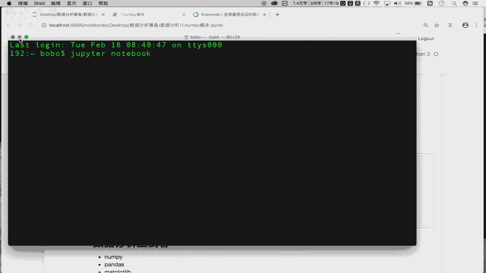

# 数据分析之量化案例：P2：Day01-02 修炼前的准备-环境搭建 🛠️

在本节课中，我们将学习如何搭建数据分析所需的开发环境。我们将介绍核心工具Anaconda和Jupyter Notebook，并详细讲解其安装与基本使用方法。

## 概述

上一节我们对数据分析进行了初步介绍。本节中，我们来看看数据分析所对应的开发环境搭建流程。

## 1. Anaconda：集成环境介绍与安装

首先，我们需要了解并安装Anaconda。Anaconda是一个集成环境，它已经帮助我们集成了数据分析和机器学习开发所需的全部环境。

以下是关于Anaconda的关键点：
*   **定义**：Anaconda是一个**集成环境**，集成了数据分析和机器学习所需的全部库和工具。
*   **安装**：需要从官网下载对应操作系统（Windows/Mac/Linux）的安装包。
*   **安装注意事项**：安装目录**不可以有中文和特殊符号**，建议安装在盘符根目录下。
*   **安装流程**：下载后，按照安装向导进行“下一步”式安装即可。详细的安装流程文档会另行提供。

安装好Anaconda后，就意味着我们拥有了进行数据分析和机器学习开发的基础环境。

## 2. Jupyter Notebook：可视化开发工具


接下来，我们介绍Jupyter Notebook。Jupyter是Anaconda提供的一个基于浏览器的可视化开发工具，我们将在其中编写和执行数据分析代码。



以下是Jupyter的核心概念与启动方法：
*   **定义**：Jupyter Notebook是Anaconda提供的**基于浏览器的可视化开发工具**，用于编写和执行代码。
*   **与Anaconda关系**：Jupyter无需单独安装，安装Anaconda后即可使用。
*   **启动方法**：在系统终端（命令行）中输入指令 `jupyter notebook` 并按下回车。

```bash
jupyter notebook
```
*   **启动结果**：执行上述指令后，会自动启动本地服务并打开默认浏览器，显示当前目录的文件结构界面。

## 3. Jupyter Notebook 基本使用


成功启动Jupyter后，我们将学习其基本操作。这包括创建文件、编写内容以及执行代码。

### 3.1 创建新文件

在Jupyter主界面，点击“New”按钮，选择“Python 3”来创建一个新的源代码文件。这个文件的后缀是 `.ipynb`。

### 3.2 理解单元格（Cell）

Jupyter文件由一个个“单元格”组成。单元格有两种主要模式：
*   **Code模式**：用于**编写和运行程序代码**。
*   **Markdown模式**：用于**编写格式化的笔记和注释**。

在单元格中输入内容后，需要点击“Run”按钮或使用快捷键来执行它。无论是代码还是Markdown笔记，都需要执行才能看到结果。

例如，在Code模式的单元格中输入：
```python
print("Hello, Data Analysis!")
```
执行后会在下方输出结果。

在Markdown模式的单元格中输入：
```markdown
# 第一节：环境搭建
## 主要内容
1.  安装Anaconda
2.  学习Jupyter使用
```
执行后会渲染成格式化的标题和列表。

### 3.3 常用快捷键

熟练使用快捷键可以极大提升在Jupyter中的工作效率。以下是几个最常用的快捷键：

*   **添加单元格**：
    *   `A`：在当前单元格**上方**插入新单元格。
    *   `B`：在当前单元格**下方**插入新单元格。
*   **删除单元格**：`X` 删除当前选中的单元格。
*   **切换单元格模式**：
    *   `M`：将当前单元格切换到 **Markdown模式**。
    *   `Y`：将当前单元格切换到 **Code模式**。
*   **执行单元格**：`Shift + Enter` 执行当前单元格，并跳转到下一个单元格。
*   **代码自动补全**：`Tab` 键可以触发代码自动补全提示。
*   **查看帮助文档**：将光标放在函数名上，按 `Shift + Tab` 可以查看该函数的帮助文档。

## 总结

本节课中，我们一起学习了数据分析环境的搭建。
1.  我们首先介绍了 **Anaconda**，它是一个集成了数据科学所需全部工具的软件包，我们需要下载并安装它。
2.  接着，我们学习了 **Jupyter Notebook**，这是一个基于浏览器的交互式编程环境，是Anaconda的一部分，我们通过命令行启动它。
3.  最后，我们详细讲解了Jupyter的基本操作，包括创建文件、使用两种模式的**单元格**（Cell）编写代码与笔记，以及一系列提高效率的**快捷键**。


环境搭建是开始数据分析之旅的第一步。请务必根据指导完成Anaconda的安装，并熟悉Jupyter的基本操作。接下来，我们将正式进入数据分析的代码实战环节。