# 数据分析之量化案例：P4：day01-04 NumPy数组属性详解 🧮

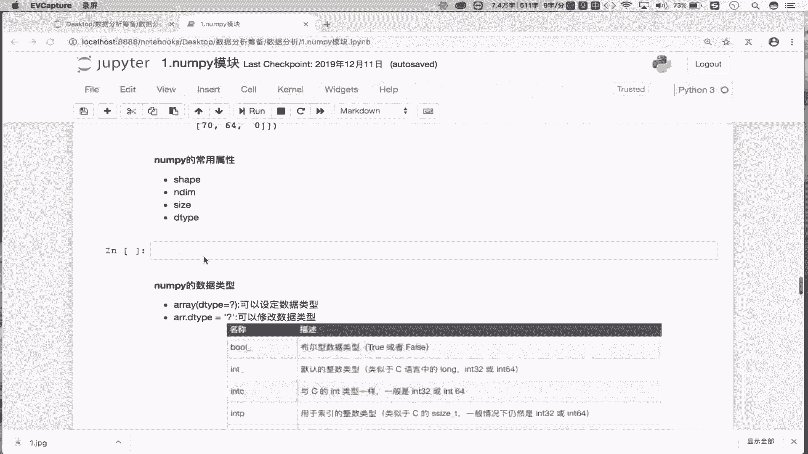

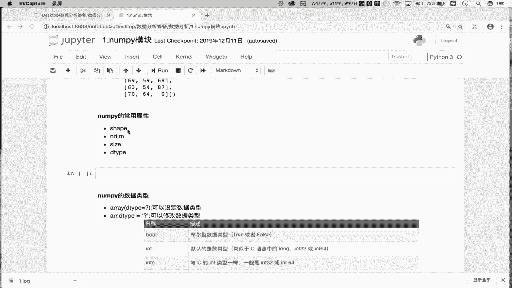

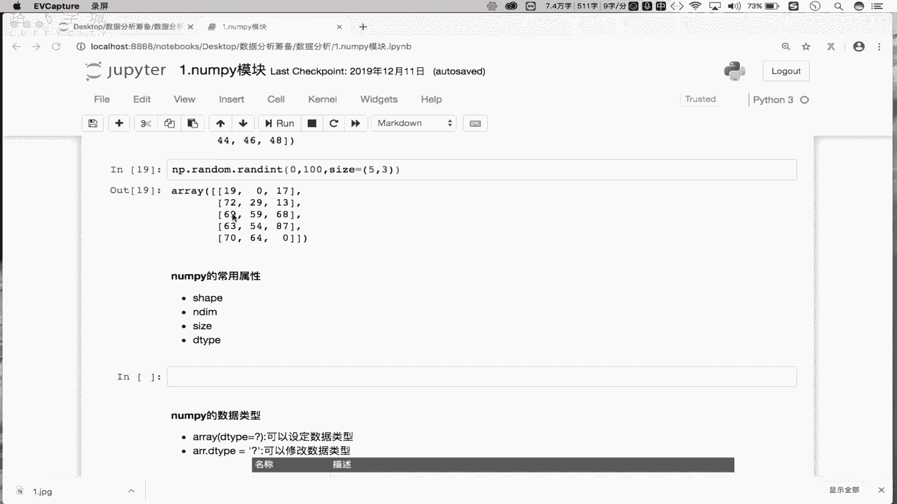

在本节课中，我们将要学习NumPy数组的几个核心属性。上一节我们介绍了NumPy数组的创建和基本方法，本节中我们来看看如何获取和修改数组的“身份信息”，例如它的形状、大小和数据类型。

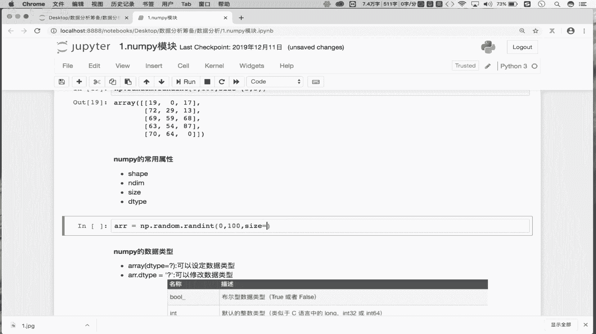

## 创建示例数组

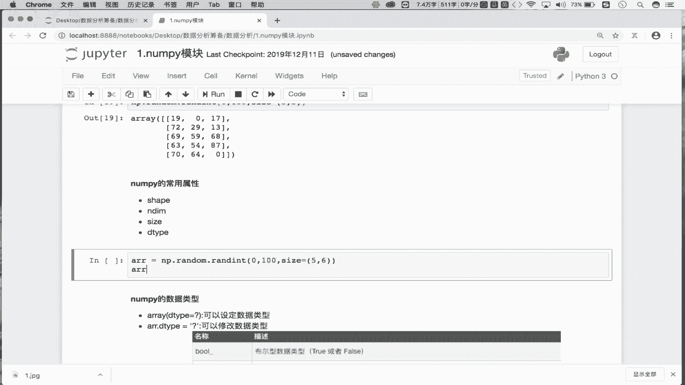

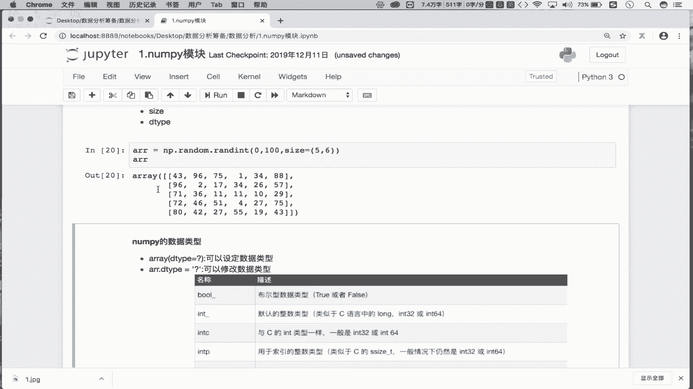

首先，我们创建一个示例数组，以便后续演示属性的使用。

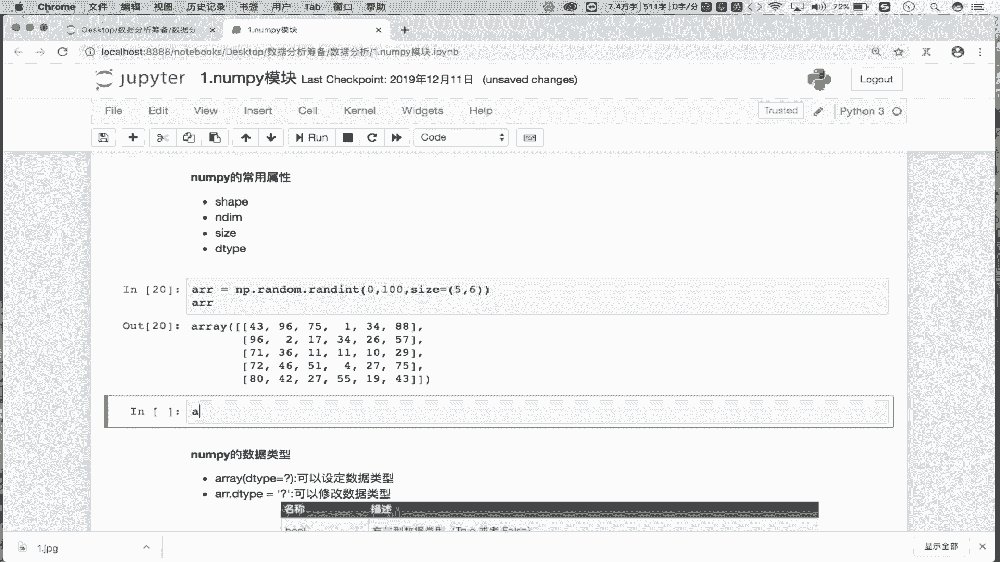

```python
import numpy as np
arr = np.random.randint(0, 100, size=(5, 6))
```
这段代码创建了一个名为`arr`的二维数组，它有5行6列，其中的元素是0到100之间的随机整数。

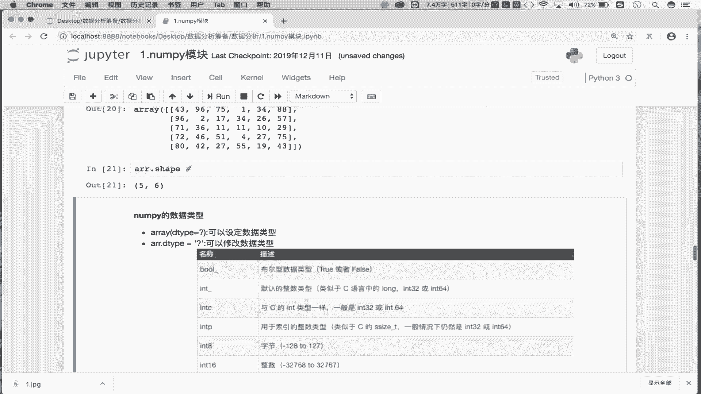


## 常用数组属性


以下是NumPy数组的几个核心属性，它们可以帮助我们快速了解数组的基本信息。

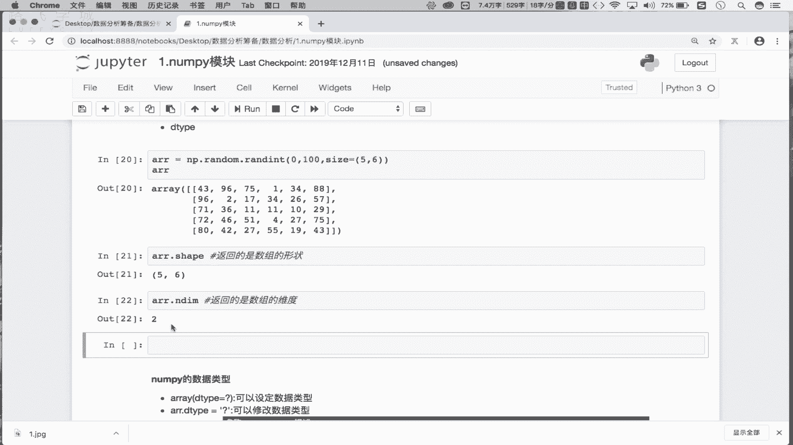

### 1. 形状 (shape)
`shape`属性返回一个元组，表示数组在每个维度上的大小。
```python
arr.shape  # 输出: (5, 6)
```
这表示数组`arr`是一个5行6列的二维数组。

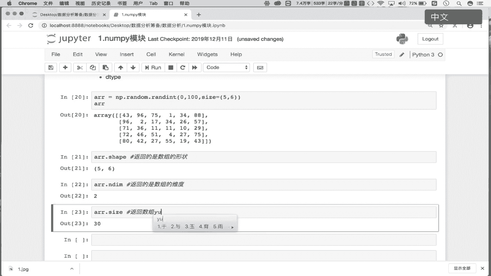


### 2. 维度 (ndim)
`ndim`属性返回一个整数，表示数组的维数。
```python
arr.ndim  # 输出: 2
```
这表示数组`arr`是一个二维数组。


### 3. 元素总数 (size)
`size`属性返回一个整数，表示数组中元素的总个数。
```python
arr.size  # 输出: 30
```
对于5行6列的数组，元素总数为 5 * 6 = 30。

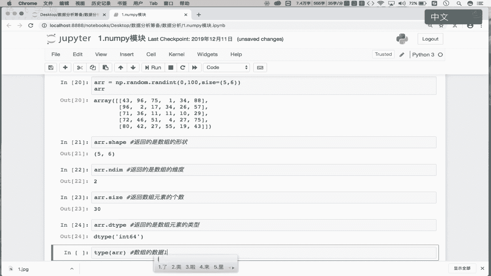

### 4. 数据类型 (dtype)
`dtype`属性返回一个对象，描述数组中元素的数据类型。
```python
arr.dtype  # 输出: dtype('int64')
```
这表示数组`arr`中的元素是64位整数类型。


## 深入了解数据类型 (dtype)

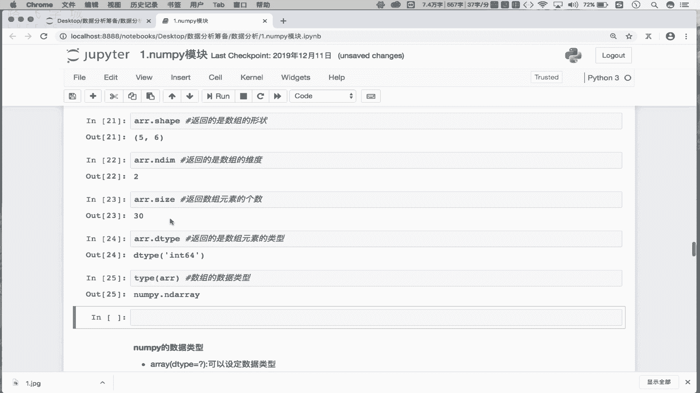

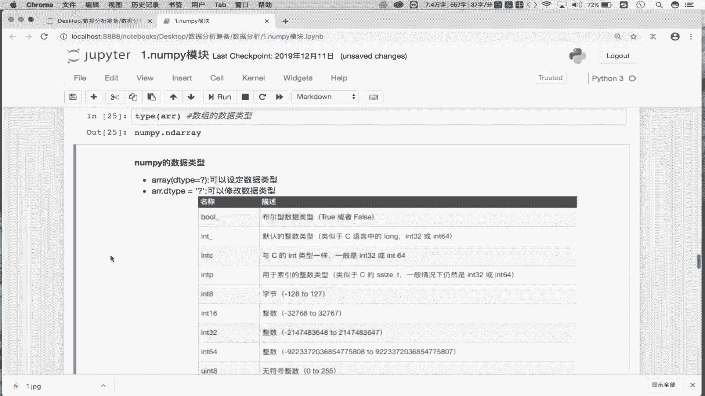

数据类型是NumPy中一个非常重要的概念，它决定了数组中每个元素所占用的内存大小和解释方式。

### 创建时指定数据类型
我们可以在创建数组时，通过`dtype`参数直接指定元素的数据类型。
```python
arr_int32 = np.array([1, 2, 3], dtype='int32')
arr_int32.dtype  # 输出: dtype('int32')
```


### 修改现有数组的数据类型
我们也可以通过给`dtype`属性赋值来修改现有数组的数据类型。NumPy会尝试进行类型转换。
```python
arr.dtype = 'uint8'  # 将数组元素类型修改为无符号8位整数
arr.dtype  # 输出: dtype('uint8')
```

### 数据类型的重要性
选择合适的数据类型可以显著影响程序性能。例如，一个包含500万个元素的数组：
*   默认`int64`类型：每个元素占8字节，总内存约 5,000,000 * 8 ≈ 38 MB。
*   使用`uint8`类型：每个元素占1字节，总内存约 5,000,000 * 1 ≈ 4.8 MB。

通过将数据类型从`int64`改为`uint8`，内存占用减少了约87.5%。在处理大规模数据时，合理设置数据类型是优化内存使用的关键。


## 数组对象类型

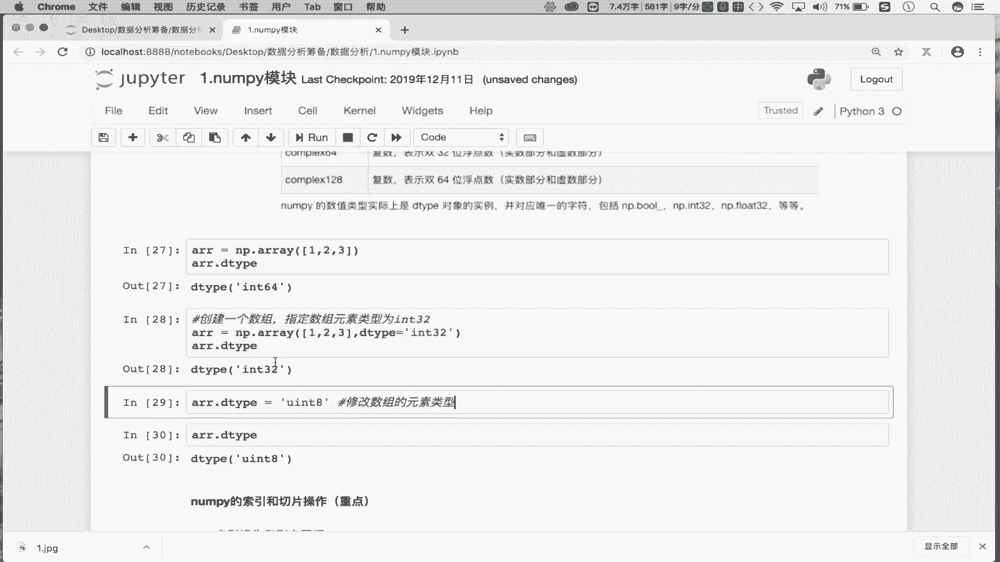

需要注意的是，`dtype`属性描述的是**数组元素**的数据类型。如果要查看**数组对象本身**的数据类型，应使用Python内置的`type()`函数。
```python
type(arr)  # 输出: <class 'numpy.ndarray'>
```
这告诉我们，`arr`是一个`numpy.ndarray`类的实例，这是NumPy中多维数组的基础类。

---

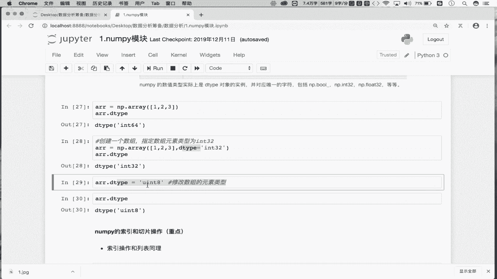


本节课中我们一起学习了NumPy数组的四个核心属性：`shape`（形状）、`ndim`（维度）、`size`（元素总数）和`dtype`（数据类型）。我们了解了如何获取这些信息，以及如何通过`dtype`属性在创建时指定或后续修改数组的数据类型，这对于管理内存和优化大型数据集的处理至关重要。