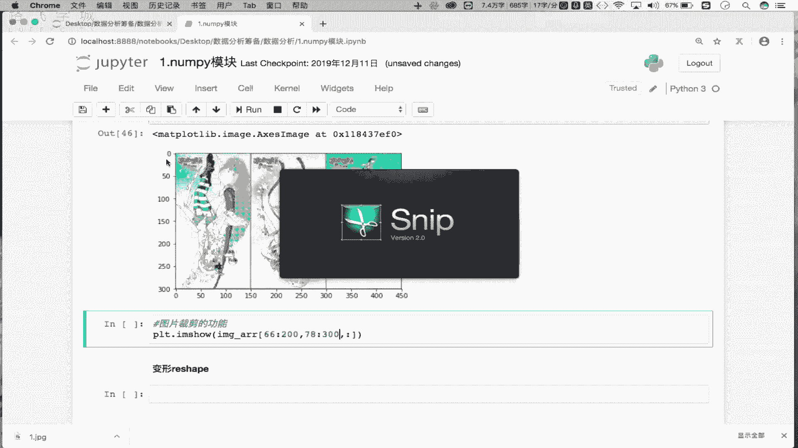

# Python金融量化数据分析：P5：Day01-05 NumPy炸天之索引和切片 📊

在本节课中，我们将要学习NumPy模块中极其重要的索引和切片操作。这些操作是获取和操作数组数据的基础，比Python原生列表更加灵活和强大。我们将从基础索引开始，逐步深入到切片、数组反转，并最终应用这些知识进行图片的翻转与裁剪。

## 索引操作

上一节我们介绍了NumPy数组的创建，本节中我们来看看如何获取数组中的特定数据。NumPy数组的索引操作与Python列表的索引操作原理相同。

首先，我们创建一个示例数组：
```python
import numpy as np
arr = np.random.randint(1, 100, size=(5, 6))
print(arr)
```
这是一个5行6列的二维数组。

以下是索引操作的基本用法：
*   **获取单行数据**：`arr[0]` 返回数组中的第一行数据。
*   **获取多行数据**：`arr[[1, 3, 4]]` 返回下标为1、3、4的行数据。

## 切片操作

索引用于获取特定元素，而切片则用于获取一个连续的子集。NumPy的切片功能非常强大。

以下是切片操作的核心用法：
*   **切出前两行**：`arr[0:2]` 或 `arr[:2]`。逗号左边用于指定行切片。
*   **切出前两列**：`arr[:, 0:2]`。逗号右边用于指定列切片。
*   **切出前两行的前两列**：`arr[0:2, 0:2]`。通过逗号分隔，同时指定行和列的切片范围。

## 数组反转

利用切片语法，我们可以轻松实现数组的行、列或整体元素的反转。

以下是实现数组反转的方法：
*   **将数组的行倒置**：`arr[::-1, :]` 或 `arr[::-1]`。`[::-1]` 表示对该维度进行反向步进。
*   **将数组的列倒置**：`arr[:, ::-1]`。
*   **将所有元素倒置（行列均倒置）**：`arr[::-1, ::-1]`。

## 实战应用：图片处理

理解了索引和切片后，我们可以将其应用于实际场景，例如图片处理。一张图片在NumPy中可以表示为一个三维数组 `(高度， 宽度， 颜色通道)`。

首先，读取并显示原始图片：
```python
import matplotlib.pyplot as plt
image_arr = plt.imread(‘1.jpg’)
plt.imshow(image_arr)
plt.show()
```

以下是利用切片进行图片操作的实例：
*   **图片左右翻转**：对代表宽度的列维度进行倒置。`plt.imshow(image_arr[:, ::-1, :])`
*   **图片上下翻转**：对代表高度的行维度进行倒置。`plt.imshow(image_arr[::-1, :, :])`
*   **图片局部裁剪**：对行和列维度进行范围切片。例如，裁剪高度66到200，宽度78到300的区域：`plt.imshow(image_arr[66:200, 78:300, :])`




---


本节课中我们一起学习了NumPy的核心操作——索引与切片。我们掌握了如何使用索引获取单行/多行数据，如何使用切片语法获取数组的子集，以及如何利用`[::-1]`实现数组的反转。最后，我们将这些知识应用于图片的翻转与裁剪，直观地感受到了NumPy切片功能的强大与灵活。这些操作是后续进行数据筛选、清洗和变换的基础，务必熟练掌握。