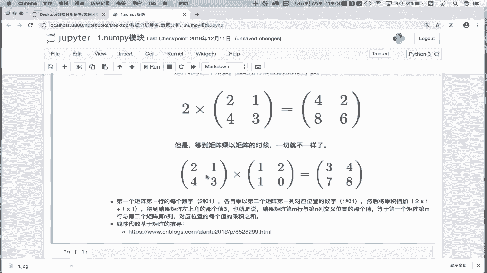
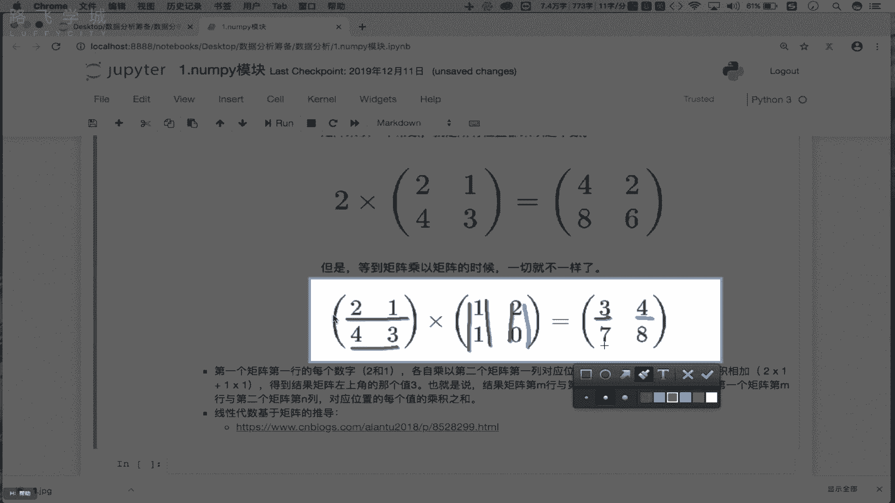
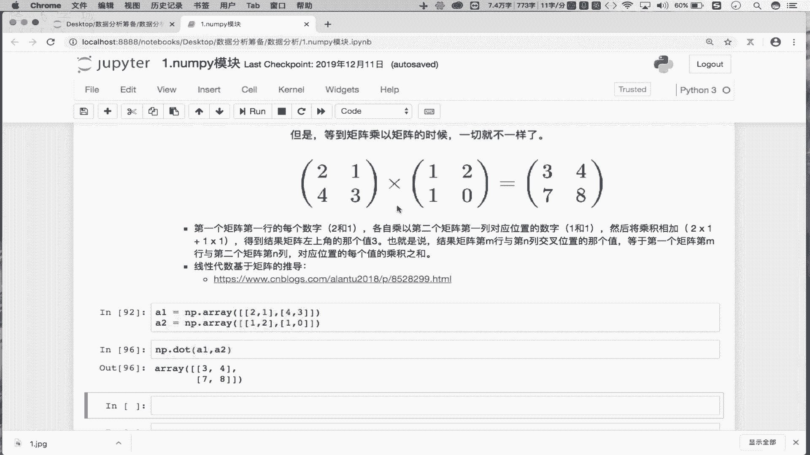
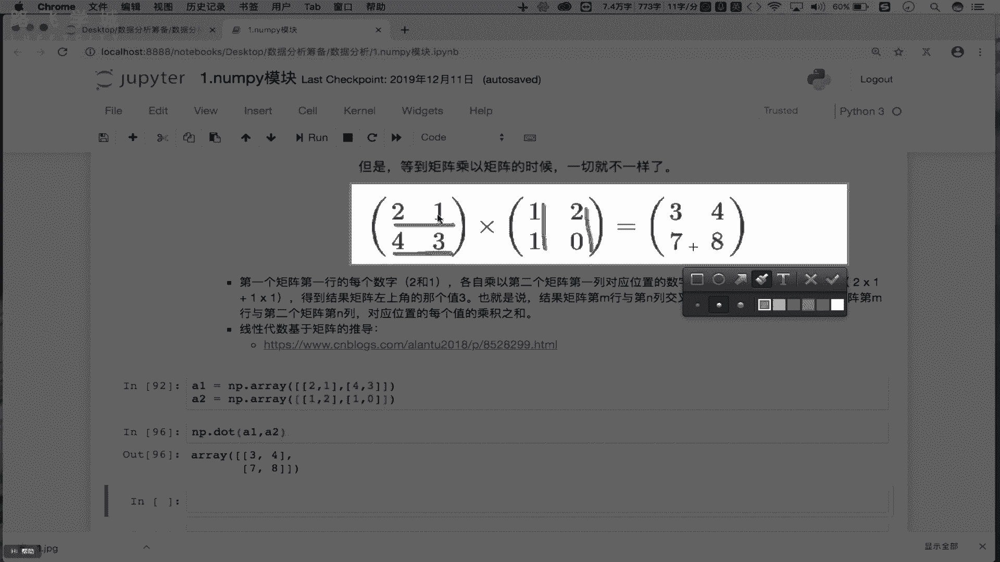
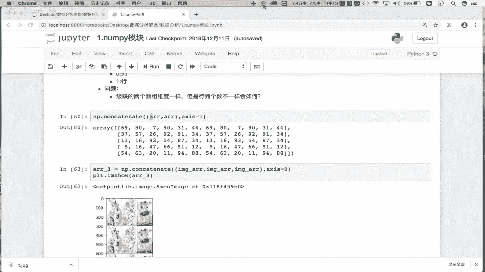

# 数据分析之量化案例：P6：Day01-06 统计、聚合与矩阵操作 📊

在本节课中，我们将学习NumPy模块中关于数组形状变换、拼接、聚合统计以及矩阵运算的核心操作。这些是进行高效数值计算和数据分析的基础。

## 数组形状变换 🔄

上一节我们介绍了数组的索引与切片，本节中我们来看看如何改变数组的形状。数组的`shape`属性描述了其维度结构，例如一个五行六列的二维数组。我们可以使用`reshape`方法改变数组的形状，但变形后的新数组必须能容纳原数组的所有元素。

以下是使用`reshape`进行变形的示例：

```python
import numpy as np

# 原始二维数组，5行6列，共30个元素
arr = np.arange(30).reshape(5, 6)
print("原始数组形状：", arr.shape)

# 将二维数组变形为一维数组，必须指定恰好30个位置
arr_1d = arr.reshape(30)
print("变形后的一维数组：", arr_1d.shape)

# 将一维数组变形为新的二维数组，例如2行15列
arr_2d_new = arr_1d.reshape(2, 15)
print("新二维数组形状：", arr_2d_new.shape)
```

## 数组拼接操作 🔗

接下来，我们学习如何将多个数组拼接在一起。拼接操作可以将数组在横向（按行）或纵向（按列）进行连接，但要求参与拼接的数组维度相同。

以下是使用`np.concatenate`进行拼接的示例：

```python
# 创建两个相同的二维数组
arr1 = np.arange(12).reshape(3, 4)
arr2 = np.arange(12, 24).reshape(3, 4)

# 沿轴向0（纵向，按列）拼接
result_v = np.concatenate((arr1, arr2), axis=0)
print("纵向拼接结果形状：", result_v.shape)

# 沿轴向1（横向，按行）拼接
result_h = np.concatenate((arr1, arr2), axis=1)
print("横向拼接结果形状：", result_h.shape)
```

需要注意的是，如果两个数组维度相同但行或列数不一致，拼接操作可能会失败，请自行尝试。

## 聚合统计操作 📈

聚合操作可以对数组中的数据进行整体或沿特定轴向的统计计算。这是数据分析中提取信息的关键步骤。

以下是常用的聚合操作示例：

```python
arr = np.random.randn(5, 6)  # 创建一个5行6列的随机数组

# 计算所有元素的和、最小值、最大值、平均值
total_sum = arr.sum()
min_val = arr.min()
max_val = arr.max()
mean_val = arr.mean()

print(f"总和：{total_sum:.2f}, 最小值：{min_val:.2f}, 最大值：{max_val:.2f}, 平均值：{mean_val:.2f}")

# 计算每一列的和（axis=0）
col_sums = arr.sum(axis=0)
print("每一列的和：", col_sums)

# 计算每一行的最大值（axis=1）
row_maxs = arr.max(axis=1)
print("每一行的最大值：", row_maxs)
```

## 数学与统计函数 ➗

NumPy提供了丰富的数学函数（如三角函数、四舍五入）和统计函数（如极差、方差、标准差）。其中，方差和标准差是衡量数据分散程度的重要指标。

以下是相关函数的应用：

```python
# 数学函数示例
angles = np.array([0, 30, 45, 60, 90]) * np.pi / 180  # 转换为弧度
sin_values = np.sin(angles)
print("正弦值：", sin_values)

# 四舍五入
rounded = np.around([3.14, 3.84, 2.176], decimals=1)
print("四舍五入到一位小数：", rounded)

# 统计函数示例
data = np.array([85, 90, 78, 92, 88, 76, 95, 89])



# 计算极差（最大值与最小值之差）
range_val = np.ptp(data)
print("数据极差：", range_val)

# 计算方差与标准差
variance = np.var(data)
std_deviation = np.std(data)
print(f"方差：{variance:.2f}, 标准差：{std_deviation:.2f}")
```

标准差公式为：
**σ = √[ Σ(xi - μ)² / N ]**
其中，σ是标准差，xi是每个数据点，μ是数据的均值，N是数据点总数。方差则是标准差的平方，即去掉开根号的部分。



## 矩阵运算 ⬜

最后，我们探讨矩阵的基本操作，重点是矩阵的转置和乘法。矩阵乘法在机器学习和线性代数中应用广泛。

以下是矩阵操作的示例：



```python
# 创建矩阵（本质是二维数组）
A = np.array([[2, 1],
              [4, 3]])
B = np.array([[1, 2],
              [1, 0]])

# 矩阵转置：行变列，列变行
A_transpose = A.T
print("矩阵A的转置：\n", A_transpose)



# 矩阵乘法：使用 np.dot 或 @ 运算符
# 结果 C = A · B
C = np.dot(A, B)  # 等价于 A @ B
print("矩阵乘法结果 A·B：\n", C)
```
矩阵乘法的计算规则是：结果矩阵C中第i行第j列的元素，等于矩阵A的第i行与矩阵B的第j列对应元素乘积之和。



本节课中我们一起学习了NumPy模块关于数组变形、拼接、聚合统计以及矩阵运算的核心操作。掌握这些内容，是后续进行金融量化分析和更复杂数据处理的基础。重点在于理解矩阵乘法的原理、聚合统计的意义以及灵活运用数组的形状操作。