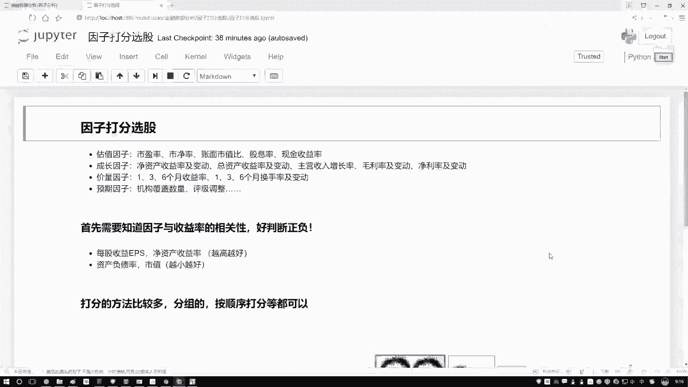
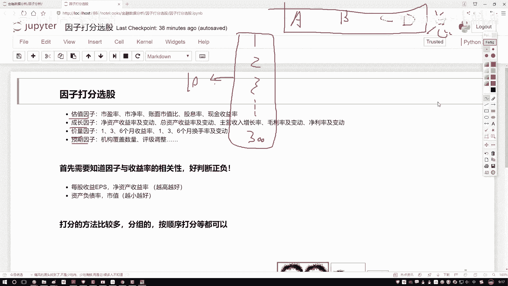
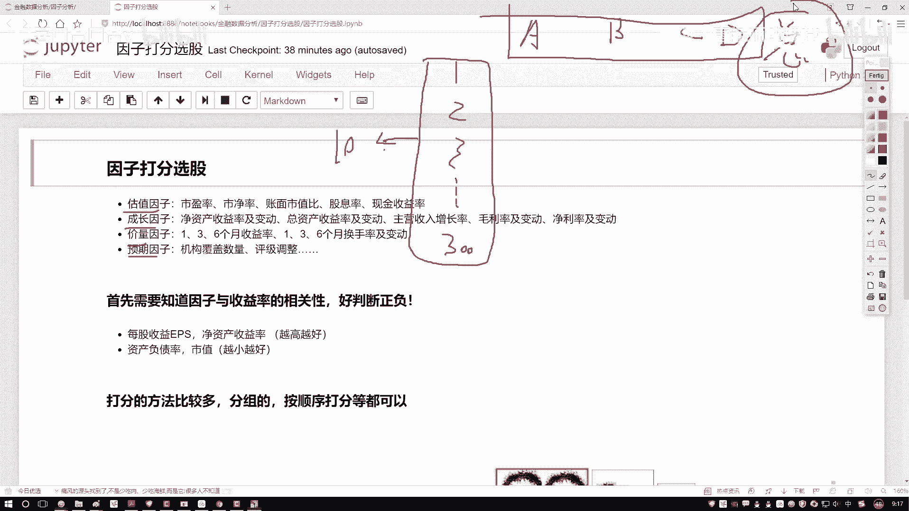
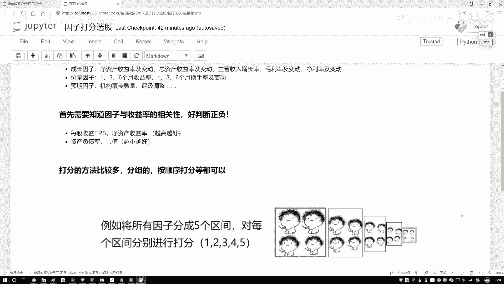
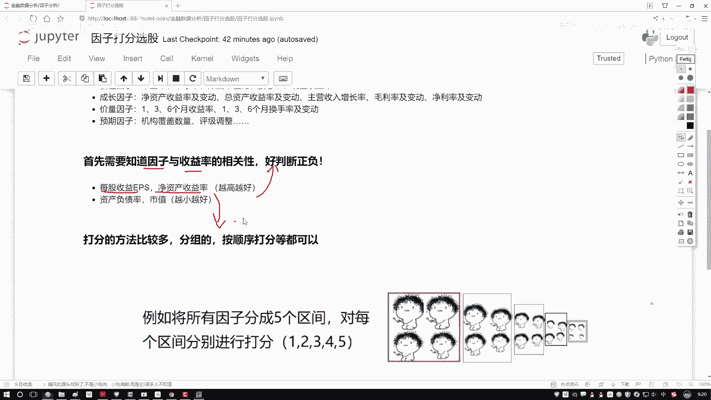

# 量化交易与Python金融分析实战：P48：因子打分法选股策略概述 📊

在本节课中，我们将要学习一种在选股过程中常用的策略——因子打分法。我们将了解其核心思想、实施前提，并学习如何通过综合多个因子的表现来筛选股票。

## 策略核心思想

上一节我们介绍了如何通过单一因子（如IC值）来评估股票。本节中我们来看看如何综合多个因子进行更全面的评估。

因子打分选股策略的核心在于，**不对单个因子进行“好”或“不好”的二元判断，而是为每个因子赋予一个具体的分数**。这类似于学生的总成绩由各科成绩汇总而成。

假设我们有300只股票（股票1， 股票2， …， 股票300），以及A、B、C、D四个因子指标。我们的目标不是单独看某个因子，而是为每只股票计算一个**综合总分**。

**公式表示如下：**
`股票总分 = f(因子A得分， 因子B得分， 因子C得分， 因子D得分)`

计算出所有股票的总分后，进行排名，选取排名靠前的股票（如前10或20名）作为投资组合。在下一次调仓时，重复此过程。这就是因子打分选股策略的基本流程。

## 策略实施前提

在具体实施打分之前，我们必须明确一个关键的先验知识：**每个因子与预期收益率的相关性是正向还是负向**。

以下是理解这一点的关键说明：

*   **正向因子**：因子值**越大**，通常预期收益**越好**。例如：每股收益、净资产收益率。
*   **负向因子**：因子值**越小**，通常预期收益**越好**。例如：市盈率、市净率。

我们需要这个信息，因为打分必须依据一个标准：对于正向因子，数值越大，得分应越高；对于负向因子，数值越小，得分应越高。

这个先验知识可以通过两种方式获得：
1.  查阅券商的研究报告，其中通常会总结各类因子的经验规律。
2.  通过我们之前学习的因子分析（如计算IC值）方法，自己进行验证。

在后续的实际编程中，我们将选取几组已知特性的因子（一组越高越好，一组越低越好）作为已知条件进行演示。

## 总结

本节课中我们一起学习了因子打分法选股策略。我们了解到，该策略通过为多个因子分别打分并汇总成总分，来综合评估股票，从而选出整体“成绩”最优的标的。同时，我们强调了实施该策略的关键前提：必须事先明确每个因子与收益率的相关性方向（正或负），这是进行合理打分的基础。在接下来的课程中，我们将进入Python平台，实战演示如何计算这个关键的总分。