# 数据分析+金融量化+数据清洗：P13：03 捕获股票跌幅的日期 📉

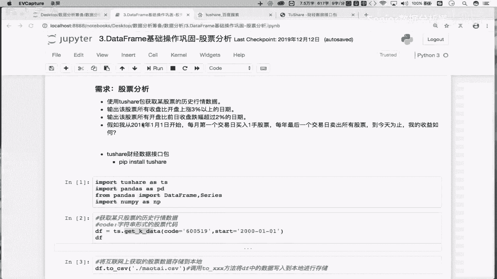

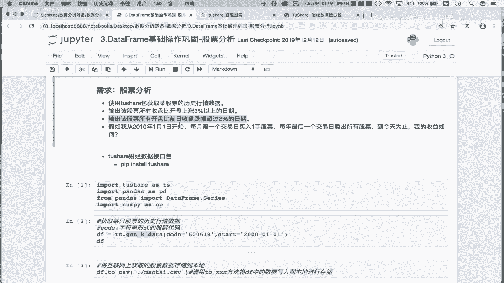

在本节课中，我们将学习如何从股票数据中，找出所有“开盘价比前一日收盘价跌幅超过2%”的日期。这是一个典型的金融数据分析需求，我们将通过编写简洁的Pandas代码来实现它。

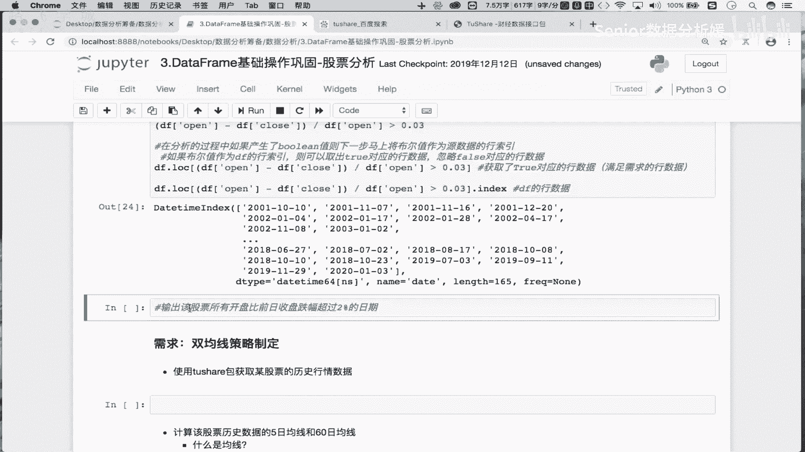

上一节我们介绍了如何计算股票的涨跌幅，本节中我们来看看如何基于特定条件筛选出我们关心的日期。

## 需求分析与伪代码

需求是：找出该股票所有“开盘价比前一日收盘价跌幅超过2%”的日期。

首先，我们需要将需求转化为逻辑步骤。跌幅的计算公式为：
`跌幅 = (当日开盘价 - 前一日收盘价) / 前一日收盘价`
我们需要找出所有 `跌幅 < -0.02` 的日期。

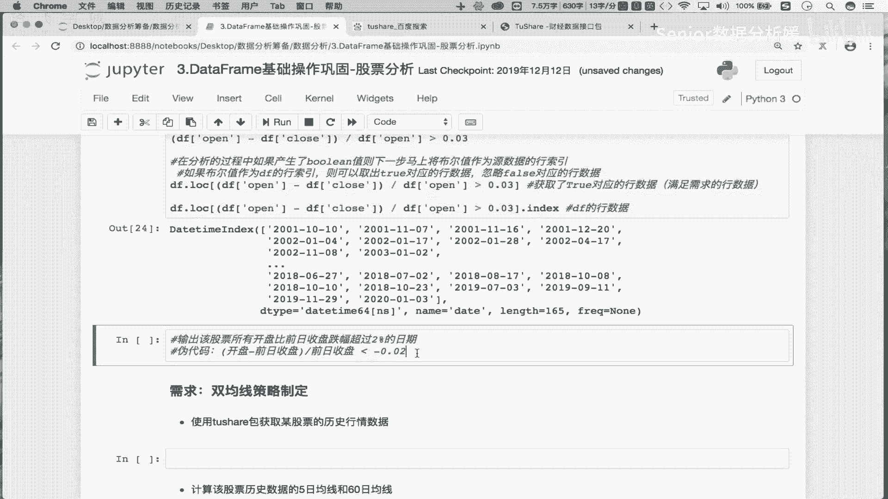

以下是实现这个逻辑的伪代码步骤：
1.  计算“前一日收盘价”序列。
2.  使用公式计算每日的跌幅。
3.  创建一个布尔序列，判断每日跌幅是否小于 -0.02。
4.  使用这个布尔序列作为索引，从原始数据中筛选出满足条件的行。
5.  从筛选出的行中提取日期索引。

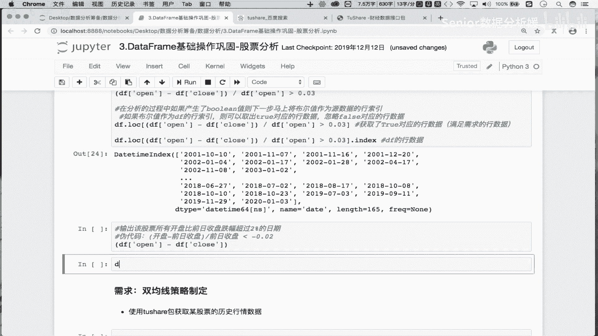

## 代码实现与分步讲解

理解了伪代码后，我们开始编写真正的Python代码。我们将使用Pandas库来处理数据。

### 步骤一：获取“前一日收盘价”

关键点在于如何获取“前一日”的数据。我们可以使用Pandas的 `shift()` 方法将 `收盘价(close)` 列整体向下移动一行。这样，每一行的“前一日收盘价”就对齐到了当日的行上。

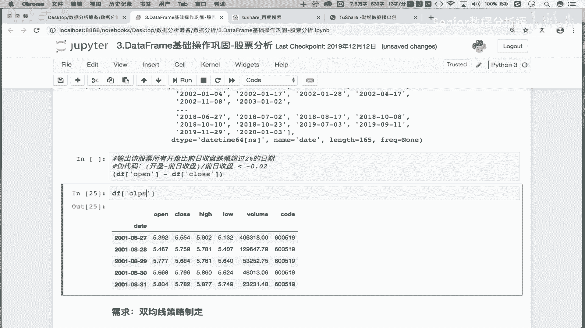

```python
# 假设我们的股票数据存储在 DataFrame `df` 中
# `df['close'].shift(1)` 就得到了“前一日收盘价”序列
previous_close = df['close'].shift(1)
```

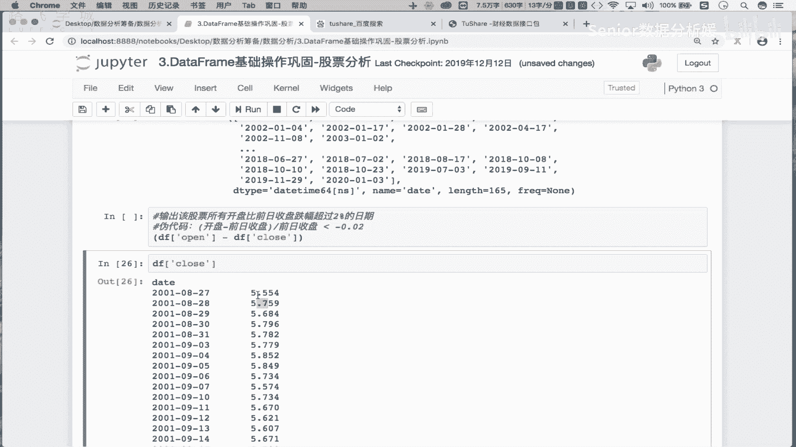

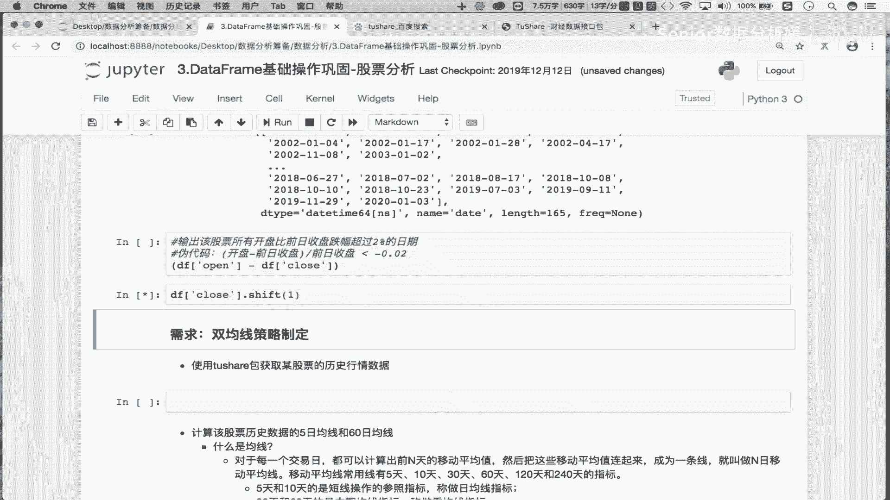

### 步骤二：计算跌幅并筛选

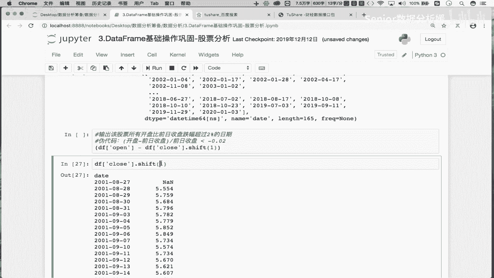

有了前一日收盘价，我们就可以计算跌幅，并判断是否超过-2%。

```python
# 计算跌幅
price_drop = (df['open'] - previous_close) / previous_close

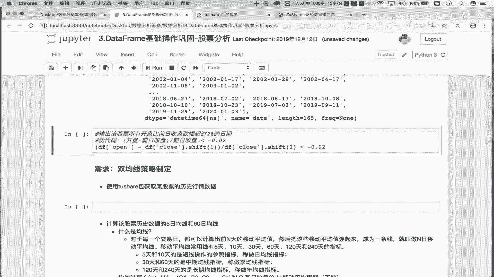

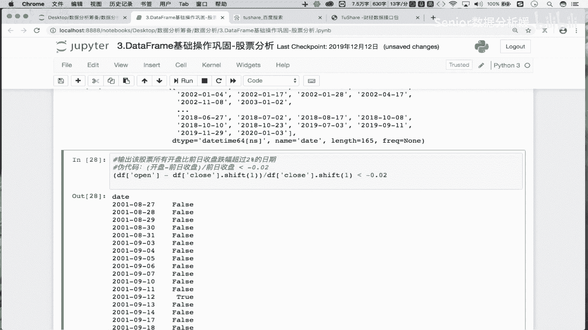

# 创建布尔掩码，找出跌幅小于 -0.02 的日期
condition = price_drop < -0.02
```
这里需要注意：`跌幅超过2%` 意味着跌幅的数值更小（例如-3% < -2%），因此我们使用小于号 `<`。

### 步骤三：提取满足条件的日期

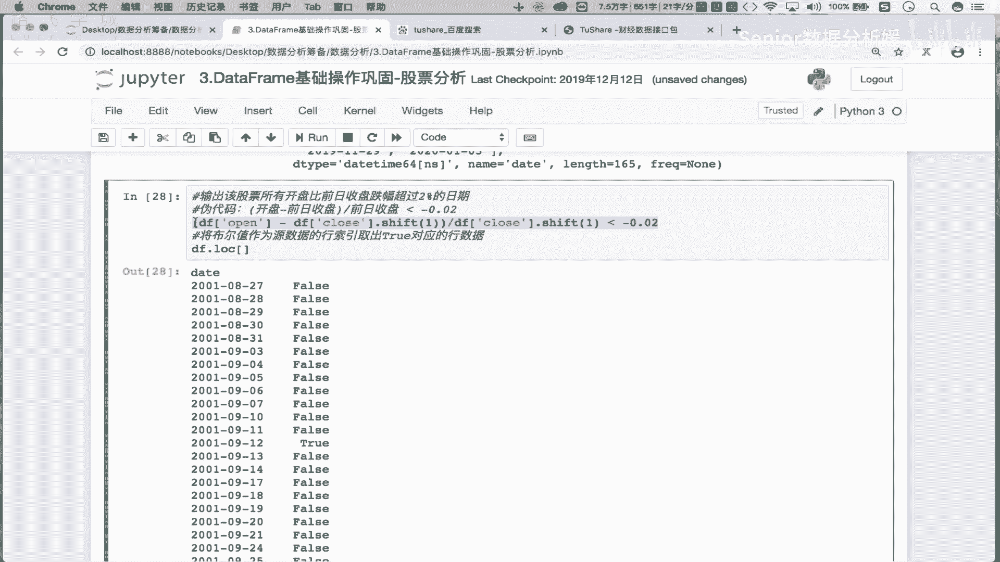

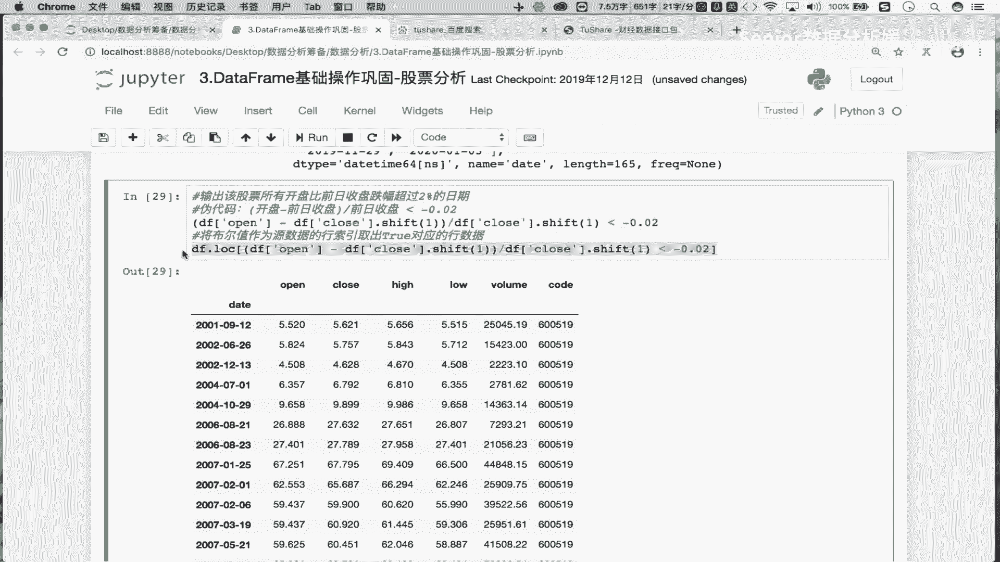

最后，我们使用上一步得到的布尔序列 `condition` 来筛选数据，并提取日期。

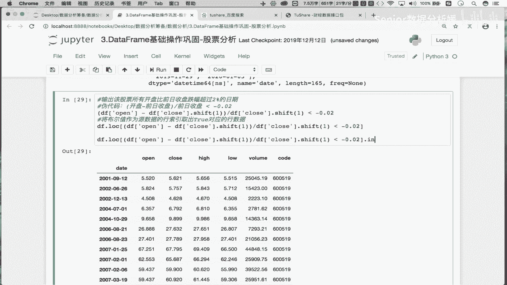

```python
# 使用布尔索引筛选出行数据
result_df = df.loc[condition]

# 从结果中提取日期索引（即行索引）
drop_dates = result_df.index
```
以上步骤可以合并为一行简洁的代码：
```python
drop_dates = df.loc[(df['open'] - df['close'].shift(1)) / df['close'].shift(1) < -0.02].index
```

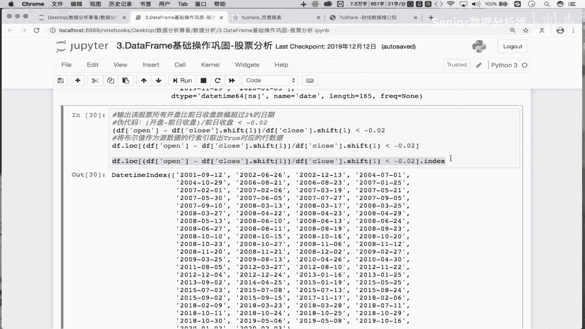

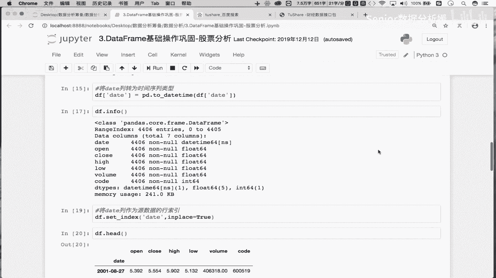

## 总结

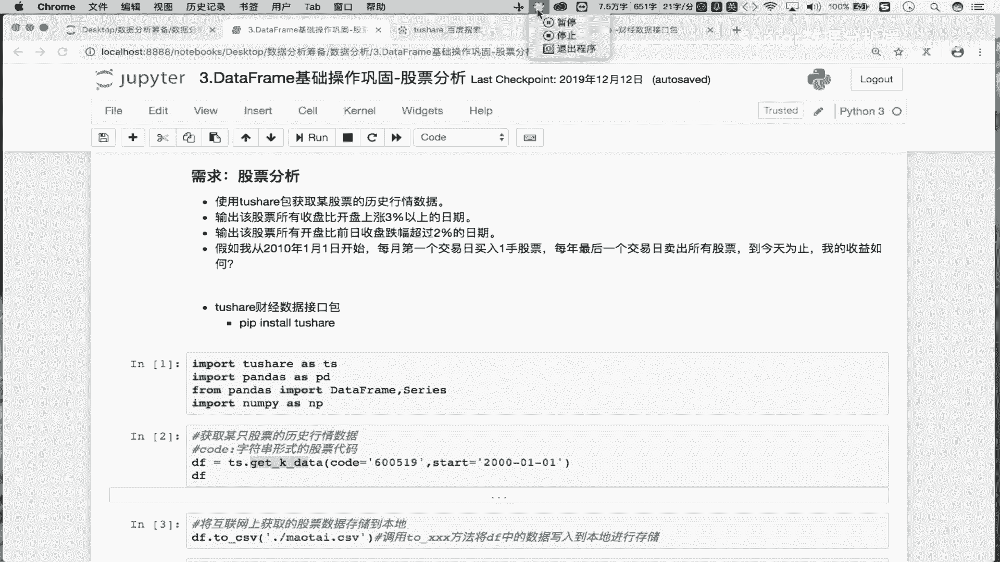

本节课中我们一起学习了如何捕获股票跌幅超过特定阈值的日期。我们首先将业务需求转化为数学公式和逻辑步骤，然后利用Pandas的 `shift()` 方法对齐时间序列数据，最后通过布尔索引高效地筛选出目标日期。这个方法在金融量化分析中非常实用，可以快速定位市场中的异常波动点。