# 数据分析+金融量化+数据清洗：P24：04 numpy基础02

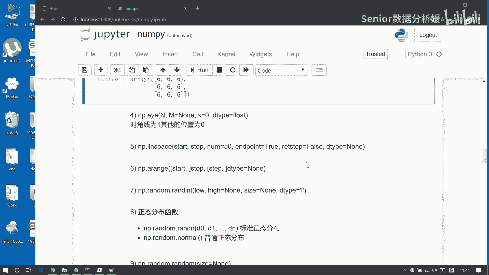

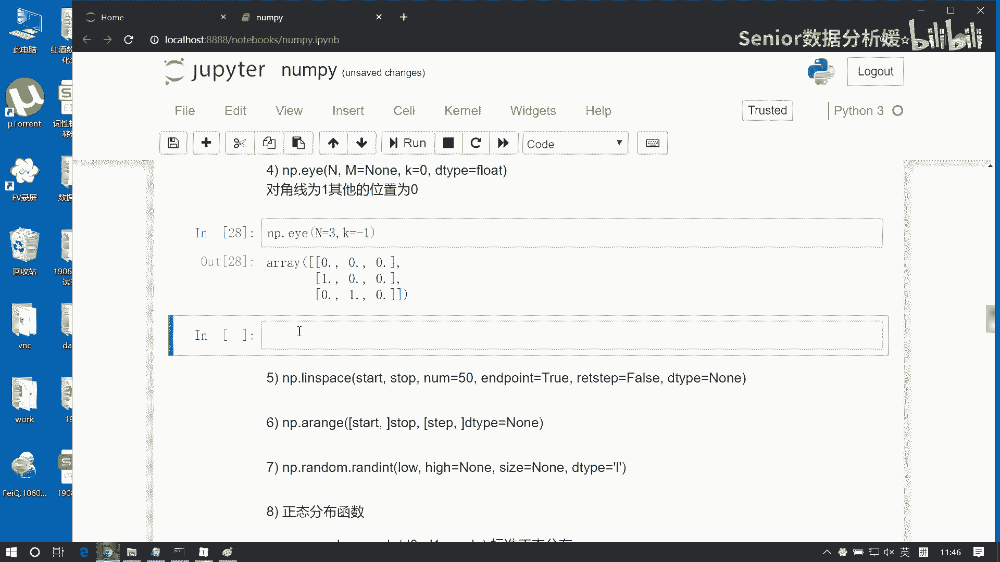


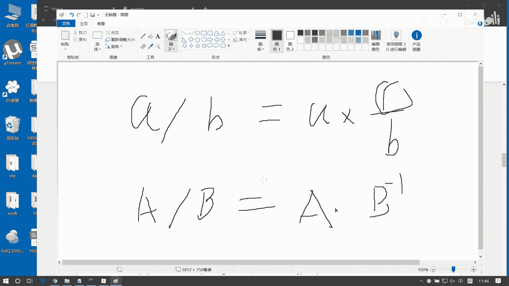

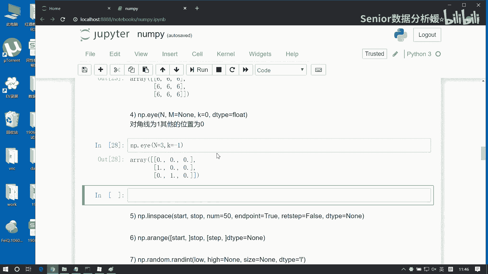

在本节课中，我们将继续学习NumPy库中几个重要的函数，包括生成特殊矩阵、等差数列、随机数以及数组的基本属性。这些知识是构建数据分析与量化模型的基础工具。


## 生成单位矩阵

上一节我们介绍了创建数组的基本方法，本节中我们来看看如何生成特殊的矩阵。`np.eye`函数用于生成对角线元素为1，其余元素为0的矩阵，即单位矩阵。

例如，`np.eye(3)`会生成一个3x3的单位矩阵：
```python
[[1., 0., 0.],
 [0., 1., 0.],
 [0., 0., 1.]]
```
该函数有两个可选参数`M`和`k`：
*   `M`：控制输出矩阵的列数。默认`M=N`，生成方阵。
*   `k`：控制主对角线的偏移量。`k=0`（默认）为主对角线，`k>0`向上偏移，`k<0`向下偏移。

单位矩阵在矩阵运算中扮演着数字“1”的角色。例如，在矩阵运算中，**矩阵A除以矩阵B**等价于**矩阵A乘以矩阵B的逆矩阵**。而求逆矩阵的过程就需要用到单位矩阵。因为矩阵本身没有直接的除法运算，所以需要通过单位矩阵来求解逆矩阵，从而实现类似除法的效果。


## 生成等差数列

接下来，我们学习两个用于生成等差数列的函数：`np.linspace`和`np.arange`。

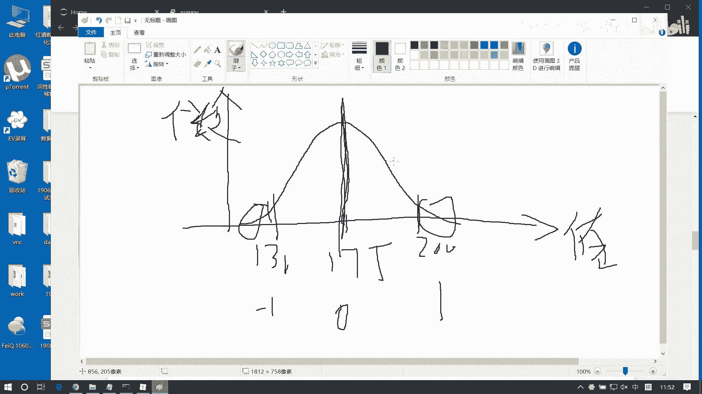

以下是两者的主要区别：
*   `np.linspace(start, stop, num)`：通过指定**元素个数**`num`来生成等差数列。参数`endpoint`默认为`True`，表示包含终点值。
*   `np.arange(start, stop, step)`：通过指定**步长**`step`来生成等差数列。结果包含起点，不包含终点。

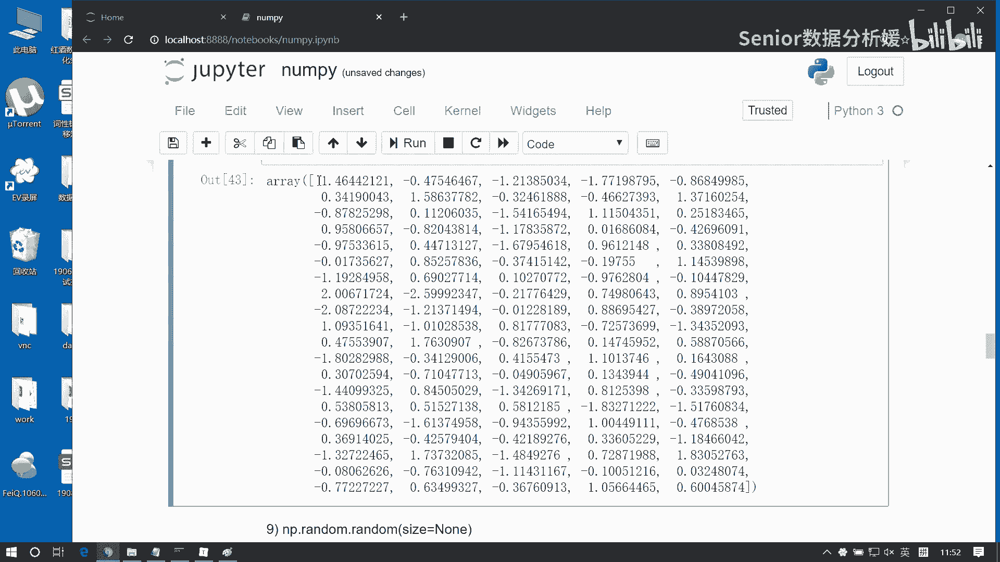

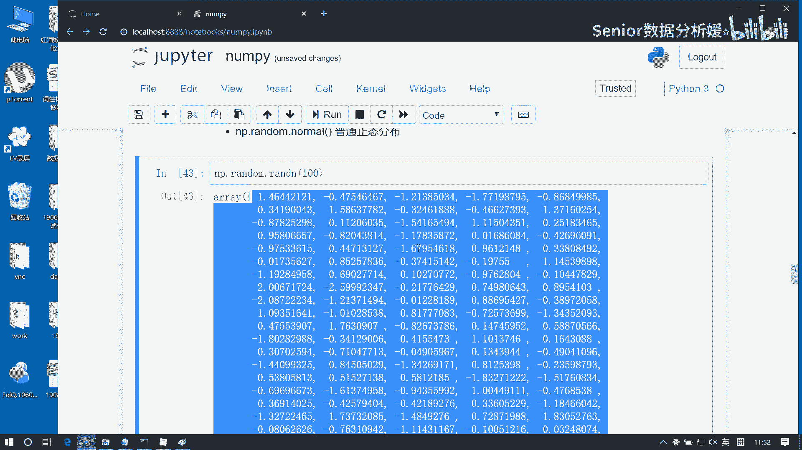

例如：
```python
# 生成0到10之间（包含10）的11个等间隔数
np.linspace(0, 10, 11)
# 生成0到9（不包含10），步长为1的整数序列
np.arange(0, 10, 1)
```


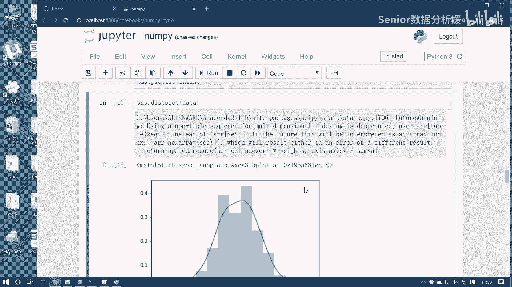

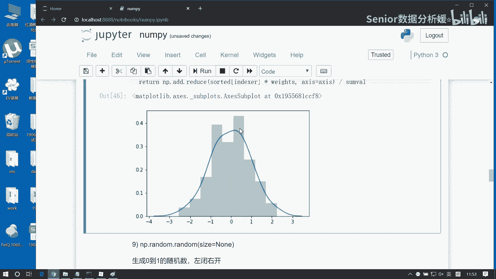

## 生成随机数

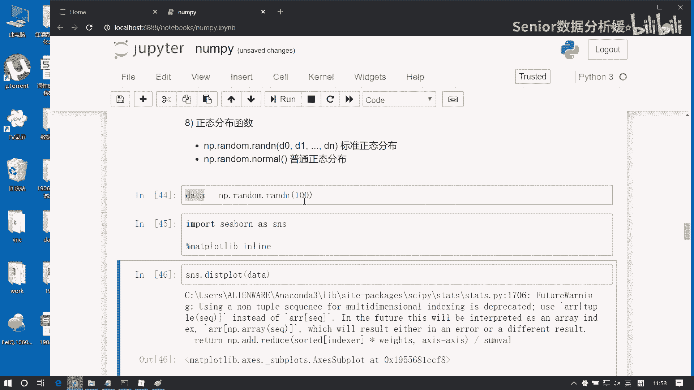

在数据分析和模拟中，生成随机数据至关重要。NumPy提供了多种随机数生成函数。

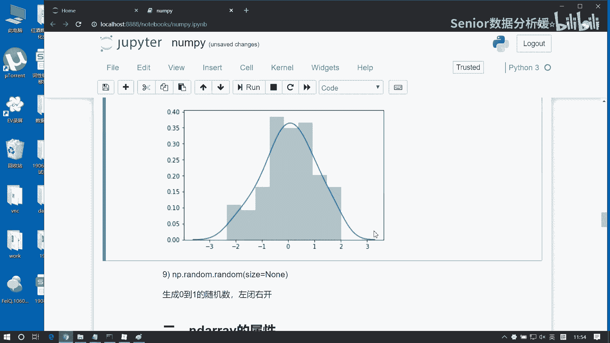

以下是几种常用的随机数生成方法：
*   `np.random.randint(low, high, size)`：生成指定范围内的**随机整数**。`size`参数定义输出数组的形状。
*   `np.random.randn(d0, d1, ..., dn)`：生成服从**标准正态分布**（均值为0，标准差为1）的随机样本。
*   `np.random.normal(loc, scale, size)`：生成服从**普通正态分布**的随机样本。`loc`是均值，`scale`是标准差。
*   `np.random.random(size)`：生成在**[0, 1)**区间内均匀分布的随机浮点数。

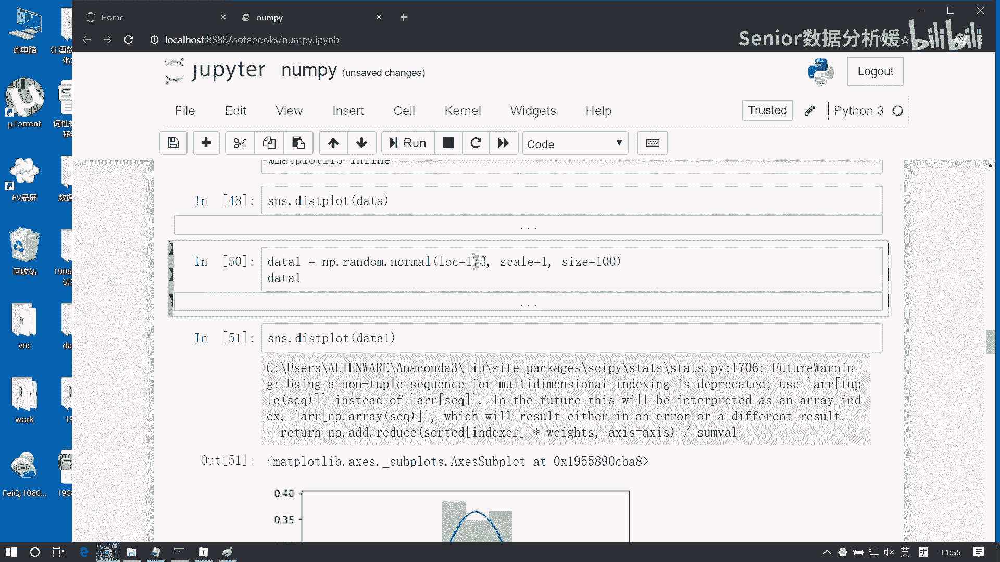

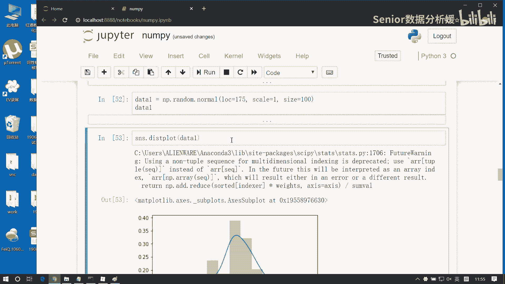

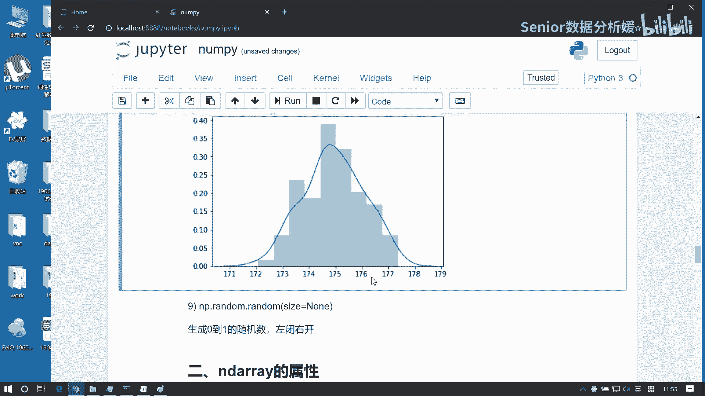

正态分布描述了大量自然和社会现象的分布规律，其曲线呈钟形。标准正态分布是均值为0、标准差为1的特殊情况。在机器学习中，将数据转换为接近正态分布的形式，通常有助于提升模型的训练效率和性能。

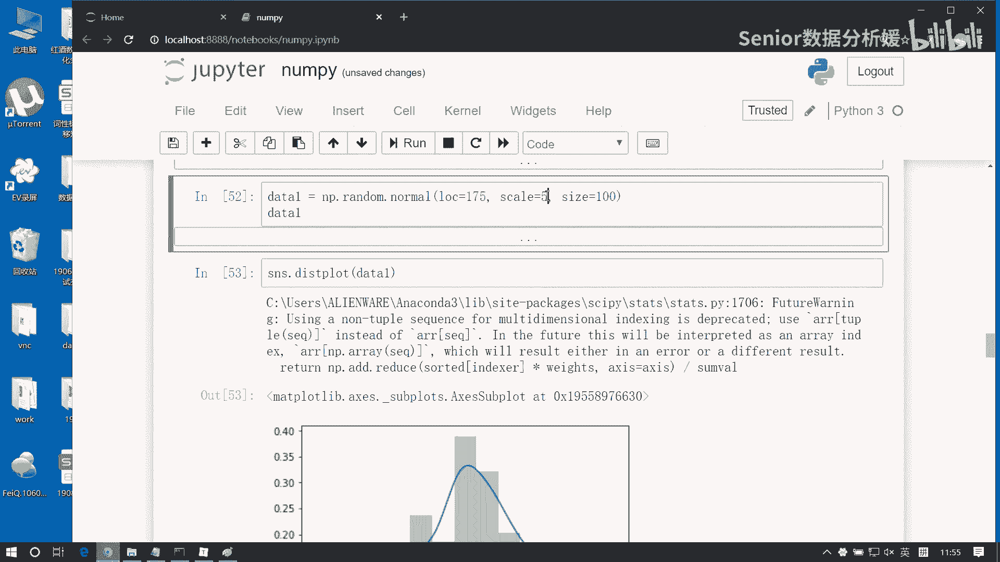

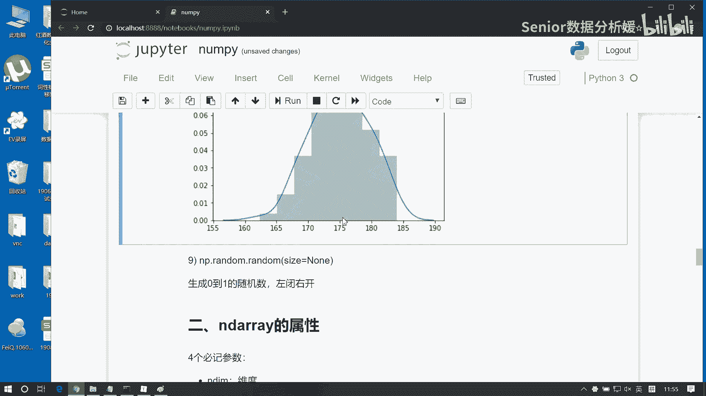

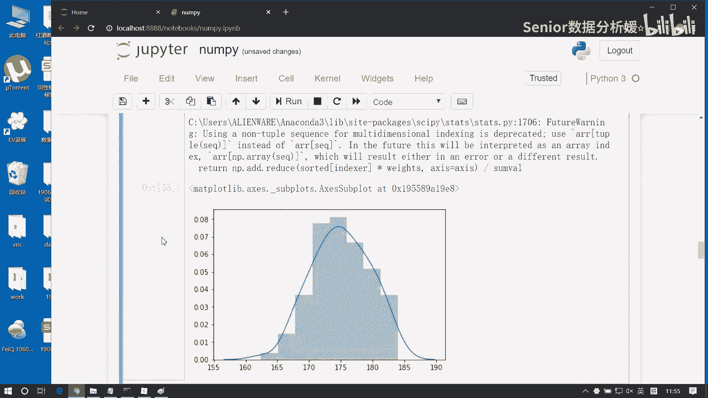

`np.random.random`生成的0到1之间的随机数用途广泛，可以表示比例、概率等。通过简单的线性变换，可以将其映射到其他区间。例如，生成**-1到1**之间的随机数：
```python
# 生成0到1的随机数
arr = np.random.random((3, 4))
# 变换为-1到1
arr_transformed = arr * 2 - 1
```
这里用到的数组与标量的直接运算，涉及NumPy的**广播机制**，我们后续会详细讲解。

## 数组的基本属性

最后，我们来了解NumPy数组对象的一些基本属性，它们能帮助我们快速获取数组的信息。

对于一个NumPy数组对象，有以下关键属性：
*   `ndim`：数组的**维度**（轴的数量）。
*   `shape`：数组的**形状**，是一个表示各维度大小的元组。
*   `size`：数组的**元素总数**（等于shape各维度的乘积）。
*   `dtype`：数组元素的**数据类型**。NumPy数组会统一其中所有元素的数据类型。

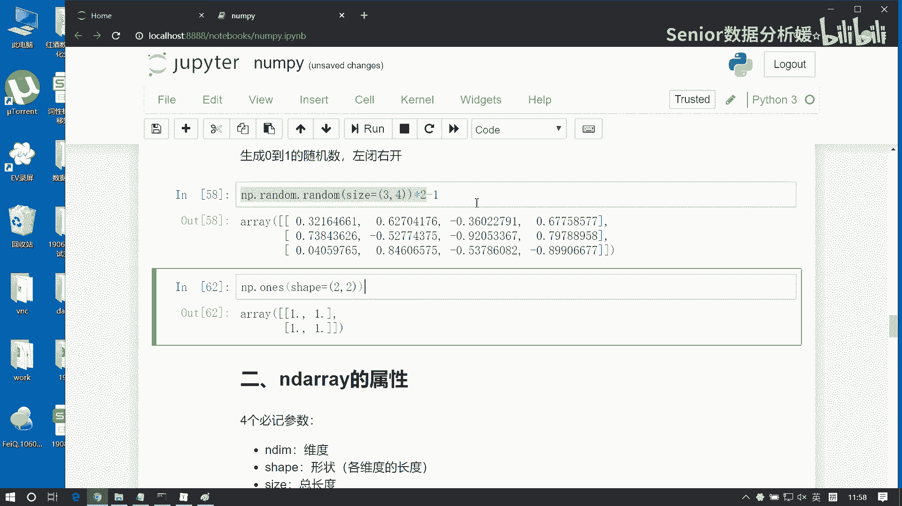

例如：
```python
arr = np.random.randint(0, 10, (3, 4))
print(arr.ndim)   # 输出：2
print(arr.shape)  # 输出：(3, 4)
print(arr.size)   # 输出：12
print(arr.dtype)  # 输出：dtype('int64')
```
如果创建数组时传入不同类型的数据，NumPy会进行**类型统一**（向上转换）。例如，混合数字和字符串会统一为字符串类型。

---


本节课中我们一起学习了NumPy中生成单位矩阵、等差数列、各类随机数的方法，并了解了数组的四个基本属性（维度、形状、大小、数据类型）。这些是进行高效数值计算和数据处理的核心基础，请务必熟练掌握。下一节，我们将深入探讨NumPy强大的数组索引和切片功能。