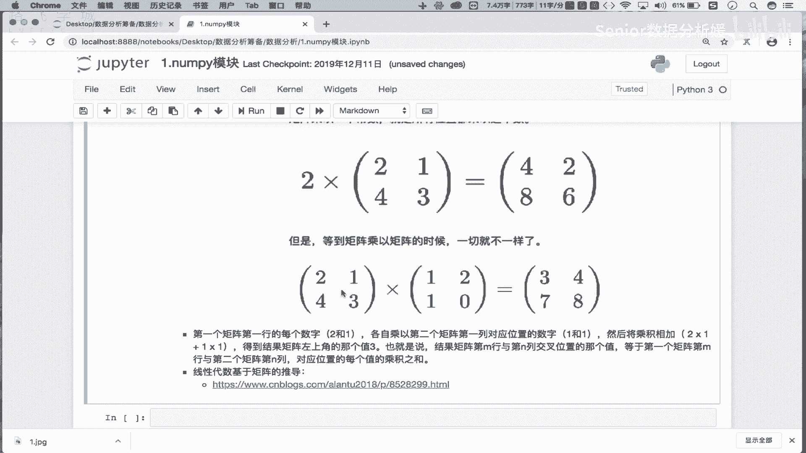
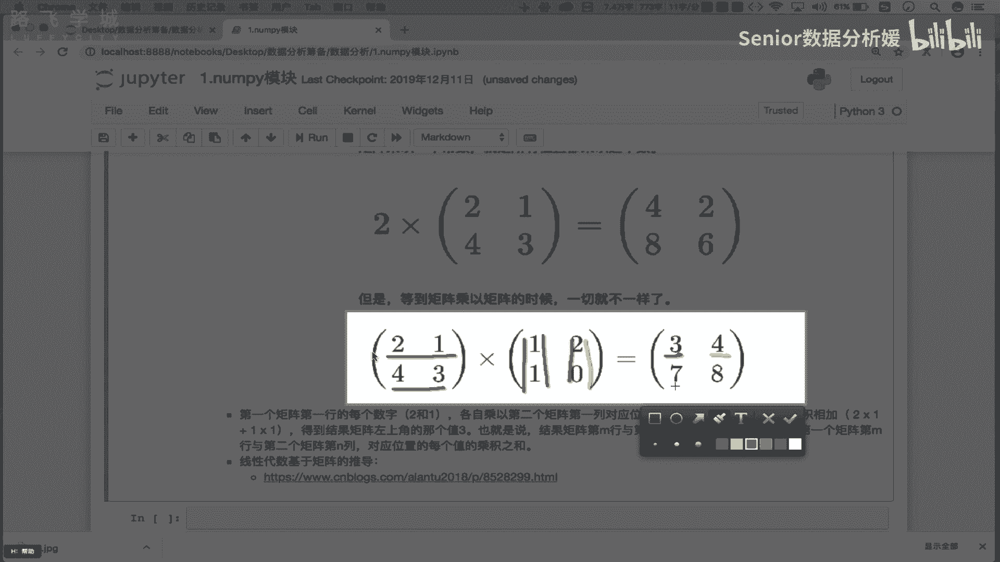
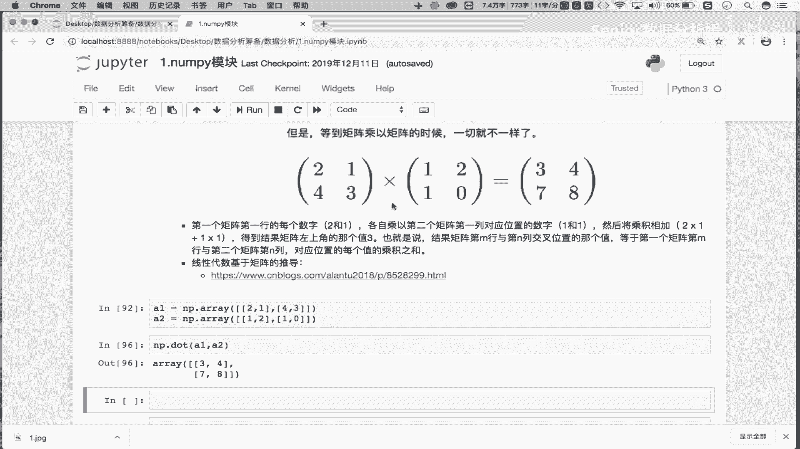
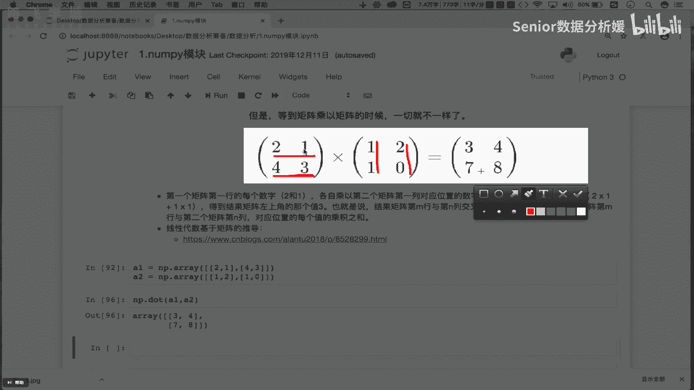
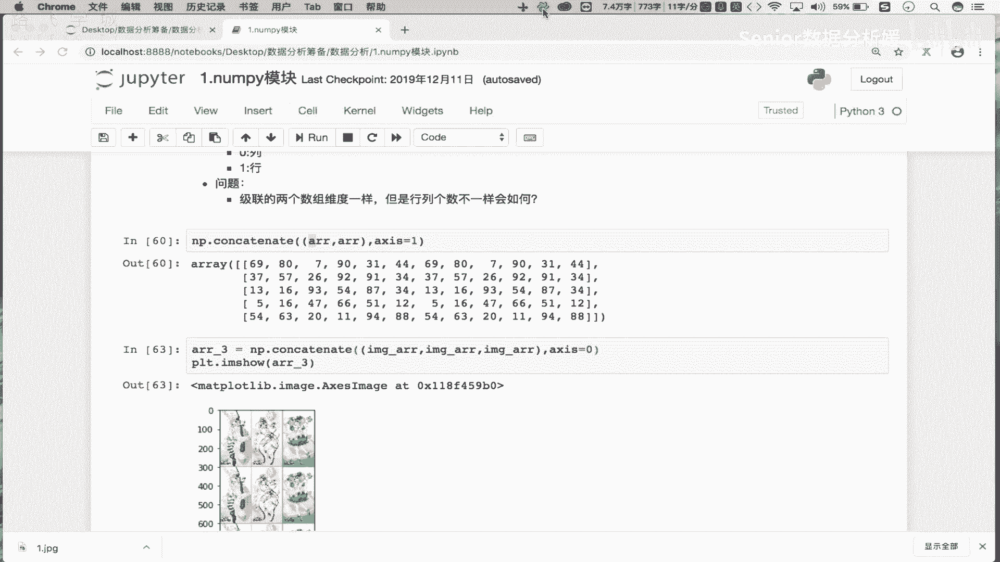

# 数据分析+金融量化+数据清洗：P7：06 统计&聚合&矩阵操作 📊

在本节课中，我们将要学习NumPy模块中关于数组形状变换、拼接、聚合计算、常用数学与统计函数以及矩阵运算的核心操作。这些是进行高效数值计算和数据分析的基础。

## 数组形状变换 🔄

上一节我们介绍了数组的索引与切片，本节中我们来看看如何改变数组的形状。变形操作指的是在不改变数组数据的前提下，重新排列其维度结构。

原始数组 `arr` 是一个五行六列的二维数组。

```python
import numpy as np
arr = np.random.rand(5, 6) # 示例：创建一个5行6列的随机数组
print(arr.shape) # 输出: (5, 6)
```

我们可以使用 `reshape` 方法将其变形。例如，将二维数组变形为一维数组。原始数组共有30个元素，因此一维数组必须有30个位置来容纳它们。

```python
arr_1d = arr.reshape(30) # 将5x6的数组变形为有30个元素的一维数组
print(arr_1d.shape) # 输出: (30,)
```

反之，一维数组也可以变形为多维数组，只要变形后容器的总元素数量不变。

```python
arr_1 = np.arange(30) # 创建一个有30个元素的一维数组
arr_2d_1 = arr_1.reshape(2, 15) # 变形为2行15列
arr_2d_2 = arr_1.reshape(6, 5) # 变形为6行5列
```

**注意**：变形操作要求新形状的总元素数必须与原数组完全一致，不能多也不能少。

## 数组拼接 🔗

接下来，我们学习如何将多个数组拼接在一起。拼接操作可以将数组沿指定轴（横向或纵向）连接起来。

以下是拼接操作的基本方法：

```python
# 假设有两个相同的二维数组 arr
arr_concat_0 = np.concatenate((arr, arr), axis=0) # 沿0轴（纵向，行方向）拼接
arr_concat_1 = np.concatenate((arr, arr), axis=1) # 沿1轴（横向，列方向）拼接
```

*   **`axis=0`**：表示纵向拼接，即上下堆叠，行数增加。
*   **`axis=1`**：表示横向拼接，即左右并排，列数增加。

**重要规则**：
1.  只能对**维度相同**的数组进行拼接。
2.  拼接时，除拼接轴外，其他轴上的维度必须一致。例如，两个二维数组进行 `axis=0` 拼接时，它们的列数必须相同；进行 `axis=1` 拼接时，行数必须相同。

**思考与实践**：如果尝试拼接两个行数相同但列数不同的数组（例如一个5行3列，一个5行4列），沿 `axis=1` 拼接会发生什么？请自行尝试。

拼接的一个典型应用是图像处理，例如制作多宫格图片。

```python
# 假设 image_arr 是一个图像数据数组
image_triplet = np.concatenate((image_arr, image_arr, image_arr), axis=1) # 横向拼接三张图
# 使用 matplotlib 显示拼接后的图像
import matplotlib.pyplot as plt
plt.imshow(image_triplet)
plt.show()
```

## 聚合操作 📉

聚合操作是对数组中所有元素或沿某个轴向的元素进行统计计算。这是数据分析中最常用的功能之一。

以下是一些核心的聚合方法：

```python
arr = np.random.rand(5, 6)
# 对整个数组计算
total_sum = arr.sum() # 所有元素的和
total_max = arr.max() # 所有元素的最大值
total_min = arr.min() # 所有元素的最小值
total_mean = arr.mean() # 所有元素的平均值

# 沿特定轴计算
col_sum = arr.sum(axis=0) # 计算每一列的和，结果是一个一维数组，长度为6
row_max = arr.max(axis=1) # 计算每一行的最大值，结果是一个一维数组，长度为5
```

## 常用数学与统计函数 🧮

NumPy 提供了丰富的数学函数，可以对数组进行逐元素计算。

以下是部分常用函数示例：

```python
arr = np.array([0, 30, 45, 60, 90])
# 三角函数（输入为角度制需先转换为弧度制）
radians = np.deg2rad(arr) # 角度转弧度
sin_values = np.sin(radians) # 计算正弦值
cos_values = np.cos(radians) # 计算余弦值

# 四舍五入
np.around(3.14159, decimals=2) # 输出: 3.14
np.around(3.14159, decimals=0) # 输出: 3.0
np.around(1234, decimals=-2) # 输出: 1200.0 (向百位取整)
```

在统计函数中，**方差**和**标准差**尤为重要，它们用于衡量数据的离散程度。

*   **方差**：每个数据与全体数据平均数之差的平方值的平均数。公式为：
    **`Var = mean((x - mean(x))**2)`**
*   **标准差**：方差的算术平方根。它和方差表示的含义相同，但单位与原始数据一致。公式为：
    **`Std = sqrt(mean((x - mean(x))**2))`**

```python
data = np.array([85, 90, 78, 92, 88])
variance = np.var(data) # 计算方差
std_deviation = np.std(data) # 计算标准差
print(f"方差: {variance:.2f}, 标准差: {std_deviation:.2f}")
# 方差是标准差的平方
print(np.isclose(variance, std_deviation**2)) # 应输出 True
```

标准差大，说明数据点偏离平均值的程度大，即数据波动大；标准差小，说明数据都聚集在平均值附近。

## 矩阵运算 ⬜



在NumPy中，二维数组可以很方便地进行矩阵运算。我们重点掌握**矩阵乘法**。

首先，了解两个基本操作：
1.  **创建单位矩阵**：主对角线为1，其余为0的方阵。
    ```python
    identity_matrix = np.eye(3) # 创建3x3的单位矩阵
    ```
2.  **矩阵转置**：将矩阵的行列互换。
    ```python
    arr = np.array([[1, 2], [3, 4]])
    arr_transpose = arr.T
    # arr_transpose 为 [[1, 3],
    #                   [2, 4]]
    ```

**矩阵乘法**不是简单的对应元素相乘，它有特定的规则。对于两个矩阵 **A** (m×n) 和 **B** (n×p)，其乘积 **C** (m×p) 中每个元素 **C[i, j]** 的计算方式为：
**`C[i, j] = sum(A[i, :] * B[:, j])`**
即 **C** 的第 i 行第 j 列元素，等于 **A** 的第 i 行与 **B** 的第 j 列对应元素乘积之和。



使用 `np.dot()` 或 `@` 运算符进行矩阵乘法：

```python
A = np.array([[2, 1],
              [4, 3]])
B = np.array([[1, 2],
              [1, 0]])

# 方法一：使用 dot 函数
C = np.dot(A, B)
# 方法二：使用 @ 运算符 (Python 3.5+)
C = A @ B

print(C)
# 输出:
# [[3 4]
#  [7 8]]
```
计算过程验证：
*   C[0,0] = 2*1 + 1*1 = 3
*   C[0,1] = 2*2 + 1*0 = 4
*   C[1,0] = 4*1 + 3*1 = 7
*   C[1,1] = 4*2 + 3*0 = 8



矩阵乘法在机器学习、图像处理等领域有广泛应用。



## 总结 📝

本节课中我们一起学习了NumPy模块的几个高级且核心的操作：
1.  **形状变换**：使用 `reshape()` 改变数组维度，需确保总元素数不变。
2.  **数组拼接**：使用 `concatenate()` 沿指定轴合并多个数组，要求维度匹配且非拼接轴维度一致。
3.  **聚合操作**：如 `sum()`, `max()`, `min()`, `mean()`，可对整个数组或沿轴进行统计。
4.  **数学与统计函数**：包括三角函数、取整函数，以及至关重要的**方差** (`np.var()`) 和**标准差** (`np.std()`)。
5.  **矩阵运算**：重点是**矩阵乘法** (`np.dot()` 或 `@`)，掌握了其计算规则和意义。



这些知识构成了利用NumPy进行科学计算和数据分析的基石，请务必理解并熟练运用。