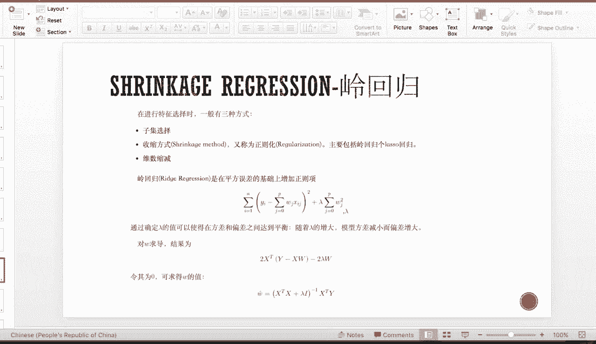
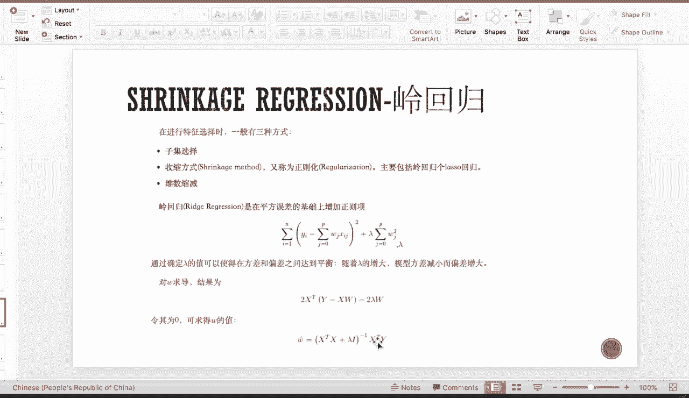
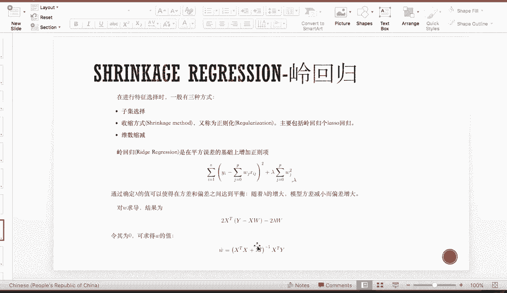
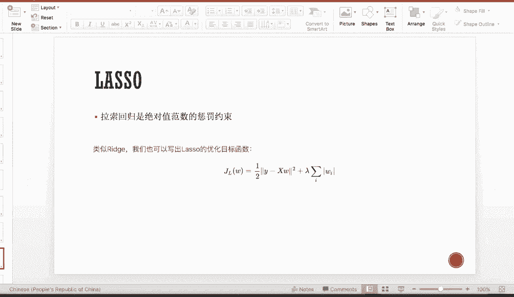
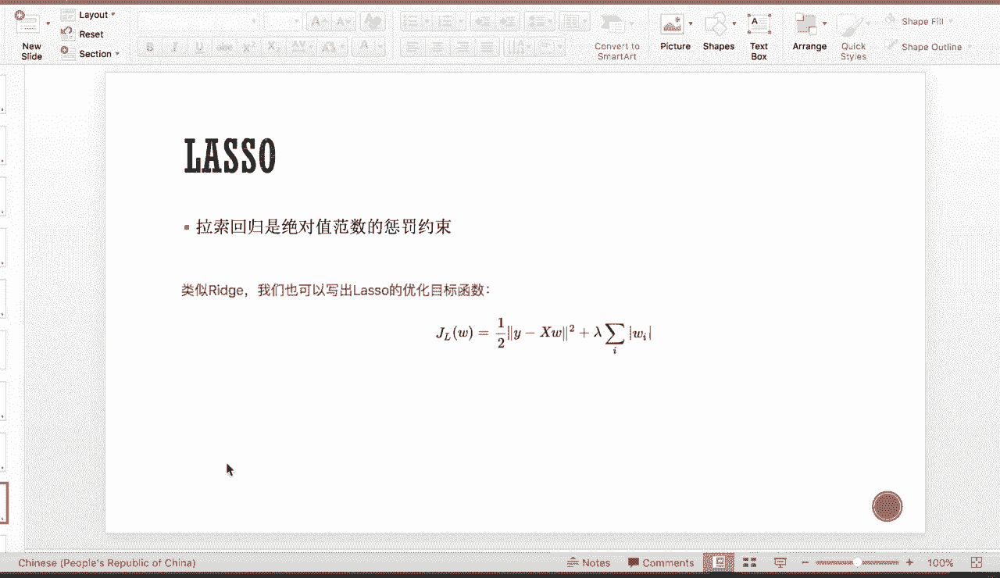
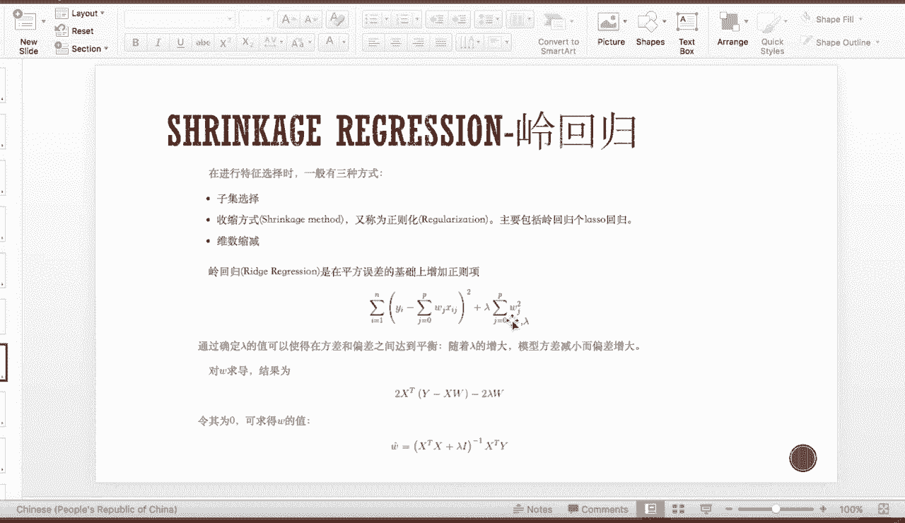
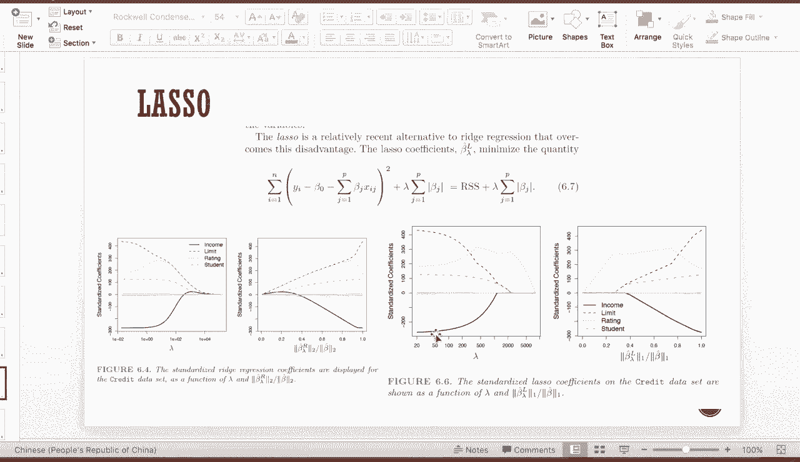
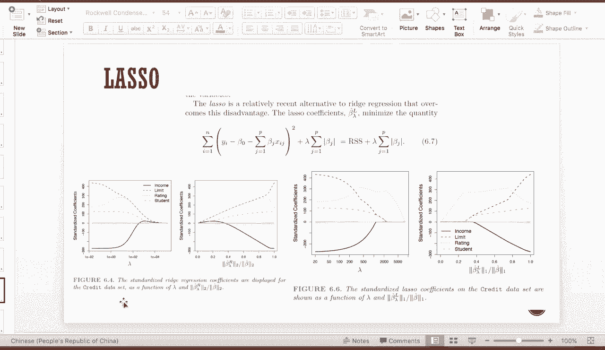

# 机器学习与量化交易：P17：收缩回归 (Shrinkage Regression)

在本节课中，我们将学习线性回归中一个至关重要的概念——多重共线性，并介绍两种用于解决此问题、同时进行特征选择的强大回归方法：岭回归和Lasso回归。

## 多重共线性及其影响

上一节我们提到，在线性回归中，我们不仅需要关注预测的均值，还需要关注其方差。当方差很大时，线性模型就越不稳健，回归结果的可靠性就越低。

那么，是什么原因会导致线性回归的方差很大呢？答案就是多重共线性。

多重共线性是指，在多变量线性回归中，由于自变量之间存在较高的相关系数，导致回归估计不准确的性质。

多重共线性的危害在于，它会使我们得到的模型参数估计的方差变大，从而使估计结果不稳健。

以下是两种常见的多重共线性检验方法：
*   **方差膨胀系数**：即 VIF。其计算公式为 `VIF = 1 / (1 - R_j^2)`，其中 `R_j^2` 是将第 `j` 个变量对其他所有变量做回归得到的拟合优度。VIF 值越高，说明该变量与其他变量的共线性越强。
*   **条件数**：基于特征值分解进行计算。

其中，VIF 是最常用的检验指标。

## 多重共线性的理论推导

首先，我们回顾多元线性回归的参数估计公式：
`β_hat = (X^T * X)^(-1) * X^T * Y`
其中，`X^T * X` 称为设计矩阵。当每个特征的均值为零时，它等价于协方差矩阵。

当存在较强的共线性时，意味着协方差矩阵越接近不可逆（即其行列式趋近于零）。此时，其逆矩阵对角线上的值会变得非常大，从而导致 `β_hat` 的估计值变得极不稳定。参数估计值的方差也随之增大。

## 解决方法：收缩回归

一种解决方法是手动删除一些相关性强的变量。但随意选择保留或删除哪个变量过于草率。有没有一种方法能让机器学习自动为我们选择因子呢？答案是肯定的。

本节我们引入两种收缩回归方法：岭回归和Lasso回归。它们的核心思想是通过机器学习，自动将一些不重要的回归系数“收缩”到零。系数为零的变量就可以被剔除。

收缩回归与普通最小二乘回归的最大区别在于：OLS回归是无偏估计，而收缩回归是有偏估计。为什么我们要选择有偏估计呢？

这涉及到机器学习中著名的 **偏差-方差权衡**。模型的均方误差可以分解为偏差的平方、方差以及一个不可约的误差项。在实践中，偏差较高时，方差往往相对较小；反之，当偏差为零（无偏）时，方差可能会非常大。因此，有时我们愿意引入一点偏差，如果能因此大幅降低方差，就能减少模型的整体均方误差，使模型更稳健。这就是我们使用收缩回归的原因。

一般来说，特征选择有三种方式：
*   **子集选择**：直接丢弃一部分特征。
*   **收缩模型**：即正则化方法，包括岭回归和Lasso回归。它们将所有特征都放入模型，但通过惩罚项强制某些特征的系数趋于零。
*   **维度缩减**：例如主成分分析，通过对原有特征进行线性组合来创建新特征。

## 岭回归

岭回归在普通最小二乘法的损失函数后增加了一个惩罚项。其优化目标为最小化：
`损失函数 = 均方误差 + λ * Σ(β_j^2)`
这个惩罚项意味着，在最小化误差的同时，我们还需要尽量让回归系数本身变小。系数越大，受到的惩罚就越大。

通过推导，岭回归的参数估计公式为：
`β_hat_ridge = (X^T * X + λI)^(-1) * X^T * Y`
对比OLS的公式 `β_hat = (X^T * X)^(-1) * X^T * Y`，我们发现它只是在 `X^T * X` 矩阵的对角线上加了一个正数 `λ`。这可以直观地理解为：当存在多重共线性时，`X^T * X` 矩阵接近奇异（病态），难以求逆。在对角线上添加 `λ` 可以改善矩阵的条件数，使其更容易求逆，从而得到更稳定的估计。

在实际应用中，惩罚系数 `λ` 需要通过网格搜索等方法确定。我们可以绘制岭迹图来观察 `λ` 变化时系数收缩的情况。当 `λ` 很小时，惩罚很弱，所有系数都显著不为零；随着 `λ` 增大，惩罚变强，系数逐渐向零收缩；当 `λ` 趋于无穷大时，所有系数都收缩为零。

## Lasso回归

Lasso回归是比岭回归更常用的特征选择方法。它与岭回归的损失函数形式类似，但惩罚项不同。
Lasso回归的优化目标为：
`损失函数 = 均方误差 + λ * Σ|β_j|`
两者的唯一区别在于惩罚项使用的范数：岭回归使用 **L2范数**（系数的平方和），而Lasso回归使用 **L1范数**（系数的绝对值和）。

Lasso回归也能绘制类似的系数收缩路径图。与岭回归相比，Lasso回归的系数能更快地**精确收缩到零**。在岭回归中，许多系数可能非常接近零但不是零；而在Lasso回归中，许多系数会直接变为零，这为我们提供了清晰的特征选择依据——系数为零的特征可以直接剔除。

为什么Lasso回归能将系数精确收缩到零，而岭回归不能呢？
我们可以从几何角度理解：Lasso的约束区域是一个菱形（在二维下是正方形），而岭回归的约束区域是一个圆形。最小化损失函数相当于在约束区域内寻找与无约束解最接近的点。菱形的顶点位于坐标轴上，因此最优解更容易“撞到”顶点，使得某些系数恰好为零。而圆形的边界是光滑的，与坐标轴相切于一个点的概率几乎为零。

从数学上讲，**L1范数具有稀疏性**，更容易产生稀疏解（即很多系数为零），而L2范数则不具备这个特性。

## Elastic Net

Lasso回归虽然能有效进行特征选择，但由于它将许多变量系数直接设为零，可能会引入较大的偏差。有时我们不希望偏差过大，但又想利用Lasso的选择能力。这时就可以使用 **Elastic Net** 方法。

Elastic Net 结合了岭回归和Lasso回归的惩罚项，其损失函数为：
`损失函数 = 均方误差 + λ * [ α * Σ|β_j| + (1-α)/2 * Σ(β_j^2) ]`
其中，参数 `α` 用于调节L1惩罚项和L2惩罚项之间的比重。当 `α = 1` 时，退化为Lasso回归；当 `α = 0` 时，退化为岭回归。

## 总结

本节课我们一起学习了线性回归中的多重共线性问题及其危害。为了解决这个问题并实现自动特征选择，我们重点介绍了两种收缩回归方法：
1.  **岭回归**：通过L2正则化惩罚项收缩系数，能有效降低方差，提高模型稳定性，但通常不会将系数精确收缩到零。
2.  **Lasso回归**：通过L1正则化惩罚项收缩系数，不仅能降低方差，还能产生稀疏解，实现特征选择。
3.  **Elastic Net**：结合了岭回归和Lasso回归的优点，通过调节参数平衡偏差和特征选择的效果。

这些方法通过引入一点偏差，换来了模型方差的大幅降低和特征的自动筛选，是构建稳健、可解释线性模型的重要工具。