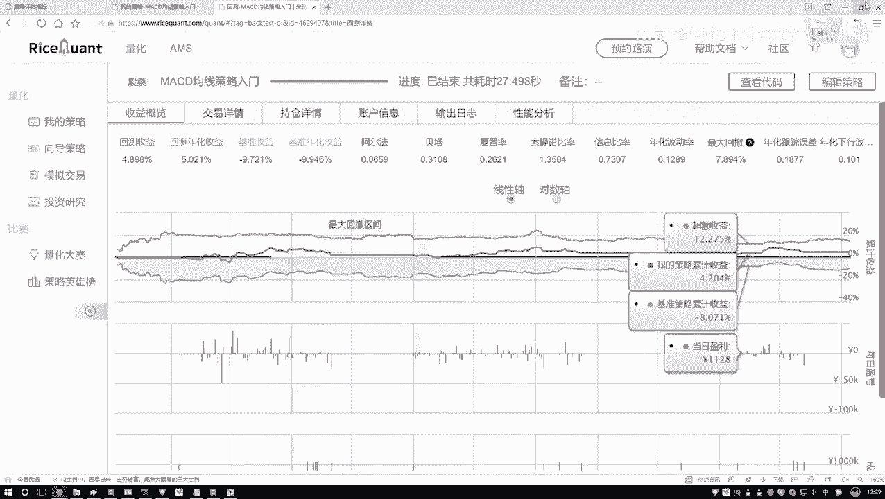
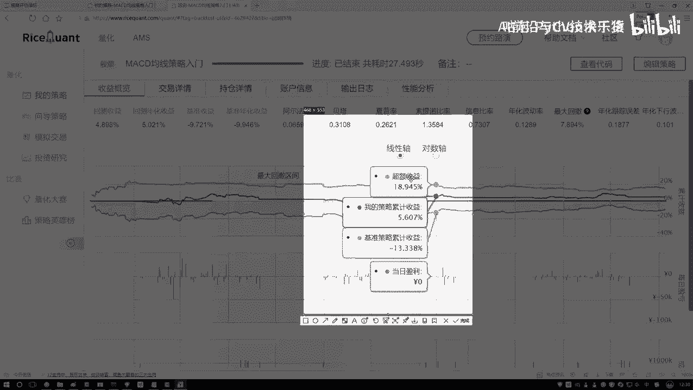
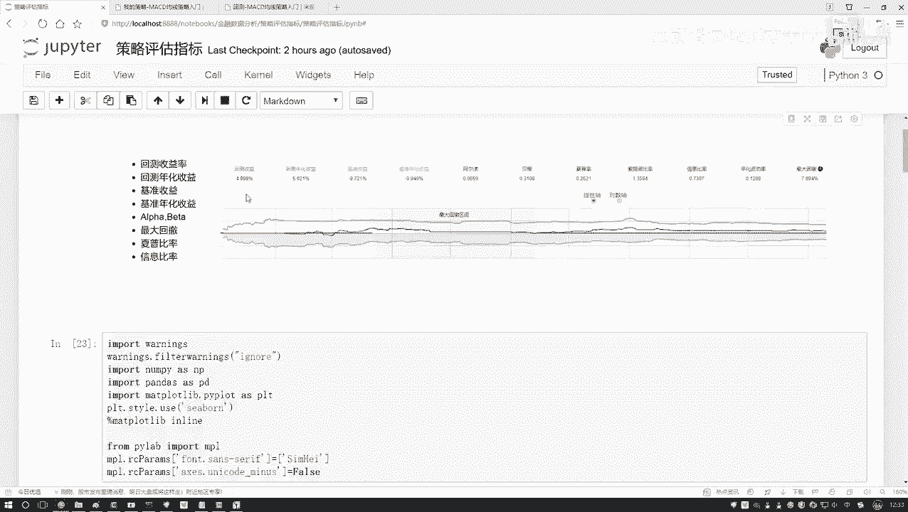

# 机器学习与量化交易：P20：阿尔法与贝塔概述 📊

在本节课中，我们将要学习量化交易策略评估中的两个核心概念：阿尔法（α）和贝塔（β）。理解这两个指标，有助于我们区分投资收益的来源，并明确策略优化的方向。

## 收益的两种来源 💰

在量化交易中，当我们通过策略获得收益时，这笔收益通常可以分解为两个部分。

一部分收益与整体市场环境相关。当市场大环境向好时，大部分投资都能赚钱，这部分收益可以看作是“随大流”获得的。

另一部分收益则与市场整体波动关系不大，它主要来源于我们独特的策略、敏锐的观察力或精细的操作手法。这部分是我们通过自身努力超越市场平均表现所获得的。

阿尔法和贝塔就是分别用来衡量这两部分收益的指标。

## 核心概念解析 🔍

以下是阿尔法与贝塔的具体定义：

*   **阿尔法（α）**：衡量的是**超额收益**。它代表投资策略中与市场波动无关的部分，即通过策略自身的“努力”所获得的、超越市场基准的收益。阿尔法值越高，通常意味着策略的独立盈利能力越强。
    *   **公式表示**：在资本资产定价模型（CAPM）中，阿尔法是回归方程 `E(Ri) = Rf + βi * [E(Rm) - Rf] + α` 中的截距项。其中 `E(Ri)` 是资产预期收益，`Rf` 是无风险利率，`E(Rm)` 是市场预期收益，`βi` 是贝塔系数。

*   **贝塔（β）**：衡量的是**系统性风险**或市场相关性。它反映了投资策略对大盘波动的敏感程度。贝塔值为1表示策略波动与市场同步；大于1表示波动比市场更剧烈；小于1则表示波动比市场平缓。
    *   **公式表示**：同上，贝塔是上述回归方程中市场风险溢价 `[E(Rm) - Rf]` 的系数，代表了资产收益相对于市场收益的变化率。

## 图解收益构成 📈

我们可以通过收益曲线图来直观理解这两个概念。

在策略回测图中，通常包含几条关键曲线：
*   **策略收益曲线**：代表我们策略的实际收益走势。
*   **基准收益曲线**（如上图蓝色线）：代表市场大环境（如沪深300指数）的收益走势，可理解为“什么都不做，单纯跟随市场”的收益。
*   **超额收益曲线**：即策略收益曲线减去基准收益曲线后的结果。这条曲线直观地展示了策略**独立于市场**所创造的额外价值。

因此，**总收益 = 市场收益（贝塔收益）+ 超额收益（阿尔法收益）**。我们的策略目标，就是尽可能最大化阿尔法收益。

## 策略目标与关注点 🎯

上一节我们介绍了收益的构成，本节中我们来看看这对我们的策略开发意味着什么。

由于市场整体的走势（贝塔部分）是个人投资者无法控制或预测的，我们的关注重点应放在如何获取稳定的**阿尔法收益**上。量化策略研究的核心，就是寻找能够持续产生正阿尔法的因子或模型。

阿尔法和贝塔的数值可以通过统计方法（如线性回归）从历史数据中计算得出。在后续讲解因子策略分析时，我们会深入探讨具体的计算方法。

## 其他常见评估指标 📊

除了阿尔法和贝塔，在策略评估中还有其他重要指标。以下是几个关键指标的简要说明，初学者了解其含义即可，无需死记公式，实际应用中多有现成工具包可供调用。

*   **最大回撤**：策略在选定周期内，从任一峰值点到其后最低点的最大跌幅。用于衡量策略可能面临的最坏情况。
*   **夏普比率**：衡量策略在承担每单位风险时所获得的超额回报。比率越高，说明风险调整后的收益越好。
*   **基准收益**：如前所述，即参照市场指数（如沪深300）的收益，作为评价策略表现的基准线。

## 总结 📝

本节课中我们一起学习了量化交易中的两个基石概念：**阿尔法（α）** 与 **贝塔（β）**。
*   贝塔（β）衡量了策略收益中与**市场整体波动**相关的部分，即系统性风险。
*   阿尔法（α）衡量了策略通过自身能力获得的、**超越市场**的超额收益。

理解这两者的区别，能帮助我们清晰界定收益来源，并将策略研发的重心聚焦于寻找和提升可持续的阿尔法上。这是构建成功量化交易策略的关键一步。