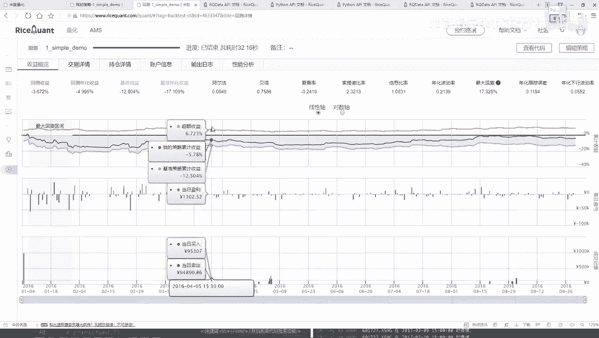
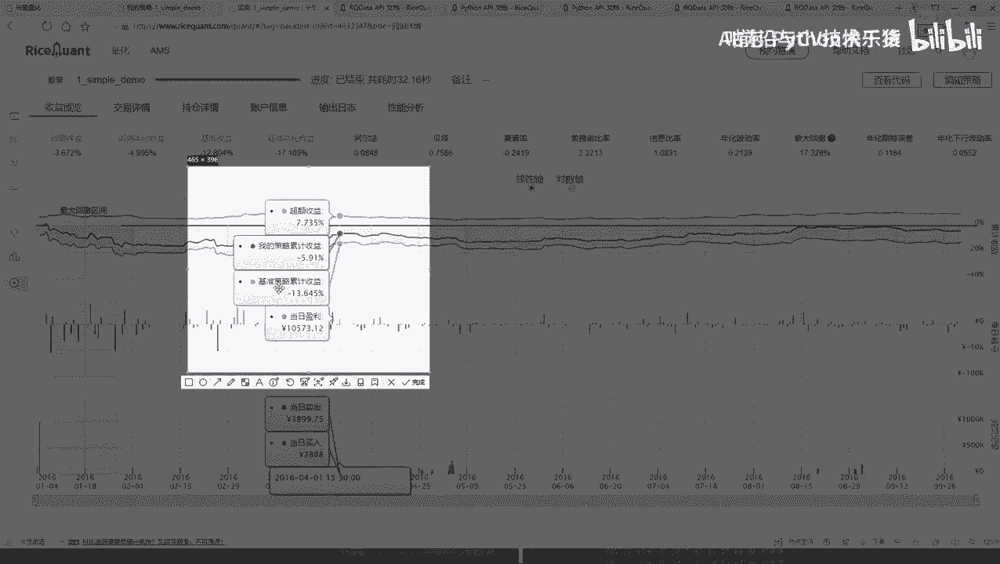
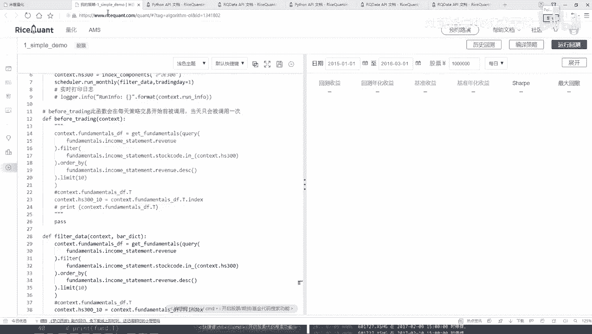

# 机器学习与量化交易项目实战：P27：定时器功能与作用 ⏰

在本节课中，我们将学习如何在量化交易策略中使用定时器功能。定时器允许我们自定义策略的执行频率，例如从每日执行改为每月执行，从而更灵活地控制交易逻辑。

上一节我们介绍了策略回测的基本流程和结果分析，本节中我们来看看如何通过定时器来调整策略中核心操作的执行周期。

## 交易详情回顾

在之前的策略中，我们设定了回测时间为2016年1月4日至2016年10月4日。策略中的核心操作（如选股）在 `handle_data` 和 `before_trading` 函数中执行，这两个函数在**每一个交易日**都会被调用。

因此，我们得到的交易结果是每日都会产生。交易详情中列出了每一天的操作，例如在第一天（1月4日），策略会平均买入选出的十只股票。

以下是第一天的买入逻辑：
```python
# 假设初始资金为100,000元，平均买入10只股票
initial_cash = 100000
stocks_to_buy = 10
cash_per_stock = initial_cash / stocks_to_buy
```
第一天执行买入操作，因为初始仓位为空。从第二天开始，策略会根据新的选股结果进行买卖调整，以维持目标仓位，并考虑交易费用（如印花税、佣金等）。

交易详情和持仓详情页面提供了所有交易的详细记录、每日盈亏以及账户市值的变化，可供深入分析。



## 引入定时器功能



在当前的策略中，每日进行选股（“洗牌”）操作可能过于频繁。我们可能希望降低操作频率，例如每十天或每月执行一次选股。

这时，我们可以使用平台提供的**定时器（Scheduler）** API来自定义函数的执行时间。

定时器的作用是按照设定的时间间隔（如每月、每周）来执行指定的函数。这为我们优化策略逻辑提供了灵活性。

## 如何使用定时器

定时器只能在策略的初始化函数 `__init__` 中使用。其基本功能是安排一个自定义函数在特定的时间点（如每月的第一个交易日）执行。

以下是定时器的一个常用方法：
```python
# 每月运行的定时器示例
self.schedule_monthly(function, tradingday)
```
*   **function**: 需要定时执行的自定义函数。
*   **tradingday**: 指定在当月的第几个交易日执行该函数（例如，1代表第一个交易日）。

为了应用定时器，我们需要调整原有策略：
1.  将原来在 `before_trading` 或 `handle_data` 中的选股逻辑移到一个自定义函数中（例如 `filter_data`）。
2.  在 `__init__` 函数中使用定时器调度这个自定义函数。
3.  注释或移除原来每日执行的选股代码。

调整后的代码结构如下：
```python
def __init__(self):
    # ... 其他初始化代码 ...
    # 使用定时器：每月第一个交易日执行 filter_data 函数
    self.schedule_monthly(self.filter_data, 1)

def filter_data(self):
    # 将原有的每日选股逻辑移动到这里
    # 例如：query(...).filter(...).order_by(...).limit(...)
    pass

# 注释掉原来在 before_trading 或 handle_data 中的每日选股逻辑
# def before_trading(self):
#     # 原有的选股逻辑
```
通过这样的修改，选股操作将从每日执行变为每月执行一次。

## 定时器效果验证

修改策略后，我们使用相同的时间段（2016年1月4日至10月4日）进行回测。结果显示，策略的最终收益发生了变化（例如从亏损4%变为亏损更多）。

这说明了**调整策略的执行频率会显著影响最终回测结果**。策略的表现好坏并不确定，需要开发者通过不同参数和不同时间段进行反复测试和优化。

例如，更换回测时间段到2018年至2020年，策略的收益结果又会不同。这强调了在量化交易中，参数敏感性和时间段选择的重要性。



本节课中我们一起学习了量化交易平台中定时器（Scheduler）的功能与使用方法。我们了解到，通过定时器可以灵活控制策略中关键函数的执行频率（如将每日选股改为每月选股），并且这一改动会直接影响策略的回测表现。核心要点在于参考官方API文档，将原有逻辑封装成函数，并在初始化阶段进行调度。量化策略的开发是一个不断实验和迭代的过程，需要结合API的熟练使用与对市场的理解。