# 机器学习与量化交易：P28：百分位去极值方法 📊

在本节课中，我们将学习如何对因子数据进行预处理。因子是影响最终结果（如股票收益）的指标，例如市净率或营收增长率。处理因子数据是构建有效量化策略的关键步骤，它有助于我们更准确地分析各因子对结果的影响，并筛选出更具潜力的股票。

## 因子数据预处理三步走 🚶‍♂️

上一节我们介绍了因子的基本概念，本节中我们来看看如何对因子数据进行预处理。以下是数据预处理的三个核心步骤：

1.  **去极值**：处理数据中的离群点或异常值。
2.  **标准化**：将不同量纲或取值范围的因子数据转换到同一尺度。
3.  **中性化**：消除因子数据中某些系统性偏差的影响。

前两个步骤在机器学习与数据挖掘中很常见，而“中性化”则是量化因子策略中特有的重要处理环节。接下来，我们将按照这个顺序，详细讲解每一步的具体做法。

## 第一步：去极值处理 📉

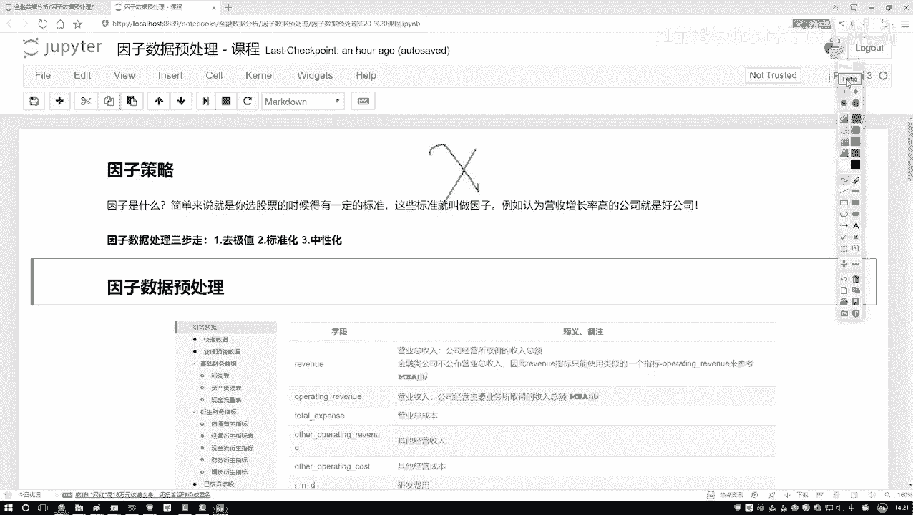

在开始建模之前，我们需要处理数据中的极值。直接使用包含极端值的数据可能会扭曲模型的结果。一种常见的思路不是直接删除这些极值，而是将它们“拉回”到合理的边界内。

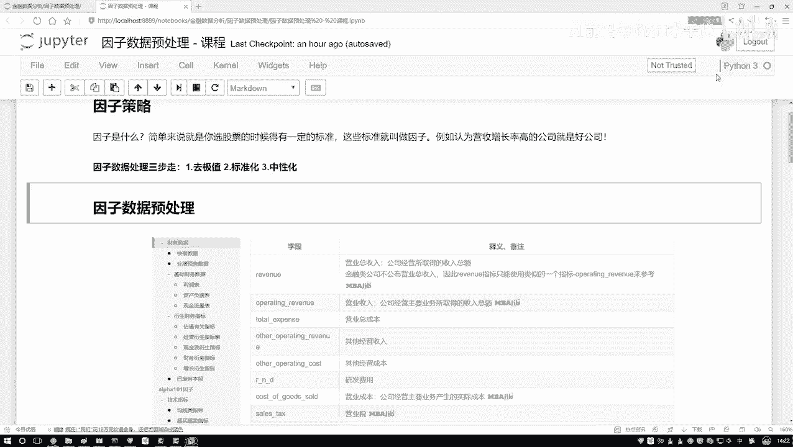

以下是几种去极值的方法，我们先介绍第一种：**分位数去极值法**。

### 分位数去极值法

分位数是描述数据分布位置的重要统计量。与容易受极端值影响的均值不同，分位数（如中位数）能更稳健地反映数据的中心趋势。

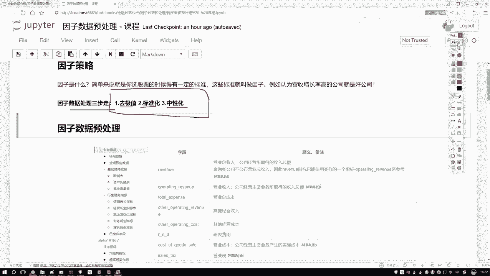

*   **中位数 (Q2)**：将数据从小到大排列后，处于正中间位置的值。如果数据个数为偶数，则取中间两个数的平均值。
    *   公式：对于有序数据集 `[x1, x2, ..., xn]`，中位数 `median = x[(n+1)/2]`（n为奇数）或 `(x[n/2] + x[n/2+1]) / 2`（n为偶数）。
*   **下四分位数 (Q1)**：数据中所有数值由小到大排列后，处于25%位置的值。
*   **上四分位数 (Q3)**：数据中所有数值由小到大排列后，处于75%位置的值。

分位数去极值法的核心思想是：设定一个基于分位数的边界，将超出边界的数据值用边界值替代。例如，我们可以计算数据的上下四分位数（Q1和Q3），并定义其差值（IQR，四分位距）为 `IQR = Q3 - Q1`。通常，将下界设为 `Q1 - k * IQR`，上界设为 `Q3 + k * IQR`（k常取1.5或3）。任何小于下界或大于上界的数值，都会被替换为相应的边界值。

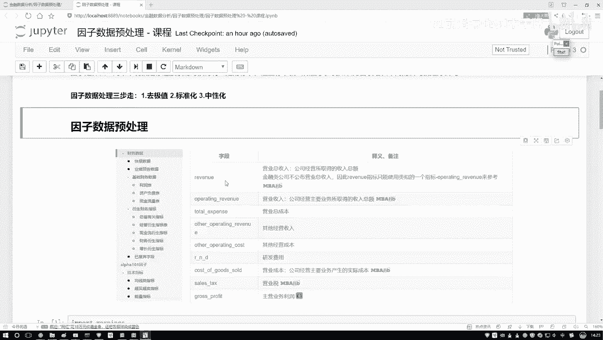

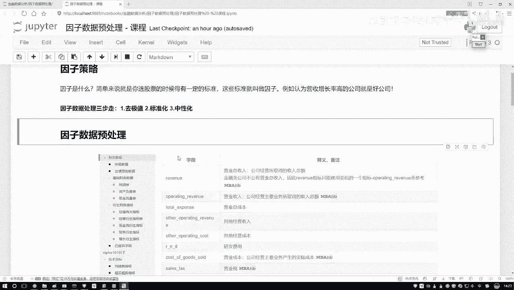

```python
# 示例：使用pandas计算分位数并进行去极值处理（假设k=1.5）
import pandas as pd
import numpy as np

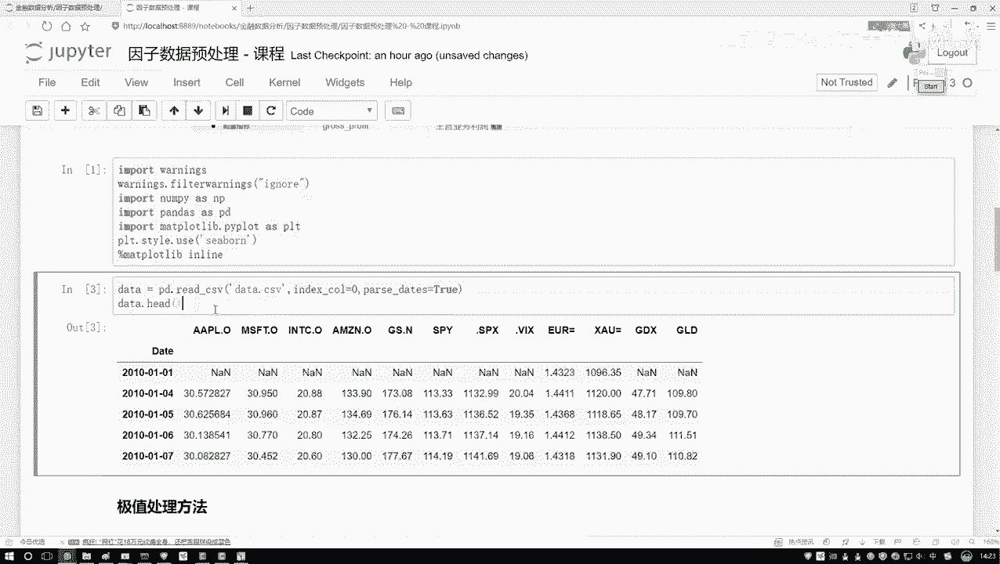

# 假设 factor_data 是一个包含因子值的Pandas Series
Q1 = factor_data.quantile(0.25)
Q3 = factor_data.quantile(0.75)
IQR = Q3 - Q1
lower_bound = Q1 - 1.5 * IQR
upper_bound = Q3 + 1.5 * IQR

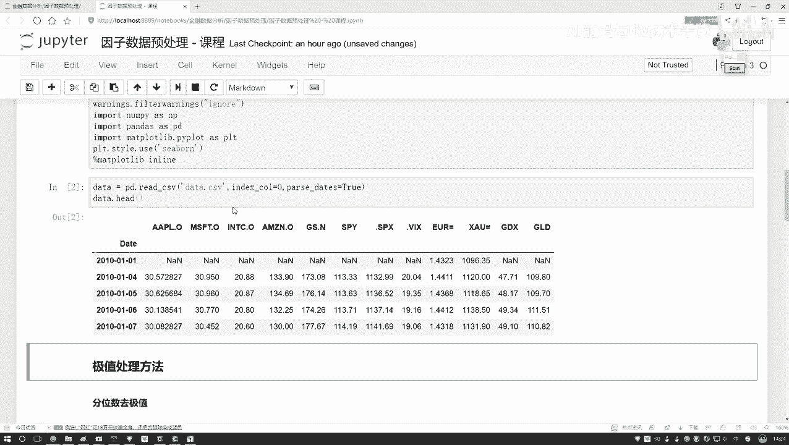

# 将超出边界的值替换为边界值
factor_data_clipped = factor_data.clip(lower_bound, upper_bound)
```

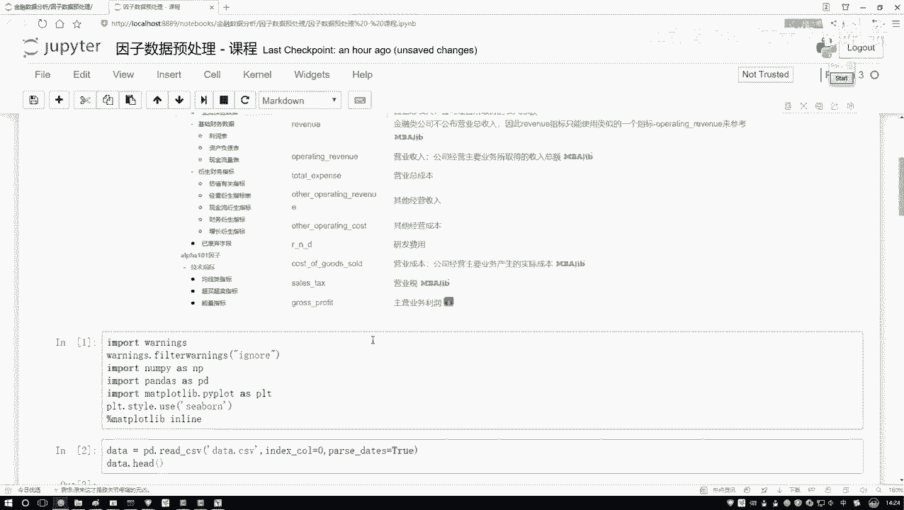

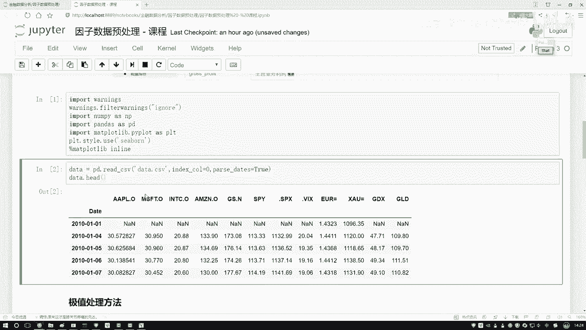

## 第二步：数据标准化 🔢

上一节我们处理了数据中的异常值，本节中我们来看看如何让不同因子在相同尺度上进行比较。这就是标准化要做的事。

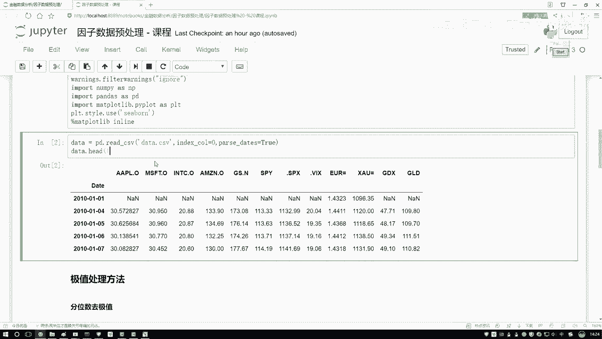

不同因子的原始数值可能差异巨大（例如，市值可能是亿级，而换手率是百分比）。直接使用这些原始值，模型可能会过分重视数值大的因子。标准化的目的就是将所有因子数据转换到均值为0、标准差为1的分布上，消除量纲影响。

最常用的标准化方法是 **Z-Score标准化**。
其公式为：
`z = (x - μ) / σ`
其中，`x` 是原始值，`μ` 是该因子所有数据的均值，`σ` 是其标准差。

```python
# 示例：使用scikit-learn进行Z-Score标准化
from sklearn.preprocessing import StandardScaler

scaler = StandardScaler()
# 假设 factor_df 是一个包含多个因子列的DataFrame
factor_df_standardized = scaler.fit_transform(factor_df)
factor_df_standardized = pd.DataFrame(factor_df_standardized, columns=factor_df.columns)
```

## 第三步：因子中性化 ⚖️

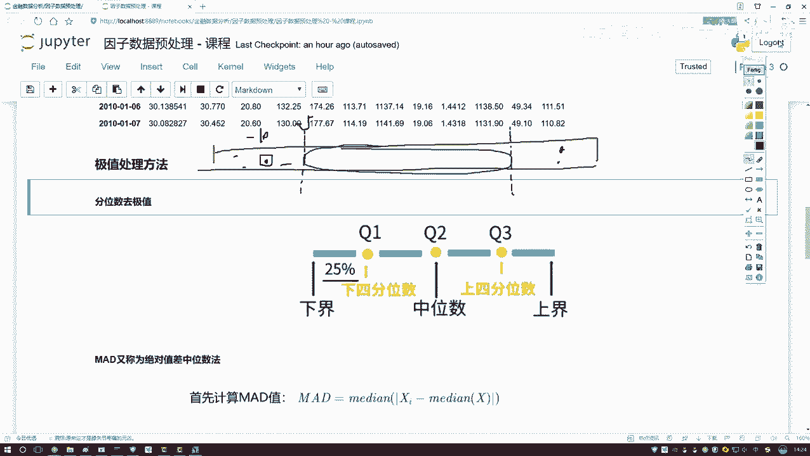

在量化策略中，我们常常希望评估一个因子本身的选股能力，而不希望它受到其他系统性因素的影响。例如，市值因子对股票收益有很强的影响（小市值效应）。如果我们想研究“市净率”因子的独立效果，就需要先剔除“市值”对“市净率”的影响。这个过程就叫**中性化**。

中性化通常通过回归分析来实现。以剔除市值影响为例：
1.  将待中性化的因子（如市净率）作为因变量 `Y`。
2.  将需要剔除影响的因子（如市值）作为自变量 `X`。
3.  进行线性回归 `Y = α + β * X + ε`。
4.  取回归的残差 `ε` 作为中性化后的新因子值。这个残差代表了原始因子中无法被市值解释的部分，即“纯净”的因子暴露。

```python
# 示例：使用statsmodels进行线性回归以中性化因子（以市值中性化为例）
import statsmodels.api as sm

# 假设 pb_ratio 是市净率因子序列， market_cap 是市值因子序列
X = sm.add_constant(market_cap) # 添加常数项
model = sm.OLS(pb_ratio, X).fit()
residuals = model.resid # 获取残差，这就是中性化后的市净率因子

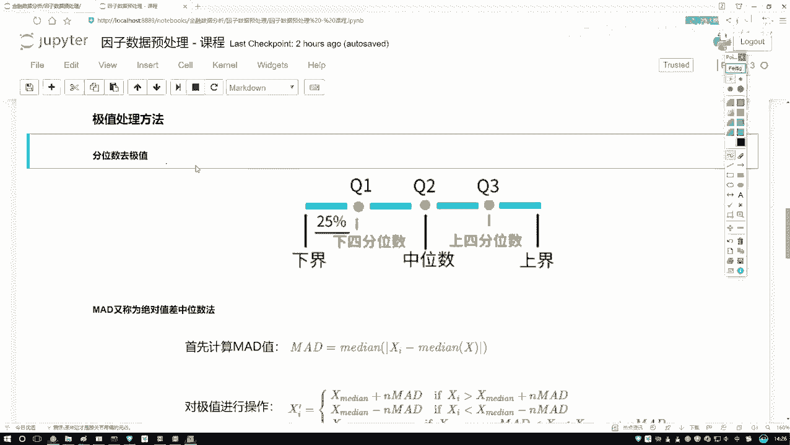

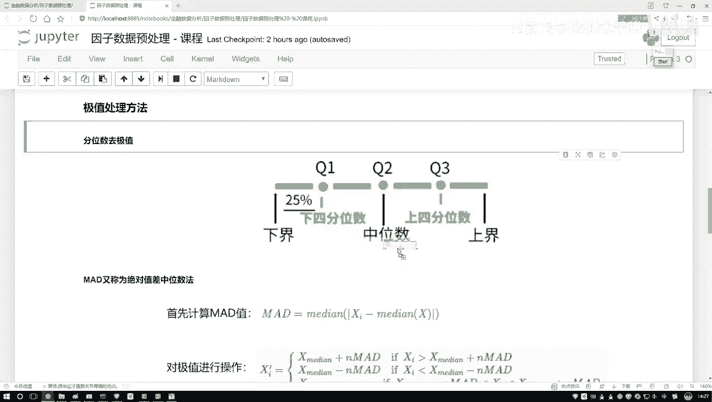

# 中性化后的因子 residuals 均值为0，且与 market_cap 的相关性为0。
```

## 总结 📝

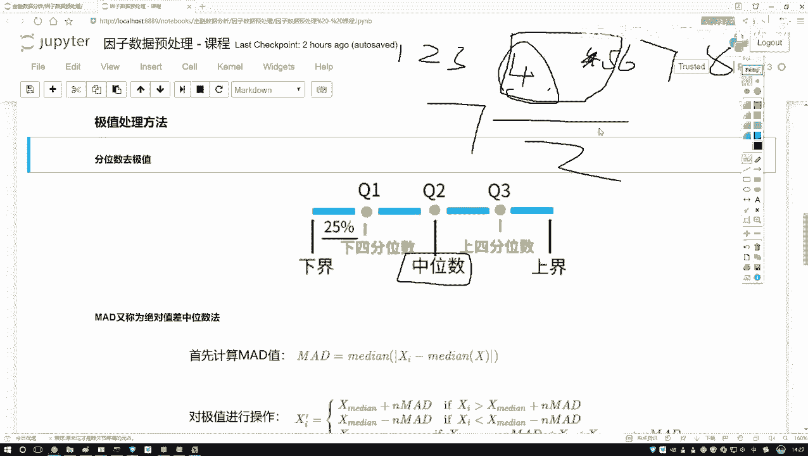

本节课中我们一起学习了因子数据预处理的三个核心步骤：
1.  **去极值**：使用分位数等方法识别并处理异常值，防止其干扰模型。
2.  **标准化**：通过Z-Score等方法将不同量纲的因子转换到同一尺度，使其具有可比性。
3.  **中性化**：通过回归分析剔除其他系统性因子（如市值、行业）的影响，得到目标因子的“纯净”暴露。

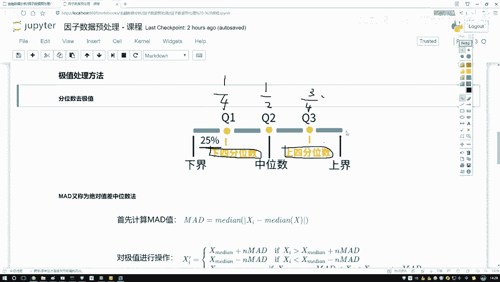

这些步骤是构建可靠多因子模型的基础，能显著提升因子有效性和策略稳定性。在实际操作中，我们通常会先对每个因子单独进行去极值和标准化，然后在构建复合因子或进行单因子测试前，进行必要的中性化处理。