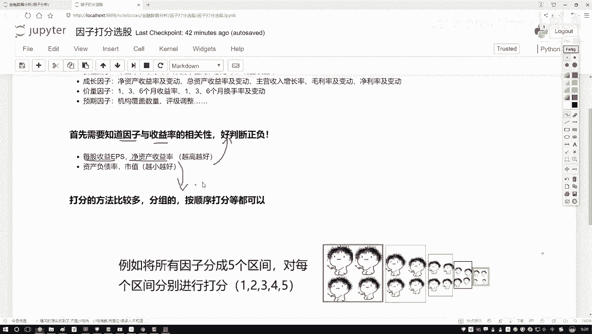
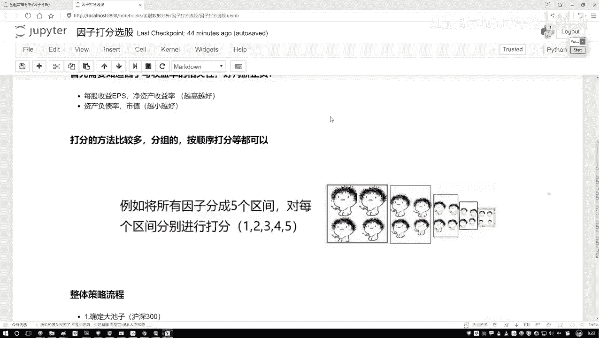
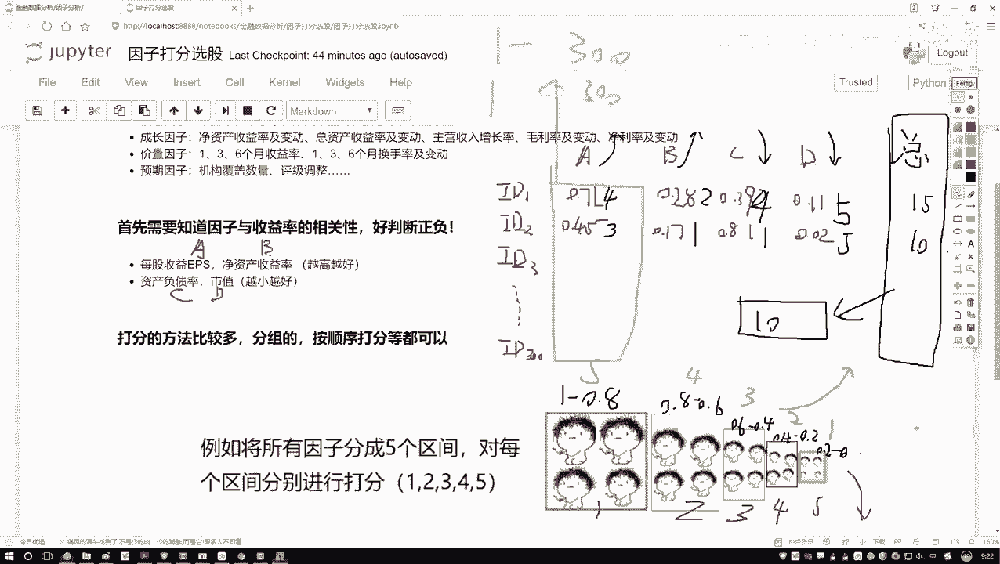
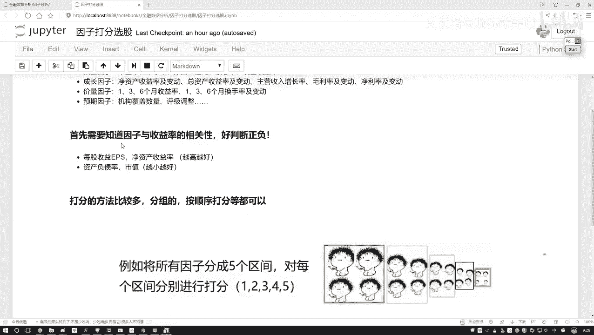
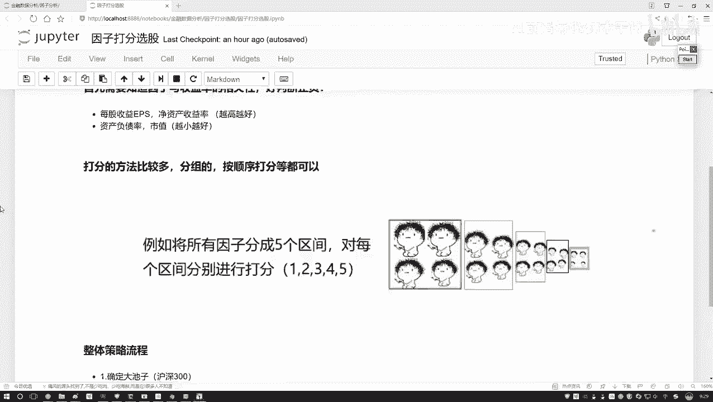
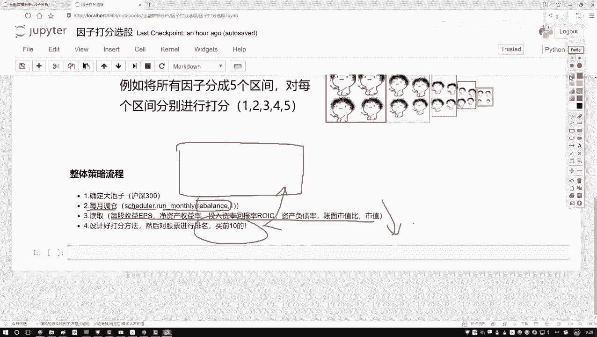
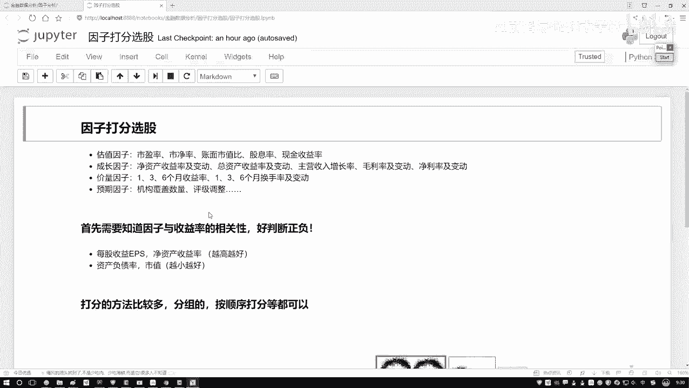

# 机器学习与量化交易：P49：整体任务流程梳理 📊

在本节课中，我们将学习如何为股票因子进行打分，并梳理一个完整的量化策略构建流程。我们将从已知的因子数据出发，通过设计打分规则，最终筛选出排名靠前的股票。

## 因子打分方法详解

上一节我们介绍了如何获取和预处理因子数据。本节中，我们来看看如何为这些因子进行打分，以便进行综合评估。

有了已知的因子数据后，接下来需要为每个因子打分。

以下是打分的基本思路：为每个因子根据其数值大小划分区间，并依据因子对收益的影响方向（越大越好或越小越好）赋予不同的分数。

首先，我们假设有一些样本数据，例如沪深300的成分股。每个股票有多个因子指标，例如A、B、C、D。其中，因子A和B是**越大越好**的指标，因子C和D是**越小越好**的指标。

每个股票都能取出对应的因子值。例如，对于股票`id1`，其因子值为：
*   A = 0.71
*   B = 0.28
*   C = 0.39
*   D = 0.11

对于股票`id2`，其因子值为：
*   A = 0.45
*   B = 0.17
*   C = 0.81
*   D = 0.02

这些数据可以直接从数据库中查询获得。

接下来，为每个因子划分区间并设计分值。假设因子值已经归一化到[0, 1]区间（或使用百分位概念，原理相同）。

以下是划分区间和打分规则的示例：

对于**越大越好**的因子（如A、B）：
*   数值在 [1.0, 0.8) 区间：得 **5分**
*   数值在 [0.8, 0.6) 区间：得 **4分**
*   数值在 [0.6, 0.4) 区间：得 **3分**
*   数值在 [0.4, 0.2) 区间：得 **2分**
*   数值在 [0.2, 0.0] 区间：得 **1分**

对于**越小越好**的因子（如C、D）：
*   数值在 [0.0, 0.2) 区间：得 **5分**
*   数值在 [0.2, 0.4) 区间：得 **4分**
*   数值在 [0.4, 0.6) 区间：得 **3分**
*   数值在 [0.6, 0.8) 区间：得 **2分**
*   数值在 [0.8, 1.0] 区间：得 **1分**

现在，根据上述规则为示例股票打分：

股票`id1`打分：
*   因子A (0.71): 落在[0.8, 0.6)区间，得 **4分**
*   因子B (0.28): 落在[0.4, 0.2)区间，得 **2分**
*   因子C (0.39): 是越小越好因子，落在[0.4, 0.2)区间，得 **4分**
*   因子D (0.11): 是越小越好因子，落在[0.0, 0.2)区间，得 **5分**
*   **总分** = 4 + 2 + 4 + 5 = **15分**

股票`id2`打分：
*   因子A (0.45): 落在[0.6, 0.4)区间，得 **3分**
*   因子B (0.17): 落在[0.2, 0.0]区间，得 **1分**
*   因子C (0.81): 是越小越好因子，落在[0.8, 1.0]区间，得 **1分**
*   因子D (0.02): 是越小越好因子，落在[0.0, 0.2)区间，得 **5分**
*   **总分** = 3 + 1 + 1 + 5 = **10分**

计算出所有300只股票的总分后，进行排序，选择总分排名前十的股票，作为下次调仓时关注的对象。

这就是打分法的基本计算方法。除了划分区间，也可以采用直接排序打分的方法。例如，对于300只股票，将某个因子的值从大到小排序，如果是越大越好的因子，排名第1的给300分，排名第300的给1分。方法有多种，核心目标是得到一个可汇总比较的总分来进行排名。

打分法是因子测试中经常用到的一种方法，效果通常不错。

## 整体策略流程梳理 🚀

了解了打分方法后，我们来看一下构建一个完整策略的整体流程。这个流程即为我们接下来要实现的策略步骤。

第一步，确定股票池。我们需要指定从何处获取数据，例如选择**沪深300指数**的成分股作为我们的初始股票池。

第二步，设置调仓周期。通常按月或按季度调仓较为常见，这里我们以每月调仓为例。因此需要设置一个定时器函数。

第三步，也是核心步骤，实现调仓函数 `rebalance`。在这个函数中，我们需要完成以下操作：

1.  **读取数据**：获取当前股票池中所有股票的选定因子数据。
2.  **应用先验知识**：明确每个因子对收益的影响方向（例如，前三个因子越大越好，后三个因子越小越好）。
3.  **因子打分**：使用上述打分法，为每只股票的每个因子计算得分。
4.  **计算总分**：汇总每只股票所有因子的得分，得到该股票的总分。
5.  **筛选股票**：对所有股票按总分进行排序，选出排名前十的股票。

整个流程看起来相对简单明了。接下来，我们将使用这种打分法进行实践，看看随意选择的几个指标，能否通过这种策略让我们的收益获得增长。

## 总结

本节课中我们一起学习了量化策略中的因子打分法。我们掌握了如何根据因子的性质（正向或负向）设计打分规则，并计算股票的综合得分。随后，我们梳理了一个完整的策略构建流程，从确定股票池、设置调仓周期到实现核心的选股逻辑。这为我们后续动手实现一个简单的多因子选股策略打下了坚实的基础。