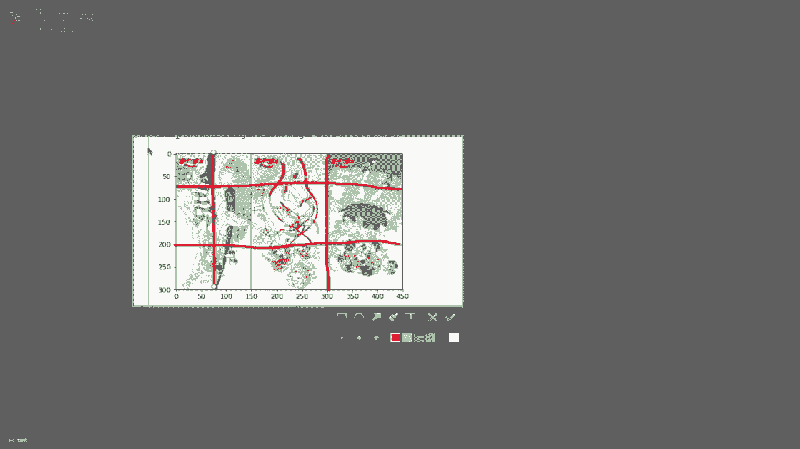

# Python金融量化+股票交易：P5：05 NumPy炸天之索引和切片 🧮

在本节课中，我们将要学习NumPy模块中一个极其重要的功能：索引和切片。它们是获取和操作数组数据的核心工具，比Python原生列表的索引切片更加灵活和强大。掌握它们，是进行高效数据处理和分析的基础。

## 索引操作

上一节我们介绍了NumPy数组的创建，本节中我们来看看如何获取数组中的数据。首先，索引操作与Python列表的索引操作方式相同。

例如，我们创建一个5行6列的随机数组：
```python
import numpy as np
arr = np.random.randint(1, 100, size=(5, 6))
print(arr)
```
假设`arr`是一个二维数组，我们可以通过索引来获取特定的行。

以下是索引操作的具体用法：
*   `arr[0]`：取出数组中下标为0的行数据（即第一行）。
*   `arr[[1, 3, 4]]`：取出数组中下标为1、3、4的多行数据。

## 切片操作

索引用于获取单个或多个特定元素，而切片则用于获取一个连续的子集。NumPy的切片功能非常灵活，可以精确控制行和列。

以下是切片操作的基本规则：
*   `arr[0:2]`：切出数组的前两行数据。中括号内放置的是行切片。
*   `arr[:, 0:2]`：切出数组的前两列数据。逗号`,`用于分隔行和列的切片，逗号左边放行切片，右边放列切片。`:`表示选择所有行。
*   `arr[0:2, 0:2]`：切出前两行的前两列数据。

## 数组反转

利用切片，我们可以轻松实现数组的行、列或整体元素的反转（倒置）。

以下是实现数组反转的方法：
*   行倒置：`arr[::-1, :]`。`::-1`表示从开始到结束，步长为-1，即反向选取。
*   列倒置：`arr[:, ::-1]`。
*   整体元素倒置：`arr[::-1, ::-1]`。即行和列同时倒置。

## 实战应用：图片处理

通过一个具体的例子，我们可以更直观地理解切片和反转的强大功能。我们将使用Matplotlib读取一张图片（图片本质上是像素值组成的NumPy数组），并对其进行操作。

首先，读取并显示原始图片：
```python
import matplotlib.pyplot as plt
image_arr = plt.imread(‘1.jpg’)
plt.imshow(image_arr)
plt.show()
```
图片数组通常是三维的，其形状表示为`(行数， 列数， 颜色通道数)`。




以下是基于切片实现的图片操作：
*   **图片左右翻转**：即对列进行倒置，颜色通道不变。代码为：`plt.imshow(image_arr[:, ::-1, :])`
*   **图片上下翻转**：即对行进行倒置。代码为：`plt.imshow(image_arr[::-1, :, :])`
*   **图片局部裁剪**：通过指定行和列的切片范围，可以截取图片的任意部分。例如，截取行66到200，列78到300的区域：`plt.imshow(image_arr[66:200, 78:300, :])`


本节课中我们一起学习了NumPy的索引与切片操作。我们了解了如何使用索引获取单行或多行数据，如何使用灵活的切片语法获取子数组、实现数组反转，并最终将这些知识应用于实际的图片翻转与裁剪中。这些是数据处理中提取和变换数据的基础技能，务必熟练掌握。