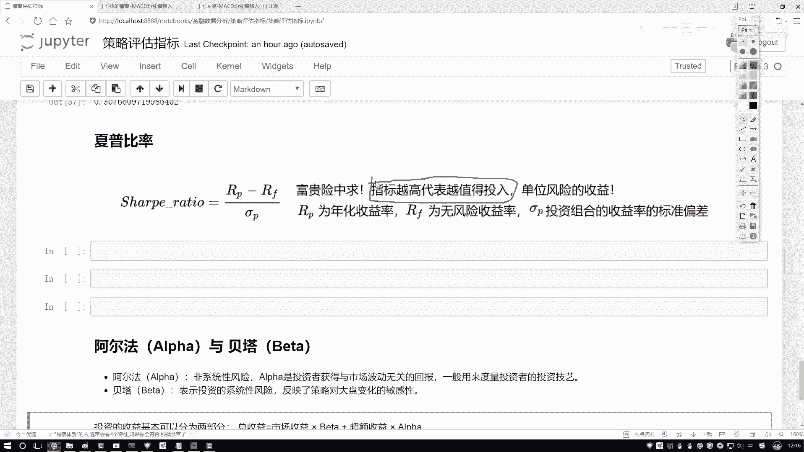
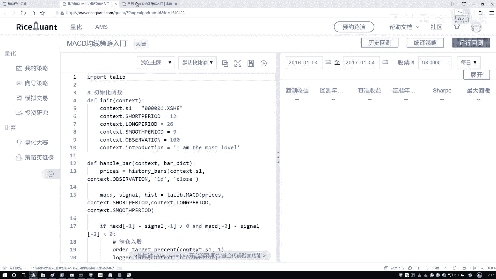
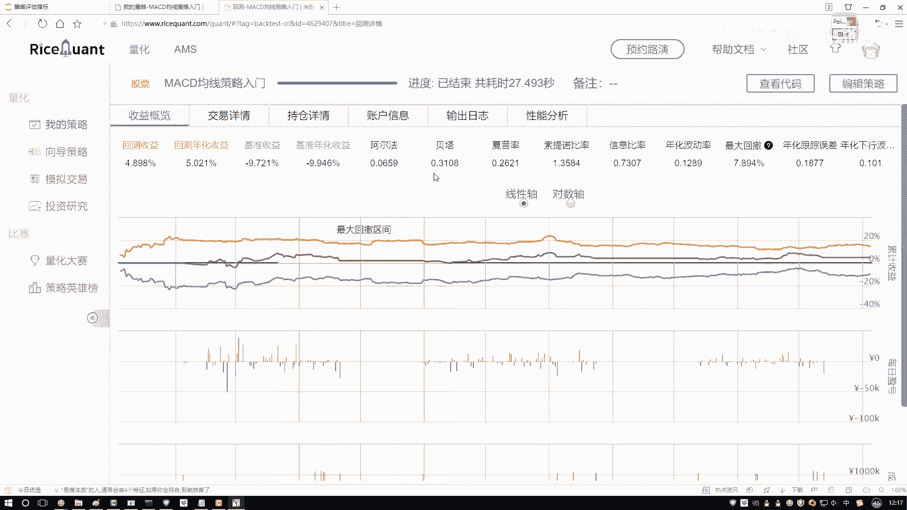
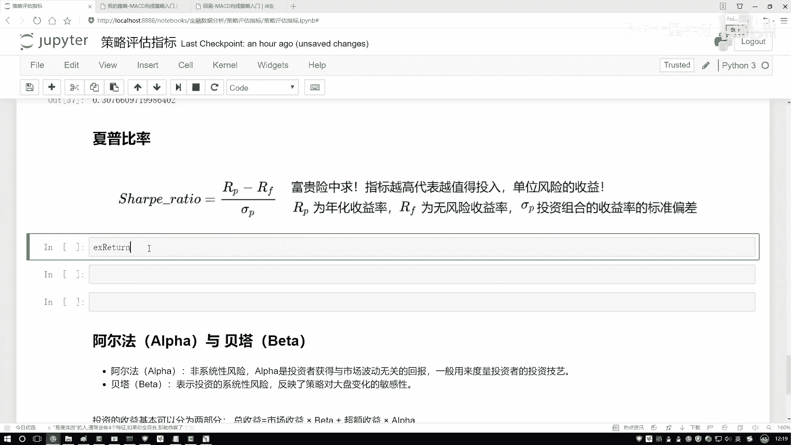
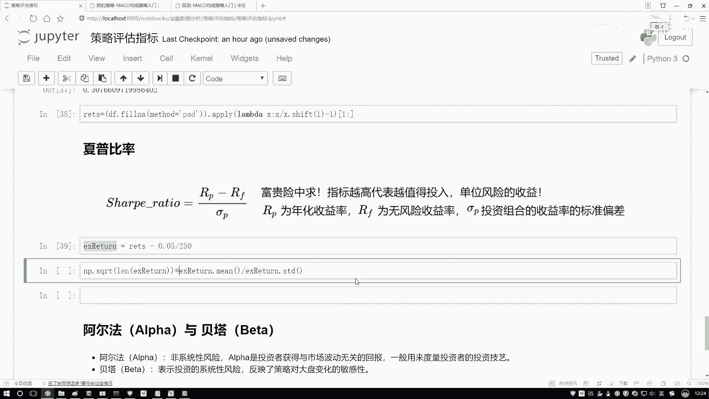
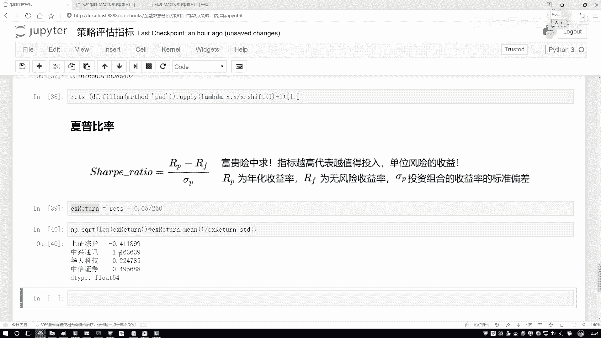
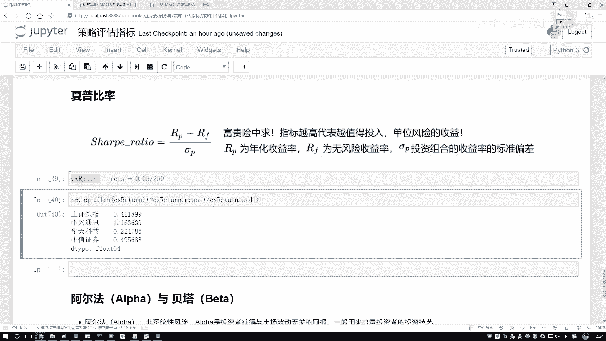
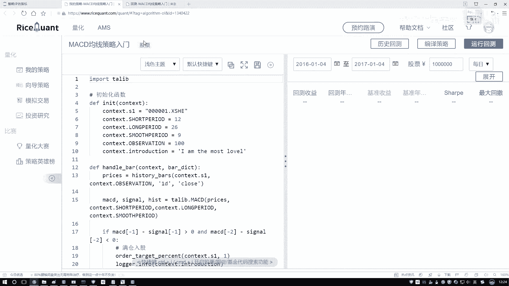
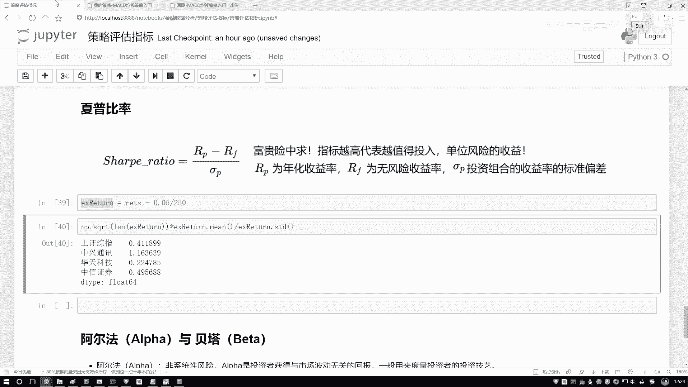

# 量化交易全教程：P16：04-4-夏普比率的作用 📈

在本节课中，我们将要学习一个在金融投资中至关重要的风险调整后收益指标——夏普比率。我们将理解它的含义、计算方法，并学习如何在Python中计算它，以帮助我们评估不同投资策略或股票的价值。

上一节我们介绍了投资回报率，本节中我们来看看如何衡量“性价比”，即承担单位风险能获得多少收益。

## 夏普比率的含义

夏普比率描述的是：在投资中，每承担一单位风险，所能获得的超额收益是多少。它衡量的是投资组合的“风险调整后收益”。



一个生动的比喻是：一份在叙利亚日薪3万美元的雇佣兵工作，其高薪对应的是极高的生命风险。夏普比率就是用来评估，为了获得一定的收益，我们所承担的风险是否“值得”。



**核心公式**：
`夏普比率 = (投资组合收益率 - 无风险收益率) / 投资组合收益率的标准差`



指标越高，意味着在承担相同风险的情况下，获得的超额收益越高，因此该投资或策略的“性价比”就越好。在选股或选择投资策略时，在其他条件相似的情况下，我们倾向于选择夏普比率更高的选项。

## 夏普比率的计算逻辑

为了更好地理解，我们先看一个生活中的例子。银行存款或国债通常提供固定的、几乎无风险的收益（例如年化3%），这可以视为“无风险收益率”。而股票、基金等投资则可能带来更高但不确定的收益（例如预期年化15%），同时也伴随着风险。

夏普比率计算的就是：你通过承担风险所获得的、超出无风险收益的那部分收益（即超额收益），与你所承担的风险（用收益率的标准差衡量）的比值。

以下是计算夏普比率的关键步骤：
1.  **计算投资组合的日收益率序列**。
2.  **确定无风险收益率**（通常采用国债利率等），并将其转化为日度数据。
3.  **计算超额收益率**：用投资组合的日收益率减去日化的无风险收益率。
4.  **计算超额收益率的均值与标准差**。
5.  **进行年化处理**：将均值和标准差乘以一年的交易天数（例如250天）的平方根进行年化。
6.  **套用公式**：将年化的超额收益率均值除以其年化标准差，得到年化夏普比率。

## Python代码实现

理解了原理后，我们来看看如何在Python中计算多只股票的夏普比率。假设我们已经有了股票的历史价格数据，并计算出了日收益率。

以下是计算夏普比率的核心代码示例：



```python
import numpy as np
import pandas as pd

# 假设 `returns` 是一个DataFrame，列是各只股票的日收益率序列
# 步骤1: 设定年化无风险利率，例如5%，并转化为日度数据
risk_free_rate = 0.05
daily_risk_free = risk_free_rate / 250

# 步骤2: 计算超额收益率（日度）
excess_returns = returns - daily_risk_free

# 步骤3: 计算年化夏普比率
# 计算超额收益率的均值（日度）和标准差（日度）
mean_excess_return = excess_returns.mean()
std_excess_return = excess_returns.std()

# 年化处理：均值乘以250天，标准差乘以250的平方根
annualized_mean = mean_excess_return * 250
annualized_std = std_excess_return * np.sqrt(250)

# 步骤4: 计算夏普比率
sharpe_ratio = annualized_mean / annualized_std





print(sharpe_ratio)
```

运行以上代码后，我们会得到一个夏普比率序列。例如，结果可能显示中兴通讯（ZTE）的夏普比率最高。这意味着，在我们分析的股票池中，承担相同风险时，投资中兴通讯历史上获得的超额回报最高。负的夏普比率则表明，其收益甚至未能覆盖无风险收益，不是理想的选择。





## 总结



本节课中我们一起学习了夏普比率。我们首先理解了它是一个衡量“风险调整后收益”的核心指标，数值越高代表投资效率越好。接着，我们拆解了它的计算公式和逻辑，明白了它如何将超额收益与所承担的风险联系起来。最后，我们掌握了用Python计算多只股票夏普比率的具体步骤和代码。记住，在量化策略评价中，夏普比率是一个帮助我们筛选出“性价比”更高策略的强大工具。