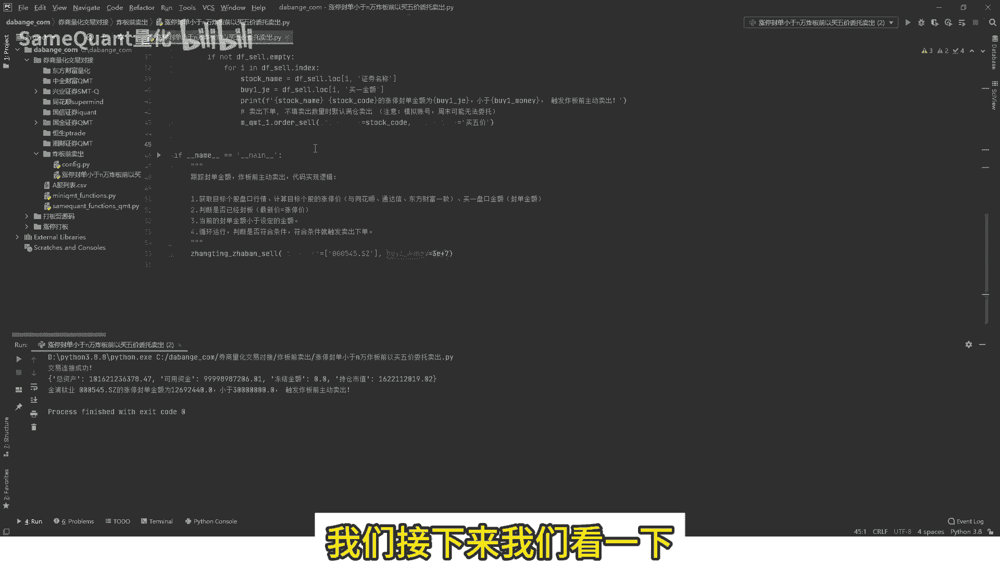
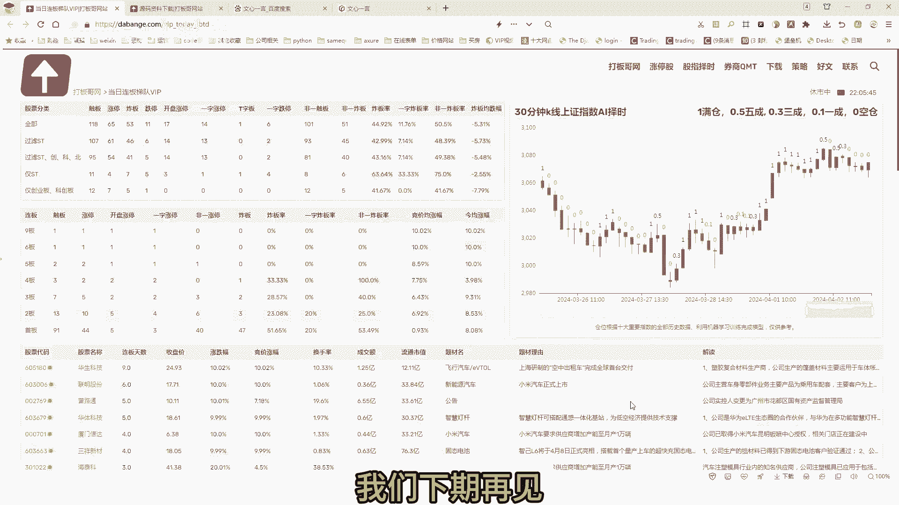

# 量化交易入门：第1章：涨停炸板前自动卖出策略详解 🚀

在本节课中，我们将学习一个实用的量化交易策略——涨停炸板前自动卖出。该策略旨在监控持仓股票，当股票涨停后，实时跟踪其封单金额，并在封单金额减少到预设阈值时自动卖出，以规避炸板风险。我们将使用Python实现，并适配券商QMT等平台。即使你不懂Python，按照步骤操作也能使用。

## 策略核心逻辑概述

该策略的核心是监控已涨停股票的封单金额变化。当封单金额低于设定值时，意味着涨停板可能即将打开（即“炸板”），此时策略会自动卖出股票。整个过程通过代码自动执行，无需人工盯盘。

## 策略实现步骤详解

上一节我们介绍了策略的核心目标，本节中我们来看看实现这个策略需要完成的具体步骤。

以下是实现该策略需要完成的四个关键步骤：

1.  **获取持仓与行情数据**：首先，程序需要获取交易账户的持仓列表，并查询这些股票的实时盘口行情。盘口行情包含最新价、涨停价、买一至买五的价格及委托数量等信息。
2.  **计算涨停价与封单金额**：对于持仓的每只股票，需要精确计算其涨停价（需与主流软件如通达信、同花顺的结果完全一致）。然后，根据买一价和买一量计算当前的封单金额，公式为：`封单金额 = 买一价 * 买一量 * 100`。
3.  **判断卖出条件**：程序需要判断股票是否满足卖出条件。条件有三个：首先，股票必须已涨停（即最新价等于涨停价）；其次，计算出的当前封单金额必须小于用户设定的阈值（例如2000万元）。
4.  **循环监控与执行交易**：将以上步骤放入循环中，持续监控所有持仓股票。一旦某只股票同时满足上述两个条件，则程序自动触发卖出下单指令。

## 代码结构与使用说明

理解了策略步骤后，我们来看看如何用代码组织这些逻辑，并让它在量化平台上运行起来。

策略源码已经封装成易于使用的功能包。对于用户而言，主要操作集中在配置文件和一个主函数调用上。

以下是用户需要关注的核心部分：

*   **配置文件 (`CONFIG`)**：在此文件中设置你的券商量化交易账号和密码。
*   **主函数调用**：核心策略逻辑已被封装。用户只需调用主函数并传入参数（如股票列表、封单金额阈值）即可。示例代码如下：
    ```python
    # 示例：运行炸板卖出策略
    stock_list = [‘000001’, ‘600519’] # 监控的股票代码列表
    threshold = 20000000 # 封单金额阈值，单位：元
    run_炸板卖出策略(stock_list, threshold)
    ```
*   **平台适配**：源码中已封装针对QMT平台的查询资金、持仓、下单等功能。如果用于其他平台（如Ptrade、东方财富），需要替换对应的功能包。

## 策略演示与验证

现在，让我们通过一个实际案例来演示策略是如何工作的。

我们以一只已涨停的股票为例。假设其当前封单金额为1269万元，而我们设定的卖出触发阈值是2000万元。

由于1269万 < 2000万，条件满足，程序会立即触发“炸板前主动卖出”的提示。如果我们将阈值改为1000万元，那么1269万 > 1000万，条件不满足，程序便不会产生卖出信号。这个过程清晰地展示了策略的触发机制。

## 获取与运行源码

如果你对实现细节感兴趣，可以查看源码中获取实时行情、计算封单金额和判断条件的函数。所有代码均已开源。



源码的下载地址位于视频描述或“打板哥”网站的“源码资料下载”栏目中，文件名称为“跟踪封单金额，涨停炸板前卖出”。下载后，按照提供的指导教程在本机配置Python环境即可运行。

## 课程总结



本节课中我们一起学习了“涨停炸板前自动卖出”量化策略。我们从策略逻辑入手，分解了**获取数据、计算指标、条件判断、执行交易**四个关键步骤。随后，我们了解了如何通过简单的配置和函数调用来使用封装好的策略代码，并通过案例演示了策略的实际触发过程。最后，我们提供了源码的获取方式。掌握这个策略，可以帮助你在量化交易中更有效地管理涨停板持仓，主动规避回落风险。