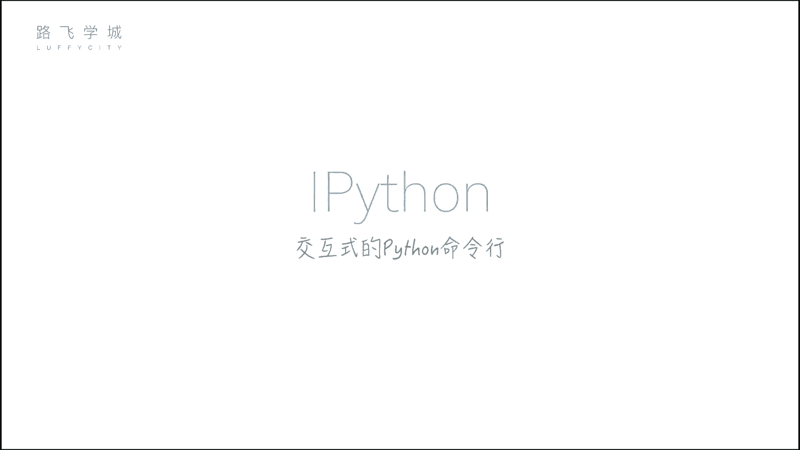
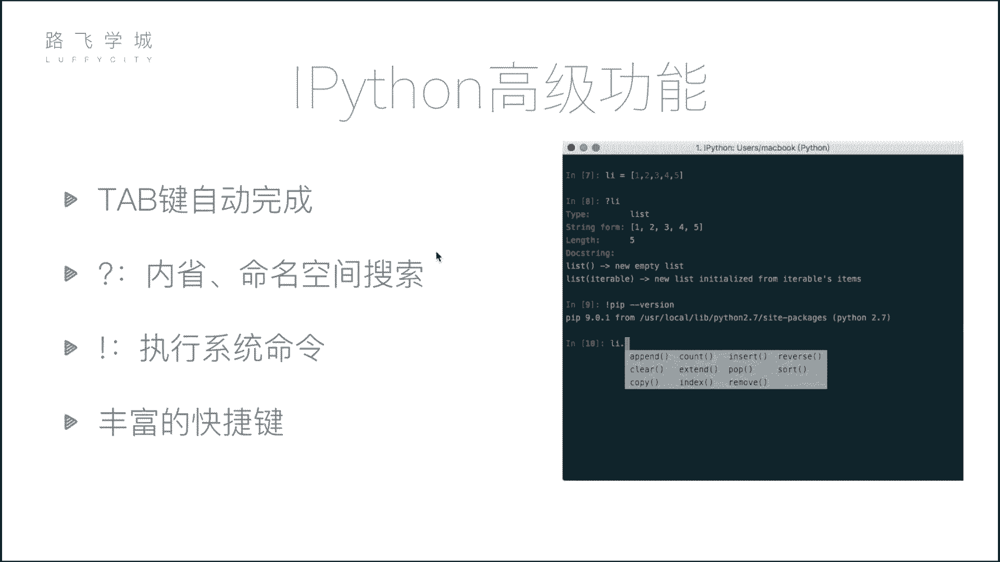
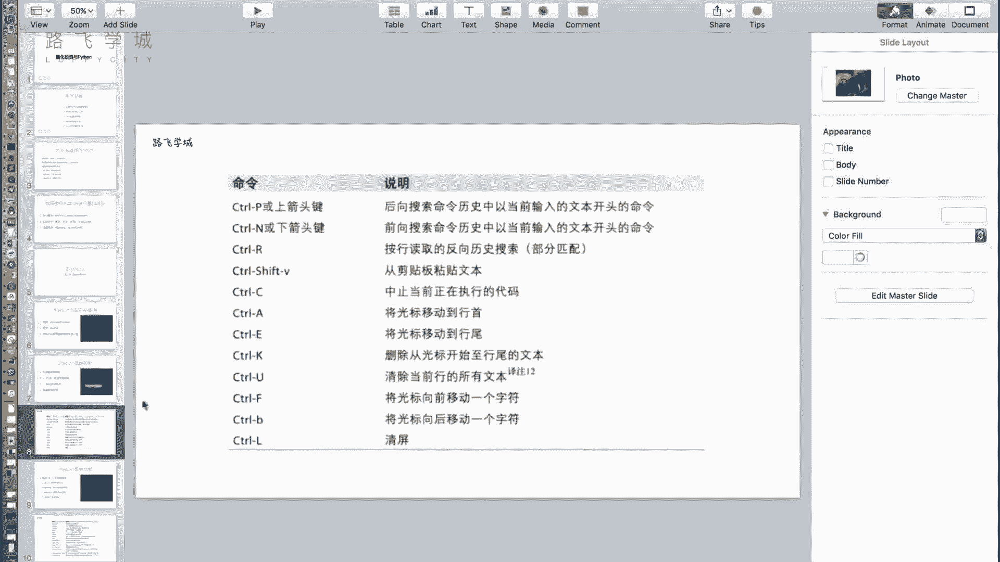

# Python金融量化：P8：07 量化投资与Python及IPython初识 📈

在本节课中，我们将要学习量化投资的基本概念，了解为何选择Python作为量化分析的工具，并初步认识一个强大的交互式Python环境——IPython。

上一节我们介绍了量化分析的基础概念，本节中我们来看看如何利用Python工具来实现量化投资。

## 为何选择Python进行量化投资？

量化投资的核心是分析数据并据此做出决策。Python因其强大的数据处理能力和丰富的生态系统，成为量化投资领域的首选工具。除了Python，市场上也存在其他工具，以下是几种常见的选择：

*   **Excel**：主要用于手工数据处理，不具备程序化能力。
*   **SAS/SPSS**：专业的统计分析软件，能进行标准化计算（如均值、图表生成），但同样非编程导向。
*   **R语言**：一门专注于数据分析的编程语言，但在量化投资领域应用较少，因其应用范围相对狭窄。


相比之下，Python是一门通用语言，在数据分析、Web开发、自动化等多个领域都能大显身手，学习一门语言即可应对多种需求。

## Python量化分析的核心模块


要进行量化分析，我们需要掌握几个核心的数据处理与可视化模块：

1.  **NumPy**：用于高效的**数组批量计算**，是科学计算的基础。
    ```python
    import numpy as np
    ```
2.  **Pandas**：核心库，提供灵活的**数据表结构（DataFrame）** 及各种数据操作功能。
    ```python
    import pandas as pd
    ```
3.  **Matplotlib**：用于**数据可视化**，将分析结果以图表形式直观呈现。
    ```python
    import matplotlib.pyplot as plt
    ```

## 实施量化投资的途径

掌握了上述模块后，可以通过以下两种主要途径实施量化投资：

1.  **自建量化框架**：从零开始，利用NumPy、Pandas和Matplotlib等库，结合下载的股票数据，编写自己的策略并进行回测。
2.  **使用在线量化平台**：市场上存在许多现成的量化平台。用户只需在平台上编写核心策略代码，平台即可自动完成数据获取、回测和结果可视化。

例如，在某在线平台中，用户在左侧编写策略代码，运行后右侧会生成策略收益曲线。图中蓝线代表策略在不同时间点的累计收益，通过与基准收益（如大盘指数）对比，可以直观评估策略的有效性。



## 强大的交互式工具：IPython



在深入学习上述模块前，我们先介绍一个能极大提升开发效率的工具——IPython。它是一个功能丰富的交互式Python命令行环境。

### 安装IPython

可以通过Python自带的包管理工具pip进行安装。建议使用国内镜像源以加速下载。
```bash
pip install ipython -i https://pypi.douban.com/simple/
```
对于尚未安装Python的用户，推荐直接安装**Anaconda**发行版，它集成了IPython及我们将要学习的所有核心数据科学库。

安装完成后，在命令行输入 `ipython` 即可启动。

### IPython的高级功能

IPython相比标准Python命令行提供了诸多便利功能，以下是几个关键特性：

*   **Tab键自动补全**：输入变量名或函数的前几个字母后按Tab键，IPython会提供补全建议或列出所有可能选项。
*   **执行系统命令**：在命令前添加感叹号 `!`，可以直接执行操作系统命令（如 `!ls`, `!pwd`）。
*   **内省与帮助**：使用问号 `?` 可以查询对象的信息；使用双问号 `??` 可以查看函数源代码（如果可用）。
*   **丰富的快捷键**：IPython支持大量快捷键以提高编辑效率，例如：
    *   `Ctrl + A`：移动光标到行首。
    *   `Ctrl + E`：移动光标到行尾。
    *   `Ctrl + U`：删除从光标到行首的所有内容。
    *   `Ctrl + K`：删除从光标到行尾的所有内容。



本节课中我们一起学习了量化投资为何青睐Python，认识了NumPy、Pandas和Matplotlib这三个核心分析模块，并初步掌握了能提升编码体验的交互式工具IPython及其实用功能。接下来，我们将开始深入这些核心模块的学习。