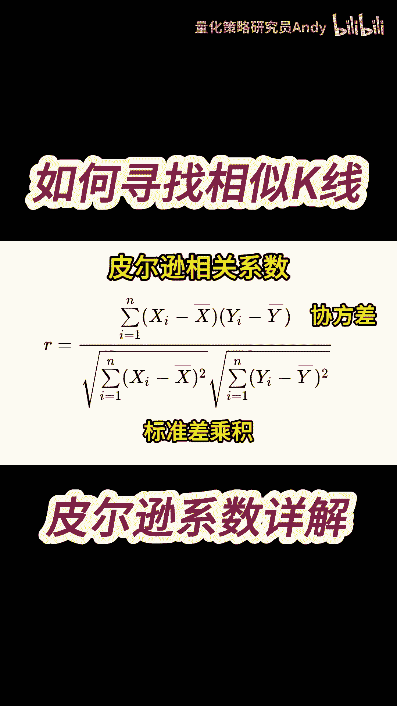
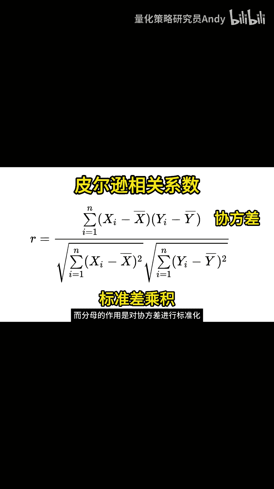

# 量化交易基础：P1：皮尔逊相关系数与K线相似度分析

在本节课中，我们将要学习一个在量化分析中非常重要的统计工具——皮尔逊相关系数。我们将了解它的定义、计算公式，并探讨如何用它来度量两组K线序列之间的相似度。



## 皮尔逊相关系数简介

皮尔逊相关系数是度量两个变量之间线性相关程度的统计量。它由英国统计学家卡尔·皮尔逊于1895年提出。

## 皮尔逊系数的计算公式

皮尔逊相关系数的计算公式如下：

**公式：**
`R = Σ[(xi - x̄)(yi - ȳ)] / √[Σ(xi - x̄)² * Σ(yi - ȳ)²]`

**代码描述：**
```python
# 假设有两个序列 x 和 y
import numpy as np

def pearson_correlation(x, y):
    x_mean = np.mean(x)
    y_mean = np.mean(y)
    numerator = np.sum((x - x_mean) * (y - y_mean))
    denominator = np.sqrt(np.sum((x - x_mean)**2) * np.sum((y - y_mean)**2))
    return numerator / denominator
```

在这个公式中：
*   `R` 代表皮尔逊相关系数。
*   `X` 和 `Y` 是两个变量，在K线分析中可以理解为两组收盘价序列。
*   `xi` 和 `yi` 分别表示两个序列中的第 `i` 个值。
*   `x̄`（读作x-bar）和 `ȳ` 分别代表 `X` 和 `Y` 序列的平均值。

## 公式组成部分解析

上一节我们介绍了皮尔逊系数的完整公式，本节中我们来详细解析它的各个部分。

公式的分子部分 `Σ[(xi - x̄)(yi - ȳ)]` 代表两个变量 `X` 和 `Y` 的**协方差**。它计算了每个数据点与其均值偏差的乘积之和，能够反映两组数据变化的协同性。

公式的分母部分 `√[Σ(xi - x̄)² * Σ(yi - ȳ)²]` 是 `X` 和 `Y` 的**标准差**的乘积。它先计算每个变量自身与其均值偏差的平方和，再求两个平方根的乘积，主要用于对分子进行标准化处理。

## 核心概念的作用

分子中的协方差直接反映了两组变量之间的协同变化趋势。而整个皮尔逊系数 `R` 的值域在 `-1` 到 `1` 之间：
*   `R = 1` 表示完全正相关。
*   `R = -1` 表示完全负相关。
*   `R = 0` 表示无线性相关。

通过计算两组K线收盘价序列的皮尔逊系数，我们就可以量化它们走势的相似程度。系数越接近1，说明历史走势越相似。



## 总结

本节课中我们一起学习了皮尔逊相关系数。我们了解了它是衡量两个变量线性相关性的核心统计量，掌握了其计算公式及各部分的含义，并明白了如何将其应用于寻找历史上走势相似的K线图案。理解这一工具是进行量化模式识别和策略研究的重要基础。