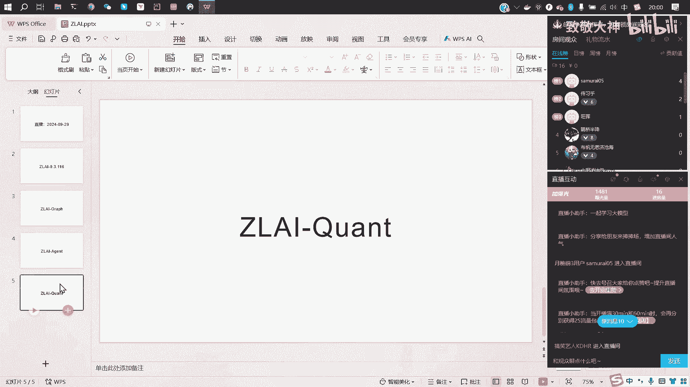
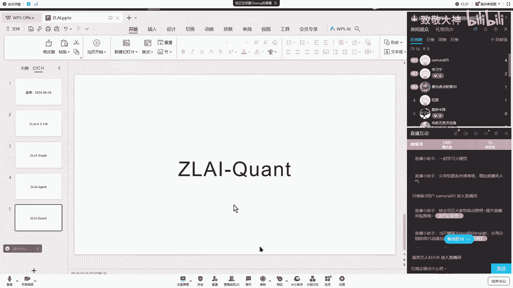
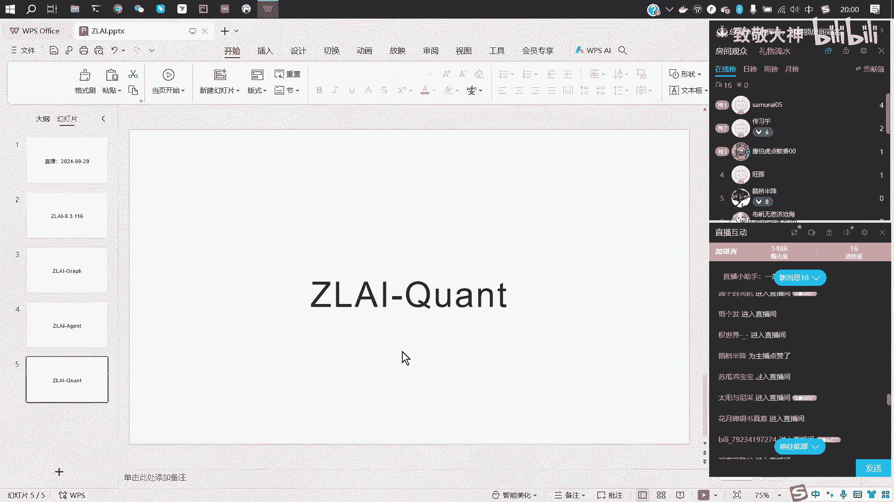
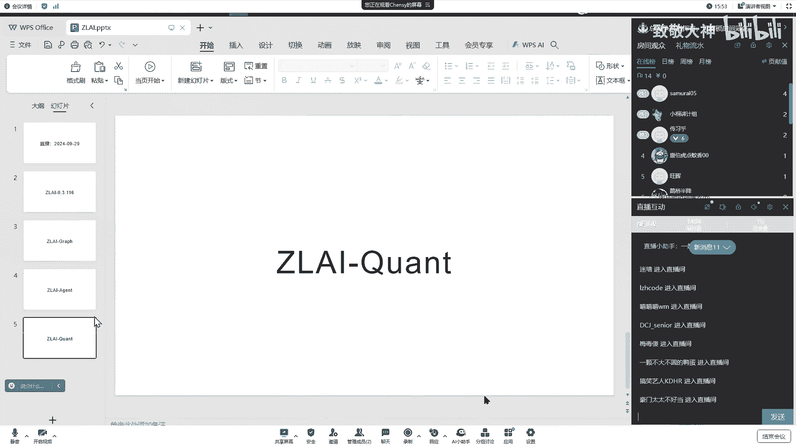
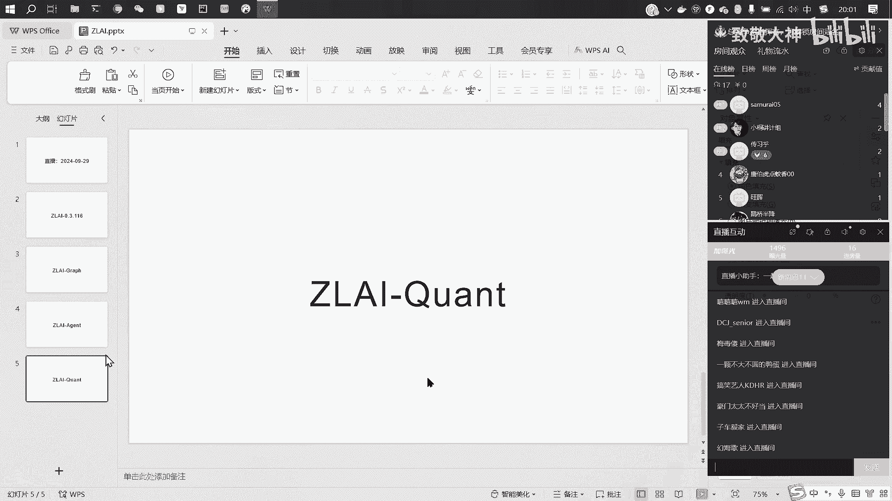
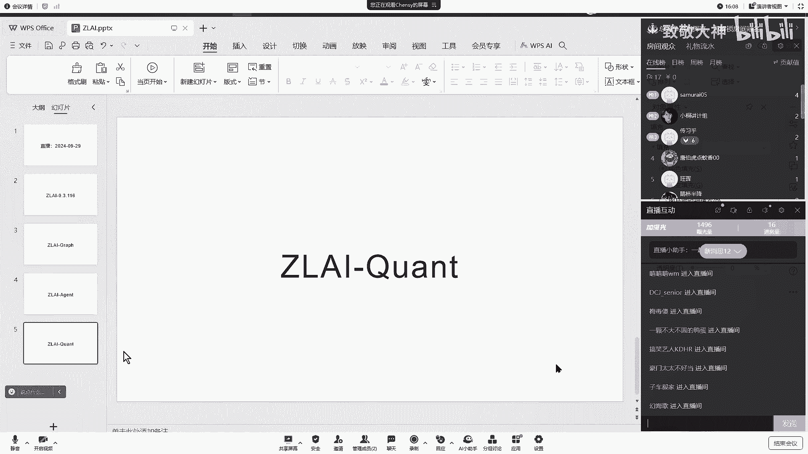
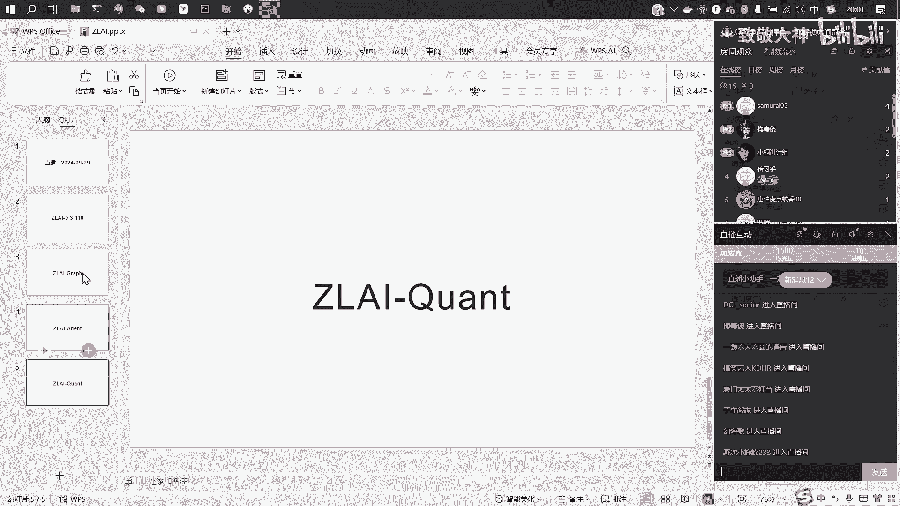

# Zlai大模型知识图谱联网与金融量化应用：P1：01_本期内容大纲 📚

在本节课中，我们将要学习本次直播分享的核心内容大纲。课程将涵盖大模型项目版本更新、知识图谱构建、智能体（Agent）详解以及金融量化数据应用等多个模块。

## 概述

本次分享主要分为五个部分。首先，我们将介绍项目的最新版本更新内容。接着，我们会详细讲解如何利用大模型构建《西游记》原著的知识图谱。然后，我们将深入探讨智能体（Agent）的运作机制。之后，课程将转向金融领域，展示如何将宏观数据、财经研报和股票数据与大模型结合进行尝试。最后，我们会进行总结。

## 课程内容详解

以下是本次分享的五个核心部分。

1.  **项目版本更新说明**
    首先，我们将回顾项目从0.3.115版本到最近116版本的更新历程。本次更新对内容进行了增删。我们将花费约10到15分钟，详细说明此版本具体增加了哪些功能或模块。

2.  **大模型知识图谱构建实践**
    上一节我们介绍了版本更新，本节中我们来看看如何应用大模型。我们将以《西游记》百回本原著为例，完整演示构建知识图谱的流程。这个图谱将涵盖原著中的人物、地点以及物品等实体及其关系。

3.  **智能体（Agent）机制深入解析**
    在构建了知识图谱后，我们将进一步探索更高级的应用。第三部分将专注于智能体（Agent），对其进行更细致、深入的说明。我们将依赖Zlai项目中的具体实现，单独剖析Agent的工作原理与应用方式。

4.  **金融数据与大模型的联动尝试**
    接下来，我们将视角转向现实应用。最近我们收集了许多宏观数据、财经研报、新闻以及股票数据。本部分的核心是探讨如何将这些真实世界产生的数据与智能体（Agent）联动起来，探索大模型在金融信息处理方面的潜在应用。

    > 请注意：这部分内容更偏向于量化分析和消息面文本处理，不构成任何投资建议。

5.  **总结与展望**
    最后，我们将对本次分享的所有内容进行回顾与总结，并展望未来的可能方向。

## 总结

本节课中我们一起学习了本次直播分享的完整大纲。我们从项目版本更新出发，逐步深入到知识图谱的构建、智能体（Agent）的解析，最后探讨了金融数据与大模型结合的前沿尝试。希望这个大纲能帮助你清晰地了解后续课程的核心脉络。