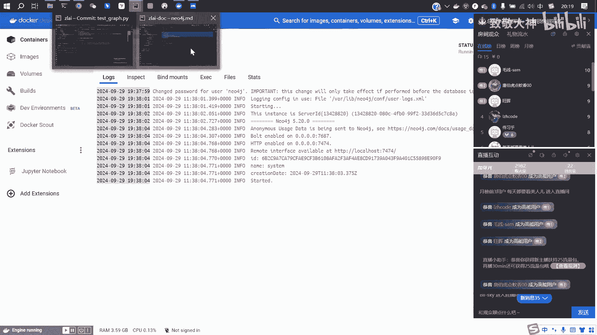
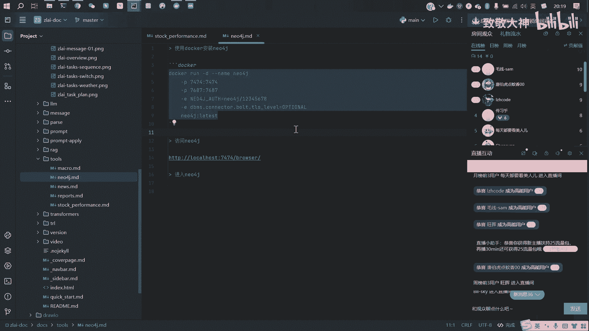
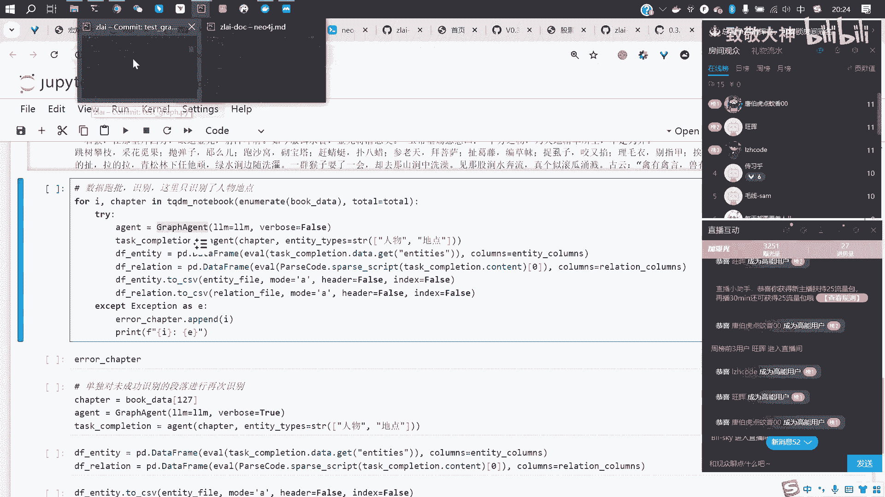
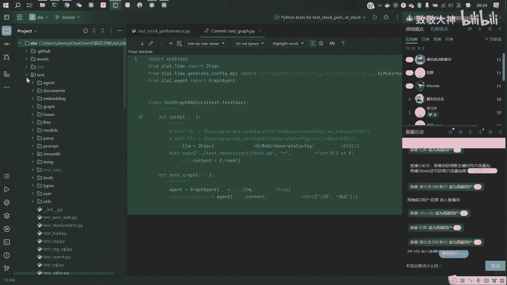
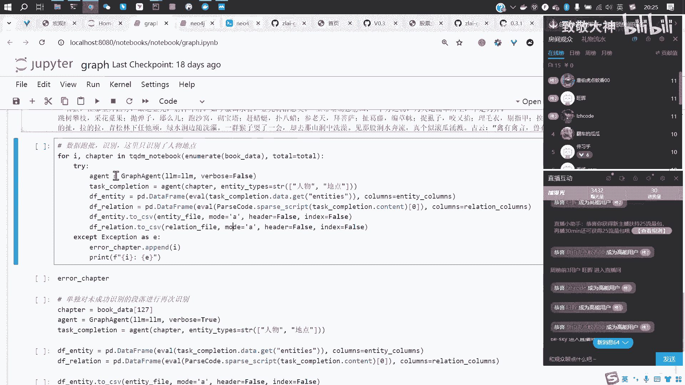
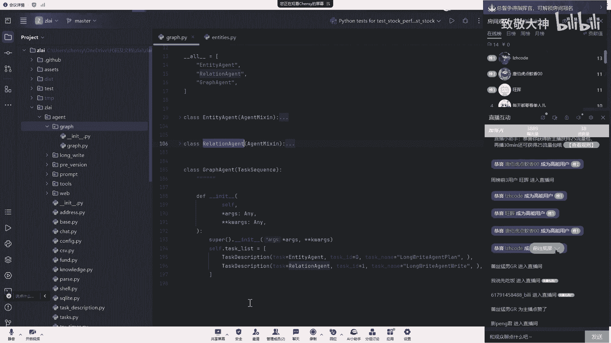
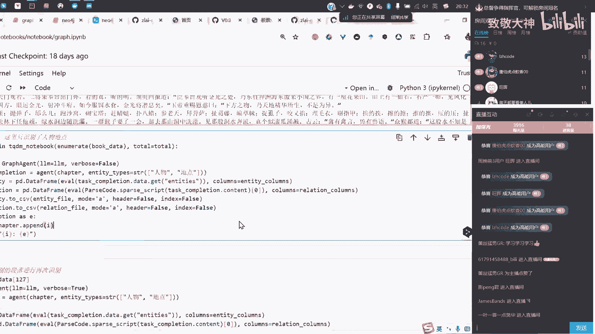
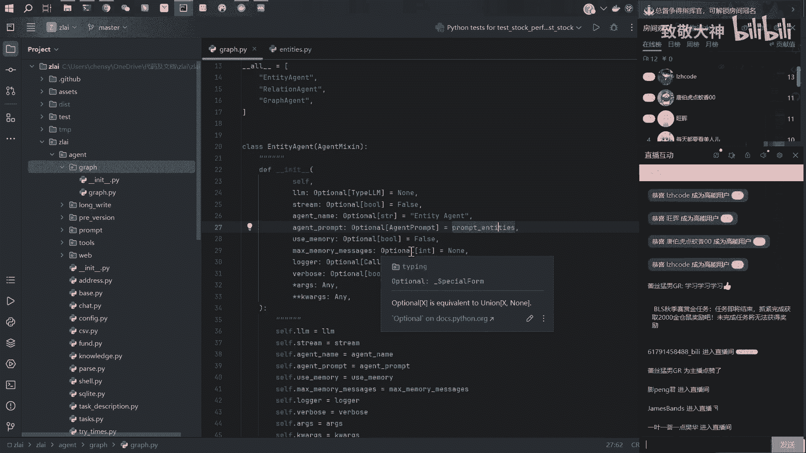
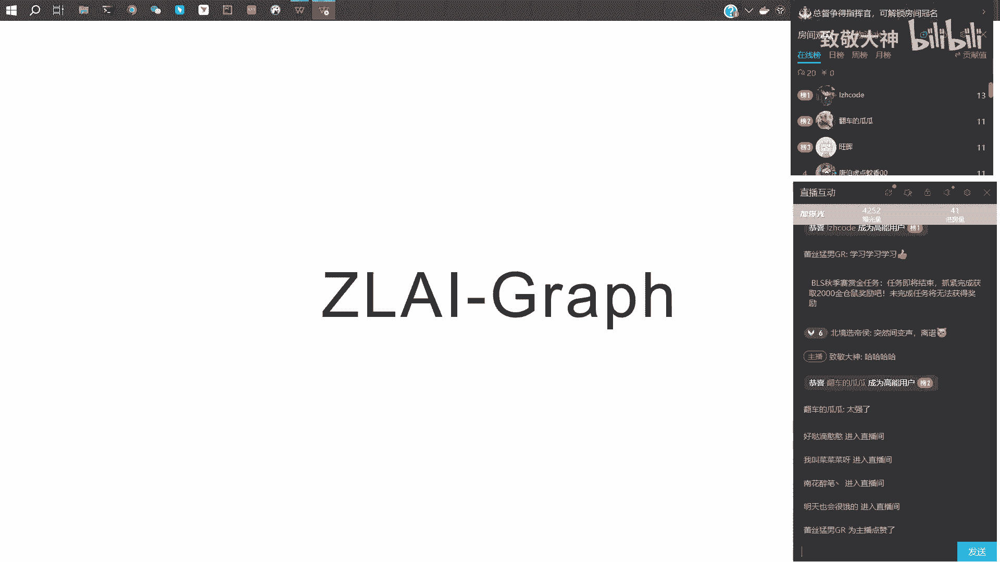

# 大模型知识图谱与金融量化应用：P3：03_大模型自动抽取知识图谱 📚➡️🗺️

在本节课中，我们将学习如何利用大语言模型自动从文本中抽取知识图谱。我们将以西游记为例，展示如何将一部长篇著作转化为结构化的实体和关系网络，并存储在Neo4j图数据库中以便查询和分析。

---

## 概述

知识图谱是一种用网络结构表示知识的方式，其中节点代表实体（如人物、地点），边代表实体之间的关系。传统方法构建知识图谱需要大量人工标注，而大语言模型的出现使得自动化、大规模地从非结构化文本中抽取知识图谱成为可能。

上一节我们介绍了大模型的基础应用，本节中我们来看看如何利用大语言模型自动构建知识图谱。

## 项目简介与核心思路

近期，Graph RAG技术比较流行。其核心思路是：当用户提供一篇长文档（如一本书）并提问时，模型会先将整本书拆解成一个巨大的知识图谱。这个图谱以网络结构存储了书中的所有知识点，能够贯穿全书的前后章节。基于这个完整的知识网络，模型能给出比传统RAG（仅对文档切片）更准确、更综合的回答。

我们实现了一个小型演示项目：将《西游记》解析成知识图谱。以下是项目的主要产出：

*   **节点**：例如“美猴王”、“花果山”等。
*   **节点描述**：对每个实体的详细说明，例如“美猴王是个什么人，有什么特点”。
*   **关系**：实体之间的关联，例如“美猴王”和“花果山水帘洞”之间存在“居所”关系。
*   **关系强度**：一个0到10分的评分，表示关系的强弱程度。
*   **关系总结**：大模型对原文内容的概括，例如“美猴王的居所是花果山水帘洞”。



完成抽取后，可以将数据导入Neo4j图数据库进行可视化展示和查询。



## 项目文件结构

以下是项目文件的基本结构，可以从提供的地址下载：

```
项目根目录/
├── data/                    # 原始数据目录
│   └── 西游记.txt          # 《西游记》原著101回文本
├── entities_v1.xlsx         # 提取的实体（节点）数据
├── relations_v1.xlsx        # 提取的关系数据
├── 01_extract_kg.ipynb      # 知识图谱抽取Notebook
└── 02_save_to_neo4j.ipynb   # 数据导入Neo4j的Notebook
```

**注意**：请使用带有“v1”后缀的数据文件，未标注版本的效果可能较差。

## 核心实现步骤

下面我们详细讲解如何从文本中自动抽取知识图谱。





### 1. 数据准备与预处理

首先，需要导入必要的工具库并选择合适的模型。本项目使用了`gpt-4`模型，你也可以根据需求替换为其他本地部署的模型（如千问、DeepSeek等）。

```python
# 示例：导入库和选择模型
from langchain.chat_models import ChatOpenAI
# 实际代码中会进行更复杂的配置，例如设置API Key和基础URL
```



接着，读取《西游记》原文并进行预处理：

1.  **按章回分割**：原著共有101个章回，以特定的分隔符（如多个换行符）进行分割。
2.  **段落筛选**：过滤掉过短的段落（如小于128字），这些段落可能只是简单对话或诗句，包含的重要实体和关系较少。
3.  **分批处理**：将文本按5个段落为一组进行分批，以控制每次输入模型的内容长度。整本书共分为388个批次。

```python
# 伪代码：文本预处理与分批
chapters = split_text_by_delimiter(raw_text, “\n\n\n\n\n\n”) # 按章回分割
filtered_paragraphs = [p for p in chapters if len(p) > 128] # 过滤短段落
batches = create_batches(filtered_paragraphs, batch_size=5) # 创建批次，每批5段
```

### 2. 知识图谱抽取流程

核心抽取流程封装在一个`GraphAgent`类中。其工作分为两个清晰步骤：

**第一步：实体识别**
使用`EntityAgent`识别当前文本批次中出现的实体（如人物、地点）。

**第二步：关系提取**
使用`RelationAgent`基于已识别的实体，判断它们之间存在何种关系。

以下是调用`GraphAgent`的核心代码：

```python
# 核心调用代码
graph_agent = GraphAgent(llm=your_llm_model)
entities, relations = graph_agent.run(
    text=current_text_batch,
    entity_types=[“人物”, “地点”] # 指定要抽取的实体类型
)
```



你只需要提供要处理的文本和希望抽取的实体类型列表，`GraphAgent`就会返回对应的实体和关系列表。

### 3. 提示词（Prompt）设计





`GraphAgent`的强大能力依赖于精心设计的提示词模板。

**实体抽取提示词**：
要求模型从给定文本中提取指定类型的实体，并以特定格式返回一个列表。列表中的每个元素是一个元组，包含`(实体名称， 实体类型， 实体描述)`。

```python
# 实体Prompt模板示例（简化）
entity_prompt_template = “””
你是一个知识图谱构建助手。请从以下文本中提取所有【{entity_types}】类型的实体。
返回一个Python列表，列表中的每个元素是一个元组：(实体名称， 实体类型， 实体描述)。
例如：[(‘孙悟空’， ‘人物’， ‘花果山的美猴王，神通广大’)， …]
待处理文本：{text}
“””
```

**关系抽取提示词**：
要求模型基于给定的实体列表，分析它们之间的关系。返回的格式需要包含`(源实体， 目标实体， 关系名称， 关系描述， 关系强度)`。

```python
# 关系Prompt模板示例（简化）
relation_prompt_template = “””
你是一个知识图谱构建助手。请分析以下实体之间的关系：{entities_list}。
返回一个Python列表，列表中的每个元素是一个元组：(源实体， 目标实体， 关系名称， 关系描述， 关系强度(0-10))。
例如：[(‘孙悟空’， ‘花果山’， ‘居所’， ‘孙悟空的居住地’， 9)， …]
待处理文本：{text}
“””
```

通过这两个提示词，大模型就能理解我们的指令，并输出结构化的数据。

### 4. 数据存储与可视化

抽取出的实体和关系被保存到Excel文件中。随后，可以通过一个简单的脚本将数据导入到Neo4j图数据库中。

在Neo4j中，我们可以：
*   执行查询语句，查找特定实体或关系。
*   进行可视化展示：粉色节点通常代表人物，蓝色节点代表地点。
*   点击任意节点或关系，查看其详细的描述信息。

这使得探索《西游记》中复杂的人物关系网络变得非常直观。

## 总结

本节课我们一起学习了利用大语言模型自动构建知识图谱的全流程。

1.  **核心价值**：大模型通过理解文本语义，可以自动化地完成传统上需要大量人工标注的实体识别和关系抽取工作，极大提升了构建知识图谱的效率。在本项目中，《西游记》全书的抽取成功率超过99%。
2.  **关键技术点**：
    *   **文本预处理**：合理的分段和分批是保证模型处理效果和效率的基础。
    *   **智能体（Agent）设计**：通过`GraphAgent`将任务拆解为“实体识别”和“关系抽取”两个可复用的步骤。
    *   **提示词工程**：清晰、结构化、包含示例的提示词是引导大模型输出正确格式结果的关键。
    *   **图数据库应用**：使用Neo4j存储和查询图谱数据，实现了知识的可视化与交互式探索。
3.  **扩展应用**：此方法不仅适用于文学作品，同样可以应用于专业书籍、行业报告、新闻档案等，快速梳理领域核心概念及其关联，为行业研究、智能问答、投资分析等场景提供结构化知识支持。



整个项目的代码是开源的，核心逻辑清晰。你可以基于此框架，通过修改希望抽取的实体类型（如增加“法宝”、“坐骑”），轻松地将其适配到任何你感兴趣的文本领域，构建专属的知识图谱。