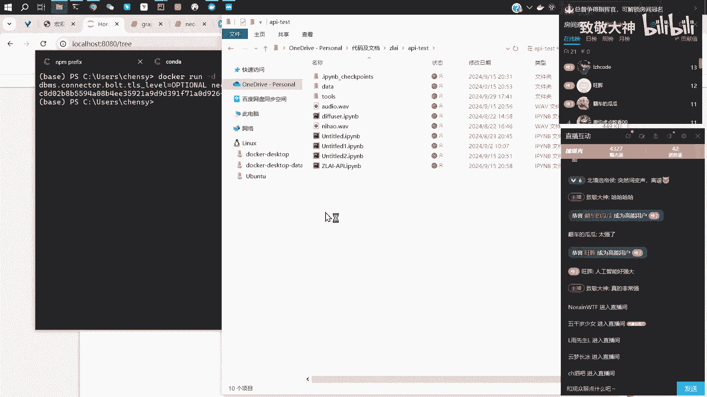
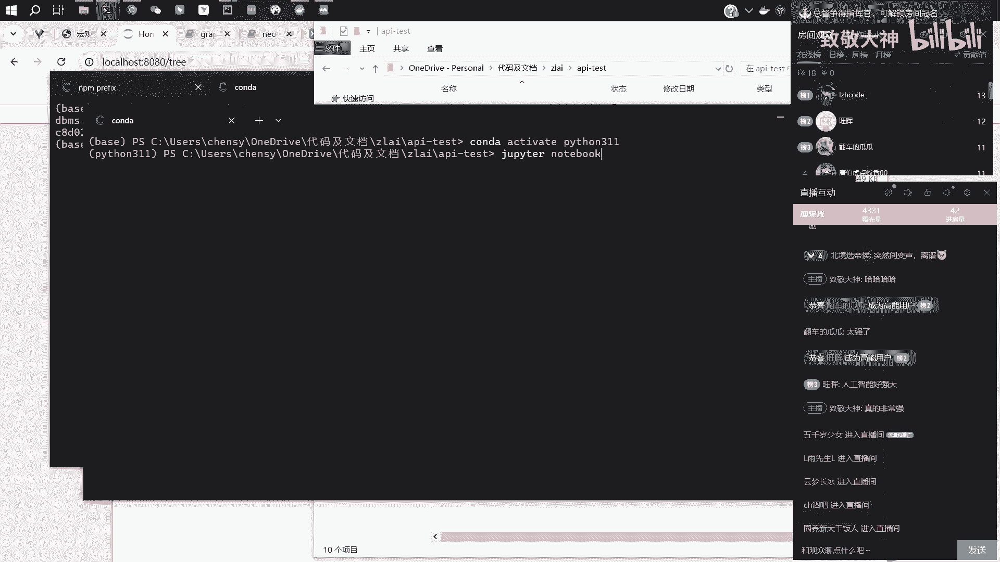
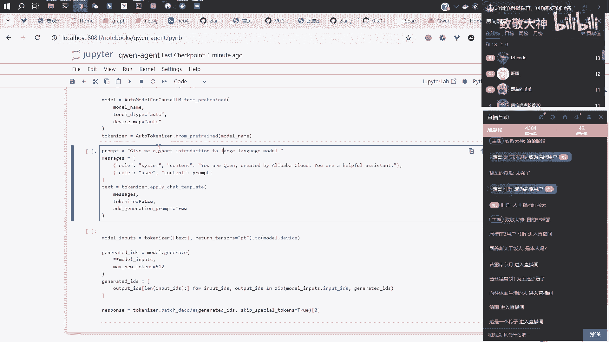
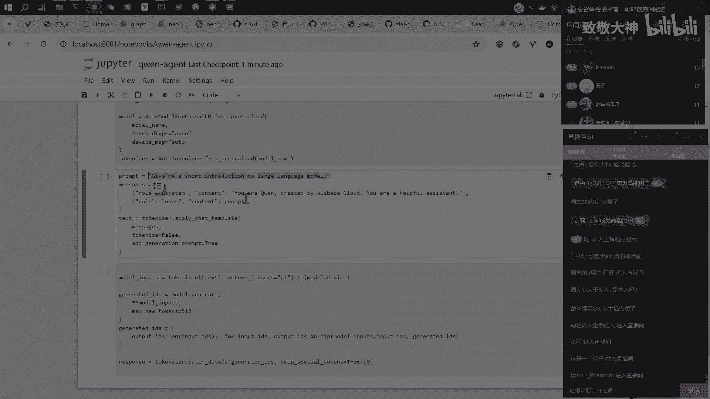
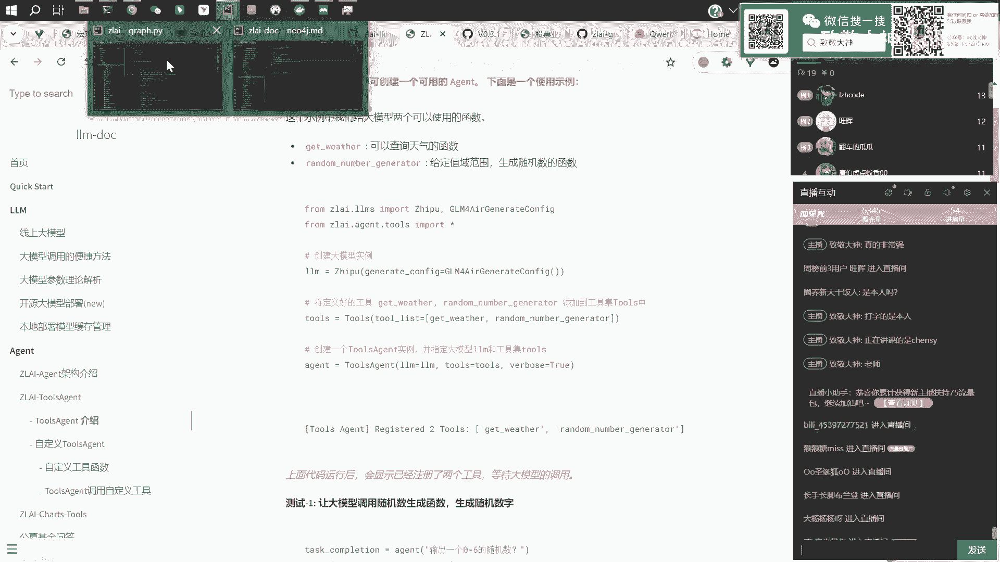
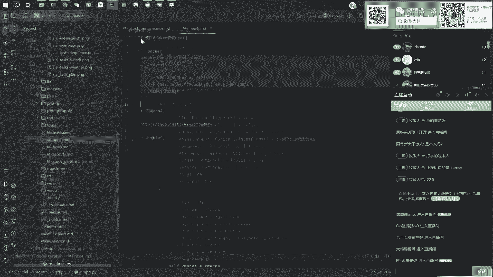
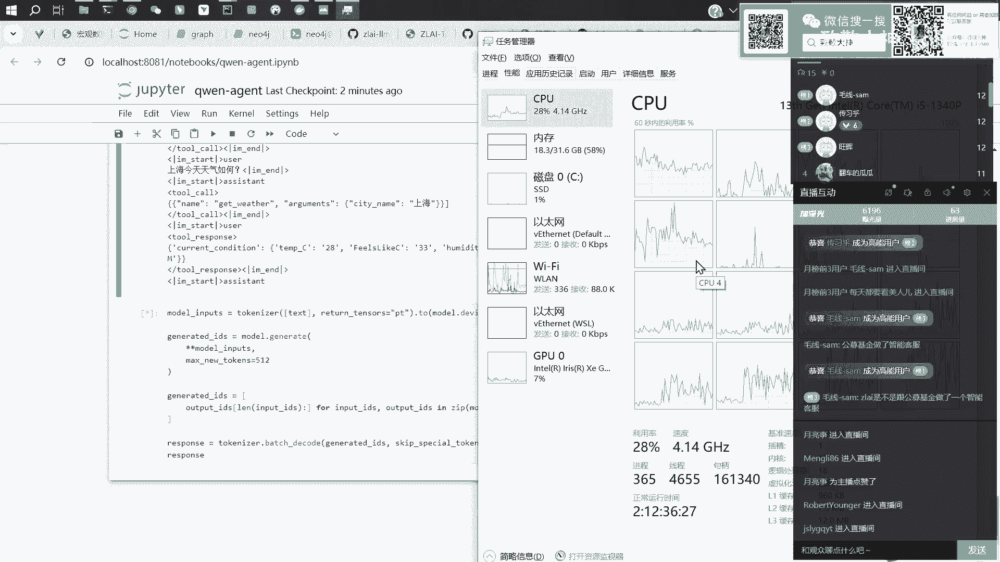

# 大模型应用开发：04：Agent与工具调用模块详解 🛠️

在本节课中，我们将学习大模型Agent的核心思想，以及如何让大模型调用外部工具（如查询天气、股票信息）来回答用户问题。我们将通过一个简单的代码示例，展示从定义工具到模型调用并整合结果的完整流程。

## 概述：什么是Agent？

上一节我们介绍了大模型的基础对话流程。本节中我们来看看如何让大模型变得更“智能”，能够主动获取外部信息来回答问题。





Agent的核心思想是赋予大模型调用外部工具或接口的权限。当用户提出一个模型自身知识库无法实时回答的问题（例如“今天某股票走势如何？”）时，模型可以判断并调用相应的接口（如股票查询API）来获取最新信息，从而给出更准确的回答。





## 基础对话流程回顾

在深入Agent之前，我们先回顾标准的大模型对话调用流程。

计算机无法直接理解文字，因此需要将对话文本转换为数字（Token）。模型接收多条消息（如系统指令、用户问题）后，会先将它们按特定模板拼接成一个长字符串，再通过词表转换为数字序列，最后进行预测生成回答。

以下是使用Qwen2.5-0.5B模型进行简单对话的代码示例：

```python
# 1. 加载模型与分词器
from transformers import AutoTokenizer, AutoModelForCausalLM
model_name = "Qwen/Qwen2.5-0.5B"
tokenizer = AutoTokenizer.from_pretrained(model_name)
model = AutoModelForCausalLM.from_pretrained(model_name)

# 2. 组织对话消息
messages = [
    {"role": "system", "content": "你是由阿里巴巴创造的千问助手。"},
    {"role": "user", "content": "请简单介绍一下你自己。"}
]

# 3. 将消息拼接并转换为模型输入
text = tokenizer.apply_chat_template(messages, tokenize=False, add_generation_prompt=True)
model_inputs = tokenizer([text], return_tensors="pt")

# 4. 模型生成回答
generated_ids = model.generate(**model_inputs, max_new_tokens=512)
generated_ids = [output_ids[len(input_ids):] for input_ids, output_ids in zip(model_inputs.input_ids, generated_ids)]
response = tokenizer.batch_decode(generated_ids, skip_special_tokens=True)[0]
print(response)
```
运行上述代码，模型会生成一段自我介绍。这是没有外部工具介入的标准流程。

## Agent如何调用工具？





现在，我们进入核心部分：如何让模型知道并调用我们提供的工具。

### 第一步：定义工具

首先，我们需要定义一些可供模型调用的函数（工具）。以下是两个简单的示例工具：

```python
# 工具1：获取天气信息
def get_weather(city_name: str):
    """
    根据城市名称获取天气信息。
    参数:
        city_name (str): 城市名称，例如“上海”。
    返回:
        str: 该城市的天气信息字符串。
    """
    # 此处应调用真实天气API，示例中返回模拟数据
    weather_info = f"{city_name}当前天气：晴，温度28°C。观测时间：10:56。"
    return weather_info

# 工具2：生成随机数
def get_random_number(seed: int, range_start: int, range_end: int):
    """
    根据种子和范围生成一个随机数。
    参数:
        seed (int): 随机种子。
        range_start (int): 范围起始值。
        range_end (int): 范围结束值。
    返回:
        int: 生成的随机整数。
    """
    import random
    random.seed(seed)
    return random.randint(range_start, range_end)
```

### 第二步：将工具信息告知模型

为了让模型知道这些工具的存在及其用法，我们需要将工具的描述信息按照特定格式编排到输入消息中。模型通过一个预设的“聊天模板”来组织这些信息。

以下是关键步骤的代码：

```python
# 1. 创建工具描述列表
tools = [
    {
        "type": "function",
        "function": {
            "name": "get_weather",
            "description": "根据给定的城市名称获取当前天气信息。",
            "parameters": {
                "type": "object",
                "properties": {
                    "city_name": {"type": "string", "description": "城市名称，例如‘上海’。"}
                },
                "required": ["city_name"]
            }
        }
    },
    {
        "type": "function",
        "function": {
            "name": "get_random_number",
            "description": "根据种子和范围生成一个随机整数。",
            "parameters": {
                "type": "object",
                "properties": {
                    "seed": {"type": "integer", "description": "随机数种子。"},
                    "range_start": {"type": "integer", "description": "随机数范围起始值。"},
                    "range_end": {"type": "integer", "description": "随机数范围结束值。"}
                },
                "required": ["seed", "range_start", "range_end"]
            }
        }
    }
]

# 2. 在对话消息中加入工具描述
messages_with_tools = [
    {"role": "system", "content": "你是一个有帮助的助手，可以调用工具来回答问题。"},
    {"role": "tools", "content": str(tools)},  # 关键：将工具描述告知模型
    {"role": "user", "content": "上海今天天气如何？"}
]

# 3. 应用聊天模板并生成回答
text_with_tools = tokenizer.apply_chat_template(messages_with_tools, tokenize=False, add_generation_prompt=True)
model_inputs_with_tools = tokenizer([text_with_tools], return_tensors="pt")
generated_ids_with_tools = model.generate(**model_inputs_with_tools, max_new_tokens=512)
# ... 解码过程同上
```
当模型接收到包含`tools`角色的消息后，它就能理解自己可以调用`get_weather`或`get_random_number`这两个函数。

### 第三步：解析模型输出并执行工具调用

模型在判断需要调用工具后，其输出不再是直接的自然语言回答，而是一个结构化的调用指令。

以下是处理流程：

```python
# 假设模型对“上海今天天气如何？”的原始输出是：
model_raw_output = '{"function_call": {"name": "get_weather", "arguments": {"city_name": "上海"}}}'

# 1. 解析输出，提取函数名和参数
import json
try:
    call_info = json.loads(model_raw_output)
    func_name = call_info.get("function_call", {}).get("name")
    func_args = call_info.get("function_call", {}).get("arguments", {})
except:
    # 如果输出不是标准JSON，则按普通文本处理
    func_name, func_args = None, {}

# 2. 根据函数名映射到具体的工具函数，并执行调用
tool_mapping = {
    "get_weather": get_weather,
    "get_random_number": get_random_number
}
if func_name in tool_mapping:
    # 执行工具调用
    tool_result = tool_mapping[func_name](**func_args)
    print(f"工具调用结果: {tool_result}")
else:
    print("模型未请求调用工具，或请求的工具不存在。")
```
执行上述代码后，我们会得到工具调用的结果，例如：`上海当前天气：晴，温度28°C。观测时间：10:56。`

### 第四步：将工具结果返回给模型进行总结

通常，原始的工具调用结果（如API返回的JSON数据）对用户不够友好。我们可以将这个结果再次交给大模型，让它生成一句流畅的自然语言总结。

```python
# 将工具返回的结果作为新消息加入对话历史
final_messages = messages_with_tools + [
    {"role": "tool", "name": func_name, "content": str(tool_result)}, # 加入工具执行结果
    {"role": "user", "content": "请根据上面的信息，用一句话告诉我上海的天气。"} # 请求总结
]

# 再次调用模型生成最终回答
final_text = tokenizer.apply_chat_template(final_messages, tokenize=False, add_generation_prompt=True)
final_inputs = tokenizer([final_text], return_tensors="pt")
final_ids = model.generate(**final_inputs, max_new_tokens=100)
final_response = tokenizer.batch_decode(final_ids, skip_special_tokens=True)[0]
print(f"模型总结: {final_response}")
```
最终，模型可能会输出类似“上海现在是晴天，气温28摄氏度，非常舒适。”的总结性回答。

## 硬件选择与模型部署建议

在实践过程中，模型大小与硬件匹配是关键。以下是简单的选择建议：

*   **CPU运行**：主要瓶颈在于CPU的计算速度。参数量**小于30亿（3B）** 的模型可以运行，但速度较慢。内存大小决定了你能将多大模型加载进来，但计算速度决定了实际可用性。
*   **GPU运行**：主要瓶颈在于显卡的**显存容量**。例如，一块12GB显存的显卡，大约可以流畅运行**60亿（6B）参数**左右的模型。如果生成长文本，显存消耗会增加，可能限制可用性。

选择模型时，需综合考虑硬件条件与任务需求。

## 总结



本节课中我们一起学习了Agent与工具调用的核心机制。我们了解到，通过将外部工具的函数描述以特定格式（`tools`角色）嵌入对话上下文，可以“赋予”大模型调用这些工具的能力。整个流程包括：**定义工具 -> 告知模型 -> 模型输出调用指令 -> 执行工具 -> 将结果返回模型进行总结**。这使得大模型能够突破其静态知识库的限制，通过查询实时信息来更准确地回答用户问题，是构建智能应用的关键一步。