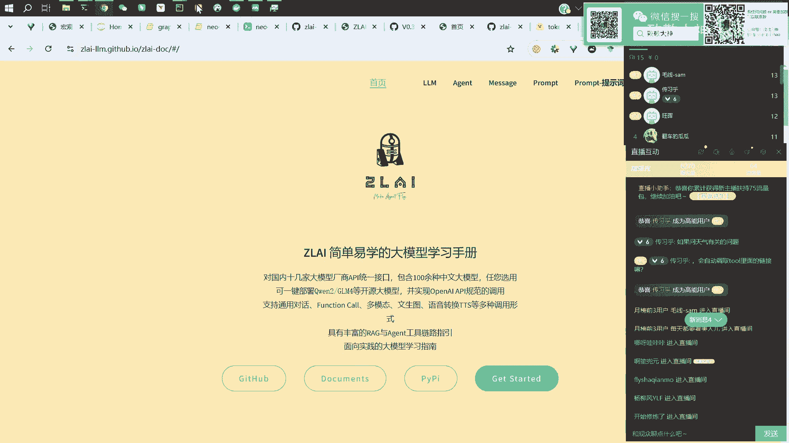
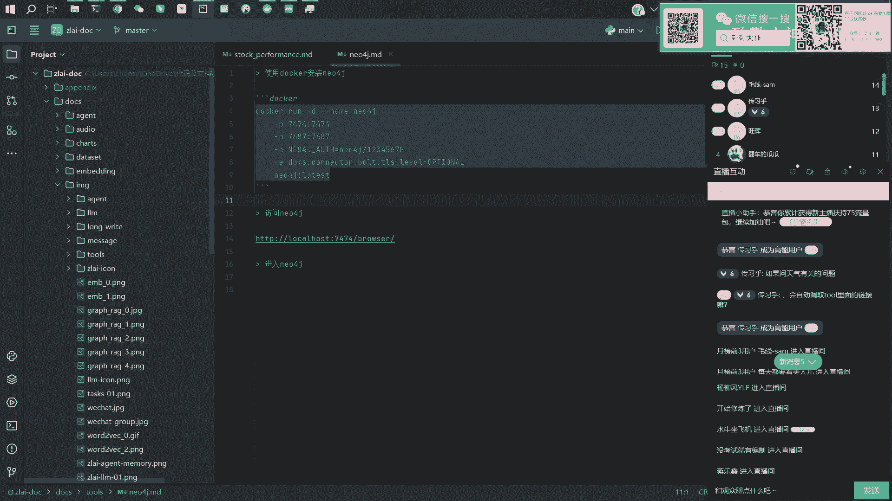
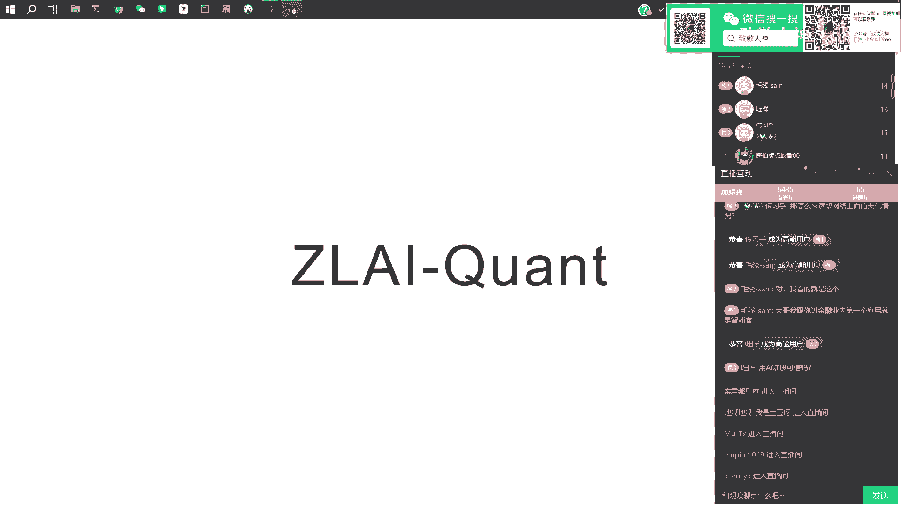

# 大模型知识图谱与金融量化应用：P5：使用工具实现联网查询

在本节课中，我们将学习如何让大语言模型通过调用外部工具（Tools）来获取实时信息，例如天气数据，并理解这与直接提供网页链接的本质区别。我们还将探讨AI在金融量化分析中的应用逻辑。

---

上一节我们介绍了知识图谱的基本概念，本节中我们来看看如何让模型“联网”获取外部信息。

有观众提问：如果询问天气相关问题，模型会自动调用工具里的链接吗？答案是不会。如果你直接给模型一个网站的链接字符串，例如一个天气网站的URL，模型不会直接去读取该网页的内容。它只会将那串URL视为杂乱的文本字符。

关于智能客服的应用，有同学提到是否为公募基金开发了智能客服。目前没有为公募基金专门开发。但在项目首页上，有一个基金问答的示例，它是一个简单的演示（Demo）。可以通过之前介绍的方法，去获取基金的相关消息。这个功能是已经实现的。

以下是工具层面已实现的功能代码示例：
*   **获取基金代码名称**
*   **获取基金基本信息**
*   **查询当前净值**
*   **基金公司查询**
*   **查询历史净值**

这些功能在代码层面是完备的，但相关文档可能不一定非常全面。

---

现在，让我们回到联网查询的演示。下图展示了模型调用天气工具后总结的回答：

回答显示上海气温28度，湿度74%，风力轻微到中等。这是我们期望的答案，因为模型通过我们提供的工具接口，获取了真实数据并做出了回答。

如果不提供工具，直接询问模型同样的问题，结果会怎样？下图展示了这种情形：

此时，模型会回答“抱歉，我无法提供实时消息……”或类似的表述。它无法给出真实数据。但如果你提供了相应的工具，模型就能调用它并获得真实数据来回答你。这就是关键区别。

那么，如何具体获取天气信息呢？我们可以查看 `get_weather` 这个函数在做什么。它实际上是在调用一个天气查询的API接口。

例如，对于城市“上海”，函数会构造请求访问类似 `https://api.weather.com/...?city=上海` 的地址。**模型并非直接读取网页链接，而是通过一个预定义的函数去调用这个API接口，并处理返回的数据**。这就是智能体（Agent）实现联网查询的底层原理。

---

接下来，我们探讨一个相关问题：AI炒股可信吗？

AI在炒股或量化分析中的应用，其可靠性很大程度上取决于你提供给AI的信息是否足够丰富和真实。你给它的信息越多、质量越高，它做出的判断就可能越精准，结论也相对更可靠。但关键在于，整个过程需要系统性的建模，不能依赖人工主观判断去下单。

使用机器学习等方法会更加科学。其本质是处理信息的能力。人类无法处理海量的信息，也难以学习数据背后复杂的概率性关系。而利用AI（即各种算法、现代信息处理方法和科学的验证手段）来完成这些任务，效果通常会更好。

由于时间关系，我们直接进入下一个话题。

---

本节课中我们一起学习了：
1.  大模型需要通过预定义的**工具函数**来获取实时外部信息，而非直接解析网页链接。
2.  通过对比演示，理解了提供工具前后模型回答的差异。
3.  初步了解了`get_weather`类函数通过调用API接口工作的原理。
4.  探讨了AI在金融量化中应用的核心在于**信息处理的质量与科学性**，而非替代人类直觉。