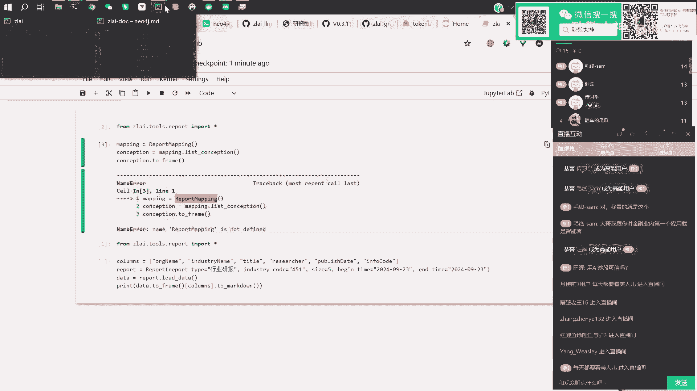
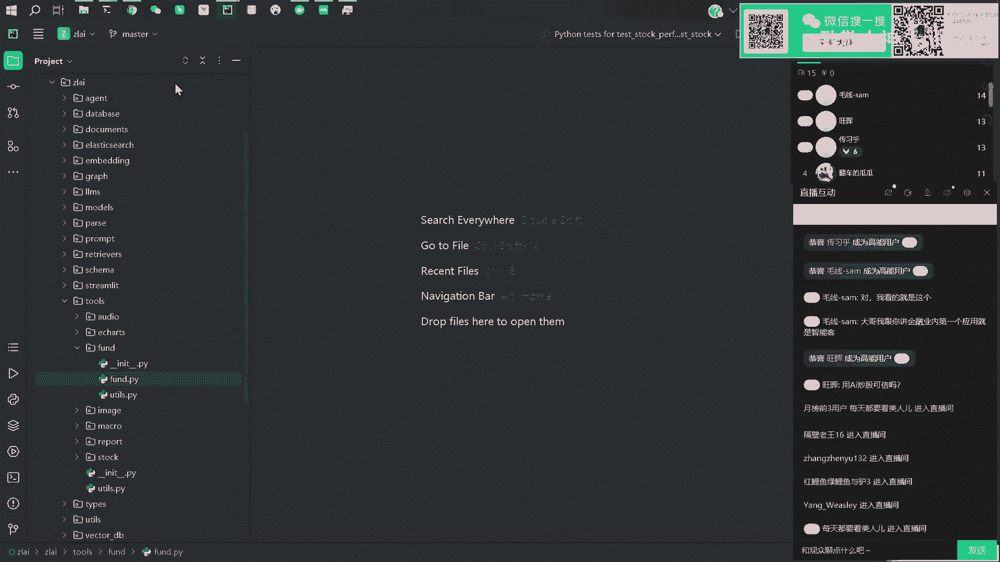
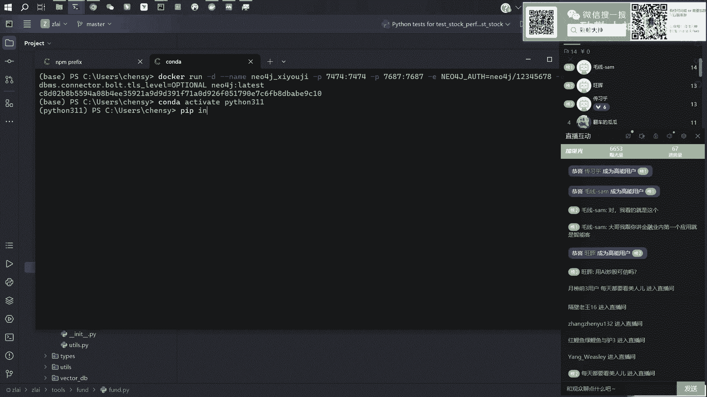
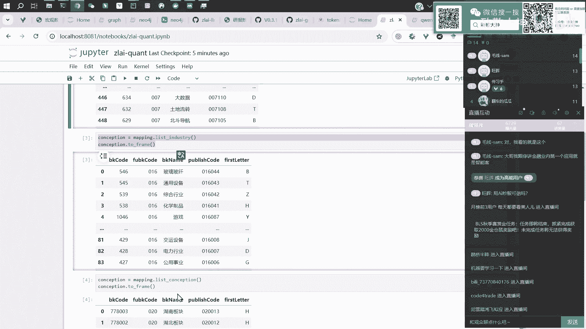
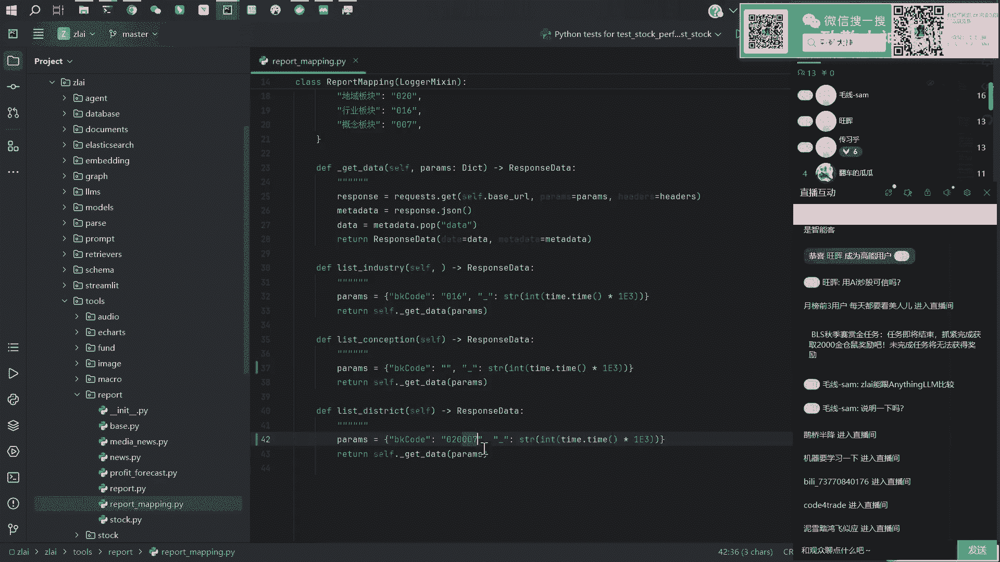
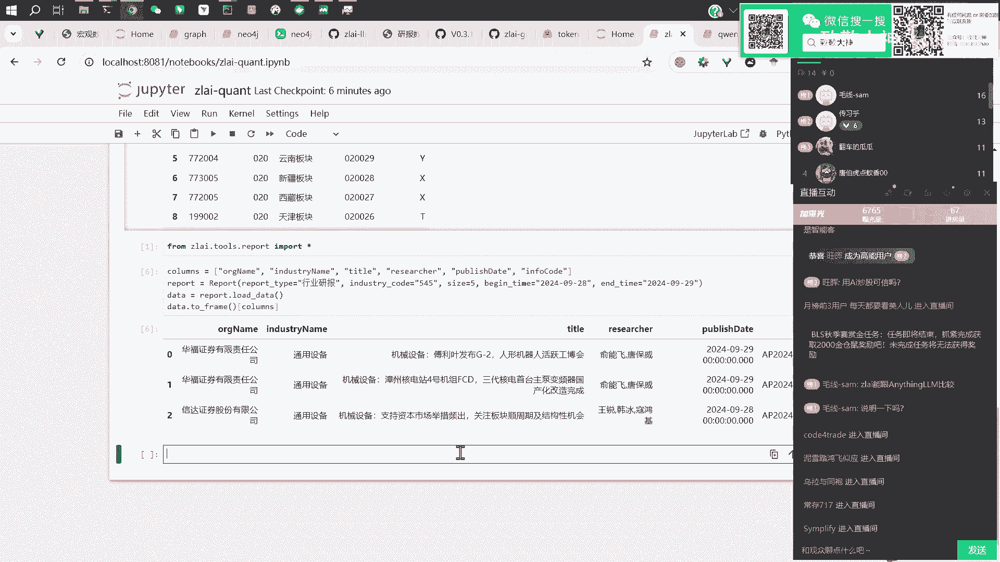
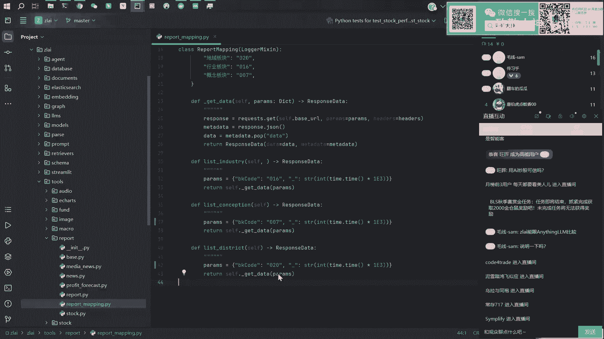
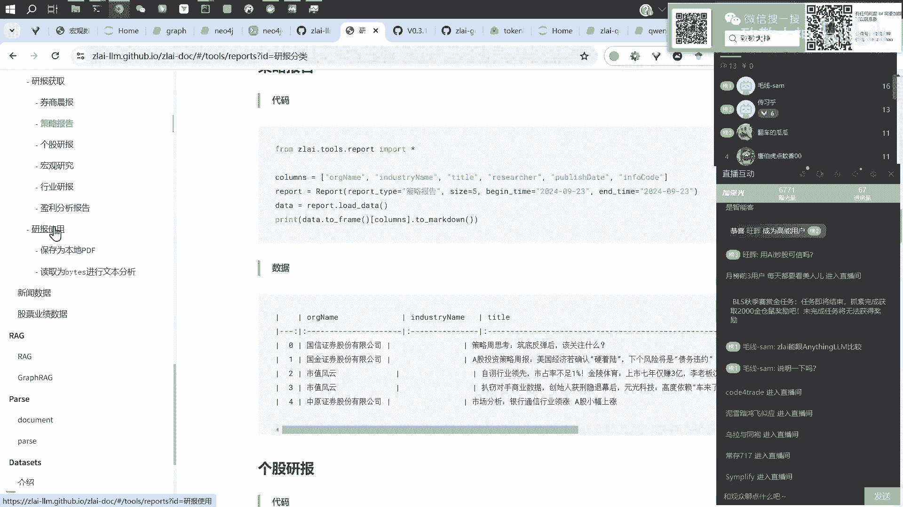
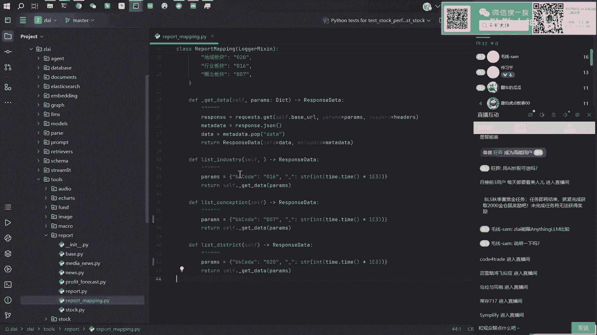
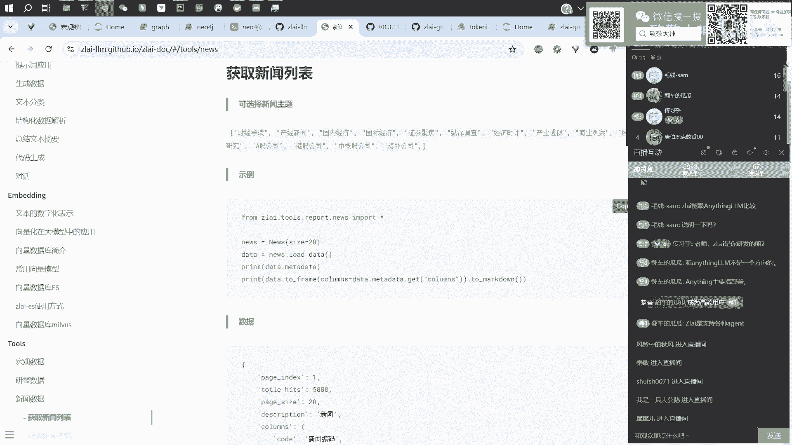

# 大模型与金融量化应用：P6：应用示例与研报解析 📊

在本节课中，我们将学习如何将知识图谱生成与联网信息获取两大技术点相结合，应用于金融量化领域。具体而言，我们将探讨如何利用大模型自动处理财经研报、新闻和宏观数据，以构建经济传导链路图谱，并展示相关的数据调用与处理示例。

## 技术结合与应用构想

上一节我们介绍了知识图谱生成和联网信息获取。本节中我们来看看如何将这两项技术结合，完成更复杂的实践。

可以考虑总结各类研报、财经报告或宏观经济研究，让大模型帮助形成一个较大的经济传导链路。例如，每月发布的CPI、PPI、PMI、GDP数据都会影响后续的经济走向。一个具体商品（如猪肉）的价格变动，可能在未来的几个月内，通过影响养殖户产能、饲料价格、兽医行业等，形成一条经济传导路径。

我们可以收集足够的材料，构建类似的知识图谱链路。从一个节点的消息出发，分析其在特定时间和空间内，可能引发的一系列经济传导效应，这些效应可能是风险、收益或其他方面的影响。

之前这类经济传导路径的研究多由人工梳理。人工梳理可能受个人知识、近期阅读内容或偏好影响，导致遗漏某些点。大模型虽然也有偏好，但由于其训练语料库规模巨大，这种偏好相对于人类会小很多。因此，第一点是可以利用大模型梳理经济传导链路。

## 支撑数据源

那么，有哪些数据源可以支撑这些操作呢？以下是整理的一些数据类别。

首先是研报数据。这类数据包括券商的晨报、策略报告、个股报告、宏观研究等。我们可以获取这些数据，用于生成庞大的经济传导路径。

第二类是更具时效性的新闻数据。例如，可以获取每日各领域最新的财经新闻及其摘要。

第三类是宏观数据。目前有十几种宏观数据指标可供调用，未来会继续丰富。

第四类是股票数据。这包括公司公布的财报数据，如总营业收入、利润、净资产、毛利率等，数据比较全面。

有了这些工具类和调用数据的方式，再结合之前提到的智能体（Agent）调用流程，大模型就可以自由调用宏观数据、研报数据和新闻数据，进行分析并生成图谱。例如，分析CPI上涨会导致下个月哪些因素发生变化。

目前，我们已完成这些数据接口的搭建。接下来，我们将挑选几个示例进行展示。

## 数据接口调用示例

以下是几个关键数据接口的调用方法展示。







### 研报数据获取与处理

例如，我们想获取某个特定行业的研报。首先需要知道该行业的编码。我们可以通过查询映射表来获取编码。

```python
# 示例：获取行业编码映射
industry_mapping = get_industry_mapping()
```



假设我们想获取“通用设备”行业（编码545）在最近两天发布的研报。



```python
# 示例：获取特定行业近期研报列表
reports = get_industry_reports(industry_code=545, start_date='2023-10-28', end_date='2023-10-29', limit=5)
```

运行后，我们得到了一个研报列表，包含报告标题、发布券商和唯一编码等信息。





获取到研报列表后，下一步是获取其正文内容。一种方式是将研报保存为本地PDF文件。



```python
# 示例：将研报保存为本地PDF
save_pdf(report_info_code_list=['code1', 'code2'])
```



但这种方式效率较低。更高效的做法是直接将研报内容读取为文本，供大模型处理。

```python
# 示例：以文本流形式读取研报
stream = load_pdf_bytes(info_code='target_code')
parsed_data = read_pdf_stream(stream)
```

`parsed_data` 包含元数据、文本内容和图片。文本内容可以拼接成长字符串直接交给大模型分析。图片内容则可供支持多模态的模型使用。

```python
# 示例：将研报文本提交给大模型进行解读
report_text = concatenate_text(parsed_data['content'])
summary = large_model_analyze(f"请解读以下研报：{report_text}")
```

大模型会返回结构清晰的摘要，包括投资要点、关注行业和风险提示等。我们还可以进一步利用这些信息，按照之前的方法构建知识图谱，展示研报中关注的行业关联关系。

### 新闻数据获取

新闻数据的调用相对直接，可以获取最新的财经新闻摘要和原文链接。

```python
# 示例：获取最新财经新闻
latest_news = get_latest_finance_news(limit=20)
```

## 总结与展望

本节课中我们一起学习了如何将知识图谱与联网能力结合，应用于金融量化分析。我们探讨了利用大模型自动梳理经济传导链路的构想，并介绍了支撑该实践的几类核心数据源：研报、新闻、宏观数据和股票数据。通过具体的代码示例，我们展示了如何调用这些数据接口，以及如何将研报内容处理后交给大模型进行分析解读。



目前，我们已经完成了基础数据接口的建设。未来的目标是整合这些模块，实现大模型自动调用多源数据、进行分析并生成经济传导图谱的完整流程，从而为投资决策提供更智能的辅助。