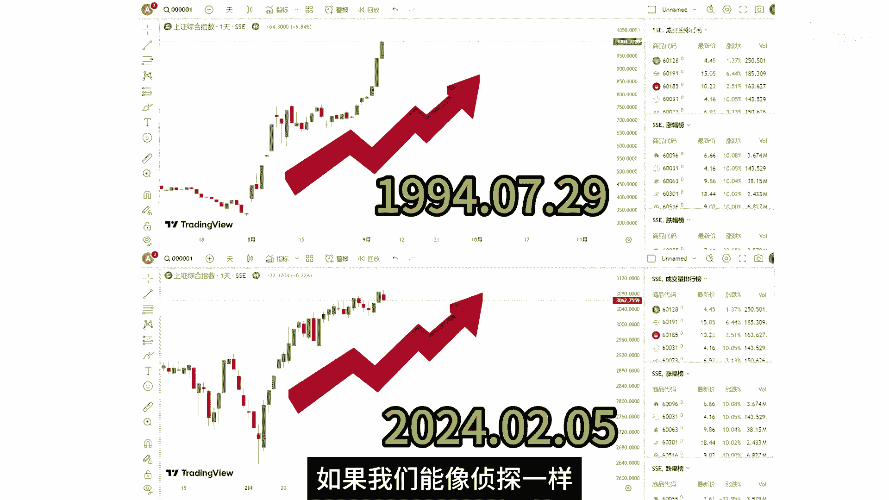
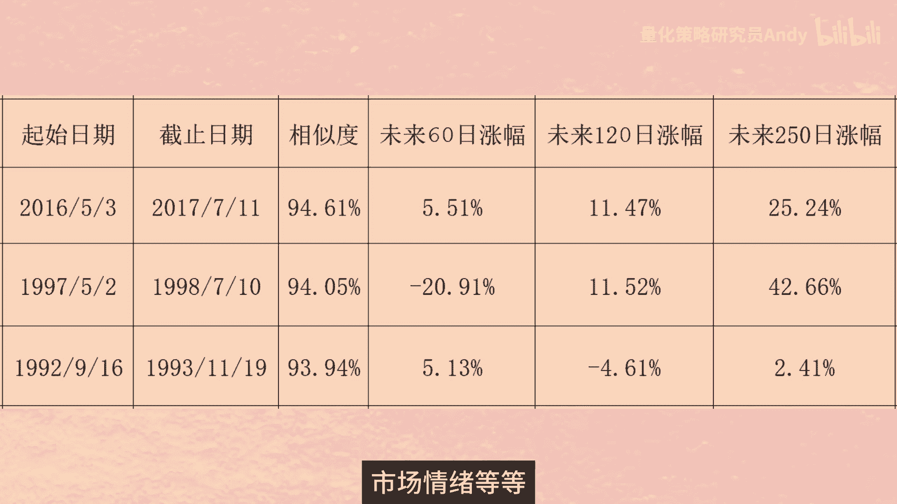

# 量化交易：P1：寻找历史中的相似行情 📈

在本节课中，我们将学习如何利用量化方法，在历史数据中寻找与当前市场走势相似的行情。我们将重点介绍皮尔逊相关系数这一核心概念，并使用Python编程来实现相似K线的搜索，以辅助我们的投资决策。

## 以史为镜，可以知兴替

你是否听过这样一种说法：现在市场的走势很像历史上的某段行情。如果时间回到2024年2月5号，你该如何判断这里就是底部呢？

注意看图中这两组K线，分别是2024年2月5号和1994年7月29号前后的上证指数K线图。我们知道在今年的2月5号市场见底之后，迎来了一波强势的反弹。在1994年的7月29号，市场也发生了同样的事情。

在金融市场中，似乎总有些模式在不断重演，就像一部没有尽头的电视剧，剧情虽有变化，但总有似曾相识的感觉。想象一下，如果我们能像侦探一样，用一把神奇的尺子量一量，就能找到那些惊人相似的历史片段，岂不妙哉？

今天我们就从量化投资的角度，来寻找历史中的相似行情。如果你对此感到好奇，那本期教程将带你一探究竟。



## 如何量化K线的相似度？


图中这两组K线看上去长得很像，那它们的相似度是多少？有没有一个可以量化的指标来衡量呢？

要想知道两组K线之间的相似度，我们需要先了解一个概念，叫做**皮尔逊相关系数**。

### 理解皮尔逊相关系数

皮尔逊相关系数是度量两个变量之间线性相关程度的统计量。它是由英国统计学家卡尔·皮尔逊在1895年提出的。

它的计算公式如下：

**公式：**
`r = Σ[(xi - x̄)(yi - ȳ)] / √[Σ(xi - x̄)² * Σ(yi - ȳ)²]`

这个公式中的 `r` 就代表皮尔逊系数。`X` 和 `Y` 是两个变量，大家可以理解为两组K线的收盘价序列。其中 `xi` 和 `yi` 分别表示两个变量的第 `i` 个值。`x̄` 和 `ȳ` 代表 `X` 和 `Y` 的平均值。

*   **分子部分**：代表 `X` 和 `Y` 的协方差。先计算每个变量与各自均值之差的乘积，然后再计算这些乘积的和。
*   **分母部分**：代表 `X` 和 `Y` 的标准差乘积。先计算每个变量与各自均值之差的平方和，然后再计算出两个平方根的乘积。

分子中的协方差，能够反映两组变量之间的相关性。而分母的作用是对协方差进行标准化，确保皮尔逊系数不仅考虑了两个变量是否同向变动，还考虑了这种变动相对于各自数据分散程度的大小。

通过这样的标准化处理，皮尔逊系数的取值范围被限定在了 **-1 到 1** 之间，使得它能够更直观地反映两个变量间线性相关性的强度和方向，而不受变量测量尺度的影响。简而言之，分母提供了对变量波动规模的调整，使得皮尔逊系数成为了一个相对度量，易于跨数据集比较。

*   当 `r = 1` 时，表示两个变量**完全正相关**。
*   当 `r = -1` 时，表示两个变量**完全负相关**。
*   当 `r = 0` 时，表示两个变量之间**没有线性相关性**。

## 用Python寻找相似K线 🐍

现在我们知道了求两组变量相关性的公式，下面我们就利用Python编程，来寻找历史上的相似K线组合。

上一节我们介绍了皮尔逊相关系数的原理，本节中我们来看看如何用代码实现它。

### 第一步：准备数据

以下是代码实现的第一步：导入必要的库并获取数据。

```python
# 导入必要的库
import pandas as pd
import numpy as np
import yfinance as yf # 假设使用yfinance获取数据，您可能需要安装

# 获取上证指数价格数据（示例）
# 这里需要替换为实际的数据获取方式，例如从本地CSV或数据库读取
# df = pd.read_csv('shanghai_index.csv')
# 假设df是包含‘Date‘, ‘Open‘, ‘High‘, ‘Low‘, ‘Close‘列的DataFrame

# 筛选出基准日期（例如2024-02-05）之前的数据
base_date = ‘2024-02-05‘
df_before = df[df[‘Date‘] < base_date].copy()

# 设置基准K线长度
length = 100
# 获取基准K线序列（最近100根）
base_data = df_before.tail(length)

# 获取历史数据（剔除基准K线）
history_data = df_before.iloc[:-length]
```

### 第二步：计算相关性并寻找相似片段

接下来，我们将循环遍历历史数据，计算每一段与基准K线的皮尔逊相关系数。

以下是核心的计算和搜索过程：

```python
# 初始化结果DataFrame
results = []

# 分别计算开盘价、最高价、最低价、收盘价序列的相关性
price_columns = [‘Open‘, ‘High‘, ‘Low‘, ‘Close‘]

# 遍历历史数据，每次取与基准长度相同的序列
for i in range(len(history_data) - length + 1):
    # 获取当前历史片段
    hist_slice = history_data.iloc[i:i+length]
    
    # 计算四个价格序列的相关系数
    corrs = []
    for col in price_columns:
        # 使用numpy的corrcoef计算皮尔逊相关系数
        corr_matrix = np.corrcoef(base_data[col].values, hist_slice[col].values)
        corr = corr_matrix[0, 1]
        corrs.append(corr)
    
    # 计算平均相关系数作为最终相似度
    avg_corr = np.mean(corrs)
    
    # 记录结果：起始日期、结束日期、相似度
    start_date = hist_slice.iloc[0][‘Date‘]
    end_date = hist_slice.iloc[-1][‘Date‘]
    results.append({
        ‘start_date‘: start_date,
        ‘end_date‘: end_date,
        ‘correlation‘: avg_corr
    })

# 将结果转换为DataFrame并按相关性排序
df_results = pd.DataFrame(results)
df_results_sorted = df_results.sort_values(by=‘correlation‘, ascending=False).reset_index(drop=True)

# 打印相关性最高的几个结果
print(df_results_sorted.head(10))
```

### 第三步：分析结果

运行代码后，我们可能会得到类似以下的结果（数据为示例）：

| 起始日期 | 结束日期 | 相关系数 |
| :--- | :--- | :--- |
| 1994-03-11 | 1994-07-29 | 0.924 |
| 1995-09-01 | 1996-01-23 | 0.924 |
| 2003-05-27 | 2003-10-20 | 0.924 |

这些日期段与2024年2月5日前的100根K线走势高度相似。我们可以进一步分析这些相似片段出现后，市场在未来一段时间（例如20天、60天、120天）的表现，作为当前行情未来走势的参考。

## 案例分析与应用扩展

在找到历史上的相似K线后，我们可以进行更深入的分析。以下是分析相似行情后续表现的方法。

我们可以计算相似行情结束后，未来不同时间窗口的收益率，以评估历史模式重演的可能性。

**示例分析（基于假设数据）：**

1.  **1994-07-29之后**：
    *   未来20天收益率：+118.85%
    *   未来60天收益率：+122.96%
    *   未来120天收益率：+77.78%

2.  **1996-01-23之后**：
    *   未来20天收益率：+12.98%
    *   未来60天收益率：+31.09%
    *   未来120天收益率：+70.82%

3.  **2003-10-20之后**：
    *   未来20天收益率：-2.31%
    *   未来60天收益率：+18.62%
    *   未来120天收益率：+24.59%

虽然2003年10月20号这一天并没有见到最低点，但这里无疑是底部区域。在不久的11月13号，指数就见到了阶段低点，随后展开反弹。在这三段行情中，未来的三个月到半年，指数均取得了较高的正收益。

找到历史中的相似K线，对于帮助我们判断当前的行情，有着较大的参考价值，尤其是对于大盘指数而言，这种参考价值比个股更高。

### 应用于其他市场：以纳斯达克指数为例

该方法同样可以应用于其他市场，例如美国的纳斯达克指数。

**思路：**
假设我们想分析纳斯达克指数在2023年一段上涨行情后的走势。我们可以将这段上涨行情作为基准，在纳斯达克指数的全部历史数据中寻找相似片段，并观察这些相似片段之后的走势是继续上涨、震荡还是回调，从而为判断当前行情提供多维度的历史参照。

## 重要风险提示 ⚠️

虽然历史总是惊人的相似，但不会简单的重演。

即使两组K线图在历史上显示出高度的相关性，这并不意味着未来他们一定会以相同的方式发展。因为股市受到多种因素的影响，包括宏观经济、公司业绩、政策变动、市场情绪等等，这些因素都可能影响价格。

因此，相似K线分析应作为一种**辅助参考工具**，结合其他分析方法和风险管理策略共同使用，而不能作为唯一的决策依据。

## 总结

在本节课中，我们一起学习了如何利用量化方法寻找历史中的相似行情。



1.  **核心概念**：我们引入了**皮尔逊相关系数**作为量化K线相似度的工具，其值介于-1到1之间，值越接近1，表示正相关性越强。
2.  **实现方法**：我们使用Python编程，通过计算历史数据片段与当前基准K线在开盘、最高、最低、收盘价上的平均相关系数，来寻找最相似的历史行情。
3.  **分析应用**：找到相似片段后，可以进一步分析该片段之后市场的表现，作为当前行情未来可能走势的参考。
4.  **注意事项**：我们强调了历史不会简单重演，该方法应作为辅助工具，并需注意其局限性。

希望本教程能帮助你开启量化分析的一扇窗，学会以更数据化的视角审视市场波动。记得在实践中不断尝试和优化参数，并始终将风险控制放在首位。