# Python金融量化分析：P40：Alphalens工具包介绍 📊

在本节课中，我们将要学习一个名为Alphalens的强大工具包。这个工具包专门用于金融因子的绩效分析，它能帮助我们自动计算关键指标并生成分析图表，从而极大地简化量化分析的工作流程。

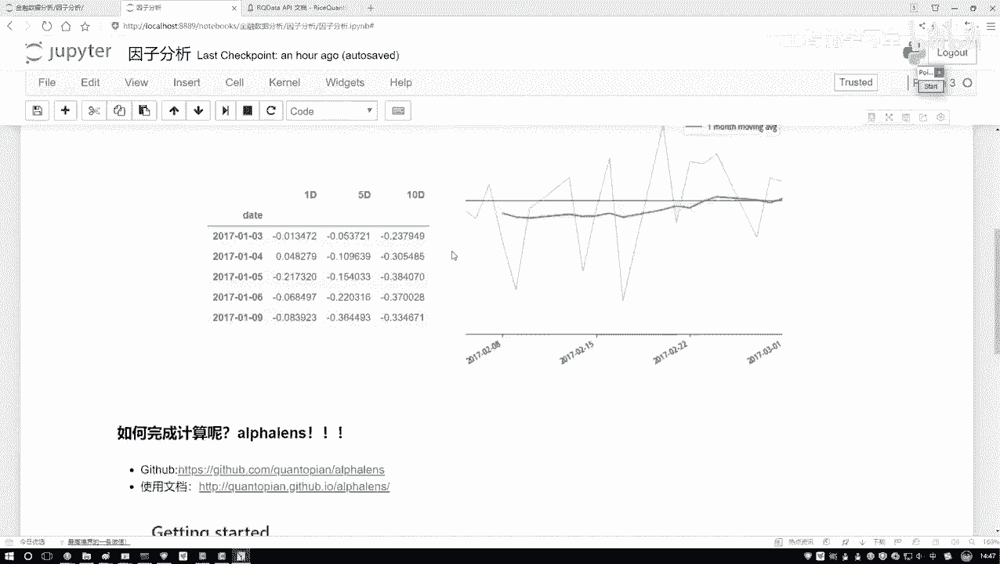

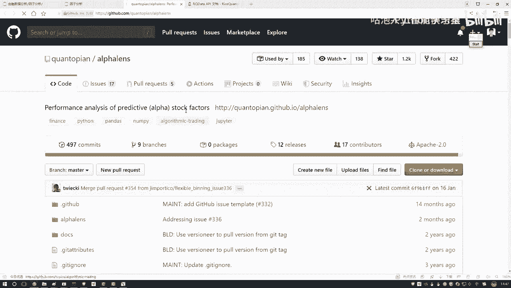

## 工具包简介与获取

上一节我们介绍了因子分析的基本概念，本节中我们来看看如何利用现成的工具来高效完成这些分析。

Alphalens是一个专门用于因子分析的Python工具包。它封装了因子收益计算、信息系数（IC）分析、分组收益统计以及可视化图表生成等一系列功能。这意味着我们无需从零开始编写复杂的计算和绘图代码。

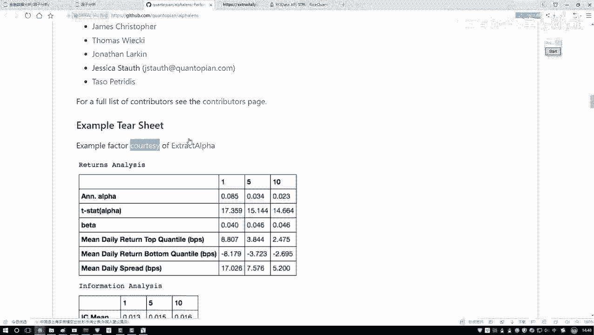

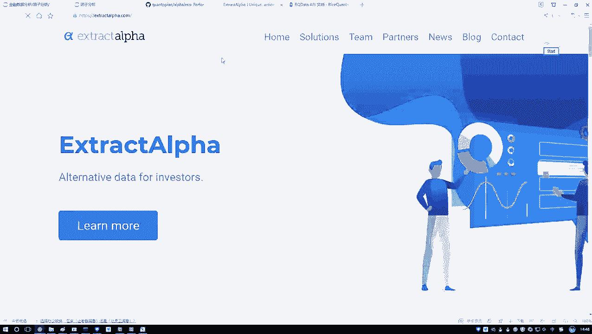

以下是获取和了解Alphalens的途径：
*   **GitHub仓库**：这是该项目的源代码和主要文档所在地。
*   **官方文档**：提供了详细的API说明和使用指南。

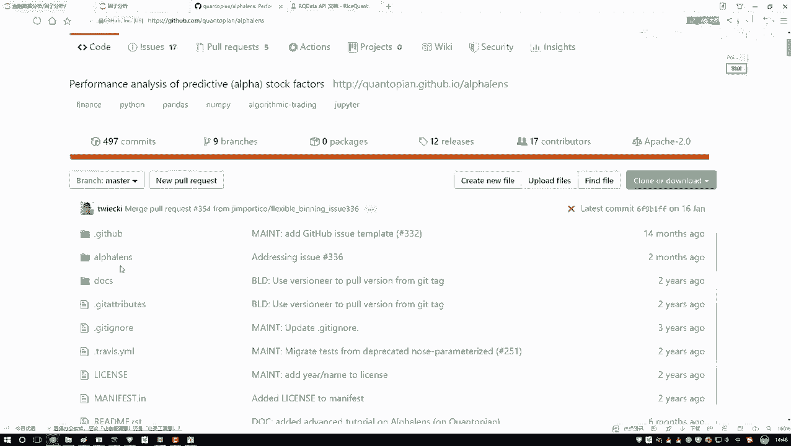

安装Alphalens非常简单，只需在命令行中执行以下命令即可：
```bash
pip install alphalens
```
不过，在本课程后续的实战环节中，我们将使用一个在线的量化平台，该平台已预装了Alphalens，因此我们可以直接使用，无需自行安装。

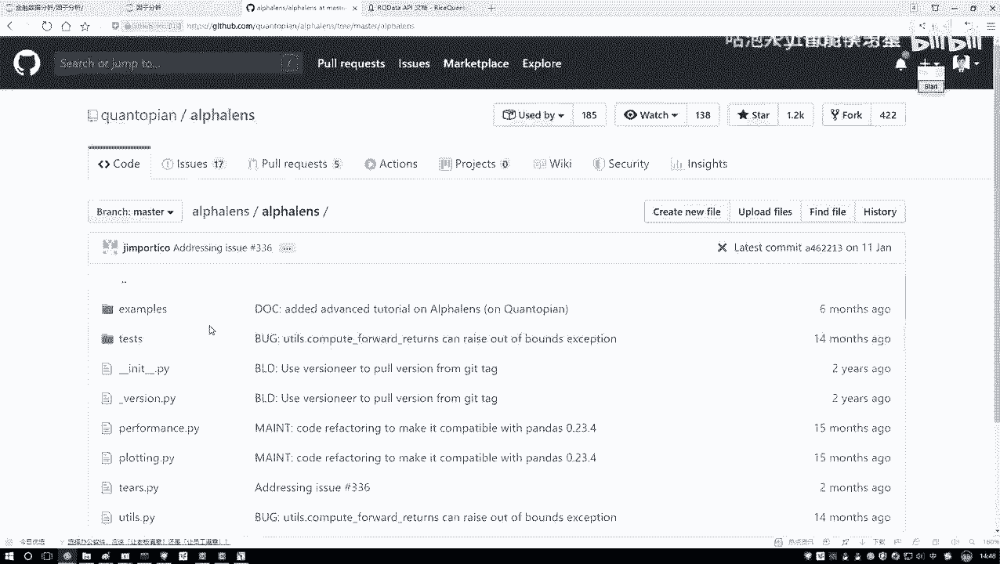

## 学习资源与平台准备

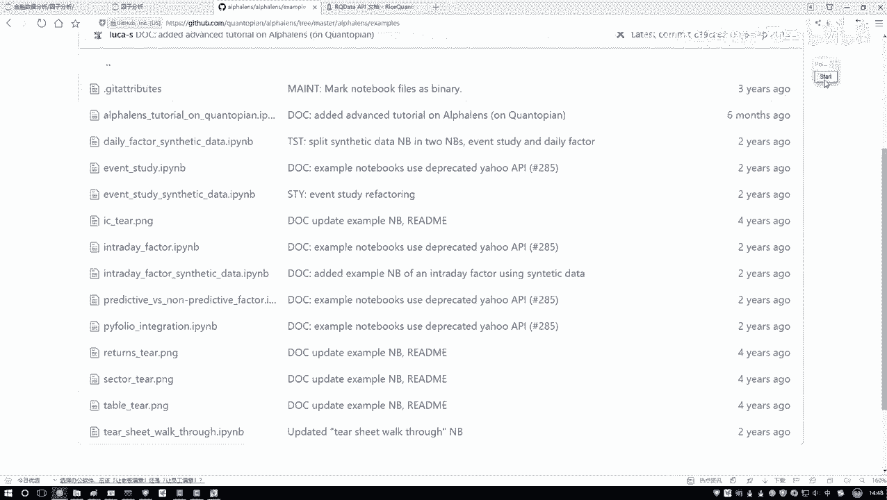

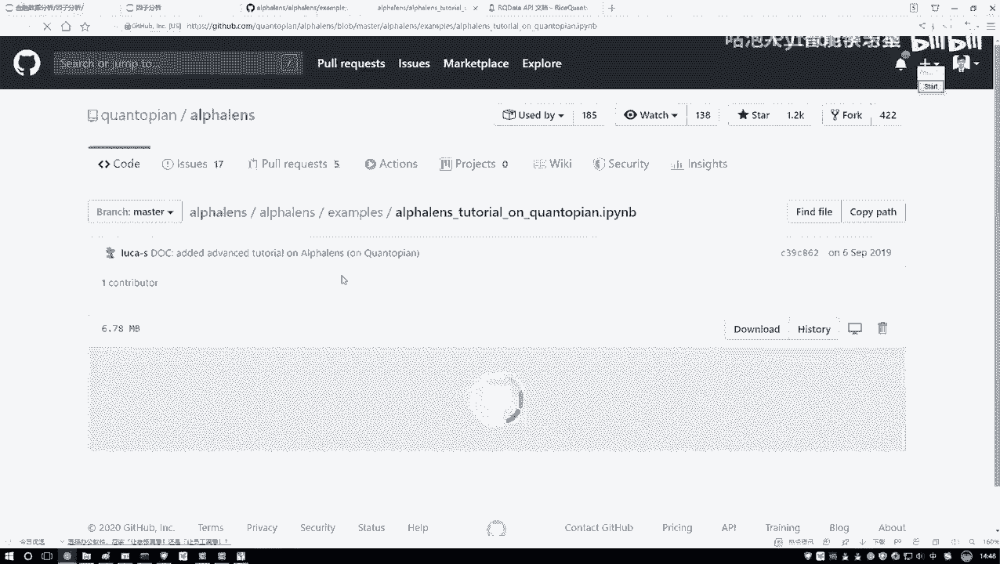

了解了工具的基本信息后，接下来我们看看如何学习使用它，并为后续的实战操作做好准备。

对于初学者，最好的学习材料是官方提供的示例（Examples）。这些示例代码清晰地展示了Alphalens的核心功能和使用方法。本课程的讲解也将主要参考这些官方示例，并将其中的关键知识点总结出来，以更易懂的方式呈现。

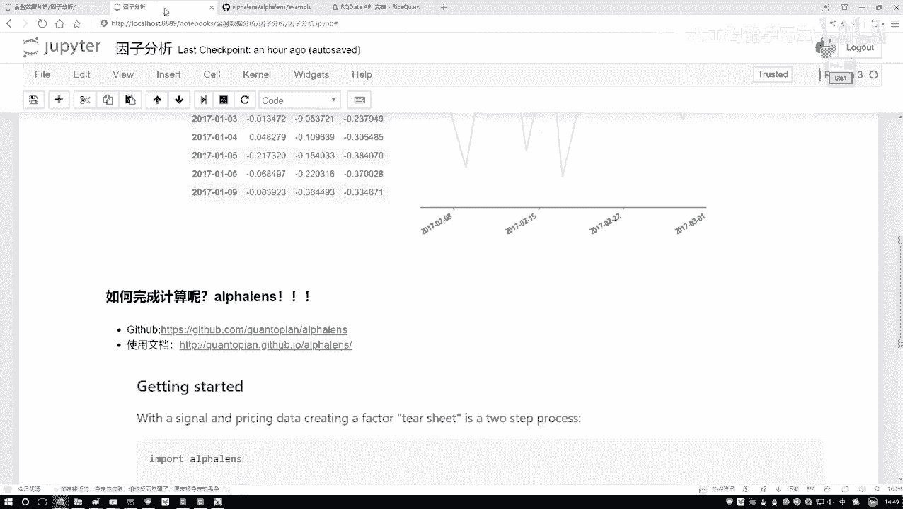

如果你想深入探索，可以仔细阅读官方文档中的说明和教程。

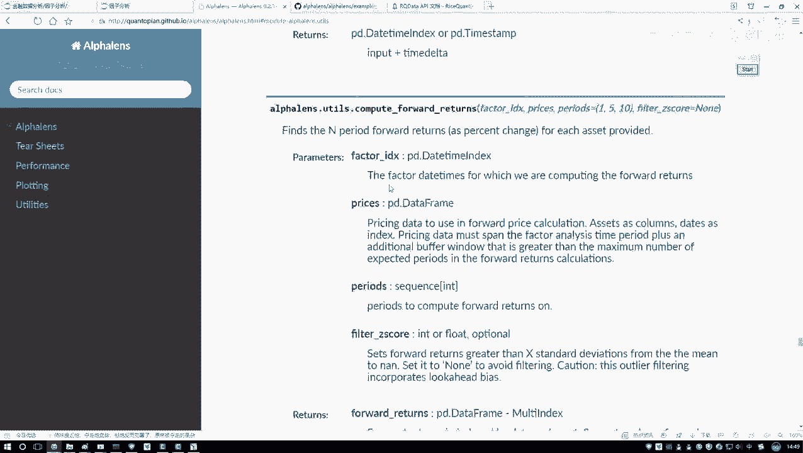

---

为了进行实际的因子分析，我们需要在能够获取金融数据的环境中编写代码。因此，我们将使用在线量化平台提供的“投资研究”模块。

这个模块提供了一个类似Jupyter Notebook的交互式编程环境，但它运行在平台的服务器上，可以直接调用平台的数据接口，解决了本地获取数据困难的问题。

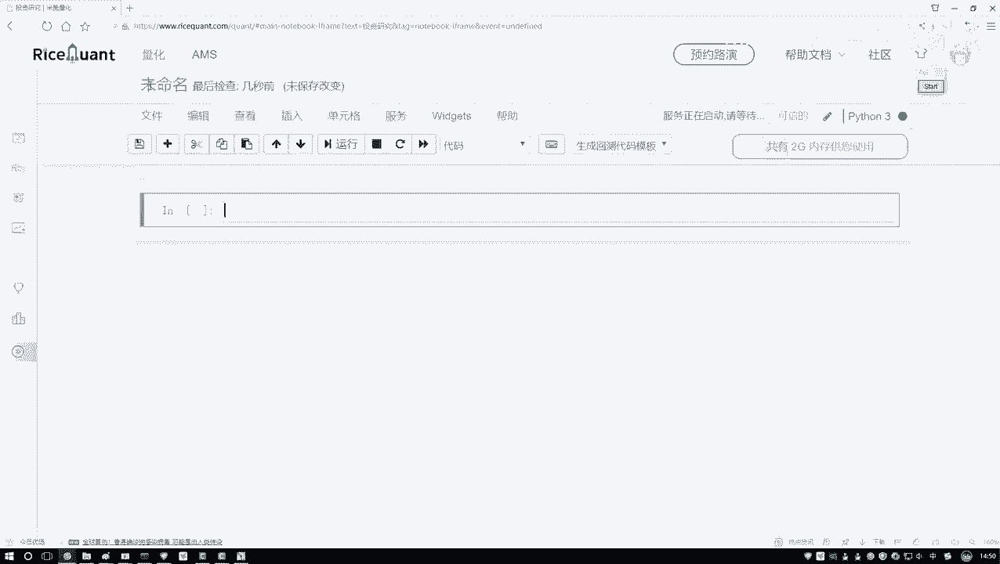

接下来，我们将在该环境中创建一个新的Notebook，并命名为“因子分析”，后续的所有代码都将在其中编写。课程也会提供完整的代码供大家参考和使用。

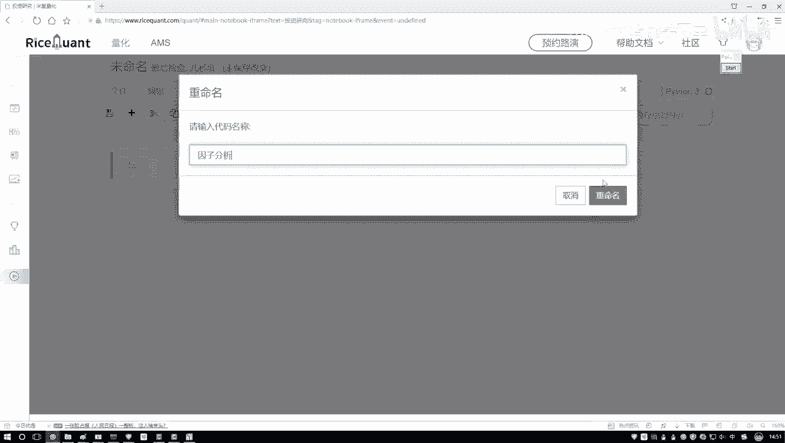

---

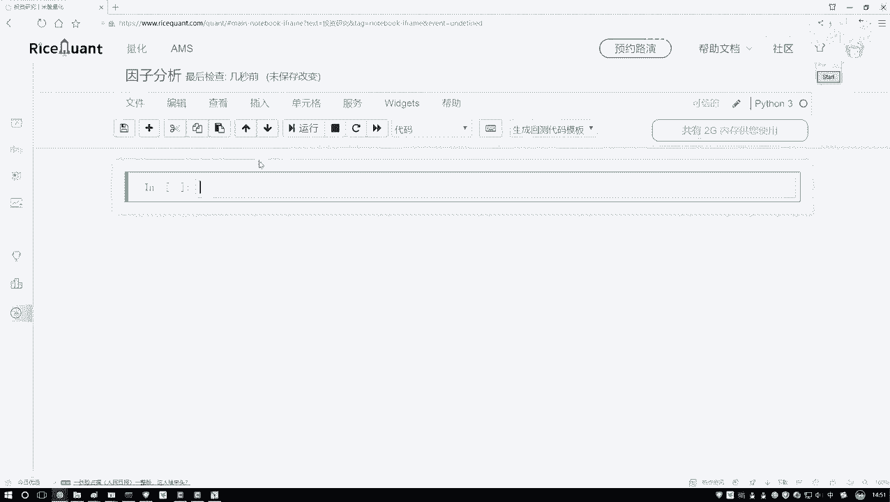

本节课中我们一起学习了Alphalens工具包的用途与优势，了解了如何获取和安装它，并熟悉了最佳的学习路径——官方示例。同时，我们也准备好了进行实战编码的在线平台环境。在接下来的课程中，我们将正式使用Alphalens对具体的因子进行深入分析。