# 量化交易与Python金融分析实战：P86：对偶性、Lagrange函数与对偶问题

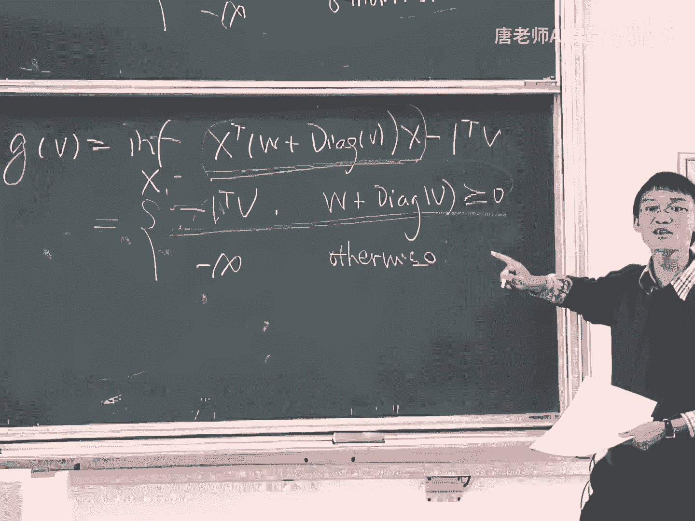

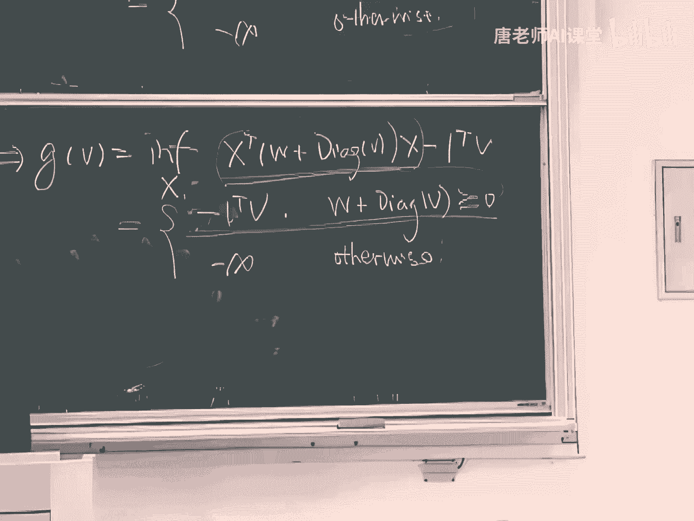


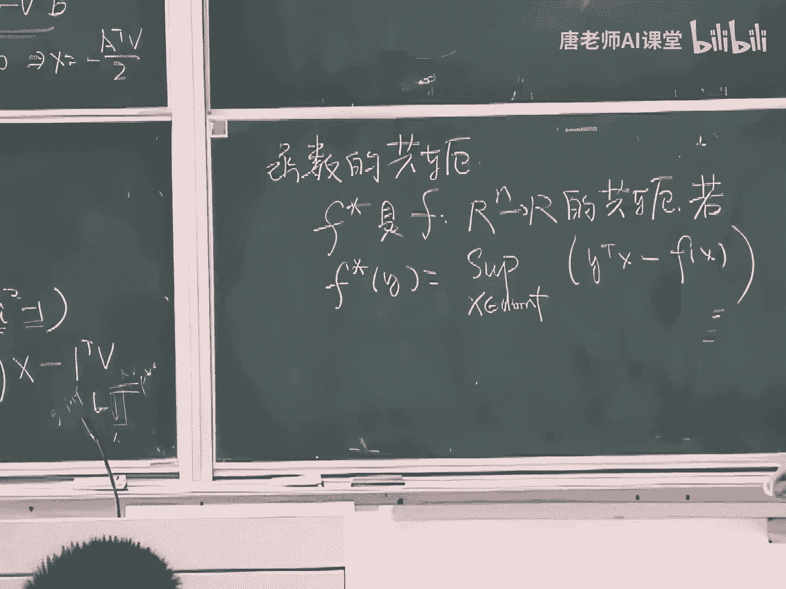

## 概述
在本节课中，我们将深入探讨优化理论中的核心概念：对偶性。我们将学习如何从原问题出发，构造其Lagrange函数，进而定义对偶函数，并最终形成对偶问题。理解这些概念是掌握高级优化算法和深入分析金融模型的基础。

## 证明Lagrange函数的凹性

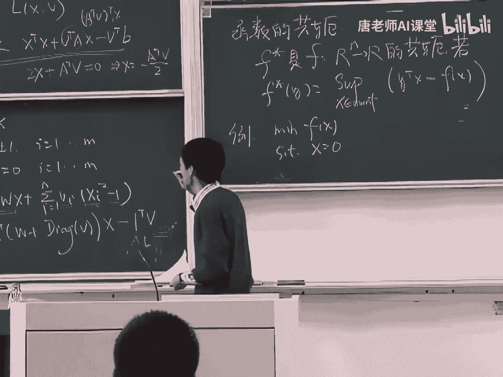

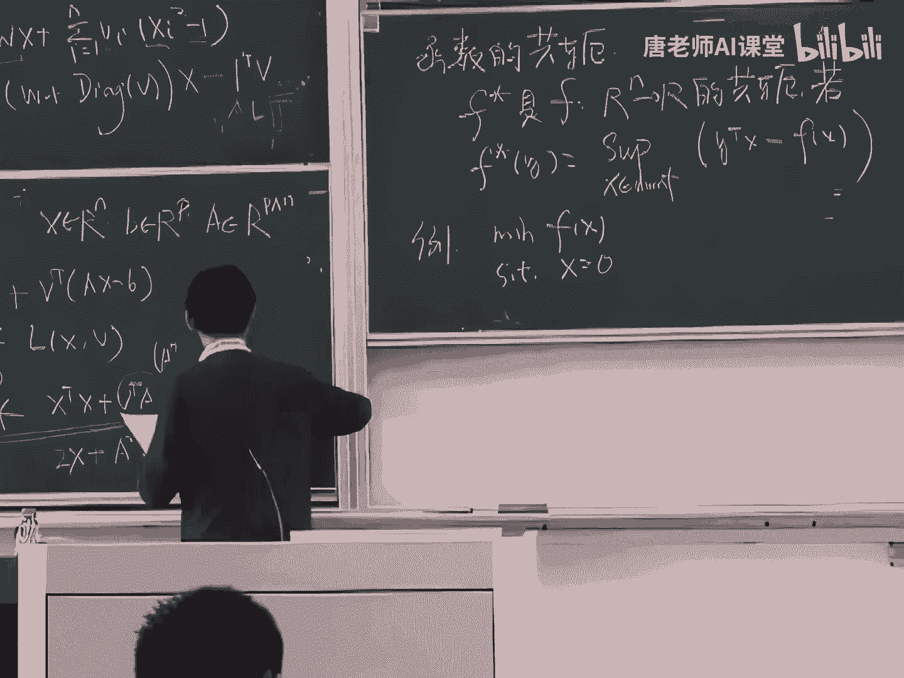

上一节我们介绍了Lagrange函数的基本形式，本节中我们来看看如何证明其凹性。

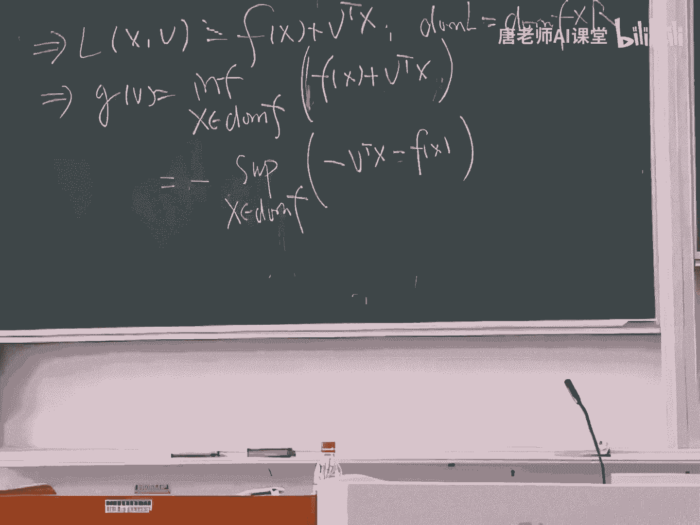

我们要证明的是，在定义域内，Lagrange函数关于其对偶变量 `(λ, ν)` 是一个凹函数。证明的思路是验证其定义域是一个凸集，并且函数本身是凹的。

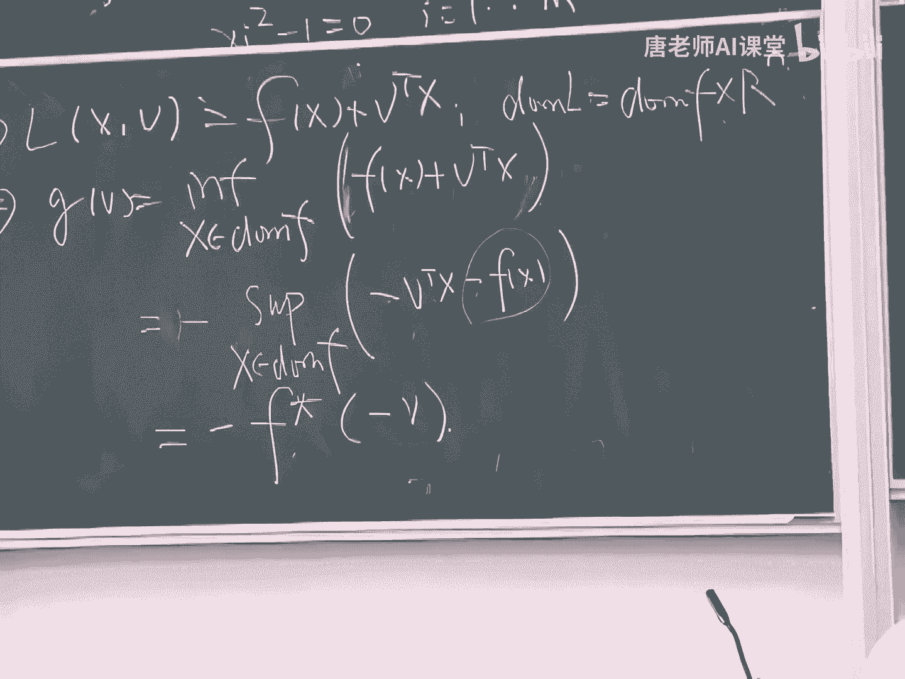

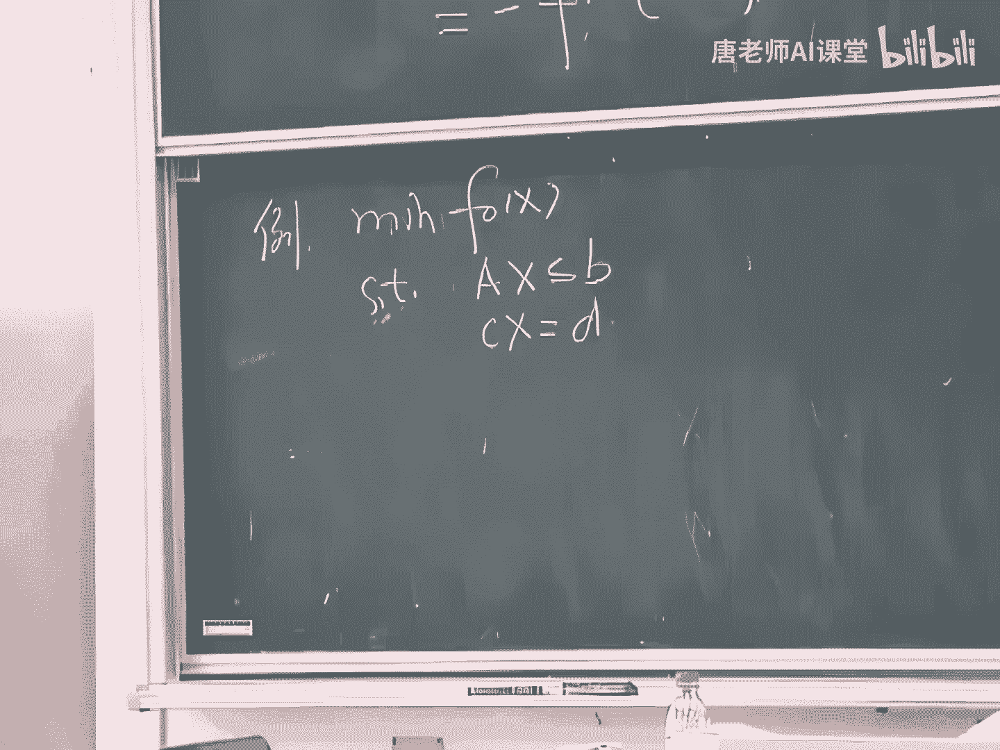

一个更直接的证明方法是利用集合的凸性。考虑集合 `A`，其定义如下：
```
A = { (u, v, t) | ∃x ∈ D, f_i(x) ≤ u_i, h_i(x) = v_i, f_0(x) ≤ t }
```
其中 `D` 是原问题的定义域。

如果能够证明集合 `A` 是一个凸集，那么由该集合支撑函数所定义的对偶函数 `g(λ, ν)` 自然就是一个凹函数。因为凹函数的上境图（epigraph）是凸集，反之，由凸集定义的支撑函数是凹函数。

以下是证明集合 `A` 为凸集的关键步骤：
1.  取 `(u1, v1, t1)` 和 `(u2, v2, t2)` 属于集合 `A`，则存在 `x1` 和 `x2` 满足定义中的不等式和等式。
2.  对于任意 `θ ∈ [0, 1]`，构造 `xθ = θ x1 + (1-θ) x2`。
3.  由于原问题中的函数 `f_i`（假设为凸函数）和 `h_i`（仿射函数）的性质，可以推导出 `(θ u1 + (1-θ) u2, θ v1 + (1-θ) v2, θ t1 + (1-θ) t2)` 也属于集合 `A`。
4.  因此，集合 `A` 是凸集。

由于对偶函数 `g(λ, ν)` 可以表示为：
```
g(λ, ν) = inf_{(u, v, t) ∈ A} { t + λ^T u + ν^T v }
```
它是凸集 `A` 的支撑函数（带一个负号），而支撑函数总是凸函数。所以，`g(λ, ν)` 关于 `(λ, ν)` 是凹函数。

## 对偶函数与共轭函数的联系

我们之前介绍过函数的共轭（Conjugate）概念，它与对偶函数有着直接的联系。让我们先回顾一下共轭函数的定义。

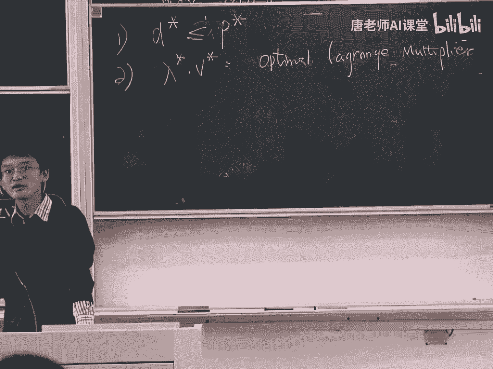

假设有一个函数 `f: R^n -> R`，其共轭函数 `f*: R^n -> R` 定义为：
```
f*(y) = sup_{x ∈ dom f} ( y^T x - f(x) )
```
共轭函数 `f*(y)` 总是一个凸函数，因为它是一系列关于 `y` 的仿射函数的上确界。

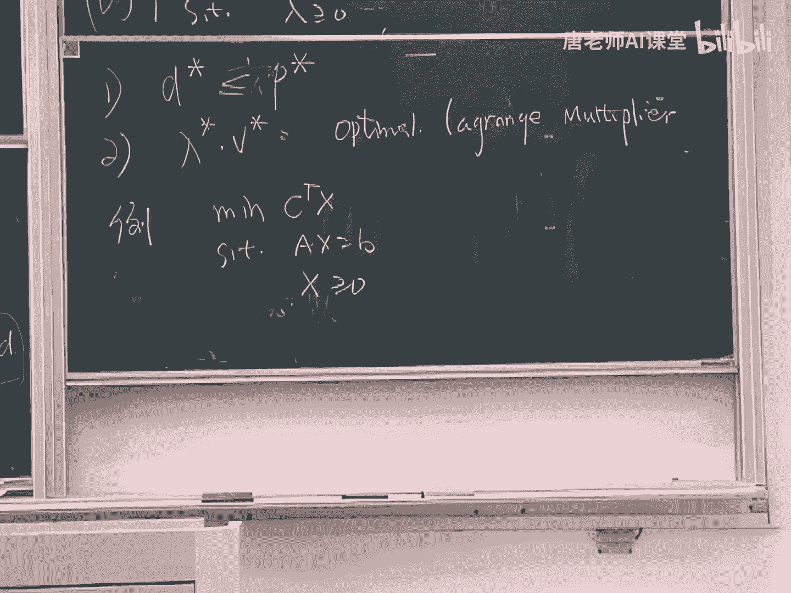

现在，我们将这个概念应用到对偶问题中。考虑一个极其简单的原问题：
```
minimize f(x)
subject to x = 0
```
其最优解显然是 `x=0`，最优值为 `f(0)`。我们来分析它的对偶函数。

首先，写出其Lagrange函数：
```
L(x, ν) = f(x) + ν^T x
```
这里 `ν` 是对应于等式约束 `x=0` 的Lagrange乘子。其对偶函数 `g(ν)` 为：
```
g(ν) = inf_x L(x, ν) = inf_x ( f(x) + ν^T x )
```
为了与共轭函数的形式 `sup ( y^T x - f(x) )` 建立联系，我们对上式进行变换：
```
g(ν) = inf_x ( f(x) + ν^T x ) = - sup_x ( -ν^T x - f(x) )
```
比较 `f*(y) = sup_x ( y^T x - f(x) )` 与上式，可以发现：
```
g(ν) = - f*(-ν)
```
**结论**：对于这个简单的无约束问题（带一个平凡等式约束），其对偶函数 `g(ν)` 等于原目标函数 `f` 的共轭函数 `f*` 在点 `-ν` 处取值的相反数。这揭示了对偶函数与共轭函数之间深刻的对应关系。

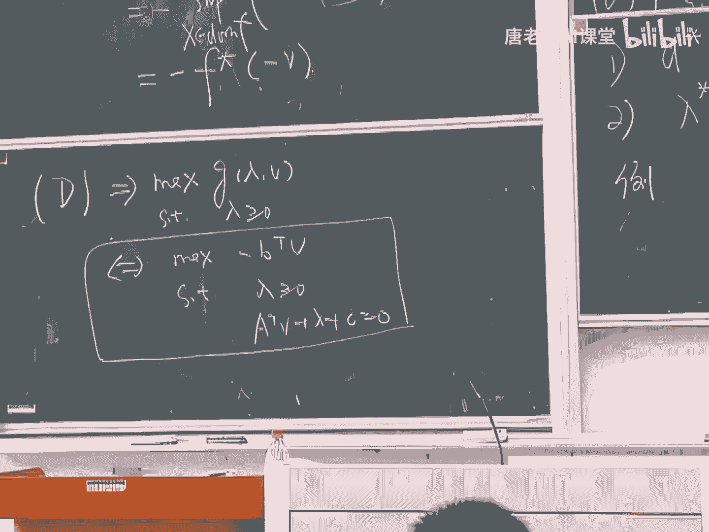

## 构造对偶问题：从函数到优化

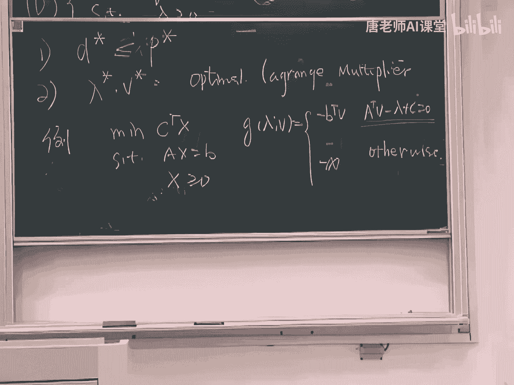

上一节我们介绍了对偶函数，本节中我们来看看如何利用它构造对偶问题，并探讨其重要性质。

我们已知，对于任意 `λ ≥ 0` 和任意 `ν`，对偶函数 `g(λ, ν)` 的值总是原问题最优值 `p*` 的一个下界。那么，最紧（最大）的下界可以通过最大化对偶函数来获得。由此，我们定义**对偶问题**：
```
maximize g(λ, ν)
subject to λ ≥ 0
```
我们记对偶问题的最优值为 `d*`，最优解为 `(λ*, ν*)`，称为**最优Lagrange乘子**。

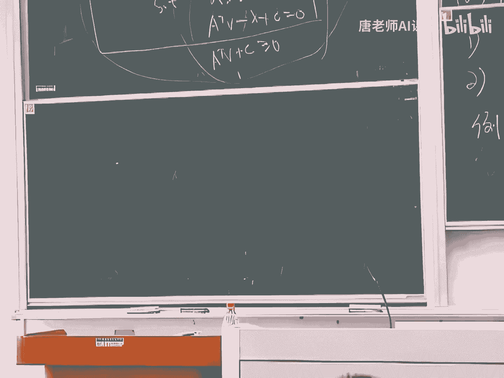

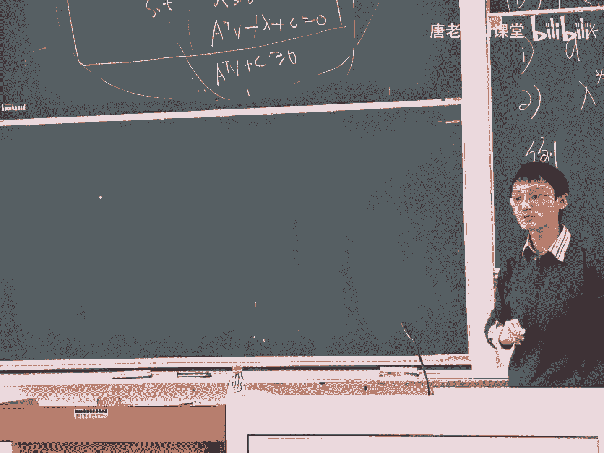

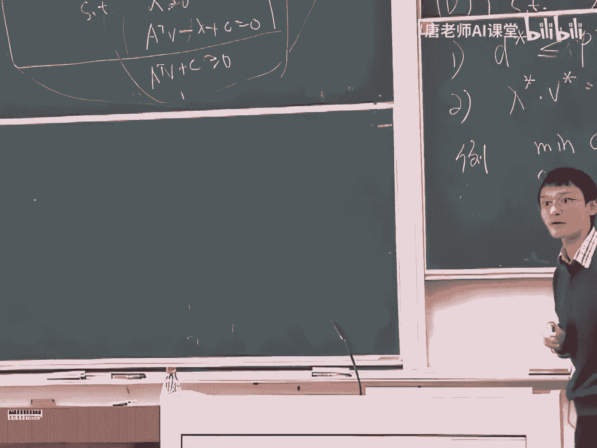

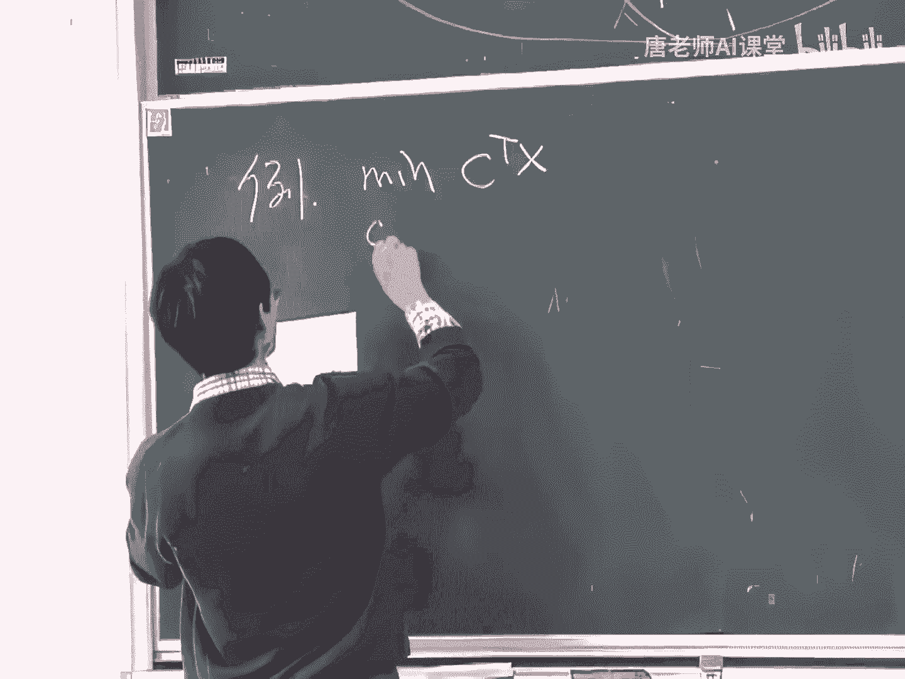

对偶问题有两个至关重要的性质：
1.  **弱对偶性**：无论原问题是否为凸，总有 `d* ≤ p*` 成立。这个不等式提供了原问题最优值的一个下界估计。
2.  **凸性**：对偶问题总是一个凸优化问题。因为我们要最大化一个凹函数 `g(λ, ν)`，且约束条件 `λ ≥ 0` 是凸的（一组线性不等式）。

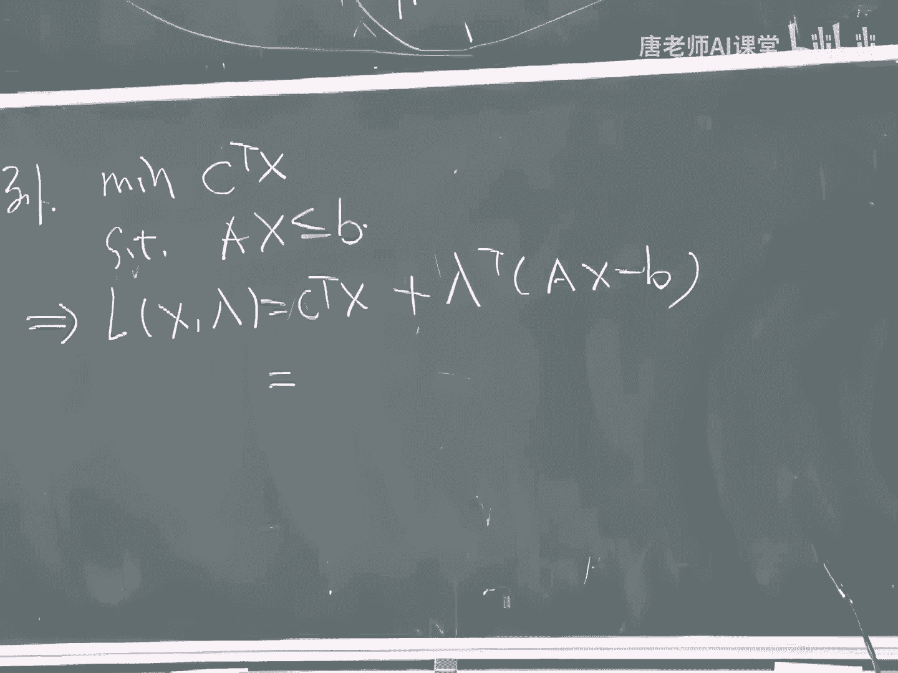


弱对偶性 `d* ≤ p*` 总是成立，但它给出的下界可能不紧（即 `d* < p*`）。一个自然的问题是：在什么条件下，我们可以得到紧的下界，即 `d* = p*`？这被称为**强对偶性**。强对偶性成立的条件（例如Slater条件）是我们下节课要讨论的核心内容。

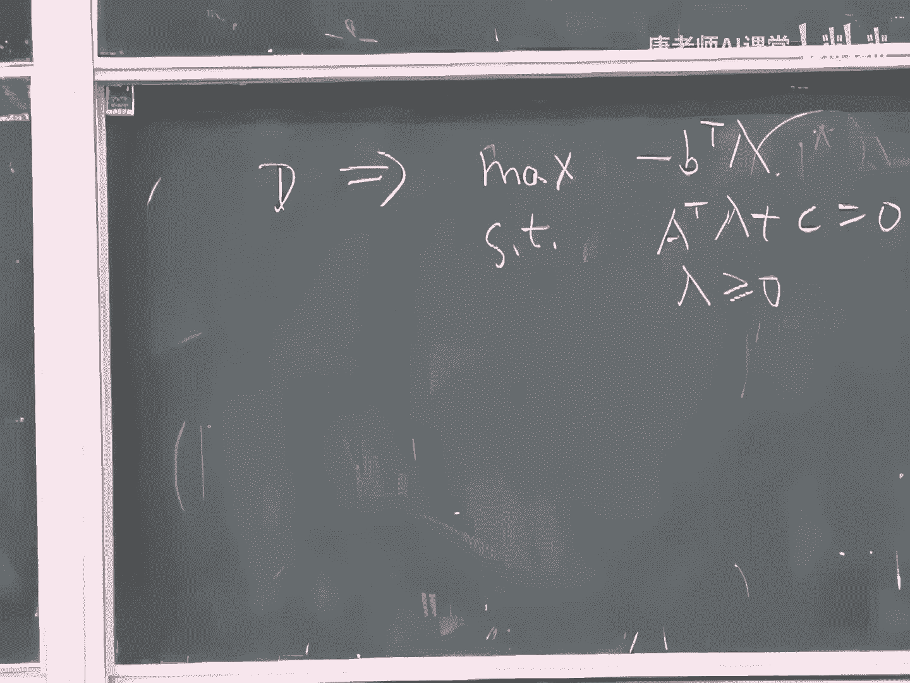

## 实例演练：线性规划的对偶

现在，让我们通过具体的线性规划例子，完整演练从原问题到对偶问题的三步流程：构造Lagrange函数、求对偶函数、形成对偶问题。

**例1：标准形式线性规划**
考虑原问题 `(P1)`：
```
minimize c^T x
subject to Ax = b
           x ≥ 0
```
1.  **构造Lagrange函数**：引入乘子 `ν` (对应 `Ax=b`) 和 `λ` (对应 `x≥0`，注意 `λ ≥ 0`)。
    ```
    L(x, λ, ν) = c^T x + ν^T (Ax - b) - λ^T x
               = -b^T ν + (c + A^T ν - λ)^T x
    ```
2.  **求对偶函数 `g(λ, ν)`**：需要对 `x` 求下确界。这是一个关于 `x` 的线性函数。
    *   如果 `c + A^T ν - λ = 0`，则 `g(λ, ν) = -b^T ν`。
    *   否则，通过令 `x` 沿负梯度方向趋向无穷，可得 `g(λ, ν) = -∞`。
    因此，`g(λ, ν)` 的有效定义域是满足 `c + A^T ν - λ = 0` 的 `(λ, ν)`，此时函数值为 `-b^T ν`。
3.  **形成对偶问题**：最大化对偶函数，并考虑其定义域和 `λ ≥ 0` 的约束。
    ```
    maximize   -b^T ν
    subject to c + A^T ν - λ = 0
               λ ≥ 0
    ```
    由等式约束 `λ = c + A^T ν` 和 `λ ≥ 0`，可消去 `λ`，得到等价的对偶问题 `(D1)`：
    ```
    maximize   -b^T ν
    subject to A^T ν + c ≥ 0
    ```
    这可以写作更常见的形式 `maximize b^T ν`，约束为 `A^T ν ≤ -c`（通过令 `ν‘ = -ν`），但本质相同。

**例2：不等式形式线性规划**
考虑另一个原问题 `(P2)`：
```
minimize c^T x
subject to Ax ≤ b
```
1.  **构造Lagrange函数**：引入乘子 `λ ≥ 0`。
    ```
    L(x, λ) = c^T x + λ^T (Ax - b) = -b^T λ + (c + A^T λ)^T x
    ```
2.  **求对偶函数 `g(λ)`**：
    *   如果 `c + A^T λ = 0`，则 `g(λ) = -b^T λ`。
    *   否则，`g(λ) = -∞`。
3.  **形成对偶问题 `(D2)`**：
    ```
    maximize   -b^T λ
    subject to A^T λ + c = 0
               λ ≥ 0
    ```

观察 `(P1)` 的对偶问题 `(D1)` 和 `(P2)` 的对偶问题 `(D2)`，可以发现一个有趣的现象：`(P1)` 和 `(D2)` 形式对称，`(P2)` 和 `(D1)` 形式也对称。实际上，**一个线性规划问题的对偶问题的对偶，就是原问题本身**。这是线性规划对偶理论中的一个优美性质。

更一般地，对于凸优化问题，在满足一定条件（强对偶性成立）时，也有类似的性质。这引出了我们留下的两个“谜团”：
1.  在什么条件下，强对偶性成立，即 `p* = d*`？
2.  在什么条件下，原问题和对偶问题互为对偶，即“对偶的对偶是自身”？

这两个问题的答案紧密相关，并构成了优化理论中对偶性的核心。我们将在接下来的课程中揭晓答案。

## 总结
本节课中我们一起学习了优化对偶理论的关键步骤。我们证明了Lagrange对偶函数总是凹函数，揭示了其对偶函数与共轭函数之间的内在联系。我们系统地学习了如何从原问题出发，构造其对偶问题，并明确了弱对偶性 `d* ≤ p*` 这一基本不等式始终成立。最后，我们通过线性规划的实例，完整演练了对偶问题的推导过程，并观察到了对偶问题与原问题之间美妙的对称性，为理解强对偶性奠定了坚实的基础。