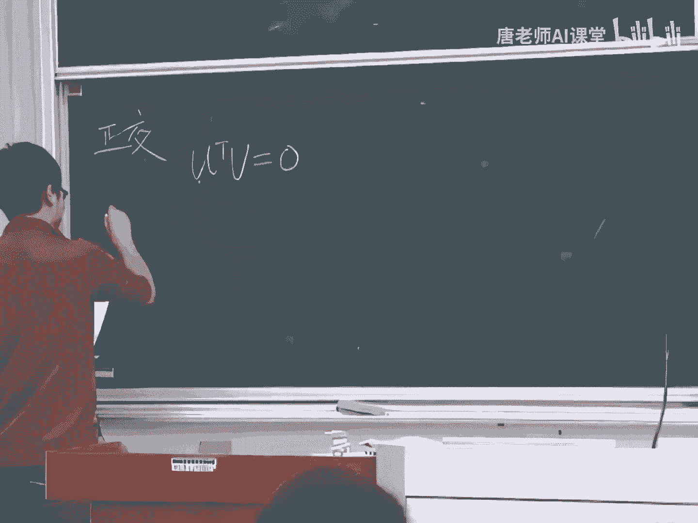
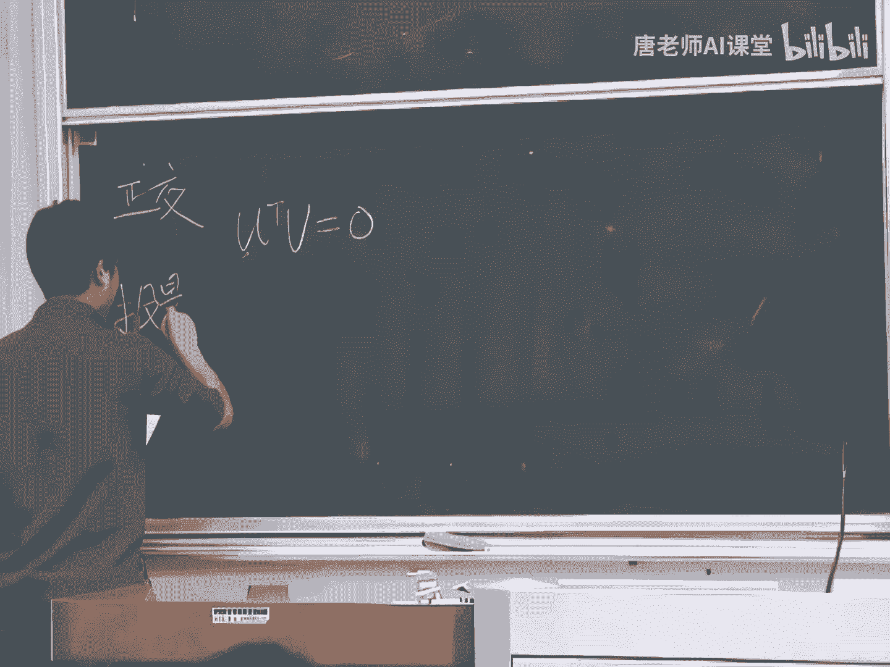
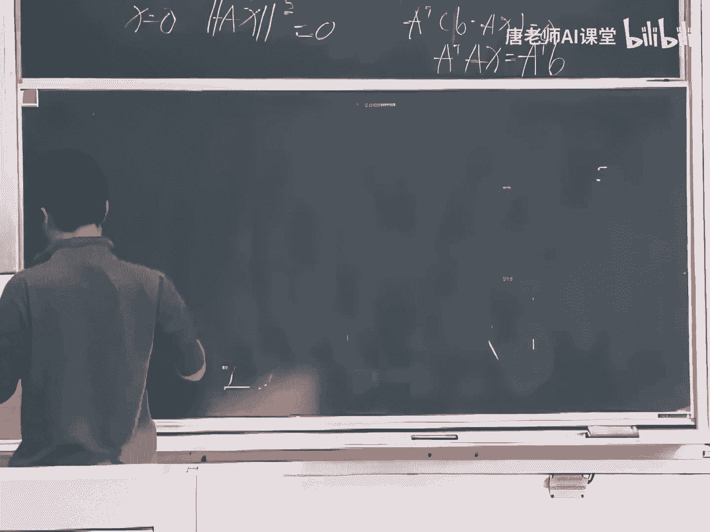
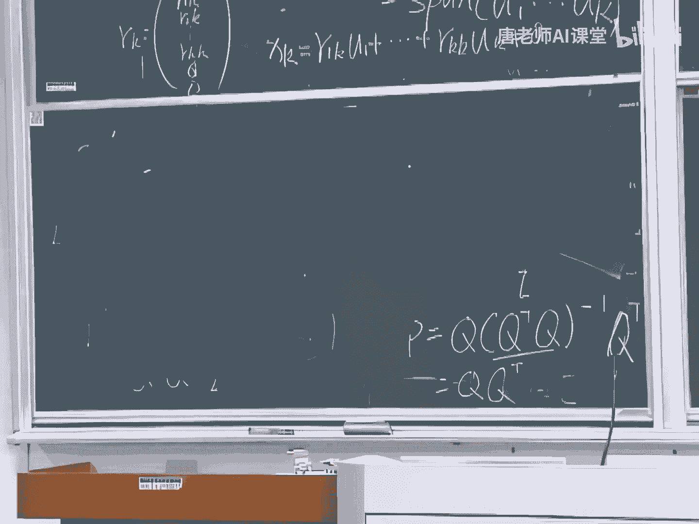
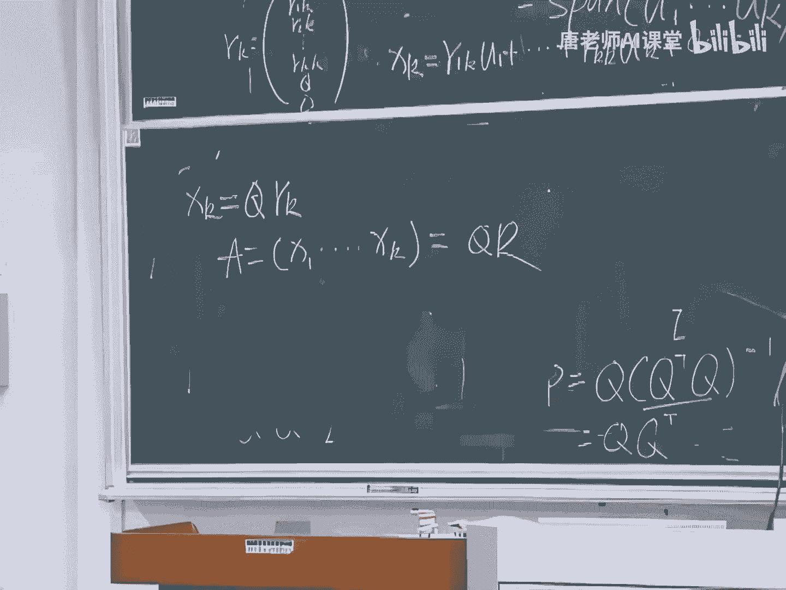
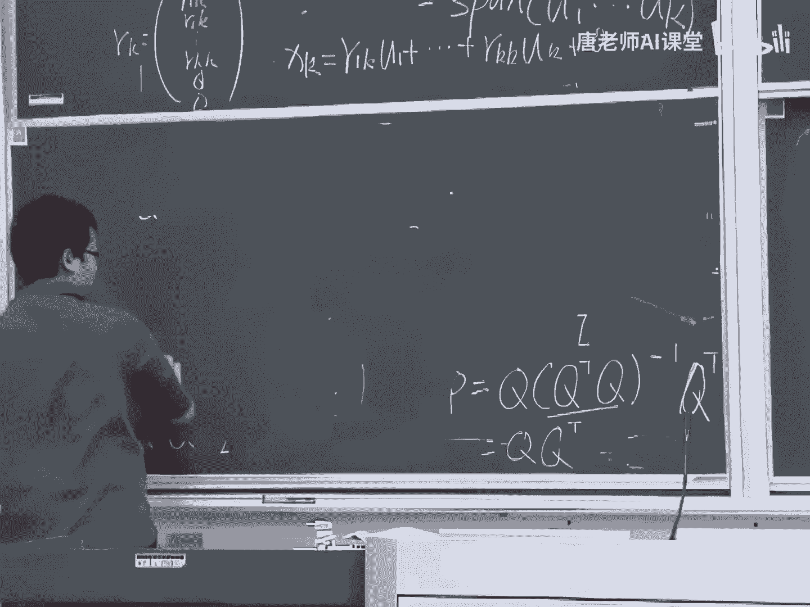
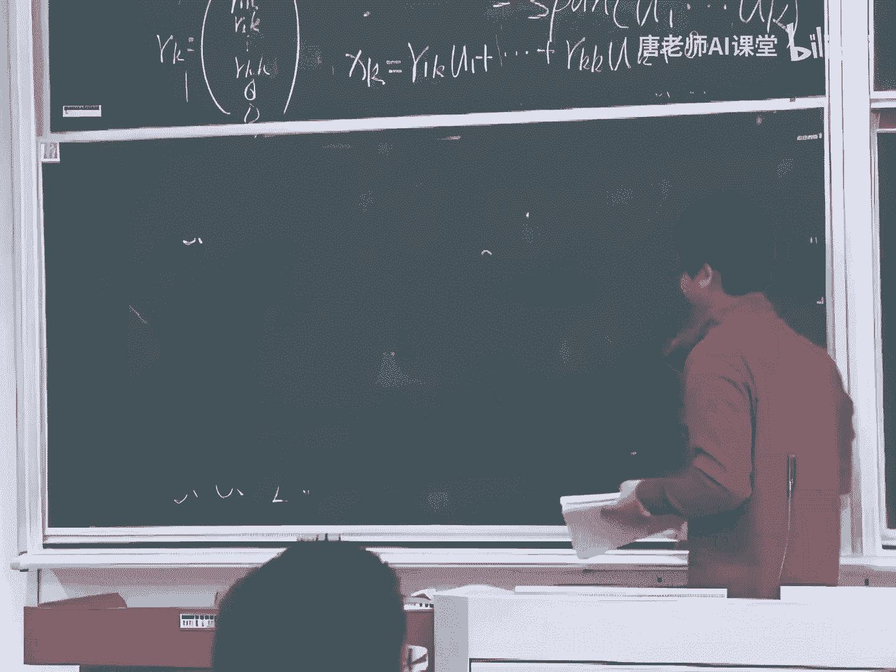
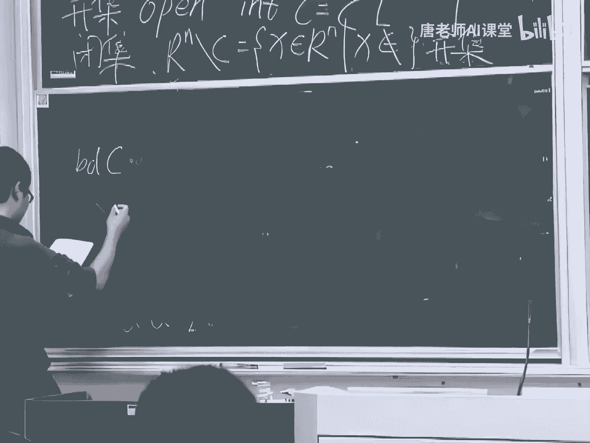
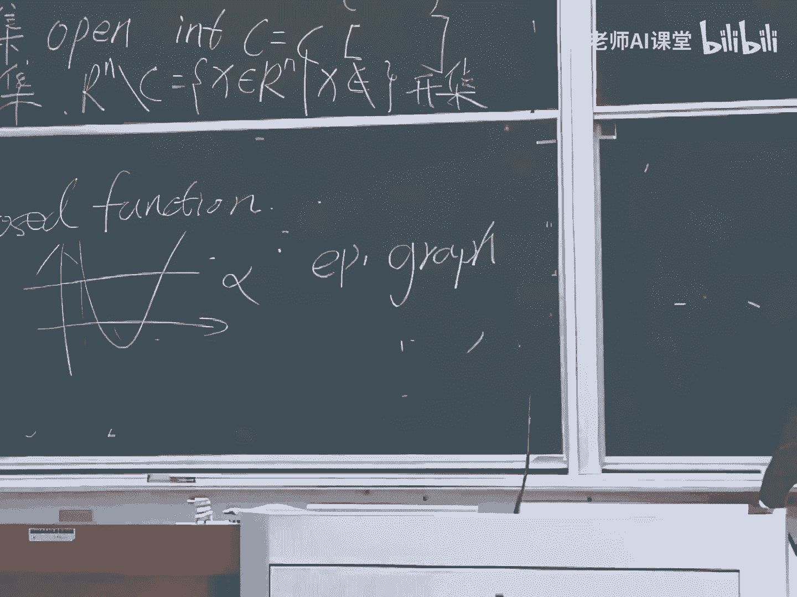

# 量化交易与Python金融分析实战：P90：线性代数与凸优化基础

## 概述
在本节课中，我们将学习线性代数中与凸优化相关的核心概念，包括向量投影、正交化、QR分解以及一些基础的集合与函数分析定义。这些内容是理解后续高级算法（如最小二乘法）的数学基础。

---

## 投影与投影矩阵

上一节我们介绍了线性代数的基本概念，本节中我们来看看向量投影。

### 低维空间中的投影
我们先从低维情况开始理解。假设有两个向量 **A** 和 **B**。向量 **B** 在向量 **A** 上的投影记为 **P**。投影的误差向量 **E** 等于 **B** 减去 **P**，即：
**E = B - P**

可以观察到，向量 **A** 与误差向量 **E** 是正交的。投影 **P** 可以表示为向量 **A** 的方向乘以一个标量系数 **x**：
**P = x * A**

根据正交关系 **A^T * E = 0**，我们可以推导出系数 **x**：
**A^T (B - xA) = 0**
**=> A^T B = x (A^T A)**
**=> x = (A^T A)^{-1} A^T B**

因此，在低维情况下的投影公式为：
**P = A (A^T A)^{-1} A^T B**

### 高维空间中的投影与投影矩阵
现在我们将概念推广到高维空间。假设有一个由线性无关的列向量 **A1, A2, ..., An** 张成的子空间。我们将这些列向量组合成矩阵 **A**。

一个关键定理是：如果矩阵 **A** 的列向量线性无关，那么 **A^T A** 一定是可逆的。
证明思路如下：假设 **A^T A x = 0**，我们在等式两边左乘 **x^T**，得到 **x^T A^T A x = 0**，这等价于 **||A x||^2 = 0**，因此 **A x = 0**。由于 **A** 的列线性无关，所以 **x** 必须为零向量。这就证明了 **A^T A** 可逆。

在高维空间中，向量 **B** 在该子空间上的投影 **P** 可以表示为 **A** 的列向量的线性组合，即 **P = A x**。误差向量 **E = B - A x** 与子空间的所有基向量（即 **A** 的每一列）都正交。

以下是推导投影的关键步骤：
1.  误差向量与每一列正交：**A^T (B - A x) = 0**
2.  展开得到正规方程：**A^T A x = A^T B**
3.  由于 **A^T A** 可逆，解得系数：**x = (A^T A)^{-1} A^T B**
4.  因此，投影向量为：**P = A x = A (A^T A)^{-1} A^T B**

我们定义**投影矩阵** **P_proj** 为：
**P_proj = A (A^T A)^{-1} A^T**

投影矩阵具有两个重要性质：
*   **对称性**：**P_proj^T = P_proj**
*   **幂等性**：**P_proj^2 = P_proj**。这意味着对一个向量投影一次后，再次投影结果不变。

**一个特例**：如果 **A** 是方阵且可逆，其列空间是整个空间，那么任何向量在该空间上的投影就是其本身。此时投影矩阵就是单位矩阵 **I**，这与公式 **P_proj = A (A^T A)^{-1} A^T = I** 是一致的。

### 投影的应用：最小二乘法
投影概念的一个重要应用是解决**超定方程组**（方程数多于未知数，通常无精确解）。例如，方程组 **A x = b** 可能无解。
我们通过将向量 **b** 投影到矩阵 **A** 的列空间上，找到最接近的向量 **P**，从而求解 **x** 使得 **A x** 最接近 **b**。这导出的正是正规方程：
**A^T A x = A^T b**
其解 **x = (A^T A)^{-1} A^T b** 就是**最小二乘解**。

---

## 正交化与QR分解

上一节我们介绍了投影，本节中我们来看看如何构造一组标准正交基，并由此引出重要的矩阵分解。

### 标准正交基
一组向量 **q1, q2, ..., qn** 如果满足以下条件，则称为**标准正交基**：
*   **正交性**：任意两个不同向量内积为零，**q_i^T q_j = 0** (当 i ≠ j)
*   **标准性**：每个向量长度为1，**||q_i|| = 1**，即 **q_i^T q_i = 1**

由标准正交基作为列向量构成的矩阵 **Q** 具有优良性质：**Q^T Q = I**（单位矩阵）。如果 **Q** 还是方阵，则 **Q^{-1} = Q^T**，称为**正交矩阵**。

使用标准正交基可以简化运算。例如，投影矩阵公式简化为：**P_proj = Q Q^T**。

### 施密特正交化程序
如何从一组线性无关的向量 **{x1, x2, ..., xn}** 得到一组标准正交基 **{u1, u2, ..., un}**？这通过**施密特正交化程序**实现。

其核心思想是逐步“剔除”新向量在已有正交方向上的分量。
1.  第一个向量单位化：**u1 = x1 / ||x1||**
2.  对于第 k 个向量 **xk** (k>1)：
    a.  减去它在前面所有正交基向量 **u1, ..., u_{k-1}** 上的投影：
        **p_k = xk - (u1^T xk) u1 - (u2^T xk) u2 - ... - (u_{k-1}^T xk) u_{k-1}**
    b.  将得到的正交向量 **p_k** 单位化：
        **u_k = p_k / ||p_k||**

以下是该过程的公式化描述：
令 **p1 = x1**, **u1 = p1 / ||p1||**
对于 k = 2 到 n：
**p_k = x_k - Σ_{i=1}^{k-1} (u_i^T x_k) u_i**
**u_k = p_k / ||p_k||**

### QR分解
施密特正交化直接导向了矩阵的**QR分解**。对于任意 m×n 矩阵 **A**（假设列满秩），它可以分解为一个正交矩阵 **Q** 和一个上三角矩阵 **R** 的乘积：
**A = Q R**

其中：
*   **Q** 是一个 m×n 矩阵，其列向量是 **A** 的列空间的一组标准正交基（可通过施密特正交化得到）。
*   **R** 是一个 n×n 的可逆上三角矩阵。

**分解的构造思路**：
设通过施密特正交化从 **A** 的列向量 **{a1, ..., an}** 得到标准正交基 **{q1, ..., qn}**。
那么，每个原始列向量 **a_k** 都可以表示为前面所有正交基向量的线性组合：
**a_k = r_{1k} q1 + r_{2k} q2 + ... + r_{kk} q_k** (其中 **r_{ik} = q_i^T a_k**)
将所有列向量的表达式组合起来，就得到了 **A = Q R**。

### QR分解的应用：求解欠定方程组
QR分解可用于求解**欠定方程组**（未知数多于方程数，通常有无穷多解）。考虑方程组 **A x = b**，其中 **A** 是 p×n 矩阵 (p < n) 且行满秩（秩为 p）。

1.  对 **A^T** 进行QR分解：**A^T = [Q1, Q2] * [R; 0]**，其中 **Q1** 是 n×p 矩阵。
2.  原方程的一个特解为：**x_particular = Q1 (R^T)^{-1} b**
3.  方程的通解为特解加上零空间的任意向量。**A** 的零空间由 **Q2** 的列张成，因此通解为：
    **x = x_particular + Q2 * z**，其中 **z** 是任意 (n-p) 维向量。

---

## 凸分析基础概念

在介绍了线性代数工具后，我们简要回顾凸优化所需的一些基本分析概念。

### 集合的相关定义 (A2)
以下是关于集合的几个基本概念：
*   **内点**：对于集合 **C** 中的一点 **x**，如果存在一个以 **x** 为中心、半径大于零的邻域完全包含在 **C** 内，则 **x** 是 **C** 的内点。所有内点的集合称为**内部**，记作 **int C**。
*   **开集**：如果一个集合 **C** 等于它的内部（即 **C = int C**），则 **C** 是开集。直观理解是集合不包含其边界点，如开区间。
*   **闭集**：如果一个集合的补集是开集，则该集合是闭集。直观理解是集合包含其所有边界点，如闭区间。
*   **边界点**：点 **x** 是集合 **C** 的边界点，如果在其任意小的邻域内，既包含 **C** 中的点，也包含不在 **C** 中的点。所有边界点的集合称为**边界**。

### 函数的连续性与闭函数 (A3)
*   **连续性**：函数 **f** 在点 **x** 处连续，如果对于任意小的 **ε > 0**，都存在一个 **δ > 0**，使得当 **||y - x|| ≤ δ** 时，有 **||f(y) - f(x)|| ≤ ε**。直观上，函数值的变化可以控制。
*   **闭函数**：函数 **f** 是闭函数，如果它的**上方图** **epi f = {(x, t) | f(x) ≤ t}** 是一个闭集。等价地，对于任意收敛序列 **x_k -> x**，若 **f(x_k)** 收敛，则必有 **lim f(x_k) ≥ f(x)**。闭函数在优化中很重要，能保证解的存在性。

### 梯度与导数 (A4)
*   **可微与导数**：函数 **f: R^n -> R** 在点 **x** 处可微，如果存在一个线性算子（用矩阵表示）**Df(x)**，使得函数在 **x** 附近有一阶近似：
    **f(z) ≈ f(x) + Df(x) (z - x)**，当 **z** 接近 **x** 时误差可忽略。
*   **梯度**：对于实值函数 **f**，其导数 **Df(x)** 是一个行向量。这个行向量的转置称为**梯度**，记作 **∇f(x)**，它是一个列向量。因此，一阶近似可以写为：
    **f(z) ≈ f(x) + ∇f(x)^T (z - x)**
*   **链式法则**：对于复合函数 **h(x) = f(g(x))**，其中 **g: R^n -> R^m**, **f: R^m -> R**，若 **g** 在 **x** 可微，**f** 在 **g(x)** 可微，则 **h** 在 **x** 可微，且其导数为：
    **Dh(x) = Df(g(x)) * Dg(x)**
    对应地，梯度为：**∇h(x) = Dg(x)^T ∇f(g(x))**

---

## 总结
本节课我们一起学习了线性代数和凸优化的核心基础：
1.  **投影**：理解了向量到子空间的投影计算，推导了投影矩阵 **P = A (A^T A)^{-1} A^T** 及其性质，并看到了其在最小二乘法中的应用。
2.  **正交化**：掌握了通过施密特正交化程序构造标准正交基的方法。
3.  **QR分解**：学习了将矩阵分解为正交矩阵和上三角矩阵的方法（**A = Q R**），并了解了其在求解欠定方程组中的应用。
4.  **基础概念**：回顾了集合（内点、开集、闭集、边界）、函数的连续性与闭函数，以及多元函数的梯度与链式法则。

这些概念是理解后续凸优化理论和算法（如梯度下降、KKT条件等）不可或缺的数学工具。