# Python金融分析+量化交易：P41：Alphalens工具包介绍 📊

在本节课中，我们将要学习一个在量化金融分析中非常强大的工具——Alphalens。它是一个专门用于因子分析和绩效评估的Python库，能够极大地简化我们的计算和可视化工作。

## 概述

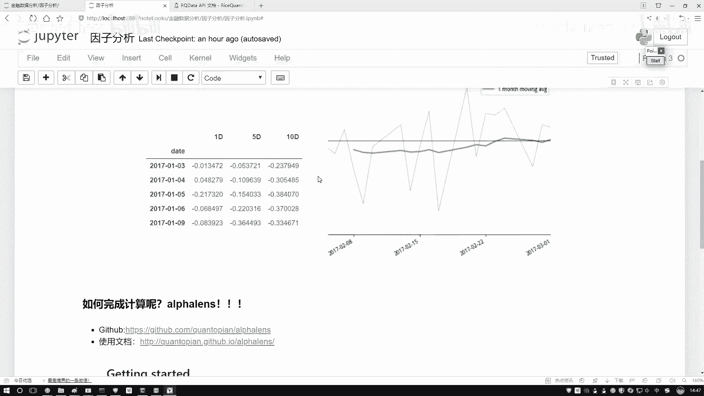

之前我们介绍了因子分析的基本概念和流程。本节中，我们来看看如何利用现成的工具包来高效地完成这些任务，而无需从零开始编写复杂的代码。

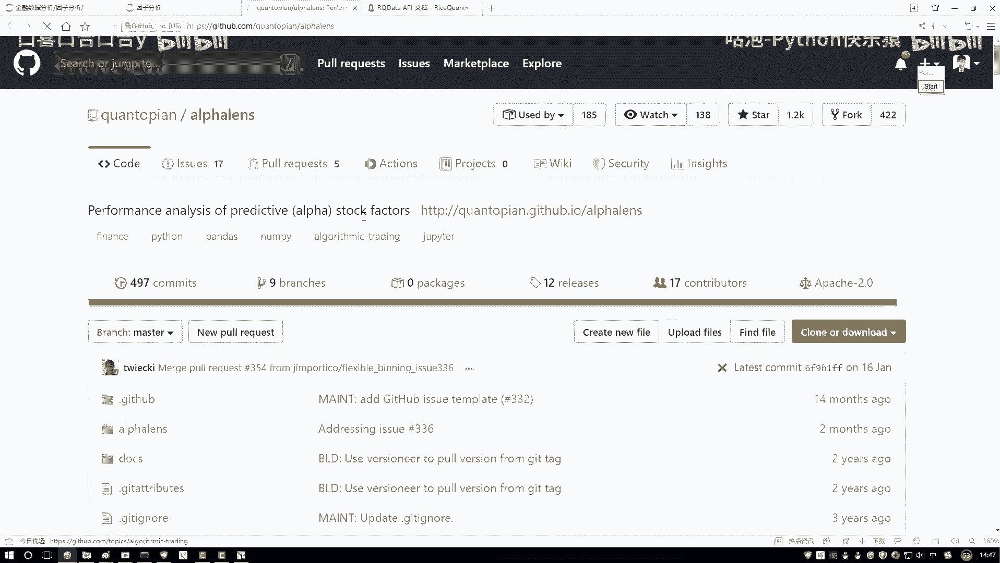

## Alphalens工具包简介

Alphalens是一个由Quantopian开发的开源工具包，专门用于分析股票因子的预测能力。它能够帮助我们计算一系列关键指标（如信息系数IC值），并自动生成专业的分析图表。

接下来，我们将从获取、安装到基本使用来了解这个工具。

### 获取与安装

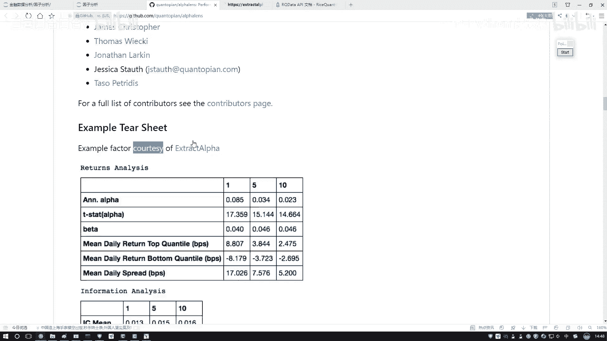

以下是安装Alphalens的步骤。请注意，我们后续的演示将在在线量化平台中进行，该平台已预装此工具。如果您想在本地环境使用，可以参照以下方法安装。

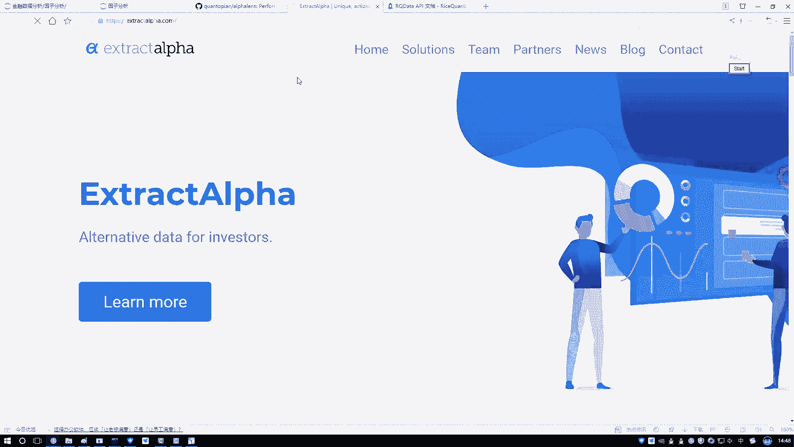

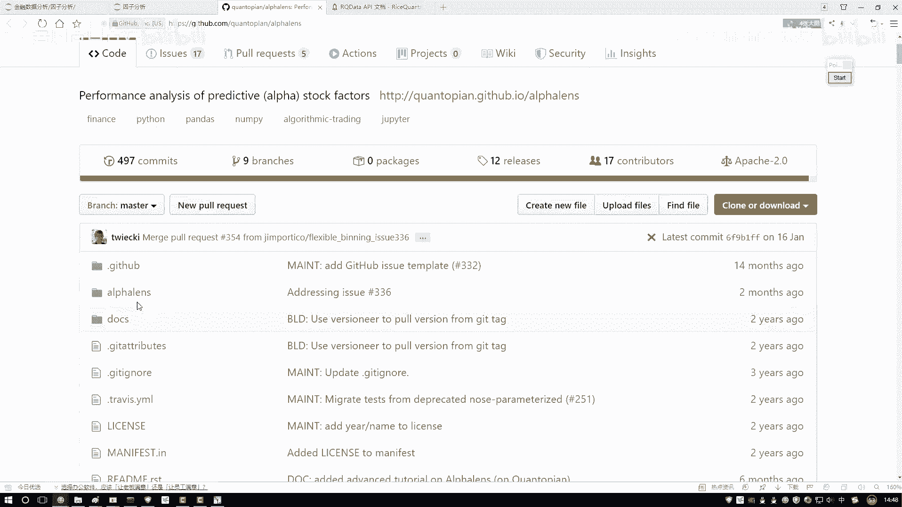

1.  **访问官方资源**：
    *   GitHub仓库：用于查看源代码和基础安装说明。
    *   官方使用文档：提供了详细的API说明和教程。

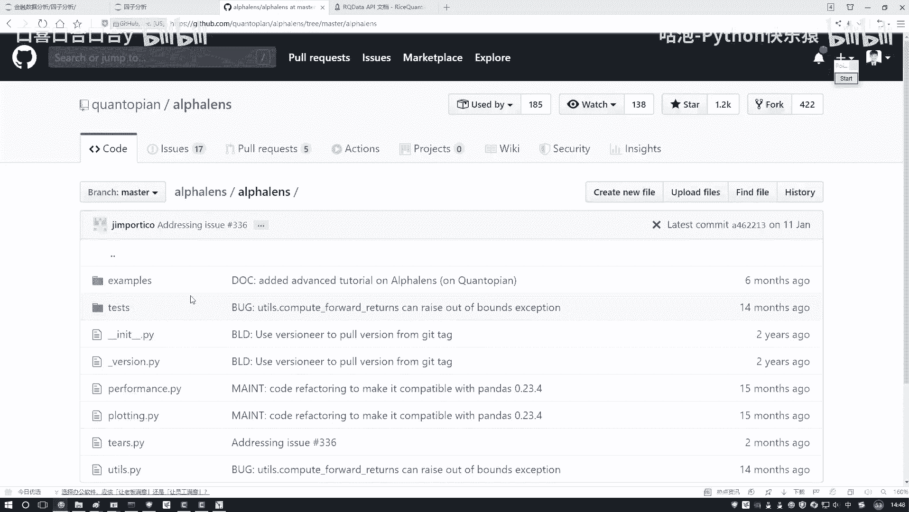

2.  **执行安装命令**：
    在命令行或终端中，使用pip包管理器进行安装，命令非常简单：
    ```bash
    pip install alphalens
    ```

### 学习资源与示例

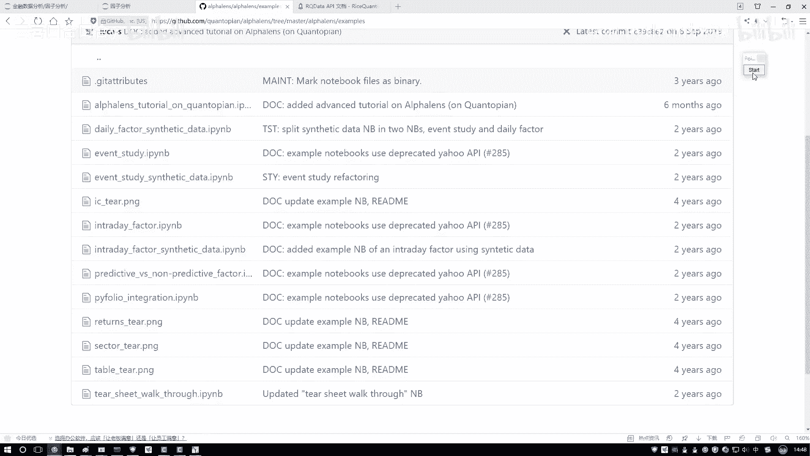

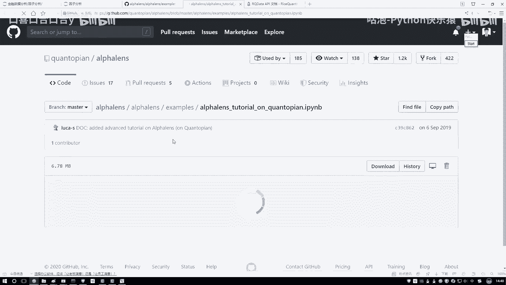

掌握一个新工具的最佳途径是查阅其官方文档和示例代码。Alphalens提供了丰富的学习材料。

*   **官方示例（Examples）**：在GitHub仓库中，您可以找到许多`.ipynb`格式的示例笔记本。这些示例逐步展示了工具的核心功能，是入门的最佳实践指南。
*   **API文档**：当您需要了解某个具体函数（如`get_clean_factor_and_forward_returns`）的详细参数和用法时，应查阅API文档。

我们课程中的案例和讲解，正是基于对这些官方示例的梳理和总结，旨在帮助您快速掌握最核心的应用。

## 在线研究环境介绍

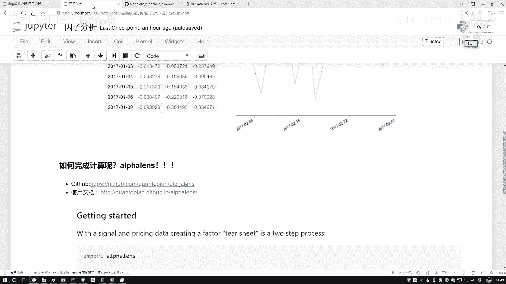

由于直接在本地的Notebook中获取和处理金融数据较为麻烦，我们将在一个在线的量化研究平台中编写和运行代码。这个平台提供了所需的数据和预装的环境。

上一节我们介绍了Alphalens工具本身，本节中我们来看看在哪里使用它。

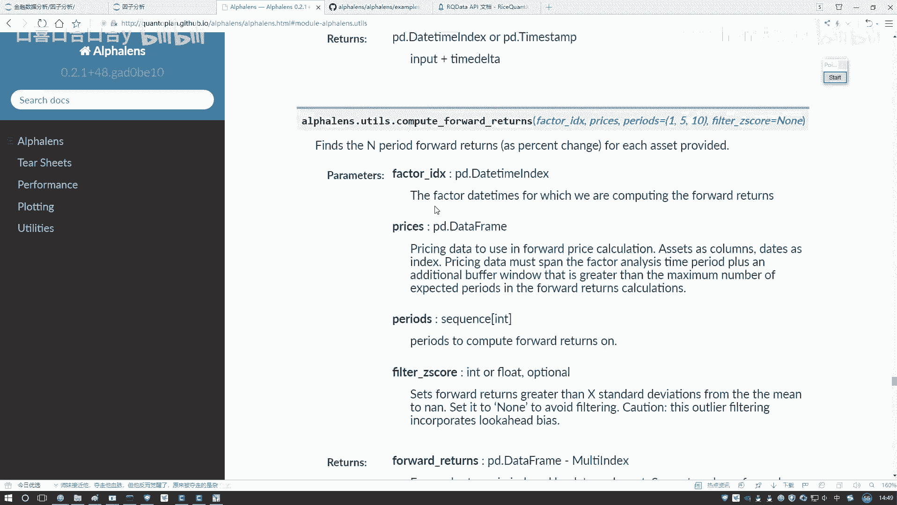

### 进入研究平台

在量化交易平台中，除了创建策略进行回测，通常还提供一个名为“投资研究”或“研究环境”的功能模块。这本质上是一个在平台服务器上运行的Jupyter Notebook环境。

1.  在平台界面找到并点击“投资研究”选项。
2.  系统会打开一个类似于Jupyter Notebook的界面。
3.  在此环境中，您可以新建一个Python3笔记本，并将其重命名为“因子分析”或其他描述性名称。

### 平台环境的优势

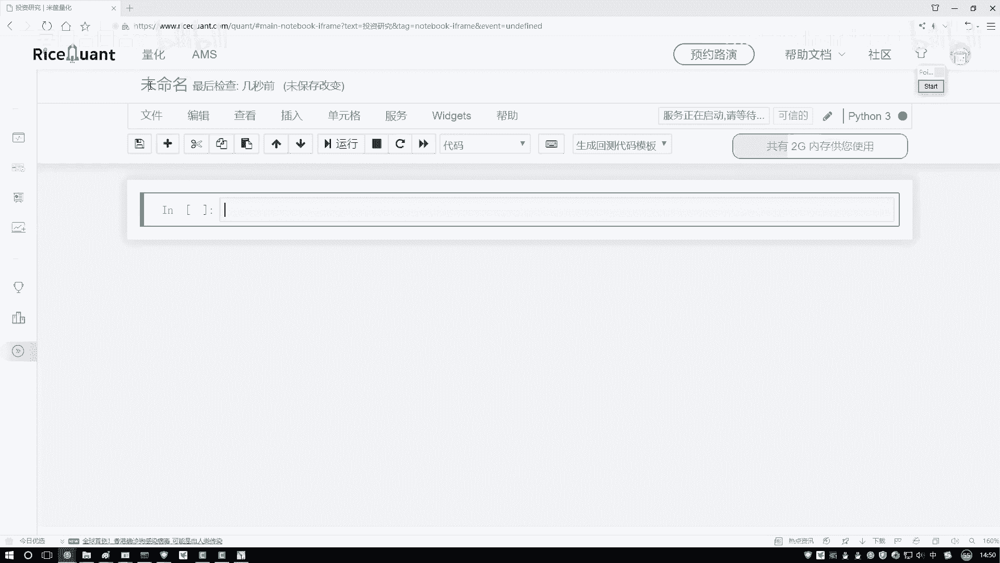

在这个环境中写代码有两大好处：
*   **数据可得性**：平台服务器直接连接金融数据库，可以便捷地获取到清洗后的股票价格、财务数据等，省去了本地数据收集的麻烦。
*   **环境一致性**：所需的Python库（如Alphalens、pandas、numpy）均已预装，避免了复杂的本地环境配置问题。

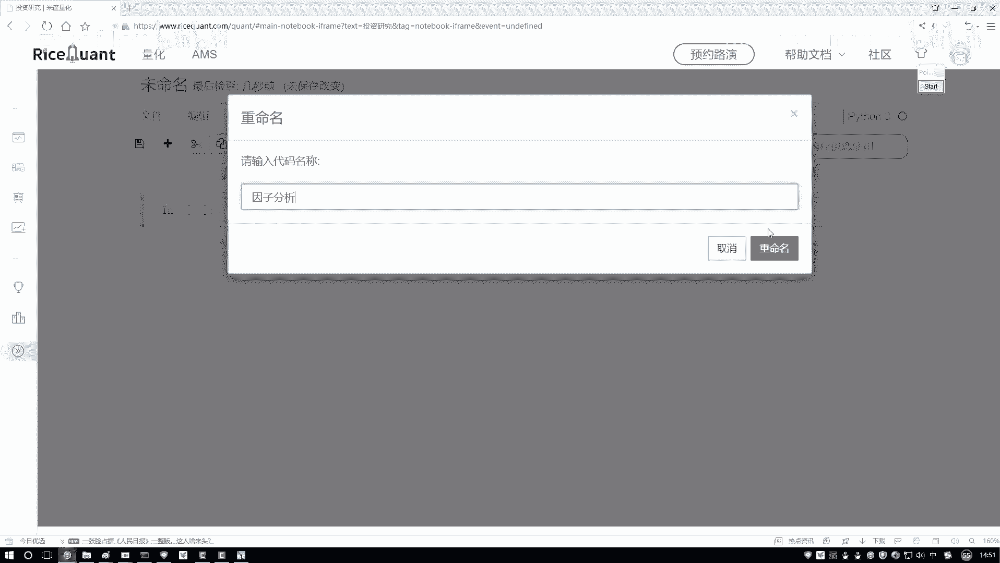

后续我们的所有演示代码都将在这样的研究环境中运行。我会将完整的代码提供给大家，您可以上传到自己的平台账户中，或者跟随视频一步步操作。

## 总结

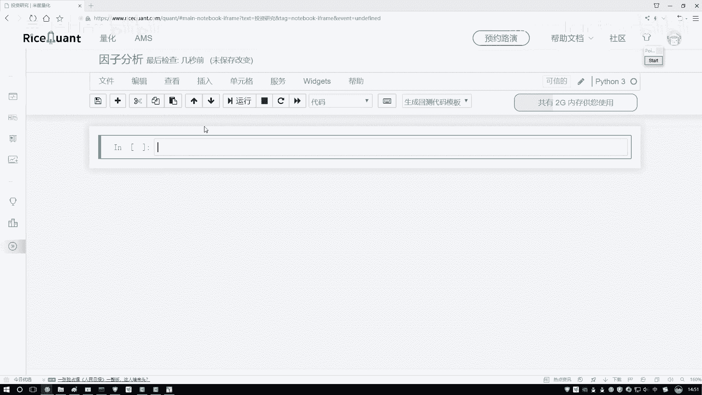

本节课中我们一起学习了量化因子分析的重要工具Alphalens。我们了解了它的用途、安装方法以及最佳的学习路径——官方示例和文档。同时，我们介绍了在线量化研究平台作为代码编写和数据分析的实践环境，它解决了数据获取和环境配置的难题。接下来，我们就可以在这个环境中，利用Alphalens工具包开始实际的因子分析工作了。