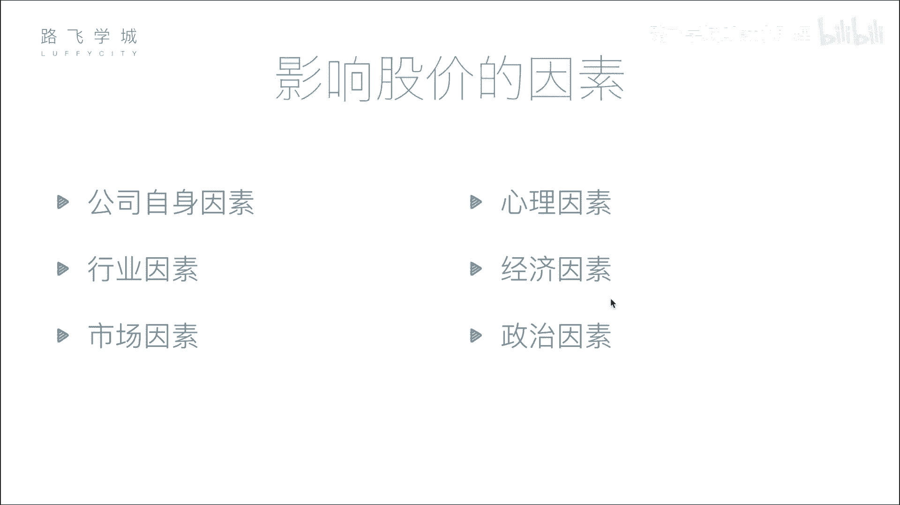
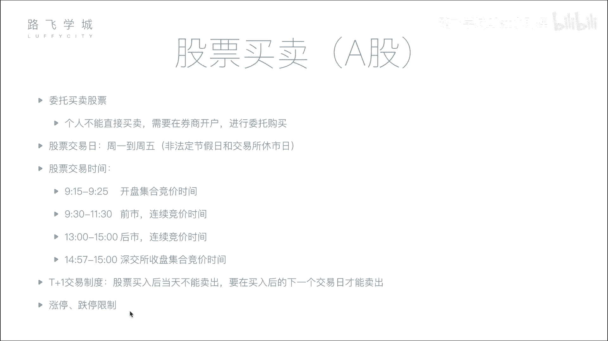

# Python金融量化分析：P5：04 影响股价因素与股票买卖知识 📈

在本节课中，我们将学习影响股票价格的主要因素，并了解股票买卖的基本流程与规则。理解这些基础知识是进行金融量化分析的第一步。

## 影响股价的六大因素

上一节我们介绍了股票的基本概念，本节中我们来看看哪些因素会影响股票价格的波动。影响股价的因素可以归纳为以下六点。

以下是影响股价的六大核心因素：

1.  **公司自身因素**
    这是影响股价最根本的因素。公司的经营状况、盈利能力、发展前景等基本面直接决定了其长期价值。如果公司发展良好，市值增长，股价通常会上涨；反之，若出现重大负面事件或经营不善，股价则会下跌。

2.  **市场因素**
    这是影响股价最直接的因素。股价的短期波动由市场的供求关系决定。其核心逻辑是：
    *   **买盘 > 卖盘**：供不应求，股价上涨。
    *   **卖盘 > 买盘**：供过于求，股价下跌。

3.  **行业因素**
    公司所属行业的整体景气度会影响行业内所有公司的股价。例如，当人工智能行业成为热点时，相关公司的股票可能普遍上涨；若某个行业前景黯淡，其股票则可能集体下跌。

4.  **心理因素**
    投资者的情绪和非理性行为会加剧市场波动。例如“从众心理”，当看到大量抛售时，其他投资者可能因恐慌而跟随卖出，导致股价非理性下跌。历史上因交易错误或恐慌情绪引发的“闪崩”事件即属此类。

5.  **经济因素**
    国家层面的宏观经济政策和指标会对股市产生广泛影响。例如：
    *   **利率上升**：可能导致银行存款吸引力增加，市场流动资金减少，进而可能引起股价下跌。
    *   **货币政策、外汇汇率**等变化也会影响市场资金面和投资者信心。

6.  **政治因素**
    国际关系、地区局势、政府政策等政治事件会显著影响市场稳定性。例如，地缘政治紧张局势可能引发投资者避险情绪，导致股市下跌；而相关领域的股票（如军工股）则可能因事件驱动上涨。

## 股票买卖流程与规则

了解了影响价格的因素后，我们再来看看股票是如何进行买卖的。这个过程遵循特定的规则和时间安排。

以下是股票买卖的关键步骤与规则：

1.  **开户与委托**
    个人投资者不能直接进入交易所交易，必须通过证券公司（券商）开户。交易时，投资者向券商服务器提交买卖指令，这个过程称为“委托”。

2.  **股票交易日**
    交易所并非全天候营业。交易日通常为**周一到周五**（非法定节假日）。在节假日，交易所同样休市。

3.  **交易时间与竞价机制**
    在每个交易日内，交易也非24小时连续进行，并且采用不同的竞价机制。
    *   **开盘集合竞价 (09:15 - 09:25)**：此期间接受委托，但不立即成交。交易所会收集这10分钟内所有的买卖申报，在**09:25**一次性集中撮合，以产生当日的**开盘价**。其核心原则是**使成交量最大化**。
    *   **连续竞价 (09:30 - 11:30, 13:00 - 14:57)**：这是主要的交易时段。交易所按照“价格优先、时间优先”的原则，对买卖申报进行**逐笔连续撮合**，投资者可即时成交。
    *   **收盘集合竞价 (仅深圳交易所，14:57 - 15:00)**：最后3分钟再次进入集合竞价，以产生**收盘价**。上海交易所的收盘价为当日最后一笔交易的成交价。

4.  **交易制度**
    *   **T+1制度**：当日买入的股票，需到下一个交易日才能卖出。
    *   **涨跌停板限制**：为防止股价过度波动，A股市场设有每日涨跌幅限制（通常为±10%），股价达到限价时将暂停交易。

## 总结

本节课中我们一起学习了影响股票价格的六大因素（公司自身、市场、行业、心理、经济、政治），并详细了解了股票买卖的基本流程，包括开户委托、交易时间以及集合竞价与连续竞价的核心机制。掌握这些基础概念是后续进行量化分析和策略开发的基石。