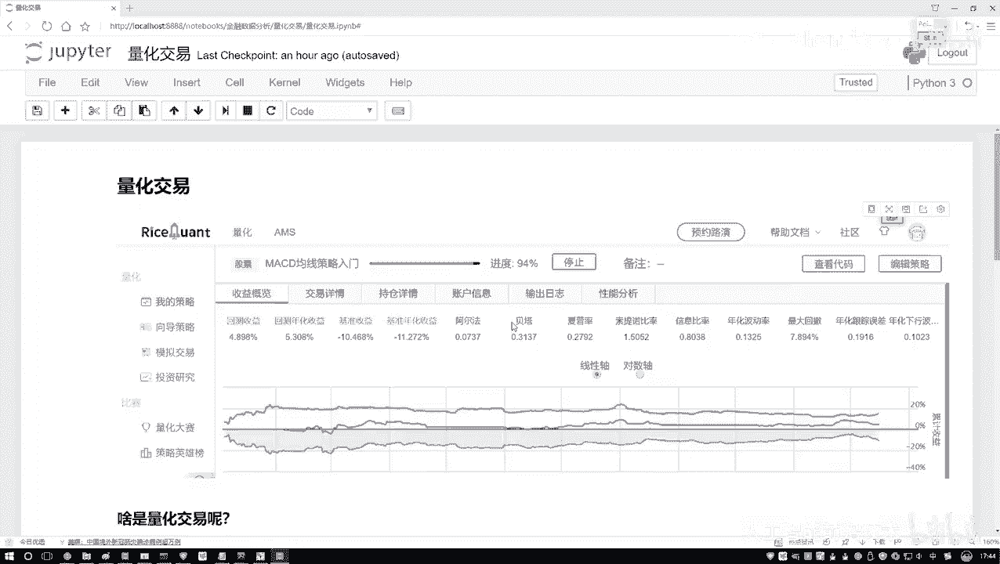
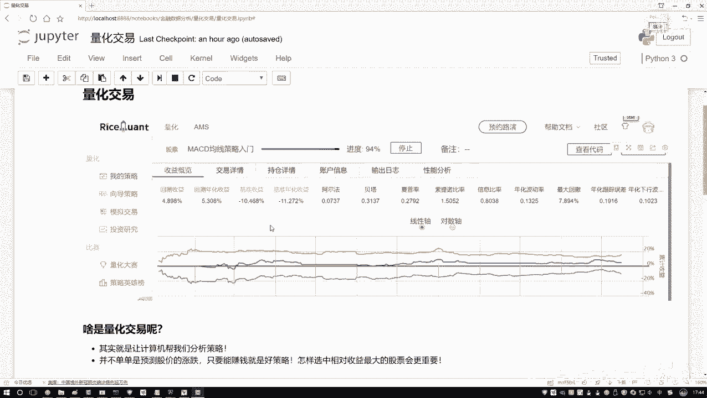
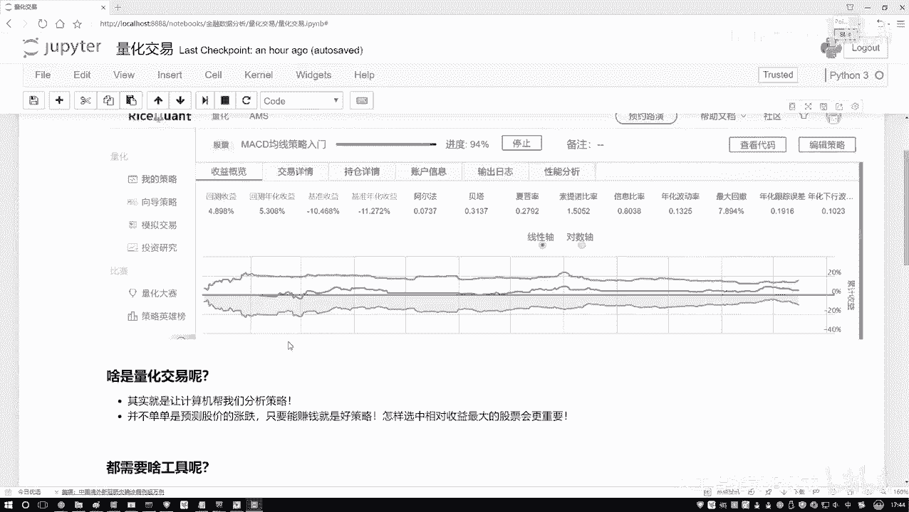
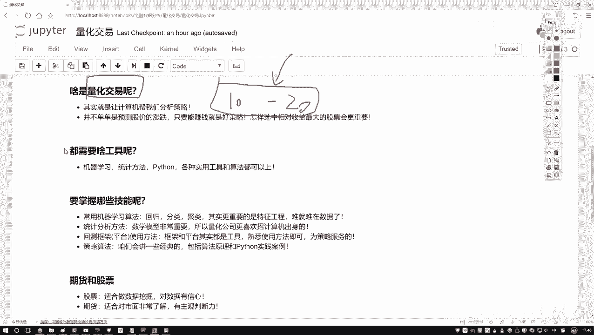
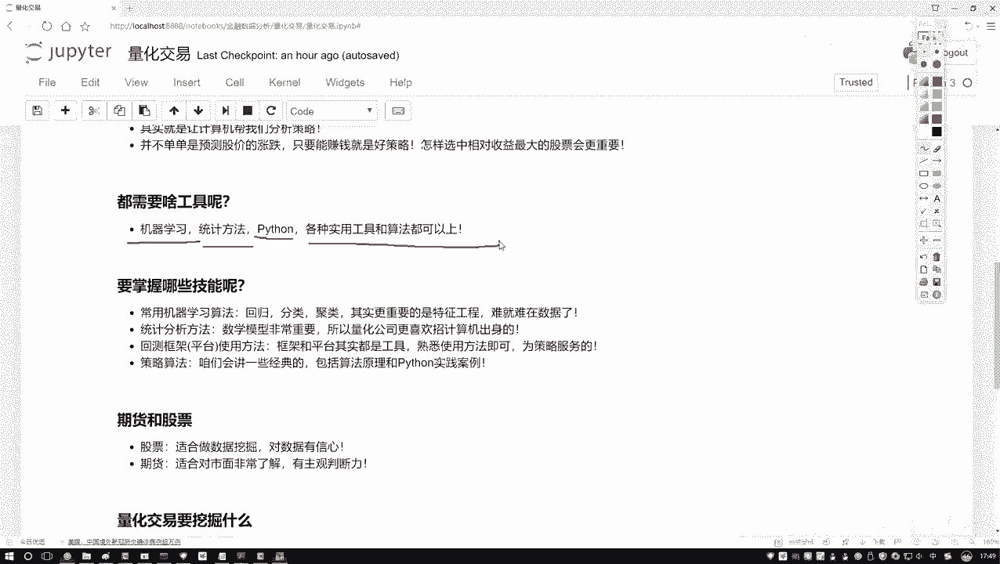

# Python金融量化+股票交易：P21：量化交易概述



在本节课中，我们将要学习量化交易的核心概念，了解它究竟解决了什么问题，以及入门量化交易需要掌握哪些核心技能。



## 什么是量化交易？



上一节我们介绍了课程主题，本节中我们来看看量化交易的本质。量化交易的目标与传统人工交易一致，即通过买卖股票等金融产品来获取收益。然而，其实现方式截然不同。

传统的人工交易依赖交易员个人的经验、直觉和实时盯盘来分析市场、做出决策。这种方式存在几个明显的局限性：
1.  **主观性**：人的情绪和主观判断可能导致决策失误。
2.  **效率有限**：个人精力有限，难以同时分析大量股票或跨越长时间维度的历史数据。
3.  **计算力不足**：面对海量数据时，人脑难以进行复杂的多维度计算和分析。

量化交易则将这些任务交给计算机。其核心思想是：**基于历史数据，通过数学模型、统计分析和计算机算法来发现盈利规律，并自动执行交易策略**。

这个过程通常被称为 **回测**。其核心流程可以概括为以下公式：
`策略收益 = 策略模型(历史数据)`
即，我们设计一个策略模型，将其应用于已知的历史数据上，检验该策略在过去是否能产生盈利，从而评估和改进策略。

简而言之，量化交易是数据挖掘在金融领域的具体应用，旨在从历史数据中挖掘出能够带来超额收益的交易信号或模式。

## 量化交易需要哪些核心技能？

理解了量化交易的目标后，我们来看看实现它需要哪些核心技能。量化交易是一个典型的交叉学科领域，但核心重心在于数据处理和算法实现。

以下是入门量化交易需要关注的几个关键技能领域：

*   **编程能力 (Python)**：这是将想法付诸实践的必备工具。Python因其丰富的数据分析和机器学习库（如Pandas, NumPy, Scikit-learn）而成为量化交易的首选语言。你需要用它来获取数据、清洗数据、实现策略和进行回测。
    ```python
    # 示例：使用pandas获取和处理股票数据
    import pandas as pd
    # 假设`data`是一个包含股价历史的DataFrame
    data['MA_10'] = data['Close'].rolling(window=10).mean()  # 计算10日均线
    ```



*   **数据分析与统计学**：这是理解市场、构建指标的基础。你需要掌握基本的统计概念（如均值、标准差、相关性），并能进行时间序列分析，从数据中提取有意义的特征。

*   **机器学习/人工智能算法**：这是构建高级预测模型的核心。算法可以帮助你发现数据中的复杂非线性关系，预测价格走势。常见的算法包括线性回归、决策树、支持向量机(SVM)等。
    `预测价格 = 机器学习模型(市场特征数据)`

*   **金融知识**：这部分需要了解，但并非初学者的首要重点。你需要知道基本的市场术语（如K线、成交量、市盈率）、交易规则和常见的金融指标（如MACD, RSI）。目标是能理解市场数据和他人策略的逻辑，而不必深究复杂的金融理论。

**总结来说**，量化交易更像一个以**数据驱动**和**算法实现**为核心的工程问题。金融知识提供了问题和背景，而计算机技能（编程、数据处理、算法）则是解决问题的工具。你的首要任务是学会如何使用这些工具，从数据中寻找盈利的可能性。



在本节课中，我们一起学习了量化交易的基本概念，它通过计算机和数据分析替代主观人为判断，旨在从历史数据中挖掘盈利策略。同时，我们也明确了入门所需的核心技能组合，即**以Python编程、数据分析和机器学习算法为主，以基础金融知识为辅**。从下一节开始，我们将逐步学习这些工具的具体应用。