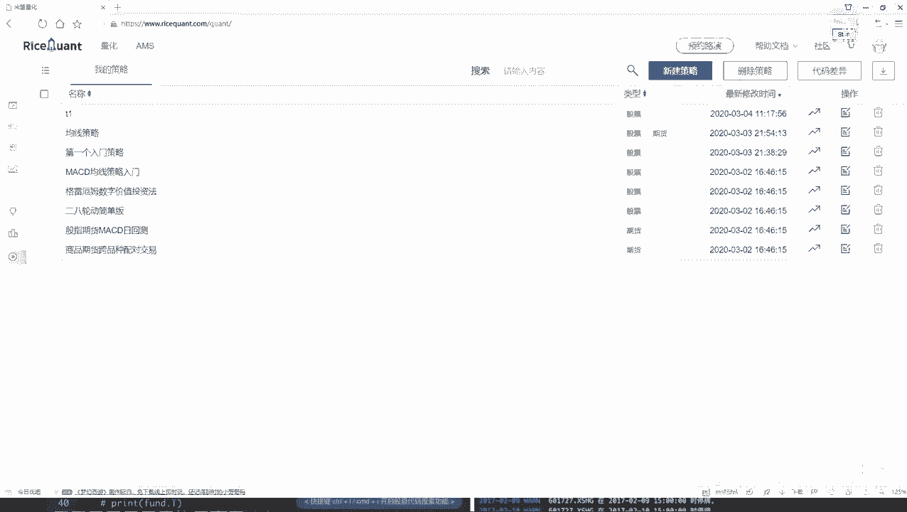
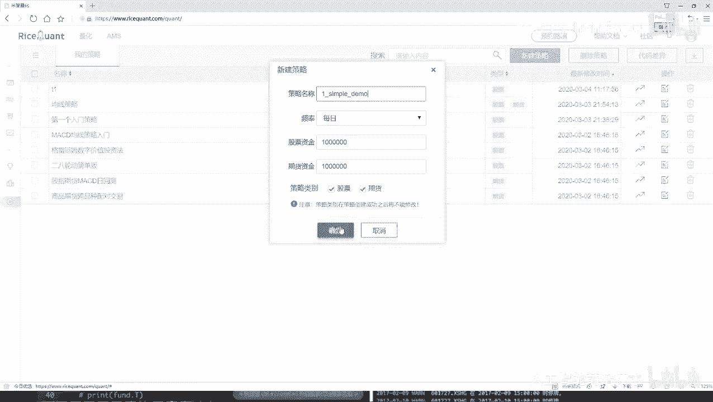
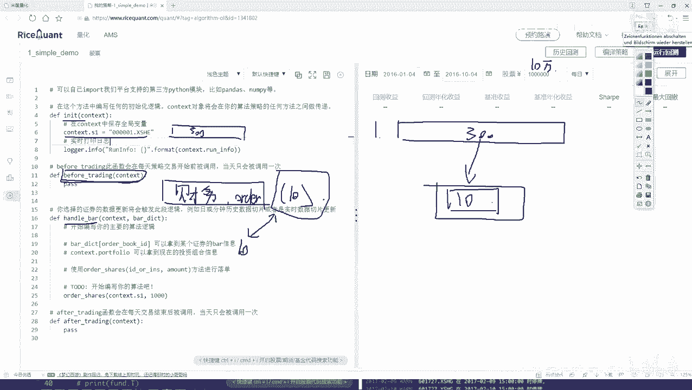
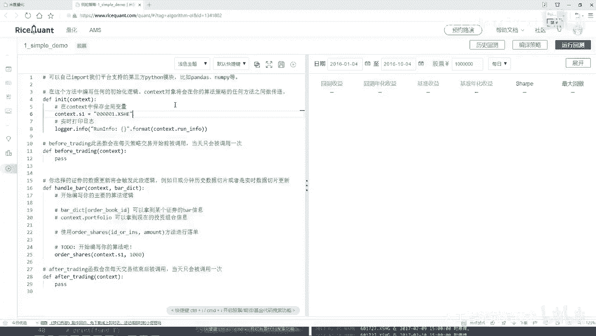

# Python金融量化与股票交易：P24：策略任务分析 📊



在本节课中，我们将学习如何在一个交易平台上构建一个简单的量化交易策略。我们将通过一个具体的任务——从沪深300指数中动态选择并持有表现最佳的十只股票——来熟悉平台的基本API和工作流程。整个过程将分为初始化、盘前数据准备和盘中交易处理三个主要步骤。



## 策略目标概述 🎯

我们的目标是设计一个策略，始终持有沪深300指数成分股中，根据特定财务指标（例如盈利数据）排名前十的股票。这意味着我们的股票持仓会随着公司财务数据的变化而动态调整。

## 策略实现步骤详解 🔧

上一节我们概述了策略的整体目标，本节中我们来看看具体的实现步骤。我们将按照交易平台提供的标准模块结构来组织代码。

### 第一步：初始化策略

在策略的初始化函数中，我们需要完成一些一次性的设置工作。

以下是初始化阶段需要完成的任务：
*   获取沪深300指数的全部成分股，作为我们的初始股票池。
*   进行其他必要的全局变量初始化。

```python
def initialize(context):
    # 获取沪深300指数成分股
    g.stock_pool = get_index_stocks('000300.XSHG')
    # 可以在此处初始化其他全局变量，例如 g.best_stocks = []
```

### 第二步：盘前数据处理

在每天交易开始前（`before_trading`函数），我们需要为当天的交易决策准备数据。这部分工作不涉及实际下单。

以下是盘前数据处理阶段需要完成的任务：
*   从股票池（沪深300成分股）中，查询所有股票的最新财务数据（例如盈利）。
*   根据选定的财务指标（如盈利额）对股票进行排序。
*   选出排名前十的股票，并将其代码存储起来，供交易函数使用。

```python
def before_trading(context):
    # 查询股票池中所有股票的盈利数据（示例，具体API可能不同）
    fundamentals = get_fundamentals(query(valuation.code, valuation.net_profit).filter(valuation.code.in_(g.stock_pool)))
    # 按盈利数据降序排序
    sorted_stocks = fundamentals.sort_values(by='net_profit', ascending=False)
    # 选取前十只股票
    g.today_best_stocks = sorted_stocks['code'].iloc[:10].tolist()
```

### 第三步：盘中交易逻辑

在盘中（`handle_bar`函数），我们将执行实际的交易逻辑。这里需要比较当前持仓与盘前计算出的最佳股票列表，并进行调仓。

以下是盘中交易阶段需要完成的任务：
*   检查当前账户的持仓情况。
*   对比当前持仓与今日最佳股票列表（`g.today_best_stocks`）。
*   卖出那些不在今日最佳列表中的持仓股票。
*   用剩余资金买入今日最佳列表中尚未持有的股票。

```python
def handle_bar(context, bar_dict):
    current_positions = list(context.portfolio.positions.keys())
    # 卖出逻辑：卖出当前持有但不在今日最佳列表中的股票
    for stock in current_positions:
        if stock not in g.today_best_stocks:
            order_target_value(stock, 0) # 卖出该股票全部持仓
    # 买入逻辑：等权重买入今日最佳列表中的股票
    cash_per_stock = context.portfolio.cash / len(g.today_best_stocks)
    for stock in g.today_best_stocks:
        order_target_value(stock, cash_per_stock) # 买入目标金额的股票
```

## 总结 📝





本节课中我们一起学习了如何为一个简单的量化交易策略进行任务分析。我们将“持续持有沪深300中财务表现最佳的十只股票”这一目标，分解为三个清晰的步骤：**初始化股票池**、**盘前筛选股票**以及**盘中执行调仓**。通过这个例子，我们熟悉了策略的基本框架和数据处理流程。虽然这只是一个基础示例，但它涵盖了策略开发的核心思想：定义规则、获取数据、做出决策并执行交易。