# Python金融量化与股票交易：P34：因子中性化与策略构建

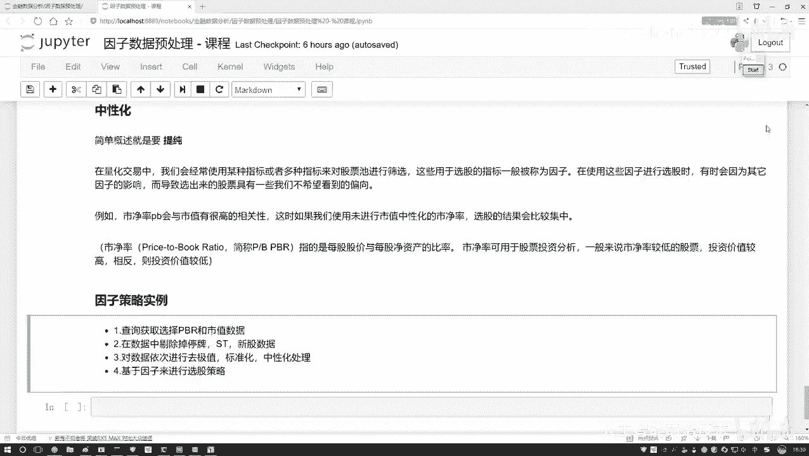

## 概述
在本节课中，我们将学习量化交易中的一个核心数据处理步骤——因子中性化。我们将理解其背后的数学原理，并通过一个具体的例子，演示如何将市净率因子中的市值影响剔除，最终构建一个简单的选股策略。

## 因子中性化的原理

上一节我们介绍了因子处理的基本流程，本节中我们来看看如何通过回归分析来“提纯”因子。

假设我们有一个市净率因子，但我们发现它与市值存在较强的相关性。我们希望从市净率中剔除掉市值所能解释的那部分信息，从而得到一个更“纯净”的、不受市值影响的因子。这个过程就是因子中性化。

### 回归方程的应用
我们如何实现这种“剔除”呢？核心思想是建立一个回归方程。

我们可以将市值视为自变量 `X`，将市净率因子视为因变量 `Y`。它们之间的关系可以近似表示为：
`Y ≈ W * X + B`
其中，`W` 是权重系数，`B` 是截距项。

通过线性回归，我们可以求解出 `W` 和 `B`。那么，`Y_pred = W * X + B` 就代表了市值能够解释的市净率部分，即预测值。

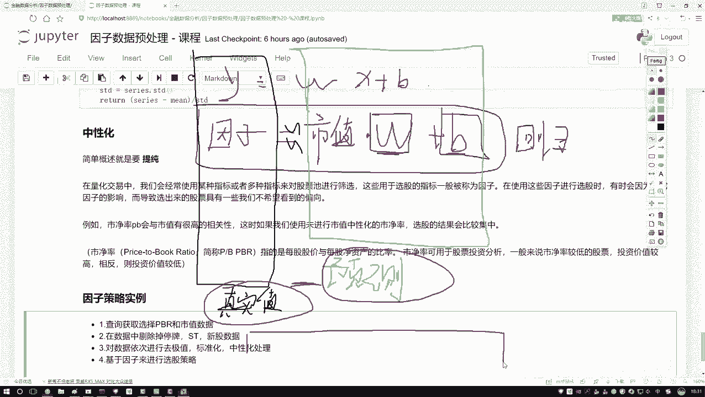

### 误差项的含义
然而，预测值 `Y_pred` 与真实值 `Y` 之间通常存在差异，这个差异就是误差项 `ε`：
`Y = Y_pred + ε`
这个误差项 `ε` 代表的就是市值所无法解释的市净率部分，也就是我们“提纯”后想要保留的因子信息。

因此，中性化的操作就是计算这个误差项：
`中性化后的因子 = Y - Y_pred = ε`

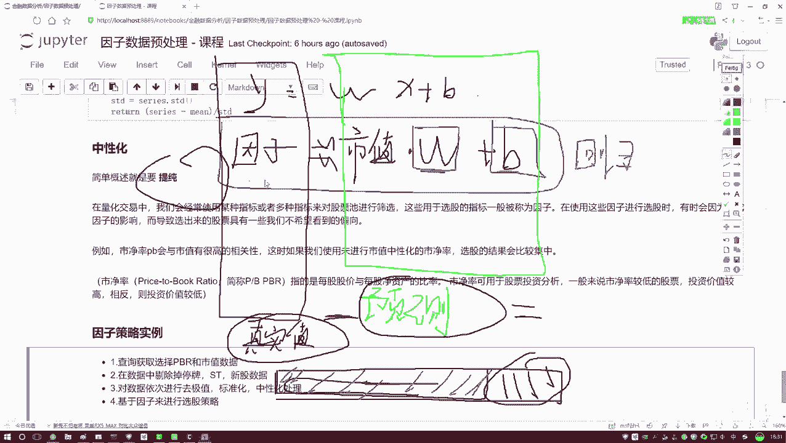

以下是实现因子中性化的两个核心步骤：
1.  **建立回归方程**：以需要剔除的变量（如市值）为 `X`，以待处理的因子（如市净率）为 `Y`，进行线性回归，求解系数 `W` 和 `B`。
2.  **计算残差**：用因子的真实值 `Y` 减去回归预测值 `Y_pred`，得到的残差即为中性化后的因子值。

这个过程听起来复杂，但实际操作就是一次回归和一次减法，目的是在目标因子中减去其他变量（如市值）对其的影响。

## 策略任务概述

理解了中性化的原理后，我们来看一个具体的策略构建任务。我们将使用市净率和市值这两个因子来演示。

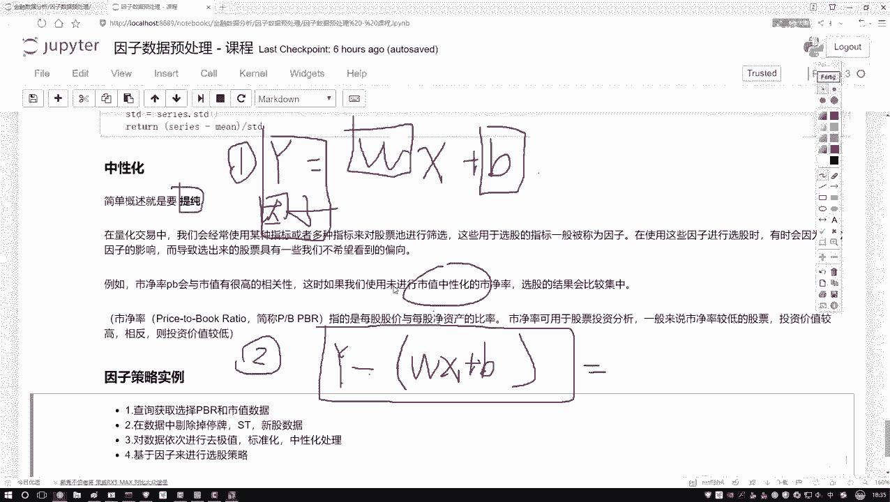

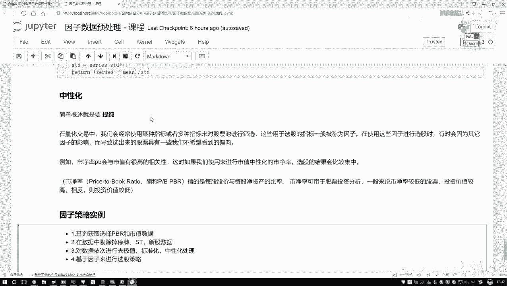

我们的目标是构建一个简单的选股策略。策略流程如下：

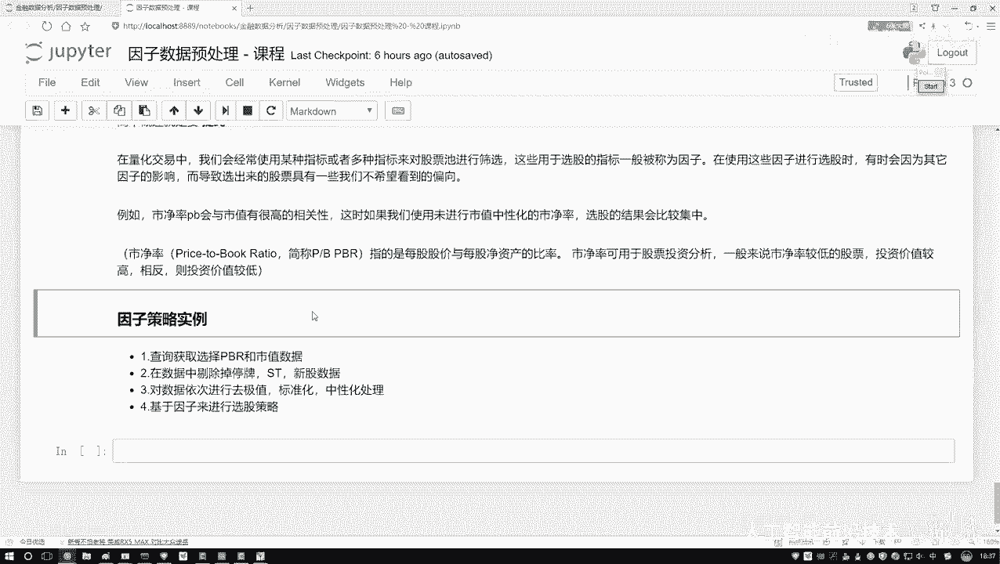

首先，我们需要获取原始的市净率和市值数据。

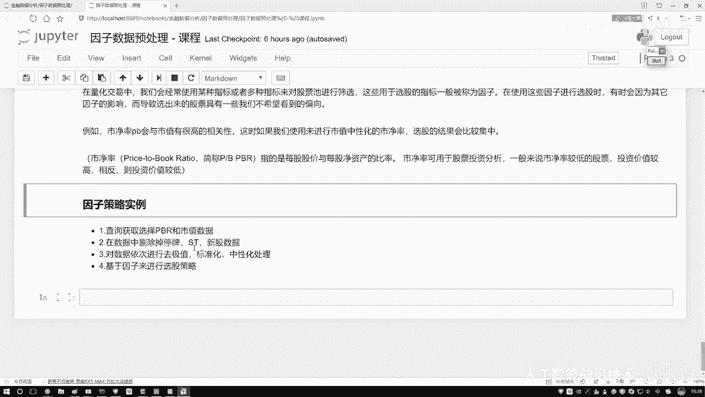

然后，对股票池进行预处理，剔除不符合条件的股票。以下是常见的剔除标准：
*   停牌的股票
*   ST/*ST股票
*   上市时间短于一定期限（例如半年）的新股

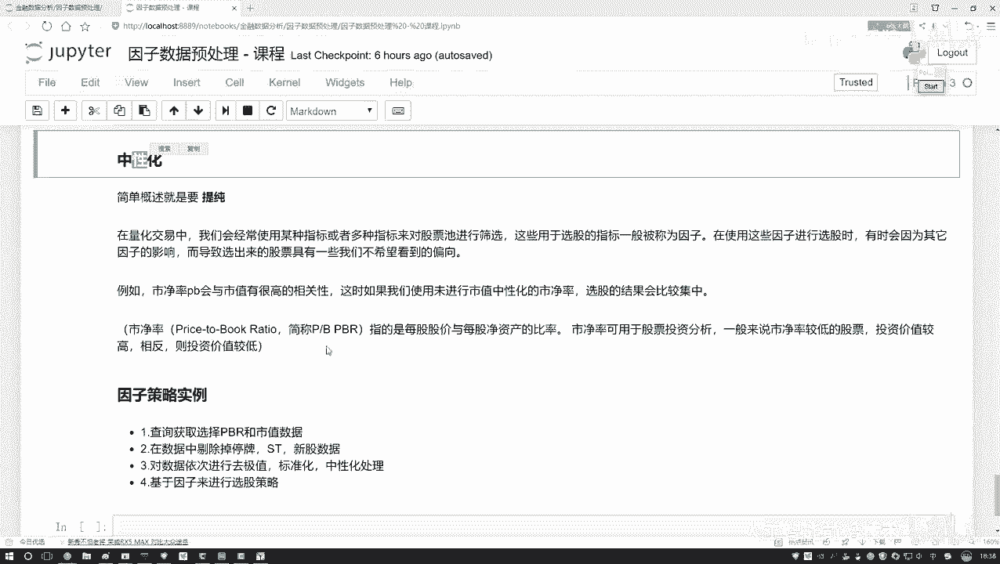

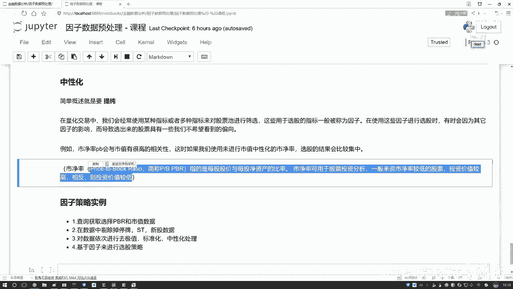

接着，对保留的股票数据进行因子处理。处理顺序通常为：
1.  去极值：处理异常值。
2.  标准化：使数据符合标准正态分布。
3.  **中性化**：本例中，我们将对市净率因子进行市值中性化处理。

数据处理完毕后，我们将基于处理后的因子进行选股。例如，我们可以设定一个规则：选择**市值中性化后的市净率**小于0.2的股票。这意味着我们寻找那些在剔除市值影响后，市净率依然较低的股票，这可能是我们的买入候选。

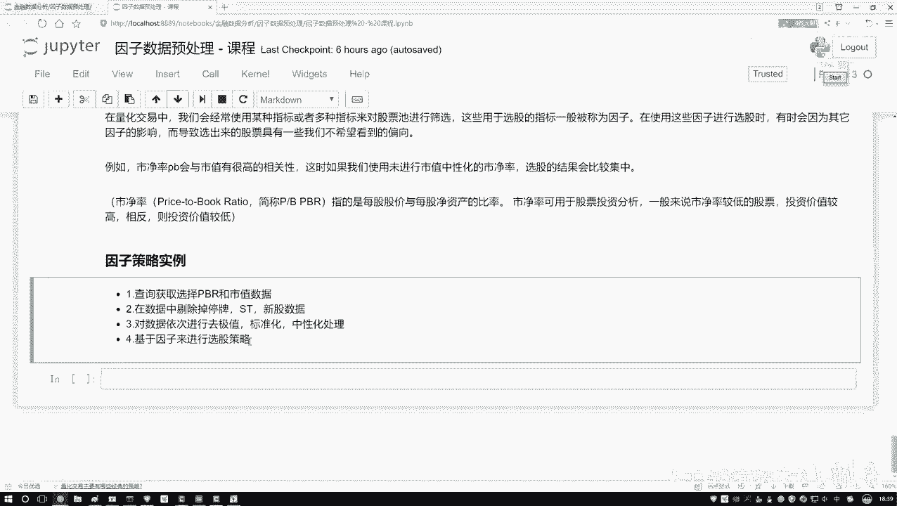

最后，我们将把上述所有步骤，包括中性化处理，整合到一个完整的策略中进行回测。

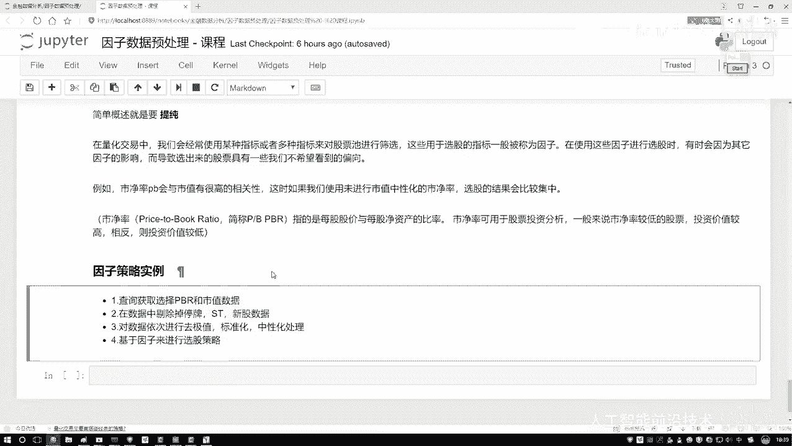

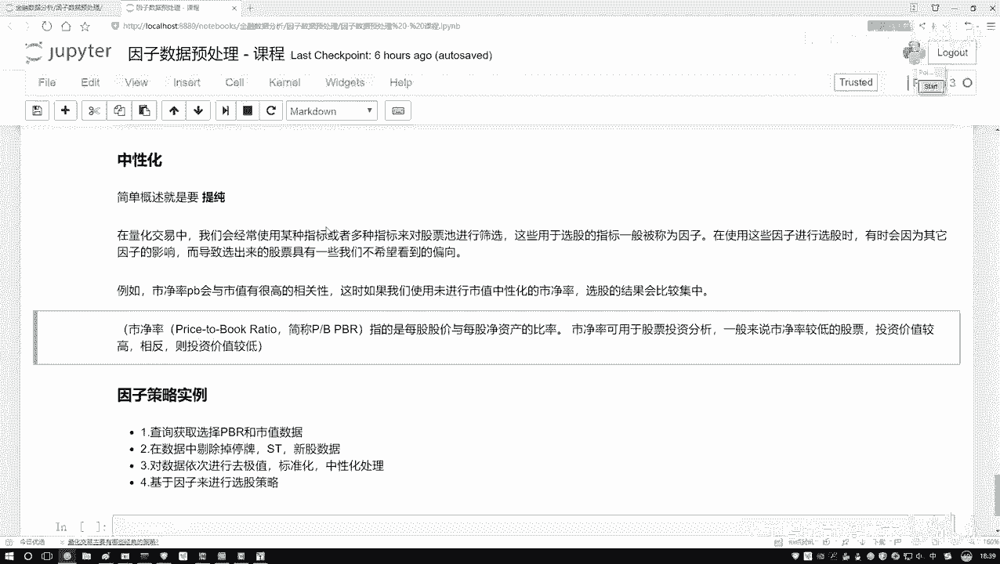

## 总结
本节课中我们一起学习了因子中性化的核心概念。我们了解到，中性化是通过线性回归来剥离因子中其他变量（如市值、行业）的影响，从而得到更独立的信号。其关键公式是 `中性化因子 = 原始因子 - 回归预测值`。随后，我们概述了一个结合了数据预处理、因子中性化和简单规则选股的策略构建流程。在接下来的实践中，我们将具体实现这一策略。