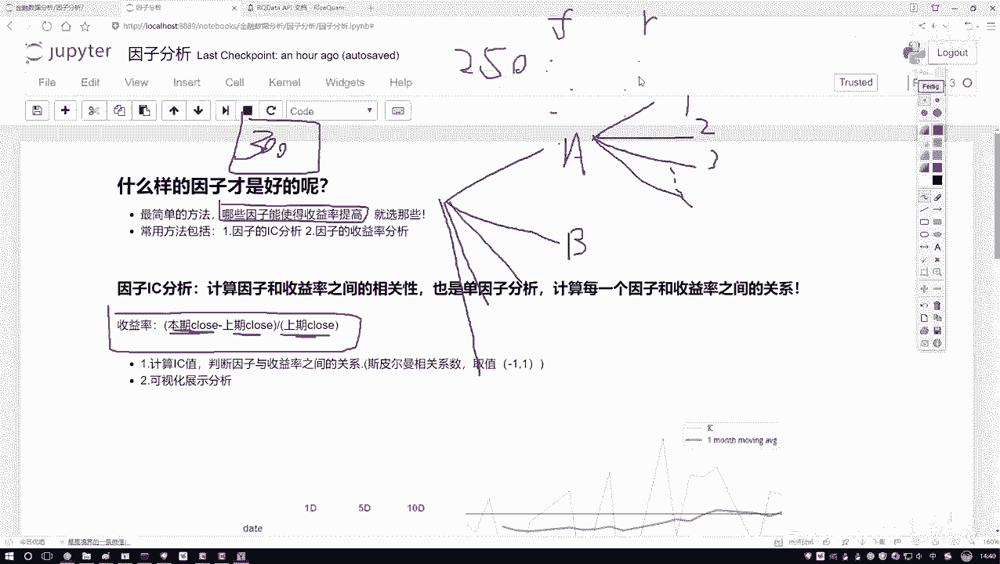
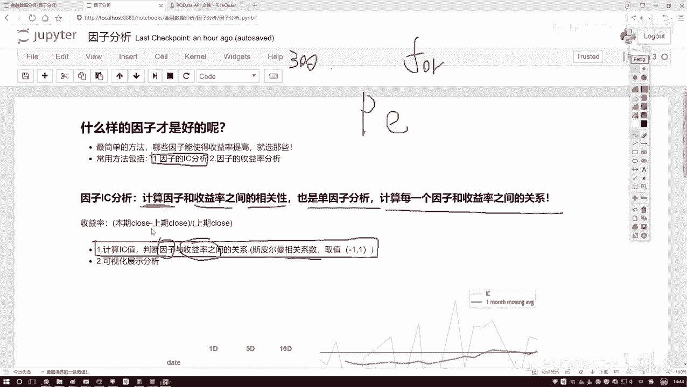
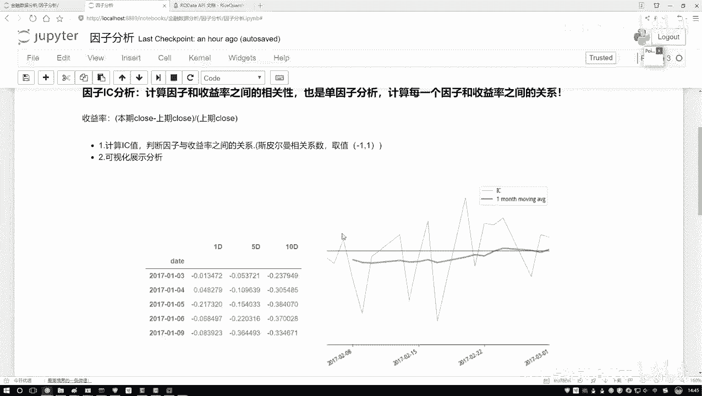
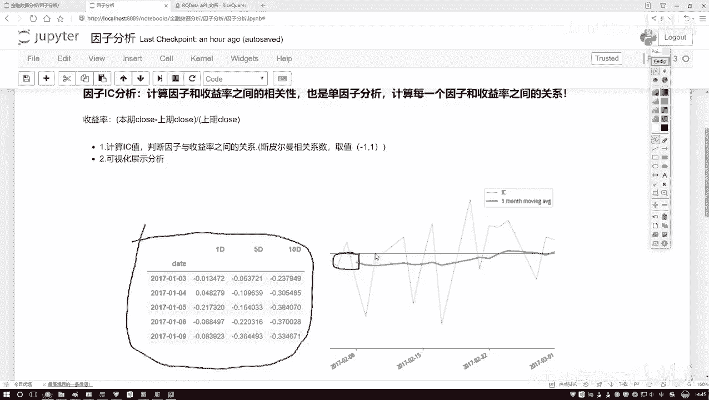
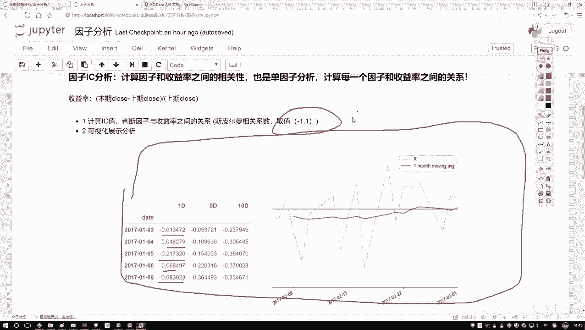

# Python金融量化+股票交易：P40：因子分析概述 📊

在本节课中，我们将要学习因子分析的核心概念。因子分析是量化交易中筛选有效指标的关键步骤，它帮助我们判断哪些因子（如基本面或技术指标）对股票收益率有显著影响，从而为策略构建提供依据。

## 因子分析的目标 🎯

上一节我们介绍了量化交易的基本背景，本节中我们来看看因子分析的具体目标。在股票分析中，我们可以获取大量因子数据，例如基本面信息和技术指标。这些因子数量庞大，可能达到数百个。问题在于，当我们进行策略回测或设计时，无法同时使用所有因子。因此，我们需要对这些因子进行排序和筛选，判断哪些因子对最终收益有积极影响，哪些影响不大或为负面。

## 收益率的概念 📈

要评估因子的好坏，首先需要理解收益率。收益率衡量了资产价格的变化幅度。以下是计算日收益率的公式：

**日收益率 = (当日收盘价 - 上一交易日收盘价) / 上一交易日收盘价**

这个公式计算了股票在单个交易日内的收益表现。在因子分析中，我们将关注因子值的变化与收益率变化之间的关系。

## 因子与收益率的关系 🔗

我们拥有连续的因子数据和对应的日收益率数据。核心任务是分析每个因子与收益率之间的关联性。这种关联性可以是正相关、负相关或不相关。我们需要量化这种关系，以便对因子进行有效排序。

## 因子IC分析 📊

接下来，我们介绍因子分析的核心方法之一：IC分析。IC代表信息系数，用于衡量因子与收益率之间的相关性。我们通常使用斯皮尔曼秩相关系数进行计算。



计算IC值的公式如下：

**IC = 斯皮尔曼相关系数(因子值序列， 收益率序列)**

斯皮尔曼相关系数的取值范围在-1到1之间。值越接近1，表示因子与收益率正相关性越强；值越接近-1，表示负相关性越强；值接近0则表示两者基本无关。

## 单因子分析流程 🔄

由于我们通常拥有数百个因子，而收益率序列相对固定，因此需要进行单因子分析。这意味着我们需要遍历每一个因子，分别计算其与收益率序列的IC值。

以下是单因子分析的基本逻辑：

```python
# 伪代码示例：遍历因子计算IC值
for each_factor in all_factors:
    ic_value = calculate_spearman_correlation(each_factor, return_series)
    # 存储或分析ic_value
```

通过这个过程，我们可以为每一个因子计算出一个IC值，从而评估其预测能力。





## IC结果的可视化与分析 📉

计算出所有因子的IC值后，我们需要对结果进行分析和可视化。常见的分析包括观察IC值的时间序列走势及其统计特征。

我们将生成两种图表：
1.  **IC值时间序列折线图**：展示IC值每日的变化情况。
2.  **IC值移动平均线图**：例如10日移动平均线，用于观察IC值的趋势，平滑短期波动。



通过图表，我们可以直观地识别出哪些因子在历史上持续与收益率保持较强的相关性（IC值绝对值较大且稳定），哪些因子相关性较弱或波动剧烈。

## 因子筛选决策 ✅

基于IC分析的结果，我们可以做出因子筛选的决策：
*   IC值持续为正且绝对值较大的因子，可能与收益率有稳定的正相关关系，值得进一步研究。
*   IC值持续为负且绝对值较大的因子，表明其与收益率存在稳定的负相关关系，也可能具有使用价值（例如作为反向指标）。
*   IC值接近0或波动不定的因子，表明其与收益率缺乏稳定关系，在初步筛选中可以考虑剔除。



本节课中我们一起学习了因子分析的目标、收益率的概念、IC分析的核心方法及其计算过程，以及如何通过可视化结果来筛选有效因子。这为后续构建具体的量化交易策略奠定了重要的基础。