# Python金融量化+股票交易：P44：数据格式转换

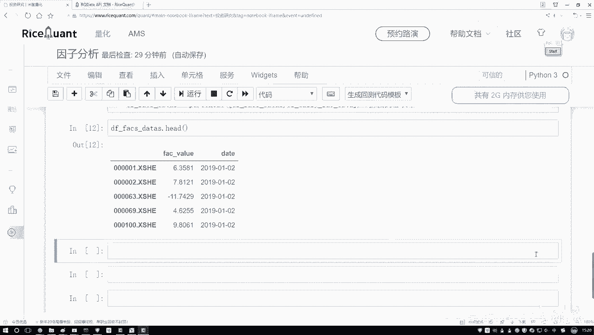

在本节课中，我们将学习如何将数据处理成特定工具包（如Alphalens）所要求的格式。这是进行后续量化分析的关键一步。

上一节我们介绍了如何获取和计算股票指标数据，但该数据的格式与Alphalens等工具包的要求不符。本节中我们来看看如何将数据转换为所需的格式。

## 理解目标数据格式

Alphalens要求的数据格式与我们当前拥有的格式不同。它需要一个多级索引的`DataFrame`，具体结构如下：

*   **第一级索引**：日期（`date`）。
*   **第二级索引**：股票代码（`asset`）。
*   **列**：具体的指标值。

例如，对于五只股票（A, B, C, D, E）在2019年1月1日和1月2日的数据，格式应如下所示：

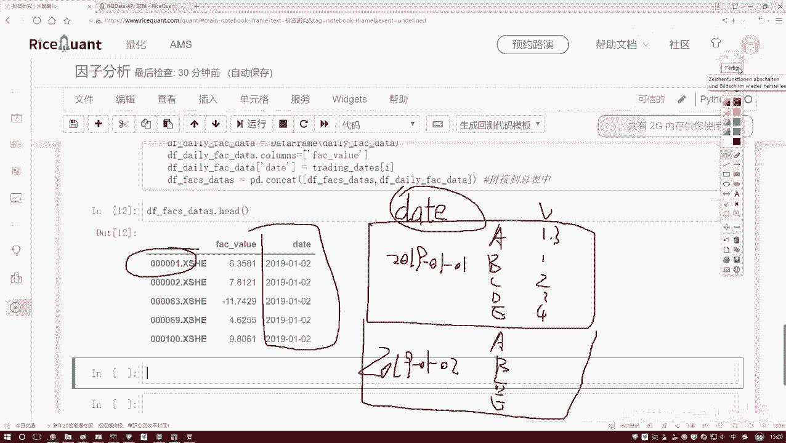

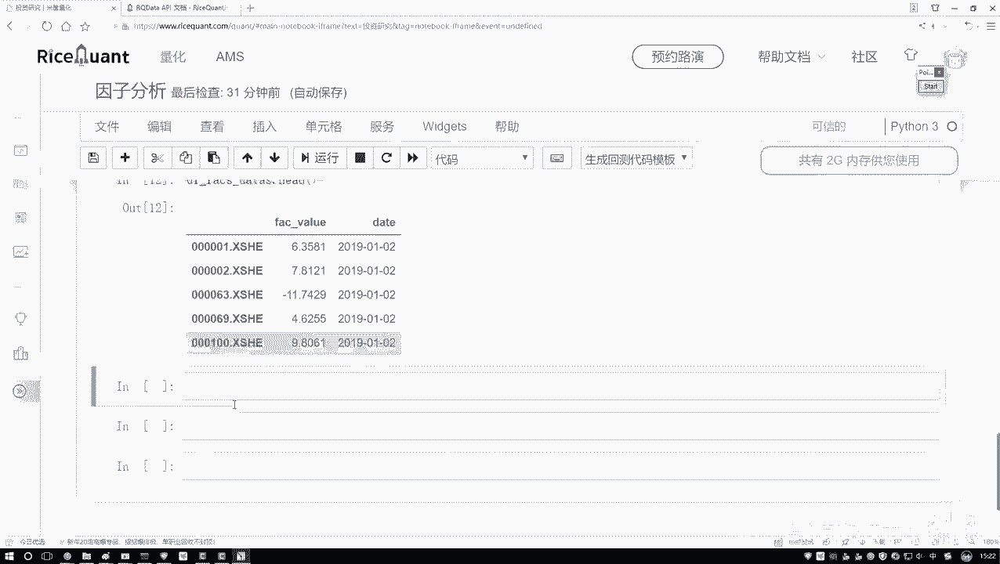

| date       | asset | value |
|------------|-------|-------|
| 2019-01-01 | A     | 1.3   |
| 2019-01-01 | B     | 1.5   |
| 2019-01-01 | C     | 2.1   |
| 2019-01-01 | D     | 3.4   |
| 2019-01-01 | E     | 4.2   |
| 2019-01-02 | A     | 1.4   |
| 2019-01-02 | B     | 1.6   |
| ...        | ...   | ...   |

而我们当前的数据格式可能是以日期为行、股票为列的宽表形式。因此，我们需要进行格式转换。

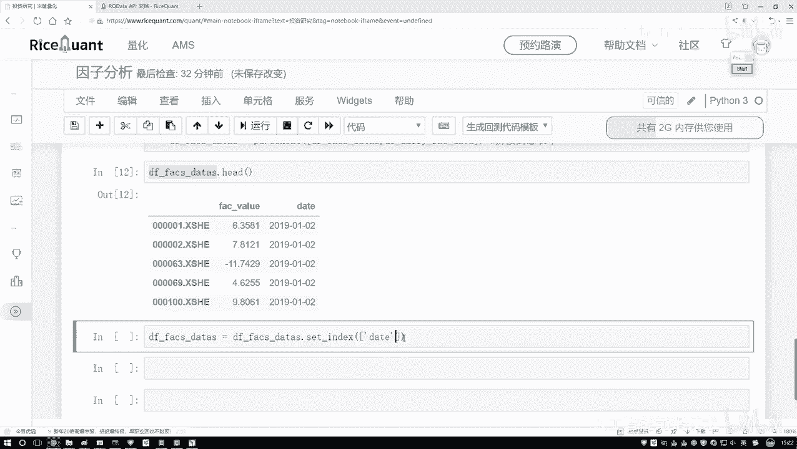

## 设置多级索引

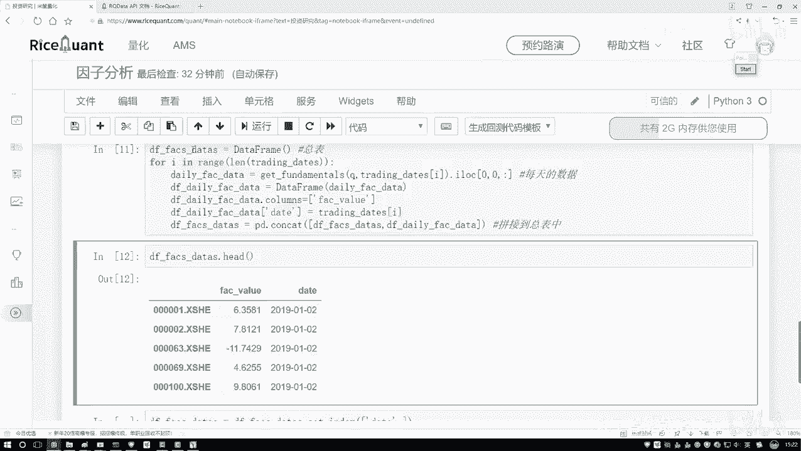

首先，我们需要将数据重塑为上述长格式，并设置多级索引。以下是实现这一转换的核心代码：

```python
# 假设 df 是原始的宽格式DataFrame，包含‘date’列和以股票代码命名的指标值列
# 首先，将‘date’列设置为索引的一部分，并将数据从宽格式转换为长格式（stack操作）
multi_index_df = df.set_index(['date', df.columns.drop('date').tolist()]).stack()

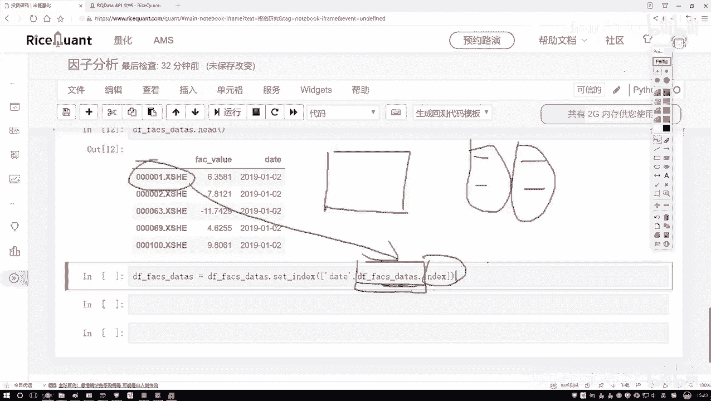

# 为转换后的Series指定一个名称，并转换为DataFrame
formatted_data = multi_index_df.to_frame(name='factor_value')

# 重置索引的第二层，使其变为‘asset’（股票代码）
formatted_data.index = formatted_data.index.set_levels(formatted_data.index.levels[1], level='asset')

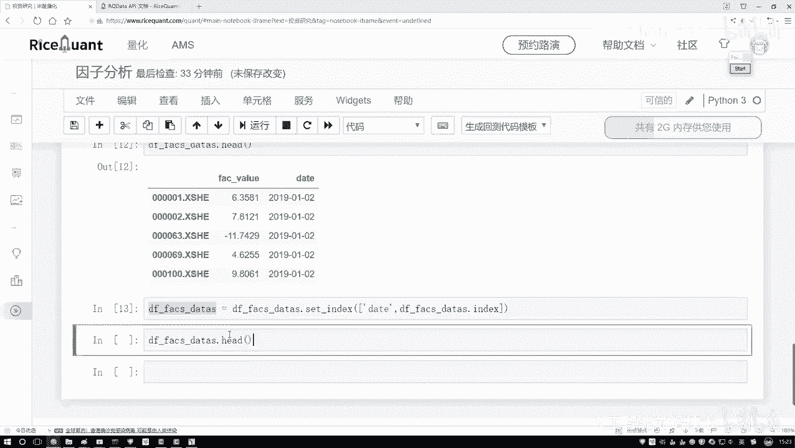

# 查看转换后的数据前几行
print(formatted_data.head())
```

执行这段代码后，我们将得到一个符合要求格式的`DataFrame`。其索引的第一层是日期，第二层是股票代码，列中存储着对应的指标值。

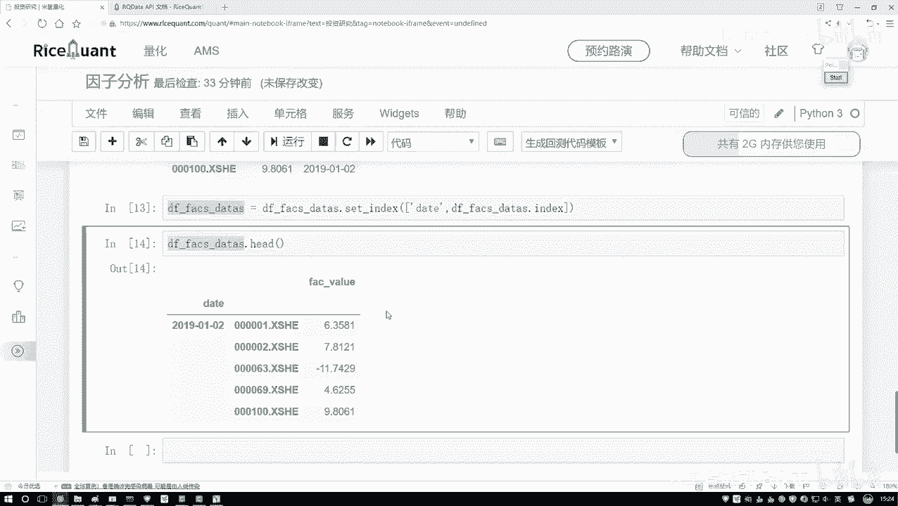

## 数据预处理

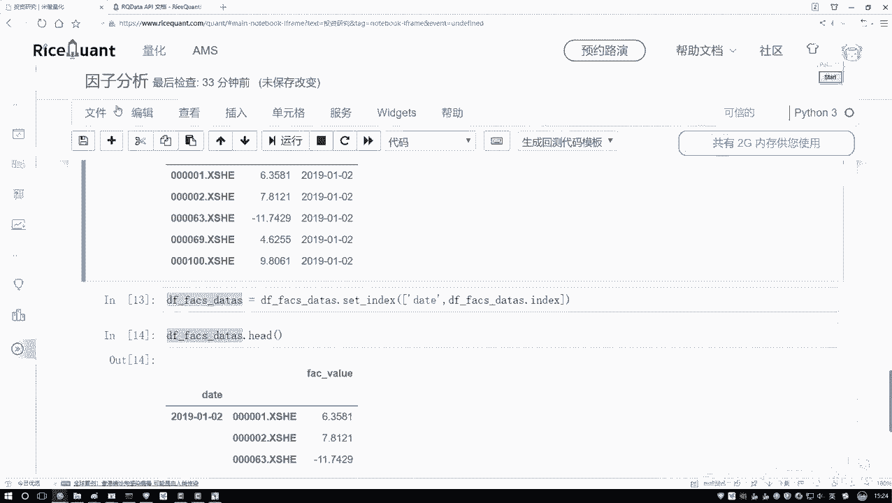

在将数据输入模型或进行统计分析前，通常需要进行预处理以消除异常值和量纲影响。以下是两个常见的预处理步骤：

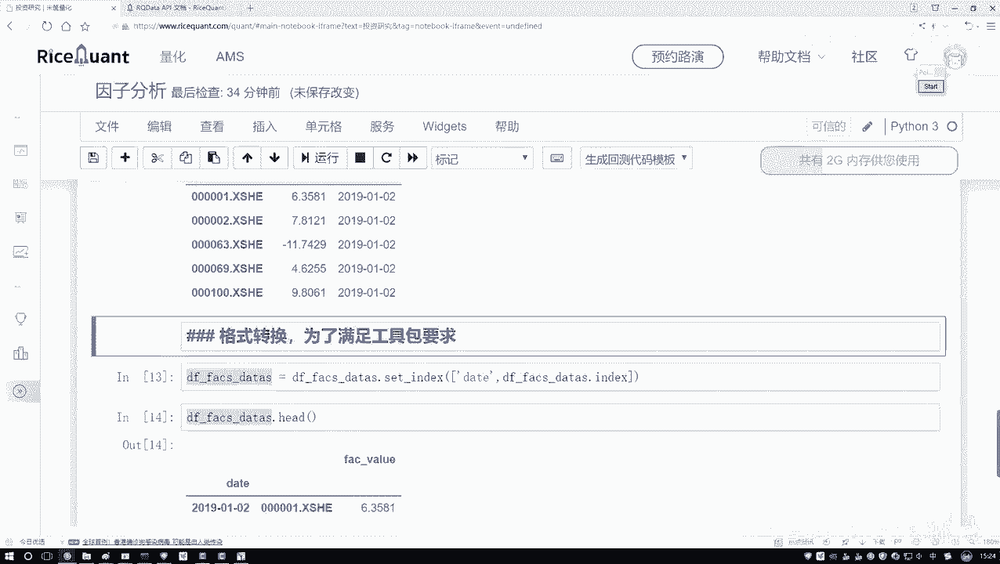

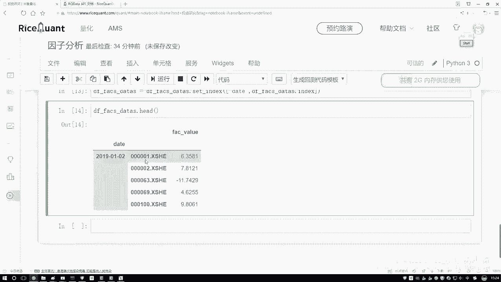

1.  **去极值（Winsorization）**：将超出指定分位数（如1%和99%）的极端值替换为边界值，以防止它们对分析产生过大影响。
2.  **标准化（Standardization）**：将数据转换为均值为0、标准差为1的标准正态分布，使不同指标具有可比性。

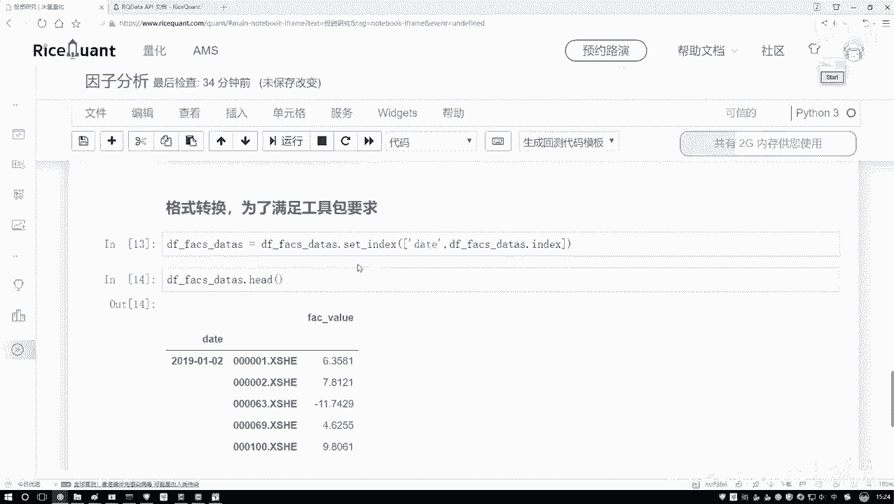

以下是预处理操作的代码示例：

```python
def preprocess_factor_data(series, winsorize_limits=(0.01, 0.99)):
    """
    对因子值序列进行去极值和标准化处理。
    参数:
        series: 待处理的因子值序列。
        winsorize_limits: 去极值的上下分位数，默认为(1%, 99%)。
    返回:
        处理后的序列。
    """
    # 去极值
    lower_bound = series.quantile(winsorize_limits[0])
    upper_bound = series.quantile(winsorize_limits[1])
    series_winsorized = series.clip(lower=lower_bound, upper=upper_bound)

    # 标准化
    series_standardized = (series_winsorized - series_winsorized.mean()) / series_winsorized.std()

    return series_standardized

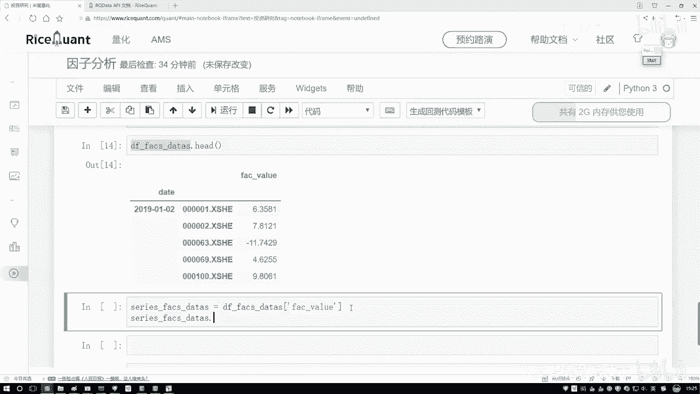

# 对转换格式后的因子数据列应用预处理函数
formatted_data['factor_value_processed'] = formatted_data.groupby(level='date')['factor_value'].apply(preprocess_factor_data)
```

这段代码定义了一个预处理函数，并对每个交易日（`date`）的因子数据分别进行去极值和标准化处理。处理后的数据将存储在新列`factor_value_processed`中。

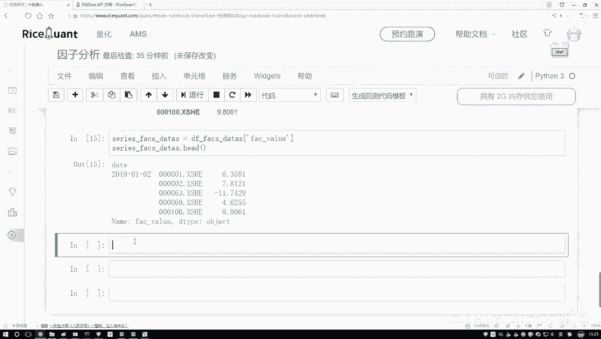

如果需要，我们还可以通过绘制直方图来观察处理前后数据分布的变化。

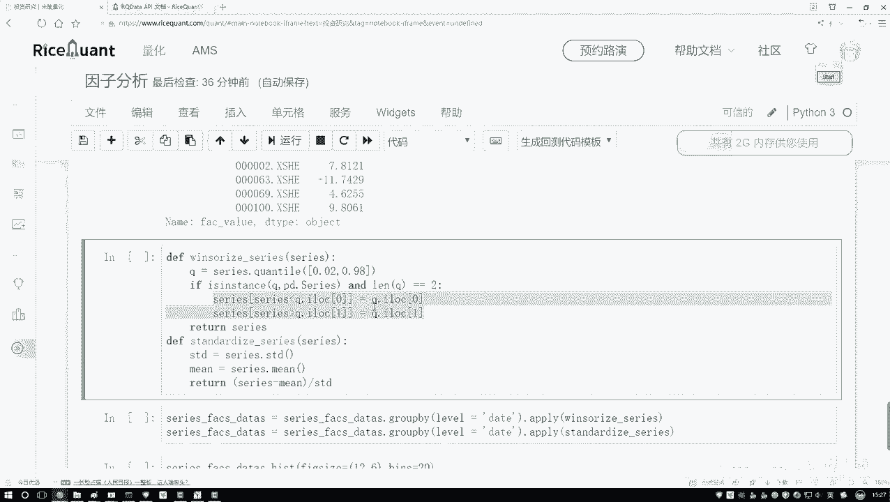

## 总结

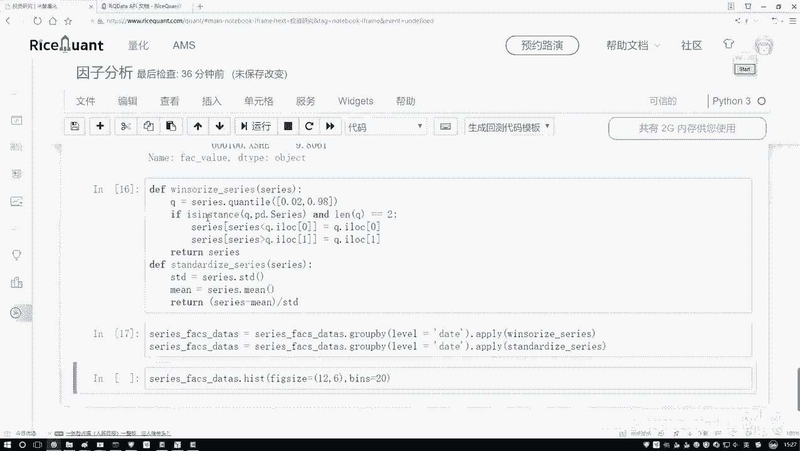

本节课中我们一起学习了为Alphalens工具包准备数据的关键步骤。

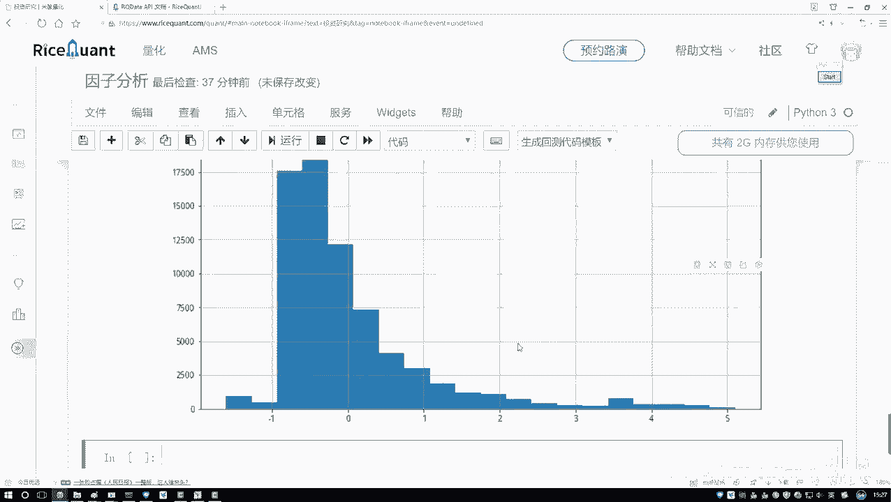

首先，我们理解了目标数据格式是一个以日期和股票代码为多级索引的`DataFrame`。接着，我们通过`set_index`和`stack`操作，成功将原始的宽表数据转换成了所需的长格式。最后，我们介绍了数据预处理的重要性，并实现了去极值和标准化操作，以确保数据质量满足分析要求。

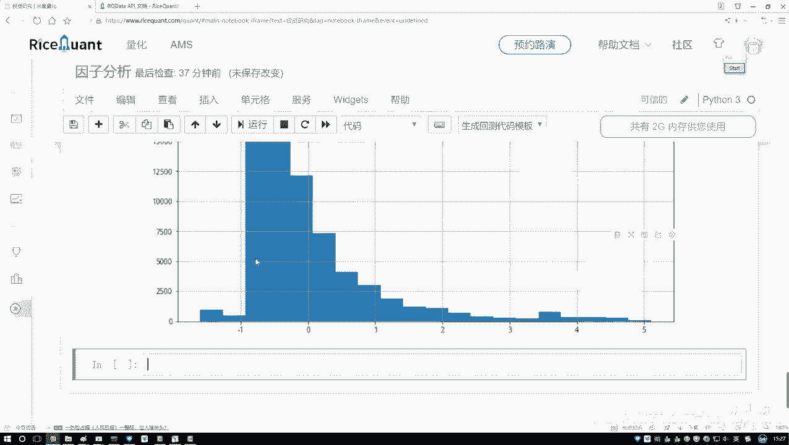

完成这些步骤后，我们的数据就已经准备就绪，可以输入到Alphalens中进行下一步的因子IC值计算和统计分析。