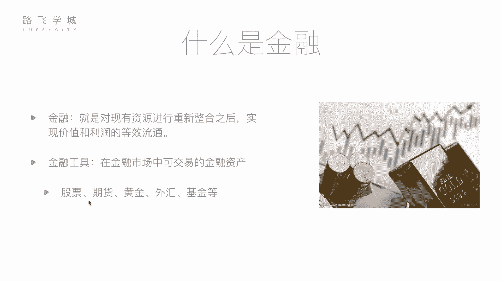

# Python量化交易：01：金融与量化分析基础

## 概述


在本节课中，我们将学习金融与量化分析的基础知识。我们将首先了解金融的基本概念，然后介绍几种常见的金融工具，最后重点讲解股票这一核心概念。通过本节内容，你将建立起对量化交易领域的基本认知框架。

## 什么是金融？

从定义上讲，金融是对现有资源进行重新整合后，实现价值和利润的等效流通。这个定义可能有些抽象，但通俗地理解，金融涉及资金的流动和增值。它并非完全是不劳而获的投机行为。金融活动对整个经济体系和个人都有积极作用。

例如，一位拥有闲置资金的投资者，可以将资金投入一家有潜力的初创公司。公司获得发展所需的资金，而投资者则有望在未来获得回报。这个过程促进了资源的有效配置和经济发展，是一种双赢的局面。这种资金融通的行为，就是金融的核心。



在日常生活中，我们更常接触到的是具体的**金融工具**，即可在金融市场中交易的金融资产。

## 常见的金融工具

以下是几种主流的金融工具，它们各有特点，适用于不同的投资需求和风险偏好。

*   **股票**：代表对一家公司的所有权份额。购买股票即成为该公司的股东，可以分享公司成长的收益（如分红和股价上涨），也需承担相应的风险。这是我们本课程后续重点探讨的核心工具。
*   **期货**：一种标准化合约，约定在未来某一特定时间和地点，以预定价格交割一定数量的某种资产（如大宗商品、金融资产）。其特点是**高杠杆、高风险、高收益**。交易双方基于对资产未来价格走势的不同判断进行交易，旨在规避风险或进行投机。
    ```python
    # 概念性示例：期货合约涉及未来交割
    futures_contract = {
        “标的资产”: “煤炭”，
        “交割价格”: 10， # 单位：元/吨
        “交割数量”: 5000， # 单位：吨
        “交割日期”: “2023-12-31”
    }
    ```
*   **黄金**：一种传统的避险资产和保值工具。其价格相对稳定，波动通常小于股票。黄金价格受全球货币供应、经济形势、地缘政治等因素影响。公式上，其价值与货币供应量常呈反向关系：`黄金价格 ∝ 货币总量 / 黄金总量`。
*   **外汇**：指不同国家货币之间的兑换交易。投资者通过预测汇率波动来赚取差价。例如，人民币与美元的汇率（如 `1 USD = 6.5 CNY`）会因两国经济状况、利率政策等因素而变动。通常，大型机构参与较多，个人因波动相对较小而较少涉足。
*   **基金**：一种集合投资方式。基金经理将众多投资者的资金汇集起来，由专业人士（基金经理）进行统一管理和投资，投资于股票、债券等多种资产。其特点是**风险相对分散，收益和风险通常低于直接投资股票**。投资者购买基金份额，间接持有投资组合。

上一节我们介绍了金融的基本概念和几种常见工具，接下来我们将深入探讨本课程的核心——股票。

## 什么是股票？

股票是股份公司为筹集资金而发行给股东的所有权凭证。购买股票意味着你拥有了该公司的一部分。作为股东，你的收益主要来自两个方面：
1.  **资本利得**：股票价格上涨后卖出所获得的差价。
2.  **股息分红**：公司盈利后向股东分配的利润。

股票投资的核心在于对公司未来价值和盈利能力的判断。而**量化交易**，正是利用计算机编程（如Python），通过数学模型和数据分析来制定投资策略、执行交易，试图在股市中获取稳定收益的方法。它结合了金融理论、统计学和计算机科学，旨在将投资决策过程系统化和自动化。

## 总结

本节课我们一起学习了金融与量化分析的基础知识。我们首先理解了金融是资源整合与价值流通的过程，然后认识了股票、期货、黄金、外汇和基金这几种主要的金融工具及其基本特点。最后，我们明确了股票作为公司所有权凭证的本质，并引出了通过计算机编程进行**量化分析**来实现自动化、理性投资的核心课程方向。在接下来的课程中，我们将逐步学习如何运用Python工具来实现这些量化分析思想。