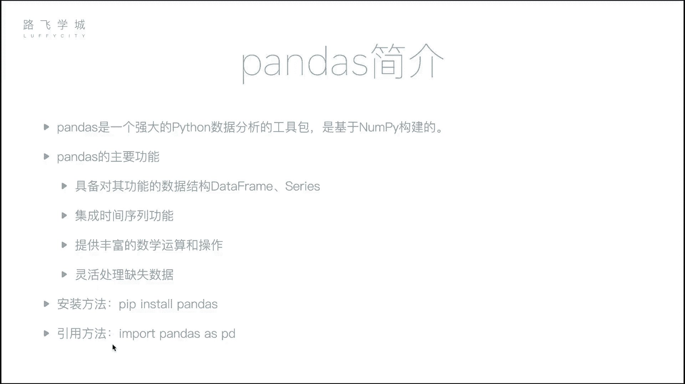
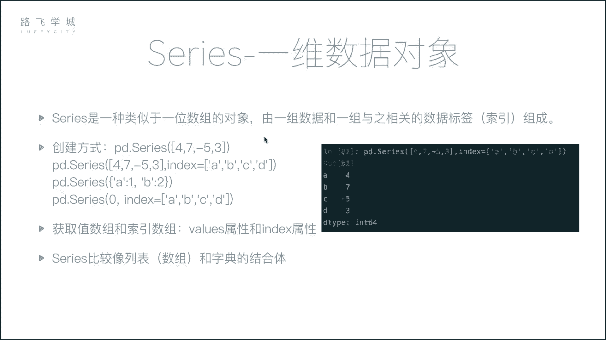
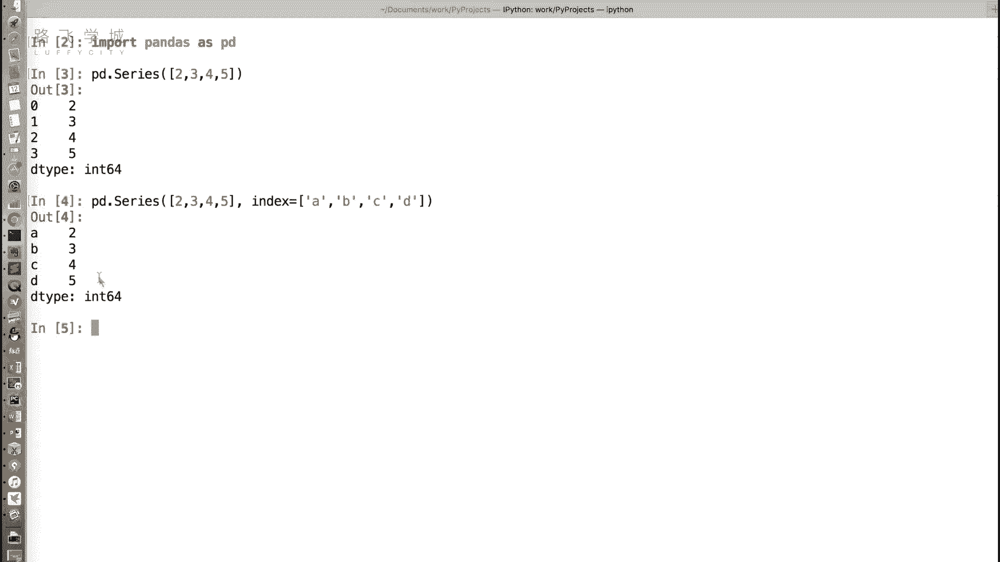
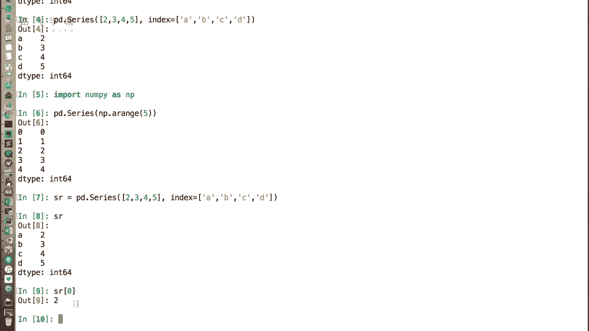
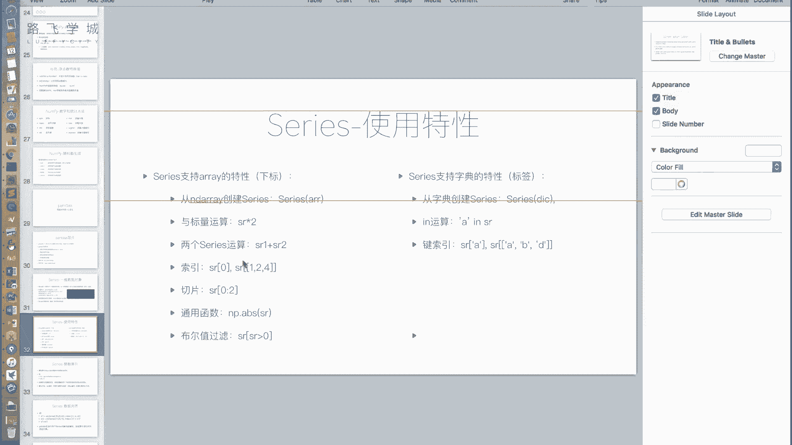
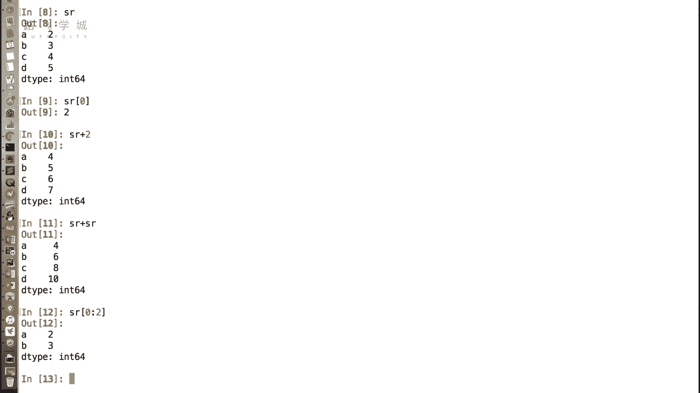
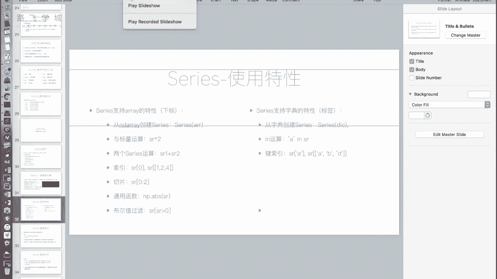
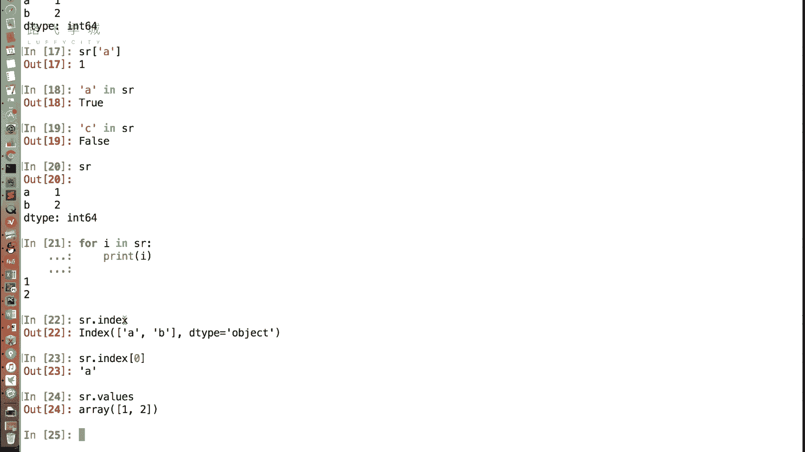
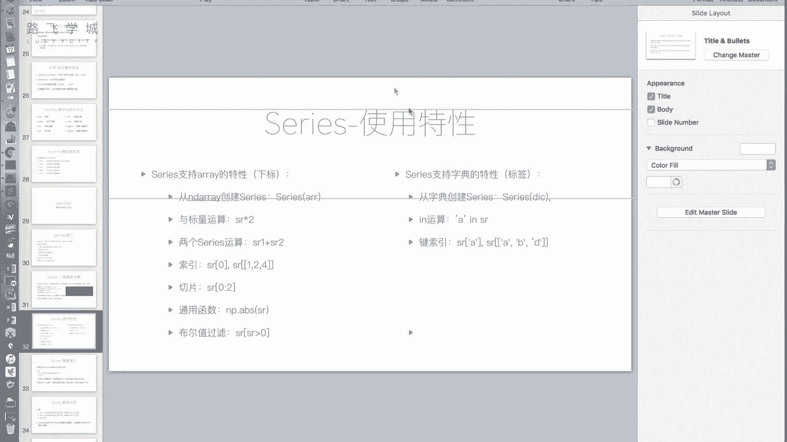
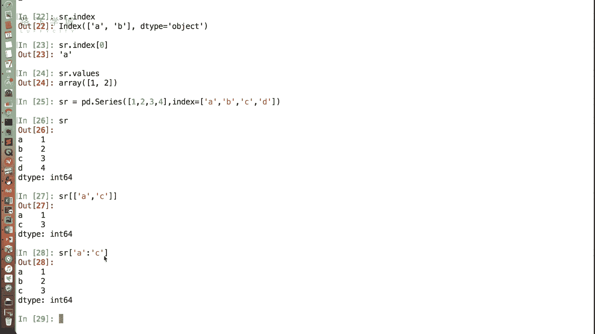

# Python量化交易：P17：Series介绍 📊

## 概述
在本节课中，我们将要学习Pandas库中的第一个核心数据结构——**Series**。我们将了解它是什么，如何创建它，以及它如何结合了列表（数组）和字典的特性，从而成为数据分析中一个强大且灵活的工具。

---



## 什么是Pandas？
上一节我们介绍了NumPy，它是数据分析的基础包。本节中我们来看看Pandas。Pandas是基于NumPy构建的，在数据分析领域应用广泛。无论进行金融数据分析还是其他领域的数据分析，只要使用Python，Pandas都是不可或缺的工具。

Pandas的主要功能包括：
*   提供两种核心数据结构：**DataFrame**和**Series**。
*   集成了时间序列功能。
*   提供了丰富的数学运算和操作。
*   能灵活处理缺失数据。



安装Pandas非常简单，使用`pip`命令即可。官方建议的导入方式如下：

```python
import pandas as pd
```




---

## Series：一维数据的容器
首先我们来介绍Pandas中的第一种核心数据对象：**Series**。Series是一种类似于一维数组的对象，可以将其理解为**数组和字典的结合体**。

### 创建Series
创建Series的基本方法是使用`pd.Series()`。以下是两种常见的创建方式：



**1. 从列表创建（类似数组）**
```python
import pandas as pd
s = pd.Series([2, 3, 4, 5])
print(s)
```
输出结果左侧是默认的整数索引（0, 1, 2, 3），右侧是数据值。这看起来就像一个列表或数组。



**2. 指定索引创建（类似字典）**
我们可以在创建时通过`index`参数自定义索引标签。
```python
s = pd.Series([2, 3, 4, 5], index=[‘a‘, ‘b‘, ‘c‘, ‘d‘])
print(s)
```
此时，输出左侧的索引变成了‘a‘, ‘b‘, ‘c‘, ‘d‘，就像字典的键值对一样。因此，Series确实融合了列表和字典的特性。

---



## Series的数组（列表）特性
Series继承了许多NumPy数组或Python列表的特性，使其操作非常直观。



以下是Series支持的数组类操作：

*   **从数组创建**：不仅可以从列表，也可以从NumPy数组创建Series。
*   **通过下标访问**：即使指定了自定义索引（如‘a‘, ‘b‘），仍然可以通过原始整数下标访问数据。
    ```python
    s = pd.Series([2, 3, 4, 5], index=[‘a‘, ‘b‘, ‘c‘, ‘d‘])
    print(s[0])  # 输出：2
    ```
*   **向量化运算**：可以与标量（单个数字）进行运算，也可以与相同大小的另一个Series进行逐元素运算（加、减、乘、除、比较等）。
    ```python
    print(s * 2)  # 每个元素乘以2
    ```
*   **切片**：和列表一样，可以使用整数下标进行切片。
    ```python
    print(s[0:2])  # 切片，获取前两个元素
    ```
*   **通用函数**：支持NumPy的通用函数，如取绝对值、最大值、最小值等。
*   **布尔索引**：可以通过条件表达式筛选数据。
    ```python
    print(s[s > 3])  # 输出值大于3的元素
    ```

---

## Series的字典特性
除了数组特性，Series也具备类似字典的功能，这使得数据访问更加灵活。

以下是Series支持的字典类操作：

*   **从字典创建**：可以直接用一个字典来创建Series，字典的键（key）会自动成为Series的索引。
    ```python
    s_dict = pd.Series({‘a‘: 2, ‘b‘: 3, ‘c‘: 4})
    print(s_dict)
    ```
*   **通过标签访问**：可以使用自定义的索引标签来获取数据，这是字典的核心特性。
    ```python
    print(s_dict[‘a‘])  # 输出：2
    ```
*   **`in`操作**：可以检查某个标签是否存在于Series的索引中。
    ```python
    print(‘a‘ in s_dict)  # 输出：True
    ```
*   **花式索引与切片**：可以使用标签列表进行花式索引，也可以使用标签进行切片。**注意**：使用标签切片时，结果是“前包后也包”的。
    ```python
    # 花式索引
    print(s_dict[[‘a‘, ‘c‘]])
    # 标签切片
    print(s_dict[‘a‘:‘c‘])  # 包含‘a‘, ‘b‘, ‘c‘
    ```
*   **遍历**：对一个Series进行`for`循环时，默认遍历的是它的**值**，而不是索引（这与字典遍历键不同）。这符合数据分析中更关注数据值本身的场景。
    ```python
    for value in s_dict:
        print(value)  # 输出：2, 3, 4
    ```





---

## 获取索引与值
有时我们需要分别获取Series的索引部分和值部分。Series提供了两个属性来实现这个目的。

*   **`.index`属性**：获取Series的索引对象。
*   **`.values`属性**：获取Series的值（通常是一个NumPy数组）。

```python
s = pd.Series([2, 3, 4], index=[‘x‘, ‘y‘, ‘z‘])
print(s.index)  # 输出索引
print(s.values) # 输出值数组
```

---

## Series的应用场景
Series结合了有序数组和键值对字典的优点，在实际工作中非常有用。例如：
*   **时间序列数据**：记录一支股票每日的收盘价。索引可以是日期（标签），值是对应的价格。这样既可以通过日期（标签）快速查询某天的价格，也可以通过整数位置（下标）获取前N天的数据切片。
*   **带标签的一维数据**：任何需要为一列数据赋予有意义的行名或ID的场景，都可以使用Series。它比单纯在列表里存储`(标签, 值)`元组更加高效和方便。



---

## 总结
本节课中我们一起学习了Pandas库的核心数据结构之一——**Series**。
1.  Series是一个**一维带标签的数组**，融合了列表和字典的特性。
2.  它可以从列表、数组或字典创建。
3.  它支持**数组特性**，如下标访问、切片、向量化运算和布尔索引。
4.  它支持**字典特性**，如通过标签访问、`in`操作和标签切片。
5.  可以通过`.index`和`.values`属性分别获取其索引和值。
6.  Series非常适合处理像时间序列、带标签的测量数据等一维数据集。

理解Series是学习更复杂的DataFrame结构的基础。在下一节中，我们将介绍功能更强大的二维数据结构——DataFrame。