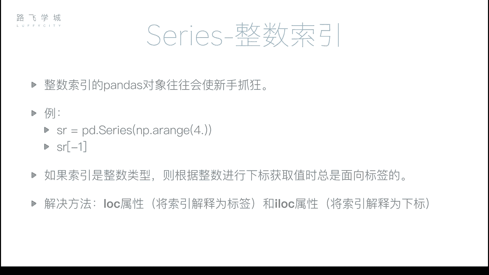
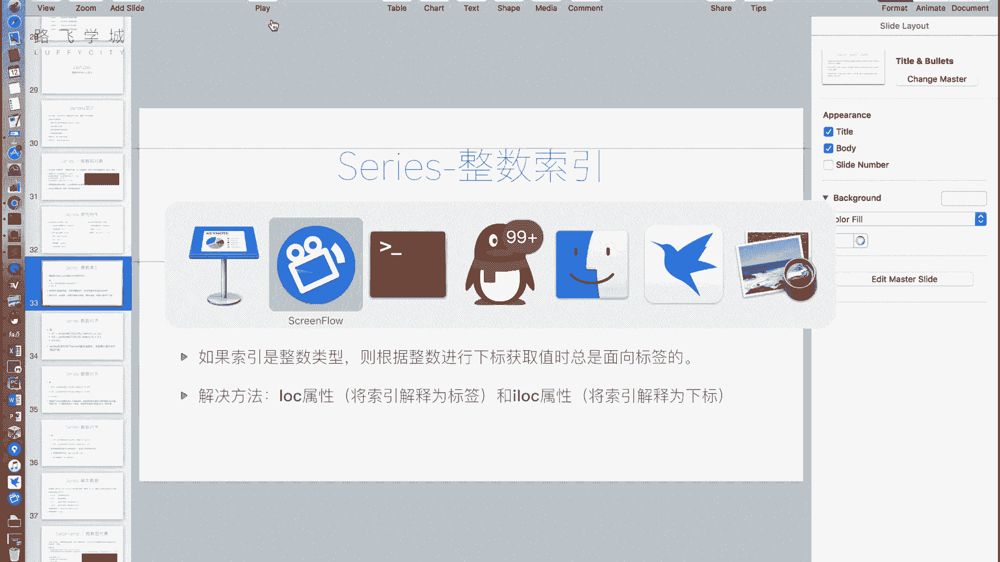
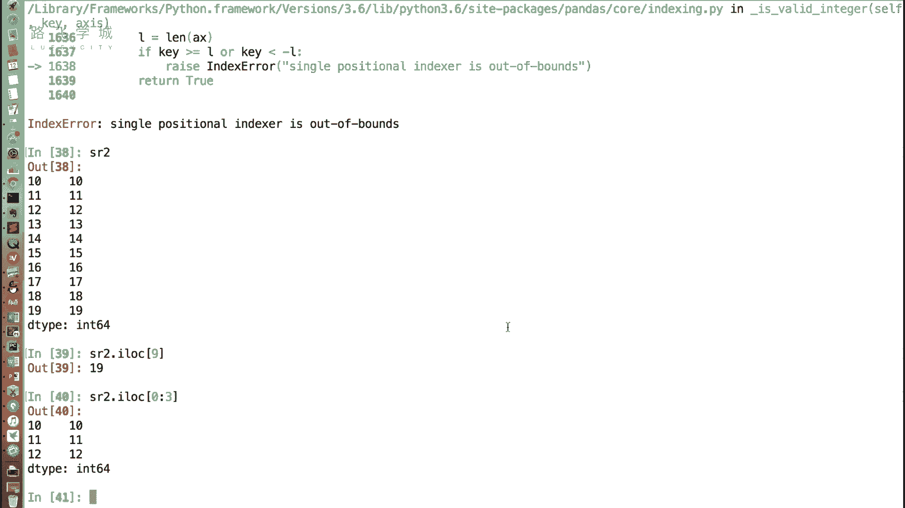
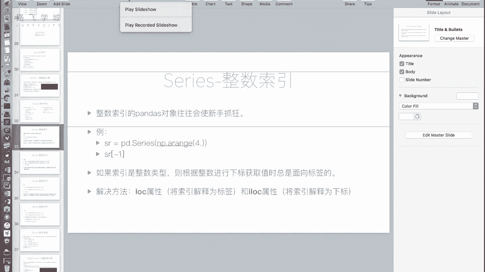

# Python量化交易：P18：Series整数索引问题 🔢

在本节课中，我们将要学习Pandas Series对象在使用整数索引时可能遇到的问题及其解决方案。整数索引容易引发歧义，导致新手困惑。我们将通过具体的例子和代码，清晰地解释问题所在，并介绍如何正确使用`.loc`和`.iloc`属性来避免这些陷阱。



---



上一节我们介绍了Series的一些基本特性。本节中我们来看看一个使用Series对象时非常重要的注意事项：当你使用整数索引的Pandas对象时，往往会让新手感到困惑。

整数索引是指索引值为数字的情况。例如，创建一个Series对象：

```python
import pandas as pd
import numpy as np

s = pd.Series(np.arange(20))
print(s)
```

这段代码创建了一个Series对象`s`。由于没有指定索引，Pandas会自动生成从0到19的整数索引。

接下来，我们通过切片操作创建一个新的Series对象：

```python
s2 = s[10:].copy()
print(s2)
```

新对象`s2`的索引是从10开始的整数（10, 11, ..., 19）。此时，如果我们尝试通过`s2[10]`来获取值，就会产生歧义。这个`10`可能被解释为**标签**（即索引值为10的那一行），也可能被解释为**位置下标**（即第10个元素，从0开始计数）。

实际上，在整数索引的Series中，使用中括号`[]`取值时，Pandas会**默认将其解释为标签**。因此，`s2[10]`会尝试寻找索引标签为`10`的行，并返回其值。而`s2[20]`则会报错，因为索引中不存在标签`20`。如果你想获取最后一个元素（位置下标为9），直接使用`s2[9]`会被解释为寻找标签`9`，同样会报错。

为了解决这个歧义问题，Pandas提供了两个明确的属性来区分操作意图。

以下是两个核心属性及其用途：

*   **`.loc[]`**：此属性明确指出，中括号`[]`内的值应被解释为**标签**。
*   **`.iloc[]`**：此属性明确指出，中括号`[]`内的值应被解释为**位置下标**。

例如，对于`s2`对象：
*   `s2.loc[10]`：获取索引标签为`10`的值。
*   `s2.iloc[9]`：获取位置下标为`9`（即最后一个）的值。

`.loc`和`.iloc`不仅支持单个值获取，也支持切片、布尔索引和花式索引。例如，`s2.iloc[0:3]`会取出前三个元素（基于位置下标切片）。

因为整数索引容易产生歧义，所以只要涉及到整数索引的操作，建议都明确使用`.loc`（基于标签）或`.iloc`（基于位置）来指定你的意图。



---



本节课中我们一起学习了Pandas Series整数索引的歧义问题。核心在于理解当索引为整数时，简单的`[]`操作会被默认解释为标签索引，这可能与基于位置下标的直觉操作相冲突。我们介绍了`.loc`和`.iloc`这两个关键属性来明确操作类型：`.loc`用于标签索引，`.iloc`用于位置索引。掌握这一区别能有效避免在数据选取时出错。