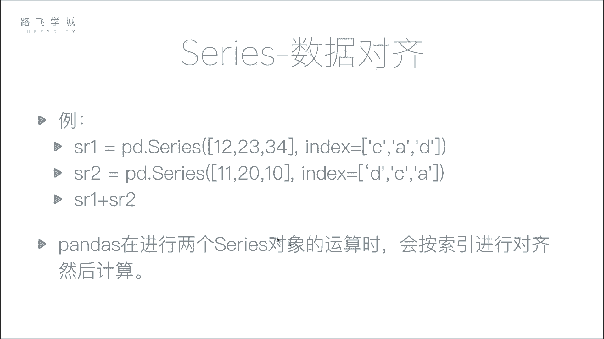
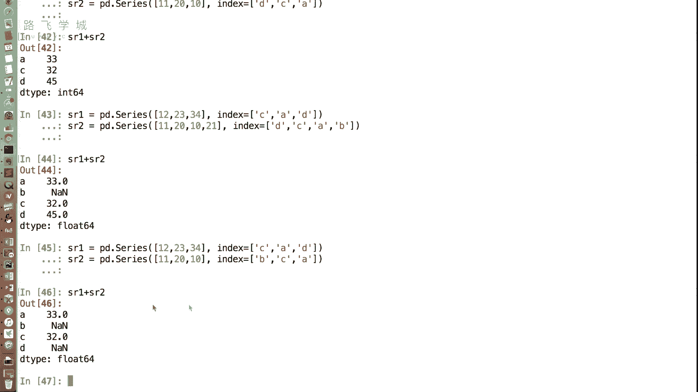
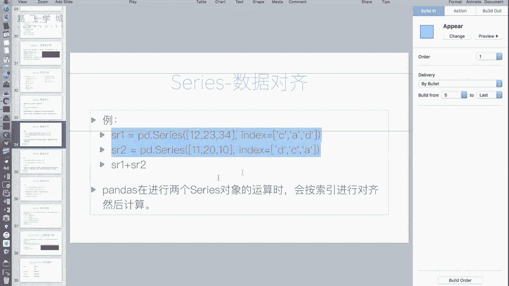
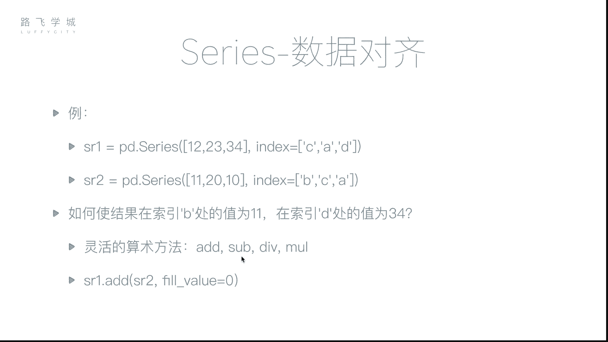
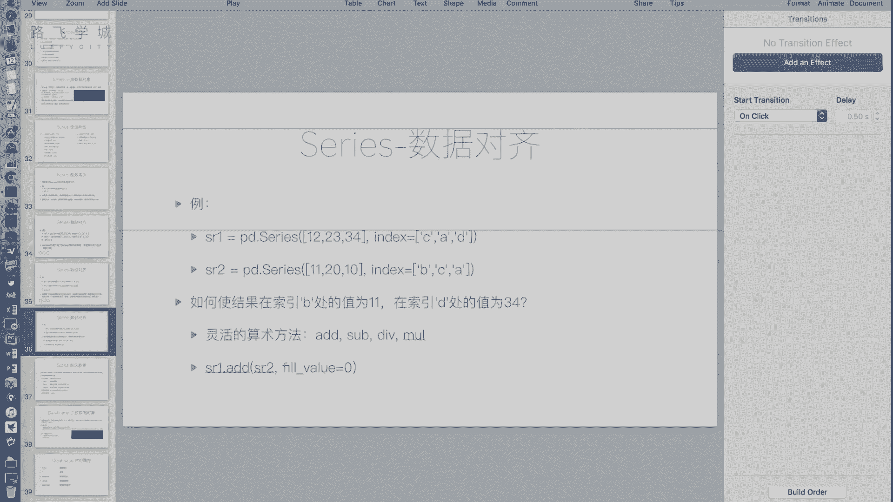
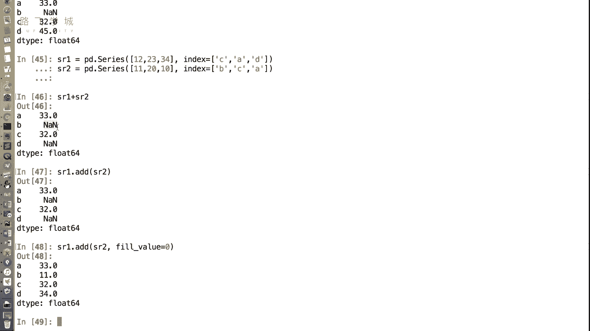

# Python量化交易：P19：Series数据对齐 📊

在本节课中，我们将要学习Pandas Series对象一个非常重要的特性：**数据对齐**。我们将了解当对两个Series进行运算时，Pandas如何根据索引标签自动匹配数据，以及如何处理由此可能产生的数据缺失问题。

---

上一节我们介绍了Series的基本操作，本节中我们来看看Series在进行算术运算时的一个核心机制。

## 数据对齐的概念

在NumPy数组中，运算通常是按位置（即下标）进行的。然而，在Pandas的Series中，运算更倾向于按照**索引标签**进行对齐。这意味着，即使两个Series中数据的顺序不同，只要它们的索引标签能够匹配，Pandas就会自动将它们对应的值进行运算。



**核心公式**：
`Series1 + Series2` 的结果不是 `Series1[i] + Series2[i]`，而是 `Series1[‘label_x’] + Series2[‘label_x’]`。


## 数据对齐示例

让我们通过一个例子来理解。假设我们有两个Series对象：

```python
import pandas as pd

sr1 = pd.Series([12, 23, 34], index=[‘C‘, ‘A‘, ‘D‘])
sr2 = pd.Series([11, 20, 10], index=[‘D‘, ‘C‘, ‘A‘])
```

以下是这两个Series的直观表示：
*   `sr1`: 索引 C=12, A=23, D=34
*   `sr2`: 索引 D=11, C=20, A=10

当我们执行 `sr1 + sr2` 时，Pandas不会简单地将第一个值12和11相加。它会查找相同的索引标签：
*   对于标签 `‘A‘`: 取 `sr1[‘A‘]=23` 和 `sr2[‘A‘]=10`，相加得到 **33**。
*   对于标签 `‘C‘`: 取 `sr1[‘C‘]=12` 和 `sr2[‘C‘]=20`，相加得到 **32**。
*   对于标签 `‘D‘`: 取 `sr1[‘D‘]=34` 和 `sr2[‘D‘]=11`，相加得到 **45**。

最终结果是：`A:33, C:32, D:45`。数据的顺序（C,A,D 对比 D,C,A）完全不影响结果，运算只依赖于索引标签的匹配。这个特性在处理如按日期、按股票代码对齐的数据时非常强大。

## 索引长度不一致与缺失值

在实际数据中，两个Series的索引可能不完全相同。Pandas如何处理这种情况呢？

假设：
```python
sr1 = pd.Series([12, 23, 34], index=[‘A‘, ‘C‘, ‘D‘])
sr2 = pd.Series([11, 20, 10, 5], index=[‘A‘, ‘B‘, ‘C‘, ‘D‘])
```
此时，`sr1` 没有标签 `‘B‘`，而 `sr2` 有。执行 `sr1 + sr2` 时：
*   标签 `‘A‘`, `‘C‘`, `‘D‘` 可以正常对齐并计算。
*   标签 `‘B‘` 只在 `sr2` 中存在，在 `sr1` 中找不到对应项。Pandas会为结果中 `‘B‘` 的位置填入一个特殊值：`NaN`（Not a Number），表示数据缺失。

**核心概念**：`NaN` 在Pandas中被用作**缺失值**的标记。当运算因索引无法对齐而产生数据缺口时，结果中就会出现 `NaN`。

## 灵活运算与填充值

有时，我们并不希望缺失值显示为 `NaN`。例如，在计算员工两个月出勤总天数时，如果某员工第二个月才入职，第一个月没有记录，我们希望将他第一个月的出勤天数视为0，而不是缺失。

Pandas提供了更灵活的算术方法来实现这种控制：



以下是四个主要的灵活运算方法：
*   `add()`: 加法
*   `sub()`: 减法
*   `mul()`: 乘法
*   `div()`: 除法



这些方法接受一个 `fill_value` 参数。当某个索引标签只在一个Series中存在时，可以用 `fill_value` 指定的值来填充“缺失”的那一方，然后再进行运算。





**示例代码**：
```python
# 使用 add 方法，并设置缺失值为0
result = sr1.add(sr2, fill_value=0)
```
执行上述代码后，对于标签 `‘B‘`：
*   `sr1` 中没有 `‘B‘`，用 `fill_value=0` 填充。
*   `sr2` 中 `‘B‘=20`。
*   因此结果中 `‘B‘ = 0 + 20 = 20`，而不再是 `NaN`。

---

本节课中我们一起学习了Series的**数据对齐**特性。我们了解到，Pandas在进行Series运算时，会依据索引标签自动匹配数据，而非简单按位置计算。当索引不一致时，会产生缺失值 `NaN`。最后，我们学习了如何使用 `add()`, `sub()` 等方法的 `fill_value` 参数，灵活地处理这些缺失情况，使数据运算更符合实际业务逻辑。



理解了数据对齐，我们就能够更自如地操作和整合来自不同源或顺序不一致的数据。在下一节课中，我们将具体讲解如何处理这些可能出现的缺失值（NaN）。