# Python量化交易：P20：Series缺失值处理 📊

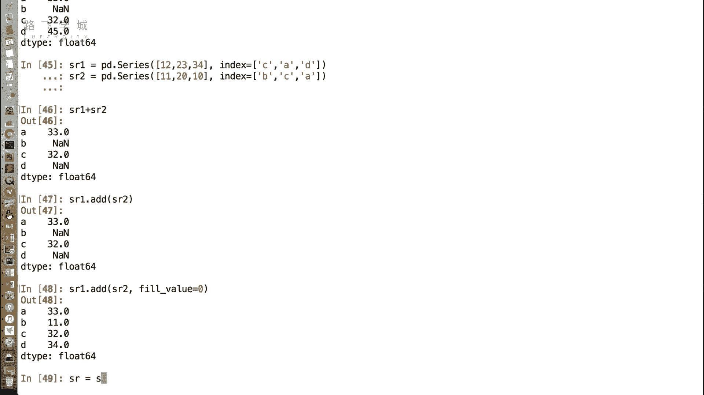

## 概述
在本节课中，我们将要学习如何处理Pandas Series数据结构中的缺失值。缺失值是数据分析中常见的问题，掌握其处理方法对于后续的数据清洗、运算和可视化至关重要。

## 缺失值的概念
在Series中，缺失数据通常以`NaN`（Not a Number）值的形式出现。出现缺失数据时，有时我们可以放任不管，但在进行进一步运算或生成图表时，这些缺失值可能会带来问题，因此需要处理。

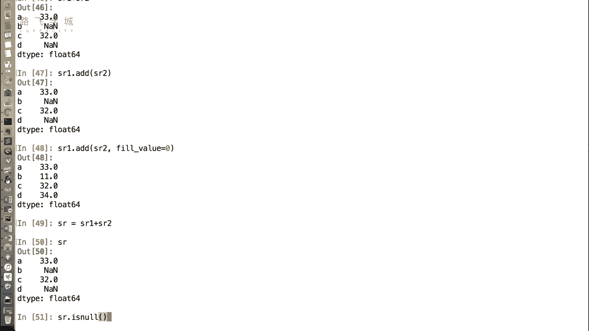

## 缺失值处理方法
处理缺失值主要有两种思路：一是直接删除含有缺失值的行；二是为缺失值填充一个具体的数值。下面我们将详细介绍这两种方法。

### 方法一：删除缺失值
删除缺失值是直接移除包含`NaN`值的行。以下是相关的操作函数。

**1. 判断缺失值**
首先，我们可以使用`isnull()`函数来判断Series中的每个值是否为缺失值。该函数返回一个布尔型Series，其中`True`表示该位置是缺失值，`False`表示不是。

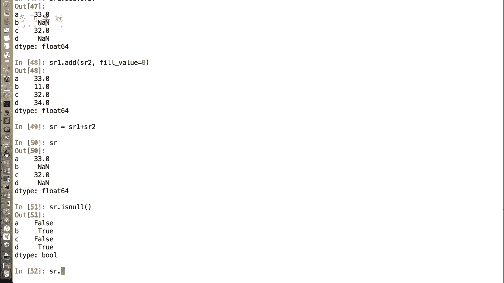

```python
SR.isnull()
```

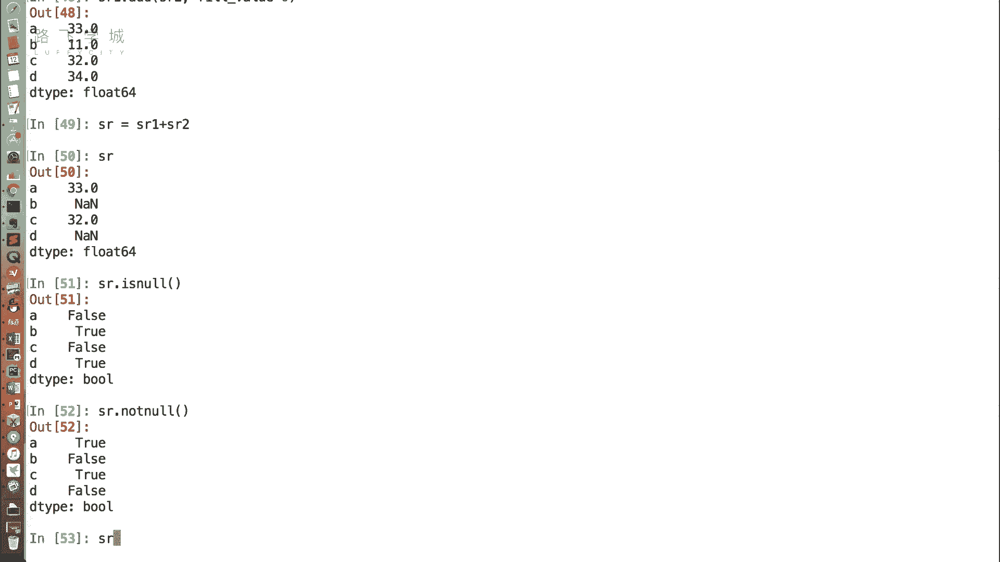

**2. 反向判断**
与之对应的还有一个`notnull()`函数，它的逻辑与`isnull()`相反，即非缺失值返回`True`，缺失值返回`False`。

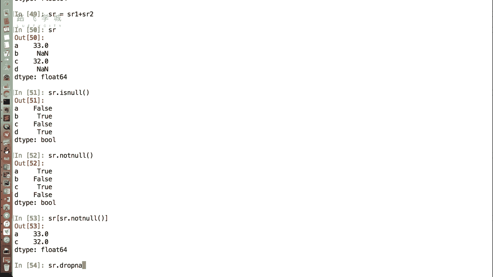

```python
SR.notnull()
```

**3. 基于布尔索引过滤**
利用`notnull()`函数返回的布尔Series，我们可以通过布尔索引来过滤掉所有缺失值。

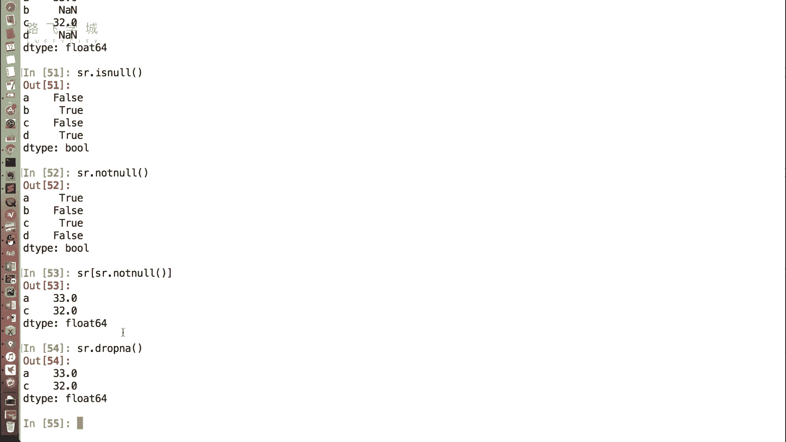

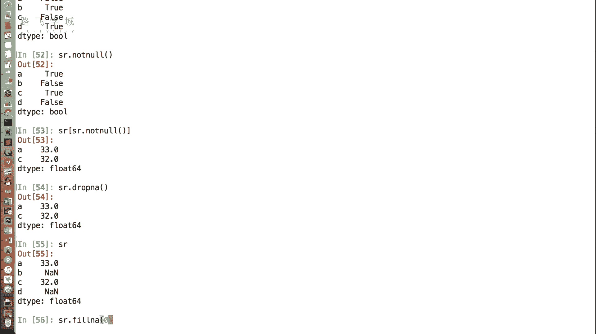

```python
SR[SR.notnull()]
```

**4. 直接删除函数**
Pandas也提供了一个直接删除缺失值的函数`dropna()`，它可以移除所有包含缺失值的行。

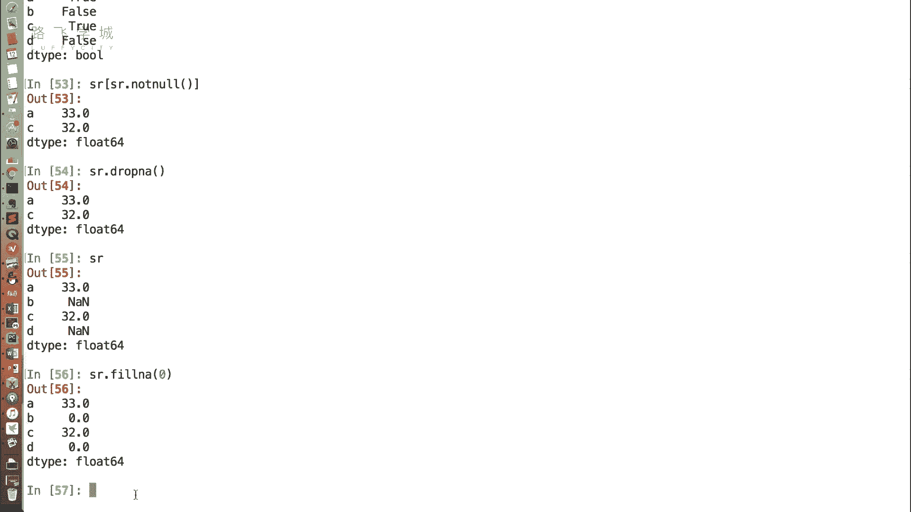

```python
SR.dropna()
```

### 方法二：填充缺失值
填充缺失值是指为`NaN`位置赋予一个具体的数值。这可以通过`fillna()`函数来实现。

**1. 填充固定值**
例如，我们可以将所有缺失值填充为0。

```python
SR.fillna(0)
```

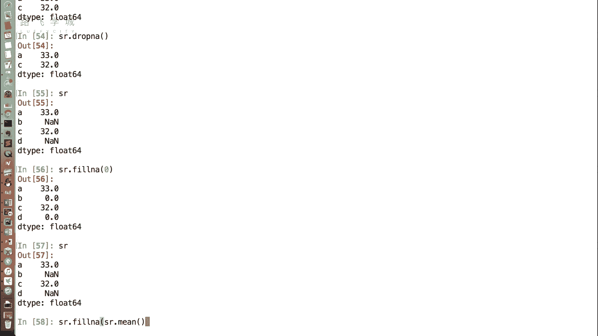

**2. 填充统计值（如平均值）**
有时，填充固定值（如0）可能不符合数据趋势。更合理的做法是填充该列的统计值，例如平均值。Pandas在计算平均值时会自动忽略缺失值，这非常方便。

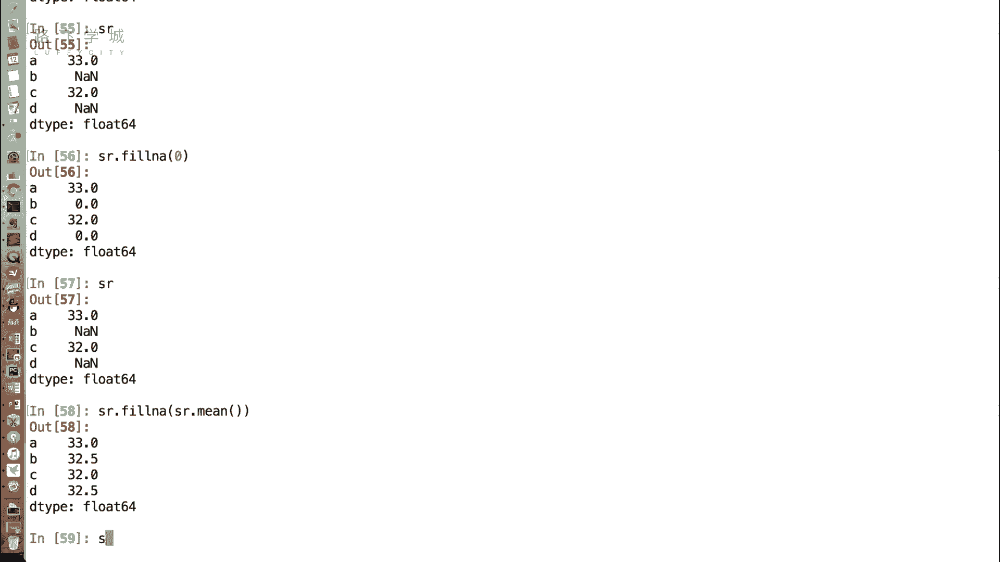

```python
mean_value = SR.mean()
SR.fillna(mean_value)
```

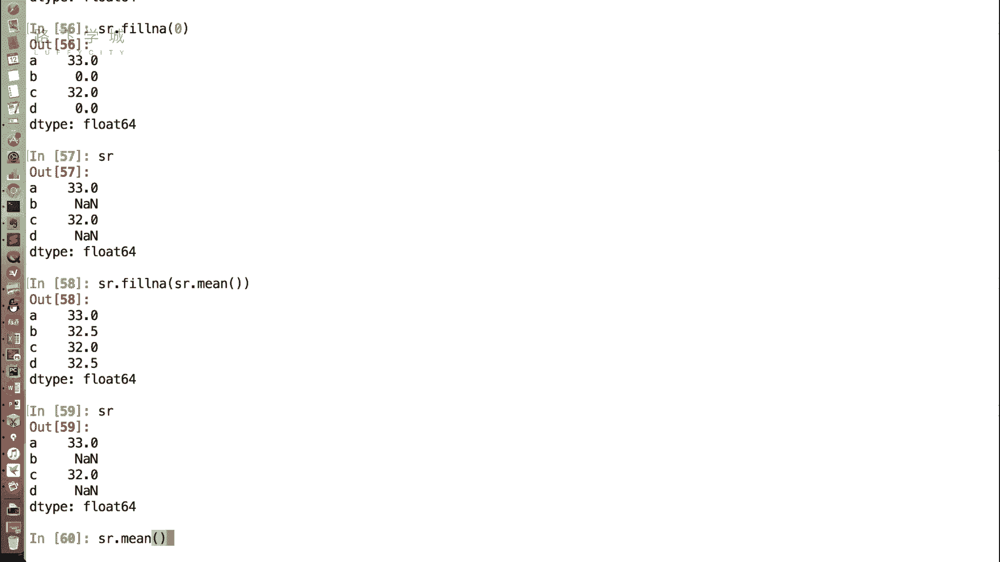

**重要提示**
需要特别注意的是，无论是`dropna()`还是`fillna()`，这些操作默认都不会直接修改原始的Series对象。如果你想保存处理后的结果，必须将返回值赋值给一个新的变量或覆盖原变量。

```python
# 正确做法：保存结果
SR_filled = SR.fillna(0)
```

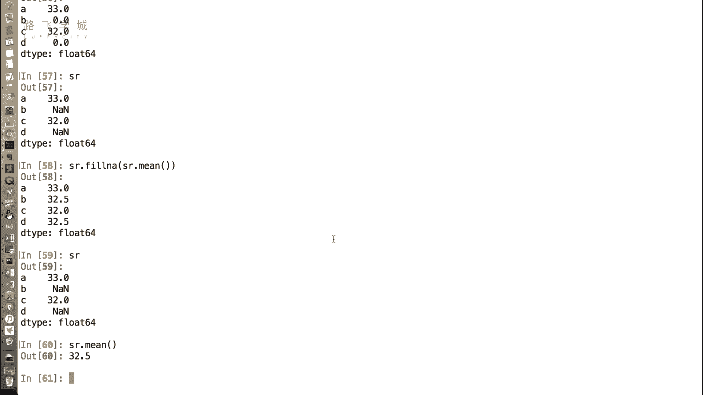

## 总结
本节课我们一起学习了Pandas Series中缺失值的两种核心处理方法：**删除**与**填充**。我们介绍了如何使用`isnull()`、`notnull()`进行判断，使用`dropna()`进行删除，以及使用`fillna()`进行填充。理解并掌握这些方法，是进行数据清洗和准备的关键一步，为后续的量化分析打下坚实基础。