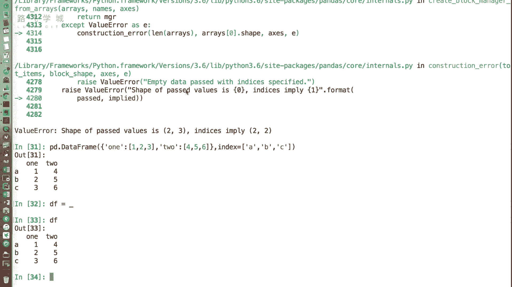
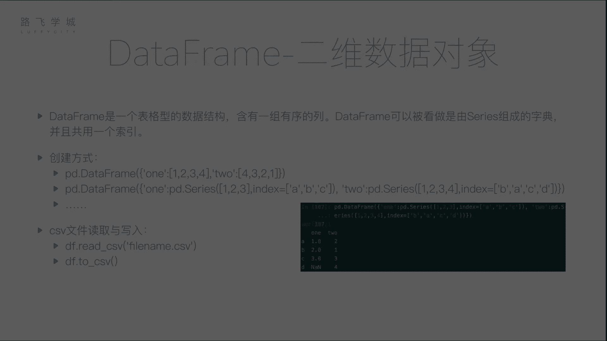
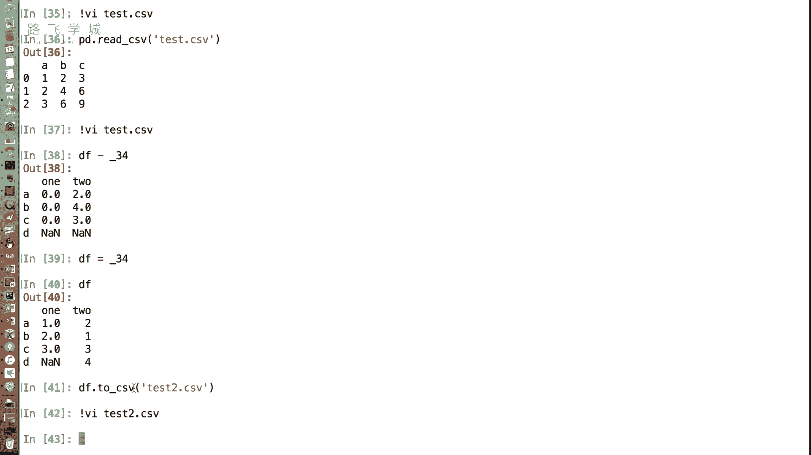

# Python量化交易：P22：DataFrame的创建 📊

在本节课中，我们将要学习Pandas库中的核心数据结构之一：DataFrame。我们将了解它是什么，以及如何通过多种方式来创建它。

上一节我们介绍了Series，它是一种一维的、只有一列的数据结构。但在实际应用中，我们经常需要处理包含多列的表格数据，这是一种二维数据，有行也有列。

## 什么是DataFrame？ 🤔

DataFrame是Pandas中用于处理二维表格数据的主要数据结构。它就像一个Excel表格，包含一组有序的列。每一列都可以是不同的数据类型（如数值、字符串、布尔值等）。

从概念上讲，DataFrame可以看作是由多个Series组成的字典，并且这些Series共享同一个行索引。这为数据的组织和操作提供了极大的便利。

## 如何创建DataFrame？ 🛠️

DataFrame有多种创建方式。以下是几种常见的方法。

### 1. 从字典创建



这是最直观的创建方式之一。字典的键（Key）将成为DataFrame的列名，字典的值（Value）将成为对应列的数据。



**示例代码：**
```python
import pandas as pd

# 字典的值是列表
data = {'one': [1, 2, 3], 'two': [4, 5, 6]}
df = pd.DataFrame(data)
print(df)
```
执行上述代码，会创建一个两列的DataFrame。列`one`的值是`[1, 2, 3]`，列`two`的值是`[4, 5, 6]`。由于没有指定行索引，Pandas会自动生成`0, 1, 2`作为索引。

我们也可以使用`index`参数来指定自定义的行索引标签。

**示例代码：**
```python
df_custom_index = pd.DataFrame(data, index=['a', 'b', 'c'])
print(df_custom_index)
```

### 2. 从嵌套字典或Series字典创建

当字典的值是Series时，Pandas会非常智能地根据Series的索引进行数据对齐。如果某个索引在某个Series中不存在，对应的位置会自动填充为缺失值（NaN）。

**示例代码：**
```python
# 字典的值是Series
data_series = {
    'one': pd.Series([1, 2, 3], index=['a', 'b', 'c']),
    'two': pd.Series([1, 2, 3, 4], index=['b', 'a', 'c', 'd'])
}
df_from_series = pd.DataFrame(data_series)
print(df_from_series)
```
在这个例子中，两个Series的索引不完全一致。Pandas会自动将它们按索引标签对齐。对于行`d`，列`one`没有对应的值，因此显示为NaN。这个特性使得合并不同来源的数据变得非常方便。

### 3. 从文件读取（最常用）

在实际工作中，我们很少手动构建大型DataFrame，更多的是从外部文件（如CSV、Excel）中读取数据。Pandas提供了强大的文件读取功能。

**从CSV文件读取：**
CSV（逗号分隔值）是一种常见的表格数据存储格式。使用`pd.read_csv()`函数可以轻松读取。

假设我们有一个名为`test.csv`的文件，内容如下：
```
A,B,C
1,2,3
2,4,6
3,6,9
```

**示例代码：**
```python
df_from_csv = pd.read_csv('test.csv')
print(df_from_csv)
```
`read_csv`函数默认将文件的第一行作为列名（`A, B, C`），并自动生成行索引（`0, 1, 2`）。这个函数功能非常丰富，我们将在后续课程中详细介绍其各种参数。

**将DataFrame保存到CSV文件：**
使用DataFrame对象的`.to_csv()`方法可以将数据写回CSV文件。

**示例代码：**
```python
df.to_csv('test2.csv', index=False)  # index=False表示不将行索引写入文件
```
除了CSV，Pandas也支持从JSON、Excel、XML等多种格式读取和写入数据，我们会在文件处理的专门章节进行学习。

## 总结 📝

本节课中我们一起学习了Pandas的二维数据结构DataFrame。我们了解到：
*   DataFrame是一个类似于Excel表格的二维数据结构。
*   可以通过**字典**、**Series字典**等多种方式手动创建DataFrame。
*   在实际应用中，最常用的方式是通过`pd.read_csv()`等函数**从文件读取**数据来创建DataFrame。
*   可以使用`.to_csv()`方法将DataFrame**保存到文件**。



DataFrame是进行数据分析和量化交易的核心工具，熟练掌握其创建和基本操作是后续学习的基础。下一节，我们将开始学习如何访问和操作DataFrame中的数据。