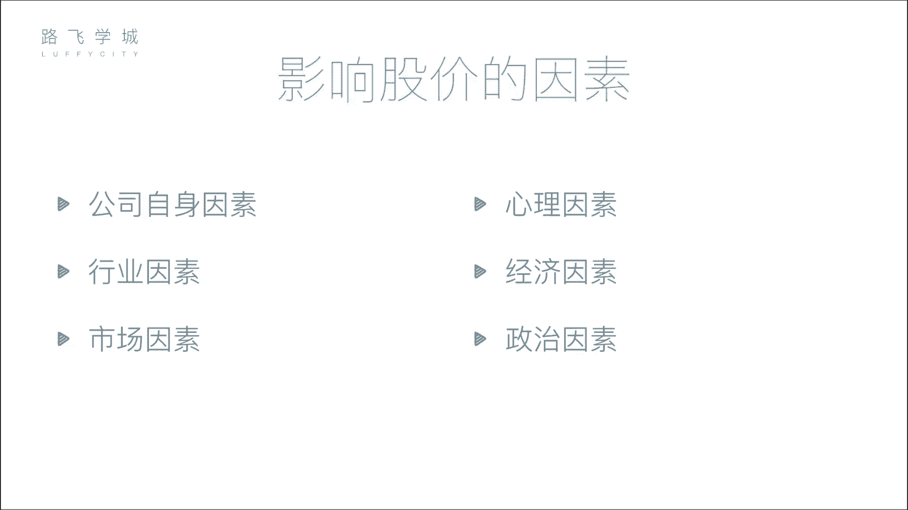

# Python量化交易：P3：03 金融量化分析-股票市场构成 📈

在本节课中，我们将要学习股票市场的构成。了解市场中有哪些参与者以及他们的角色，是进行金融量化分析的基础。我们将逐一介绍公司、投资者、监管机构、交易所和中介机构，并解释中国股票市场的板块划分。

## 公司和投资者

上一节我们介绍了股票的分类，本节中我们来看看股票市场的构成。首先，市场中有公司和投资者。公司是需要融资的一方，投资者是提供资金的一方。公司通过上市向投资者融资。

## 监管与服务机构

公司和投资者不能直接进行交易，这需要一系列机构来确保市场的公平与秩序。

以下是主要的监管与服务机构：

*   **证监会**：这是证券行业的监管机构。公司想要上市，需要向证监会提交各种材料。证监会负责审查公司是否存在违法行为，例如欺诈或洗钱。证监会有行政权力，能决定公司能否上市，甚至可以将已上市的公司退市。
*   **证券业协会**：这个机构的作用相对较弱。它主要负责行业自律和从业人员管理，例如主办证券从业资格考试。
*   **交易所**：交易所提供股票交易的场所。在中国，主要有上海和深圳两家交易所。在早期，交易者需要亲自到交易所排队交易。现在，交易主要通过互联网连接到交易所的系统完成。交易所的核心功能是处理所有买卖股票的请求。

## 证券中介机构

个人投资者通常不能直接在交易所买卖股票，这需要通过证券中介机构，也就是我们常说的券商。

这背后的原因与历史和发展有关。在早期，交易所通过出售价格高昂的“交易席位”来限制直接参与者。拥有席位的机构（如大型券商）为了赚回席位费，便代理众多小投资者进行交易，逐渐形成了现在的券商模式。

现在，投资者需要在券商（如中信证券、中金公司等）开户，并使用它们提供的软件（如同花顺）下达交易指令。券商通过其在交易所的席位，将投资者的指令传递给交易所执行。

## 中国交易所与板块

中国的交易所有两个：上海证券交易所和深圳证券交易所。每个交易所内部又划分为不同的板块。

以下是各交易所的板块划分：

*   **上海证券交易所**：主要有一个**主板**。
*   **深圳证券交易所**：分为三个板块：
    *   **主板**
    *   **中小板**：为规模较小但发展较好的公司提供融资渠道。
    *   **创业板**：为创业型、成长性高的公司提供融资渠道，上市门槛相对主板较低。

主板上市要求严格（例如对净利润有较高要求），而创业板等板块的要求相对宽松，旨在鼓励创新和小型企业的发展。

## 大盘指数

对于每一个板块，我们常用一个“大盘指数”来反映其整体表现。

指数反映了该板块内所有股票的综合表现。例如，上海主板的大盘指数是**上证指数（沪指）**。深圳各板块则分别有**深证成指（深成指）**、**中小板指**和**创业板指**。

可以将指数理解为一个“股票包”的平均值或趋势图。它概括了整个市场的资金流向和总体情绪，是判断市场整体向好还是向坏的重要指标，而不必逐一分析成千上万只个股。

---

本节课中我们一起学习了股票市场的核心构成。我们认识了市场中的主要参与者：融资的公司、投资的个人、进行监管的证监会、提供交易场所的交易所以及连接投资者与交易所的券商。同时，我们也了解了中国两大交易所及其不同的板块划分，并明白了大盘指数作为市场整体“温度计”的意义。这些基础知识是后续进行量化分析和策略开发的重要前提。