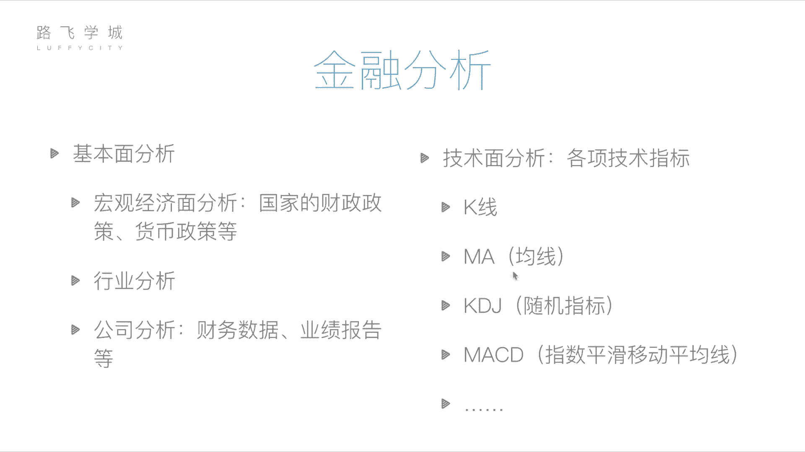
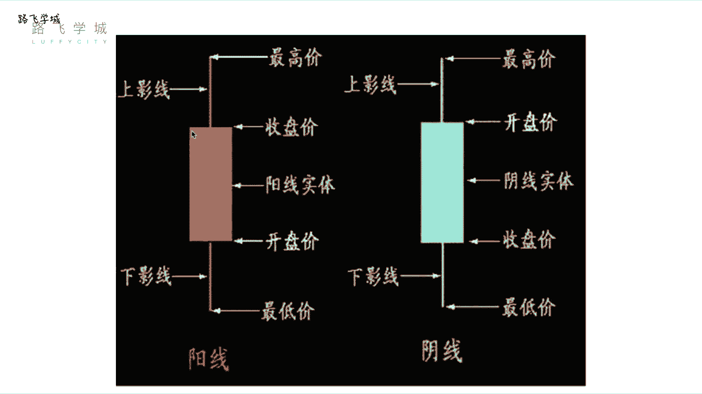
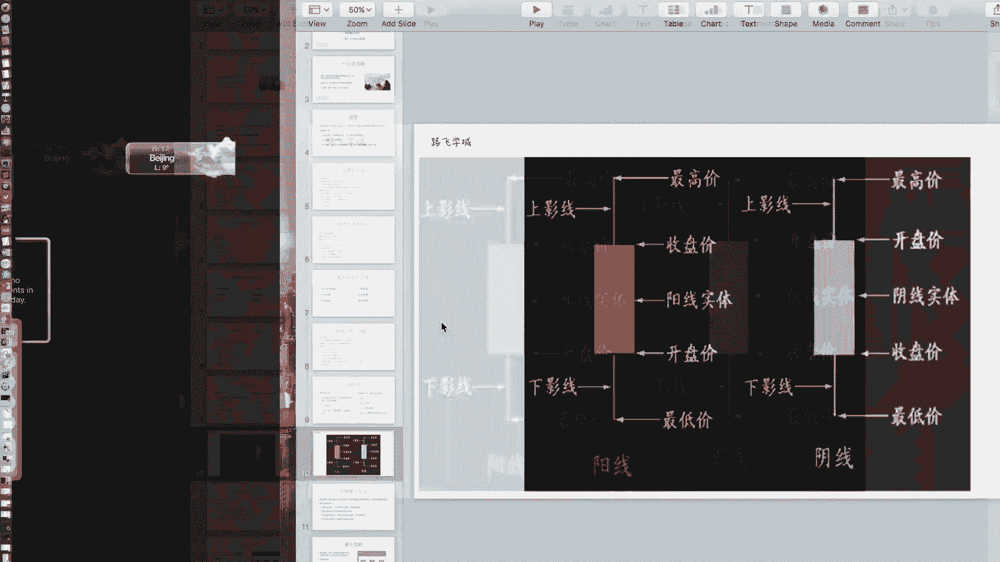
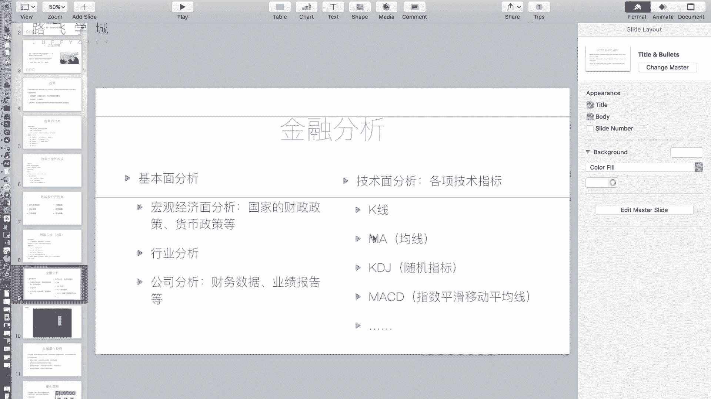
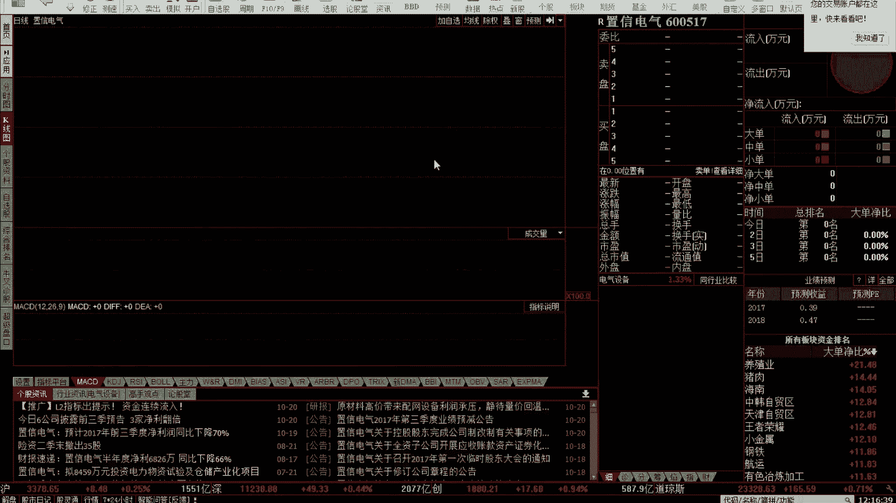
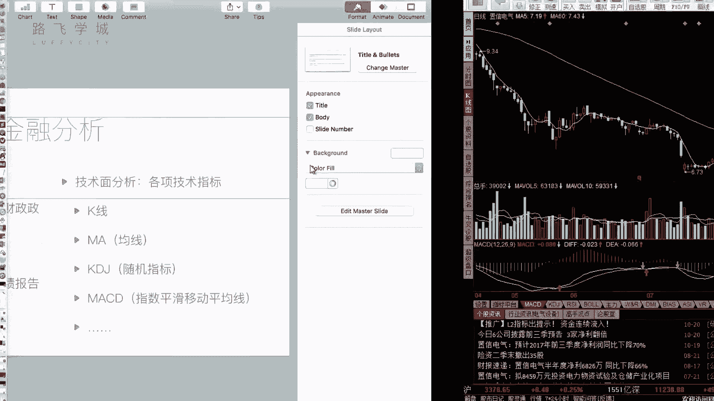

# Python量化交易：P5：05 金融量化分析-金融分析 📈

在本节课中，我们将要学习金融分析的核心方法。金融分析是判断股票买卖时机、评估投资价值的关键手段，主要分为基本面分析和技术面分析两大类。

上一节我们介绍了金融和股票的基础知识，本节中我们来看看如何运用这些知识进行具体的分析，以避免盲目投资。

## 基本面分析

基本面分析的核心是评估公司的内在价值，主要依据公司的运营状况、财务状况以及宏观经济环境。其逻辑是：一家运营良好、持续盈利的公司，其股票长期来看更有价值。

以下是基本面分析的三个主要层面：

1.  **宏观经济面分析**：分析国家整体的财政政策、货币政策等宏观因素，判断经济周期和资金流向。例如，判断政策是鼓励投资还是鼓励储蓄。
2.  **行业分析**：评估特定行业（如科技、教育、能源）的整体发展前景和景气度。可以通过观察该行业内代表性股票的走势来辅助判断。
3.  **公司分析**：这是最具体的一环。投资者需要深入研究目标公司的公开信息，特别是其定期发布的财务报表（财报）。财报数据经过审计，相对客观，可以反映公司的盈利能力、偿债能力和成长性。

## 技术面分析

技术面分析与公司内在价值无关，其核心假设是“市场行为包容消化一切”。它认为所有已知和未知的信息都已经反映在股票价格的历史走势中。因此，技术分析主要通过研究历史价格和交易量数据，来预测未来的价格动向。

技术分析依赖于各种技术指标。以下是两个最基础且重要的指标：

### K线图

K线图是记录股票每日价格变动的图表。一根K线包含了四个关键价格：开盘价（Open）、收盘价（Close）、最高价（High）和最低价（Low）。

*   **阳线**（通常为红色或空心）：表示当日股价上涨，即收盘价高于开盘价。其实体的下端是开盘价，上端是收盘价。
*   **阴线**（通常为绿色或实心）：表示当日股价下跌，即收盘价低于开盘价。其实体的上端是开盘价，下端是收盘价。

无论是阳线还是阴线，从实体向上延伸的细线称为“上影线”，其顶端代表当日最高价；向下延伸的细线称为“下影线”，其底端代表当日最低价。

**公式表示单日价格关系**：
`最高价 >= (开盘价, 收盘价) >= 最低价`

特殊的K线形态，如“十字星”（开盘价等于收盘价）或“光头光脚阳线”（无影线），都具有特定的市场含义。

### 移动平均线（MA）

移动平均线是通过计算过去一段时间内股价的平均值，来平滑价格走势、显示趋势方向的指标。它是一条连续的趋势线。

常见的均线有5日均线（MA5）、10日均线（MA10）、60日均线（MA60）等。数字代表计算平均值所取的天数。

**计算公式（以N日简单移动平均线为例）**：
`MA(N) = (P1 + P2 + ... + PN) / N`
其中，`P1` 代表今日的收盘价，`P2` 代表昨日的收盘价，以此类推，`PN` 代表N-1天前的收盘价。这个计算每天都会向前移动，因此称为“移动”平均。

例如，MA5的值就是过去5个交易日收盘价的平均值。将每天的MA值连接起来，就形成了均线。短期均线（如MA5）对价格变化更敏感，长期均线（如MA60）则更能代表长期趋势。

---

本节课中我们一起学习了金融分析的两大支柱：基本面分析和技术面分析。基本面分析帮助我们从公司价值和宏观环境的角度挑选股票，而技术面分析则为我们提供了通过历史价格图表和指标来寻找买卖时机的方法。理解K线和均线是踏入技术分析大门的第一步。