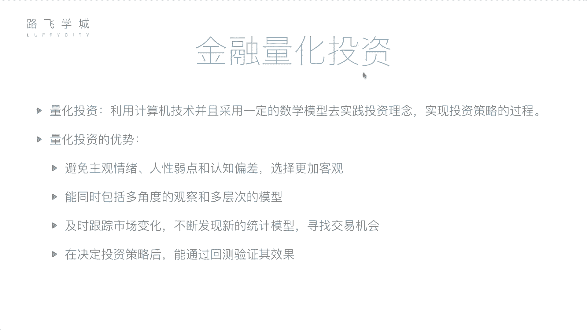
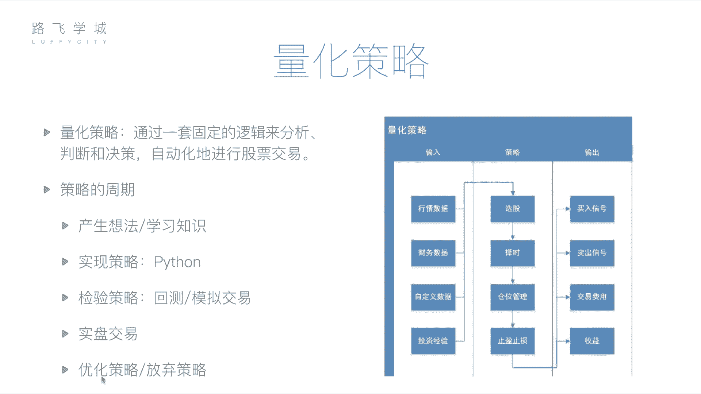

# Python量化交易：P6：06 金融量化分析-金融量化投资介绍 📈

## 概述
在本节课中，我们将学习金融量化投资的核心概念。我们将了解什么是量化投资，它与传统人工投资相比有哪些优势，并深入探讨量化策略的构成要素及其完整的生命周期。通过本节内容，你将建立起对量化交易系统的基本认知框架。

## 量化投资的概念
上一节我们介绍了金融分析的基本面与技术面方法。本节中，我们来看看如何将这些分析方法自动化。

金融分析是通过基本面或技术面对公司及股票做出判断的过程。这个判断过程可以交由计算机来完成。无论是基本面分析所需的财务报表，还是技术面分析所需的历史价格与交易记录，这些数据都可以被获取。利用计算机来执行这些分析的过程，就称为**量化投资**或**量化分析**。

所谓量化投资，是指**利用计算机技术，并采用一定的数学模型，去实践投资理念，实现投资策略的过程**。它包含三个重要部分：
1.  **计算机技术**：即使用计算机编程的方式。
2.  **数学模型**：即具体的策略或套路，例如均线（Moving Average）就是一个数学模型。其公式可以表示为：
    `MA(n) = (P1 + P2 + ... + Pn) / n`
    其中，`P`代表价格，`n`代表周期数。
3.  **实践**：使用编写好的计算机程序去真实执行投资，或预先进行测试以验证策略的可靠性。

## 量化投资的优势
相较于传统的人工投资，量化投资具有以下显著优势：

以下是量化投资的主要优势列表：
1.  **避免主观情绪干扰**：人类投资者容易受到情感、人性弱点和认知偏差的影响。例如，可能因持有某支股票时间过长而产生感情，在应该卖出时犹豫不决；或者因股票短期连续下跌而产生恐慌，在低点错误抛售。量化投资基于预设的规则和数据进行决策，选择更加客观。
2.  **强大的信息处理能力**：计算机能够同时从多角度、多层次观察市场。它可以快速分析大量股票的多维度信息（如均线、财报、行业数据等），而人类难以同时处理如此庞杂的信息。量化策略本质上是将投资者的经验“套路”转化为程序，从而高效地在全市场筛选机会。
3.  **及时跟踪与发现机会**：市场每时每刻都在变化。计算机程序可以7x24小时不间断地监控市场，一旦发现符合策略的买卖机会，其反应和执行速度远超人工。此外，程序也更容易尝试和集成新的策略或通过机器学习优化模型。
4.  **可进行历史回测验证**：在将策略投入真实交易前，可以通过**回测**来检验其历史表现。回测是指将制定好的策略应用于历史数据中，模拟在过去一段时间内的交易，从而评估该策略是盈利还是亏损。通过多次回测和调整，可以在相当程度上验证策略的有效性，降低实盘交易的风险。




## 量化策略的核心构成
理解了量化投资的基础后，我们来看看其核心——量化策略。一个完整的量化策略主要包括输入、处理逻辑和输出三部分。

### 策略输入（数据源）
策略需要数据来进行分析和判断。主要的数据输入包括：
*   **行情数据**：股票的历史交易数据，如每日的开盘价、收盘价、最高价、最低价、成交量等。
*   **财务数据**：上市公司的财务报表数据，如利润表、资产负债表等。
*   **自定义数据**：任何可量化的、可能影响股价的因素。例如，通过自然语言处理分析的公司相关新闻舆情（正面/负面）；甚至是一些非传统的指标（如所谓的“玄学”指标）；以及投资者个人的经验规则。

### 策略处理（核心逻辑）
策略程序拿到数据后，主要执行以下四类任务：
1.  **选股**：从数千只股票中，依据策略规则筛选出目标股票。代码逻辑可能类似于：
    ```python
    # 伪代码示例：筛选市盈率低于20且近期上涨的股票
    selected_stocks = []
    for stock in all_stocks:
        if stock.PE_ratio < 20 and stock.trend == 'up':
            selected_stocks.append(stock)
    ```
2.  **择时**：决定买卖的具体时机，目标是“低买高卖”。
3.  **仓位管理**：决定资金在不同股票之间的分配比例。例如，对上涨概率判断更高的股票分配更多资金。
4.  **止盈止损**：必要的风险控制手段。
    *   **止损**：当亏损达到预定比例（如-10%）时自动卖出，防止损失扩大。
    *   **止盈**：当盈利达到预定比例（如+30%）时自动卖出，锁定利润，避免回落。

### 策略输出（执行与反馈）
策略运行后会产生输出，用于指导或执行交易：
*   **交易信号**：产生“买入”或“卖出”指令。这个信号可以提示给投资者，也可以直接通过API接口发送给券商系统进行自动化交易。
*   **交易费用与收益报告**：计算每次交易产生的佣金、手续费等成本，并汇总计算策略的净收益、收益率等各项绩效指标。

## 量化策略的生命周期
一个量化策略从构思到应用，通常会经历一个完整的周期，如下图所示：



以下是该周期的各个阶段：
1.  **产生想法**：策略的起点，可能源于投资经验、新学的技术指标或任何灵感。
2.  **策略实现**：将想法通过编程（如使用Python）转化为可执行的计算机程序。
3.  **回测验证**：使用历史数据检验策略在过去的表现，这是评估策略有效性的关键步骤。
4.  **模拟交易**：在当下市场环境中，用实时数据但虚拟资金进行交易演练，进一步验证策略在近期市场的适应性。
5.  **实盘交易/策略迭代**：经过充分验证后，将策略投入真实资金进行交易。在此过程中，仍需持续监控，并根据表现对策略进行优化调整，或决定是否放弃并开发新策略。

## 总结
本节课中，我们一起学习了金融量化投资的基础知识。我们明确了量化投资是利用计算机和数学模型执行投资策略的过程，并分析了其客观、高效、可回测的优势。我们深入剖析了量化策略的三大组成部分：数据输入、核心处理逻辑（选股、择时、仓位管理、止盈止损）以及结果输出。最后，我们了解了策略从构思、实现、验证到实盘应用的完整生命周期。


接下来，我们将开始学习如何使用Python工具来实现这些量化策略。在进入具体编程之前，我们会先介绍几个关键的数据分析模块，它们是构建我们量化交易系统的强大工具。