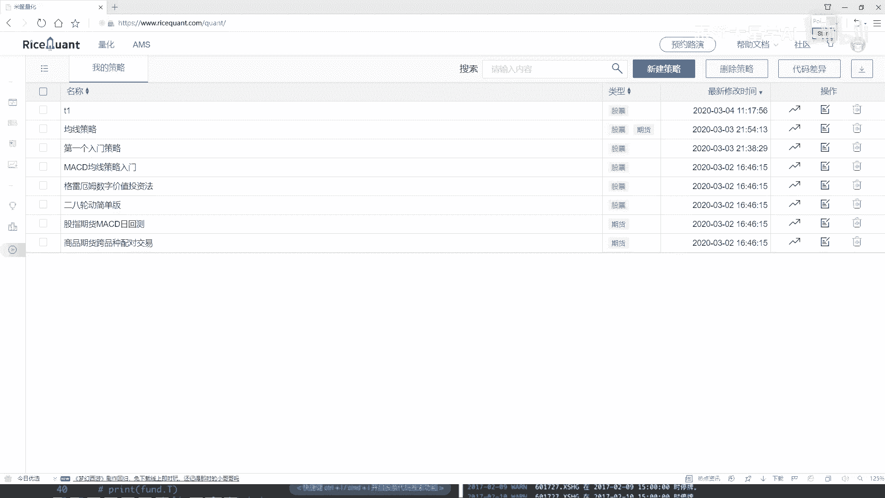
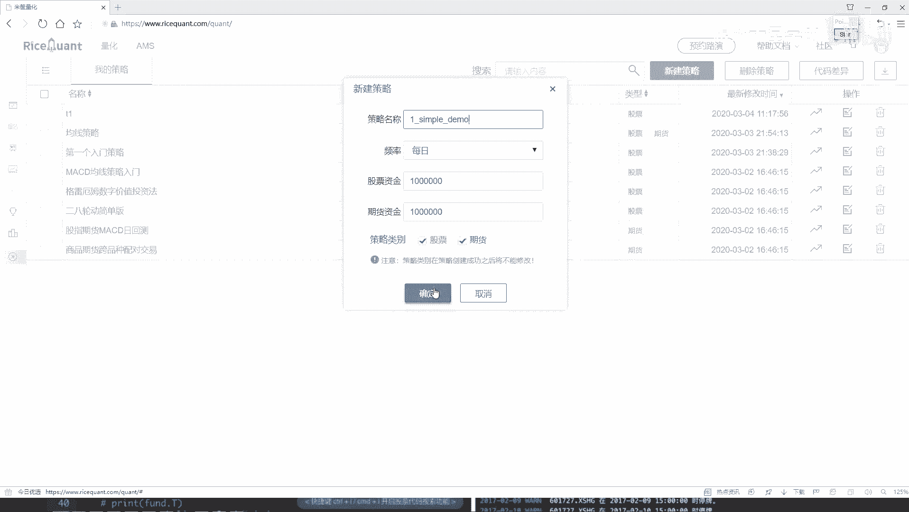
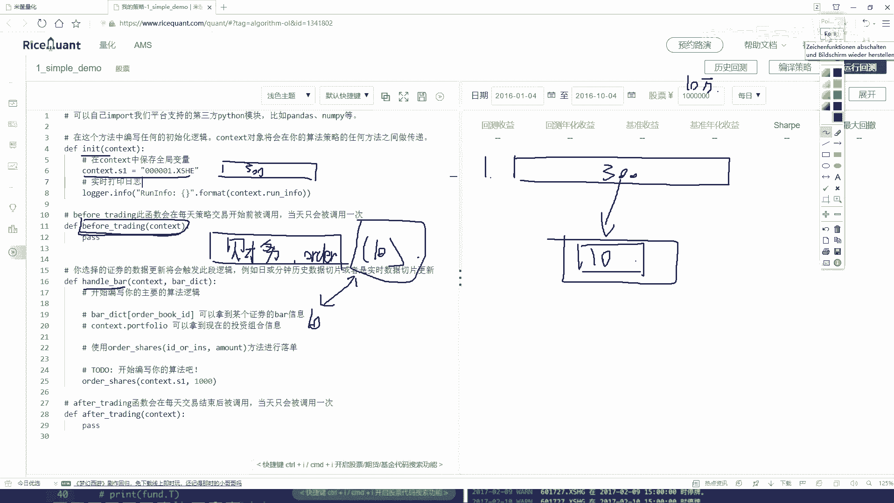
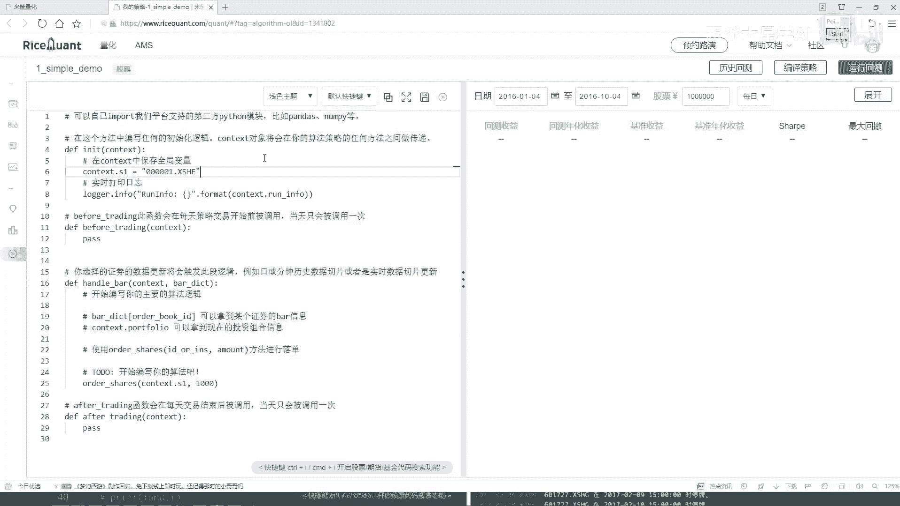

# 量化交易入门：P21：06-Ricequant回测选股分析实战-1-策略任务分析

在本节课中，我们将学习如何使用Ricequant平台构建一个简单的量化交易策略。我们将通过一个具体任务——从沪深300指数中动态选择并持有表现最好的10只股票——来熟悉平台的核心API和策略编写流程。



## 策略目标概述



我们的目标是设计一个策略，始终持有沪深300指数中表现最好的10只股票。这个“最好”的标准可以基于财务指标（例如净利润）来定义。策略需要每天更新持仓，卖出不再属于“最好”行列的股票，并买入新进入“最好”行列的股票。

## 策略模块与任务分解

上一节我们介绍了策略的基本框架，本节中我们来看看如何将我们的目标分解到各个模块中。

Ricequant的策略通常包含三个主要函数：`initialize`（初始化）、`before_trading_start`（盘前处理）和`handle_bar`（盘中处理）。以下是每个模块需要完成的任务：

### 1. 初始化函数 `initialize`

在初始化函数中，我们需要设定策略的初始状态。对于我们的任务，核心工作是获取股票池。

*   **获取股票池**：我们需要获取沪深300指数的所有成分股，作为我们后续筛选的基础股票池。这通常在策略开始时执行一次。

### 2. 盘前处理函数 `before_trading_start`

这个函数在每个交易日开始前（开盘前）被调用。所有与当日交易决策相关、但不涉及实际下单的数据准备和计算工作都应放在这里。

*   **获取财务数据**：从股票池中获取我们关心的财务指标数据，例如每只股票的净利润。
*   **排序与筛选**：根据获取的财务数据（如净利润）对股票池中的所有股票进行排序，并选出排名前10的股票代码。

### 3. 盘中处理函数 `handle_bar`

这个函数在交易时间内的每个Bar（例如每分钟、每天）被调用，是执行实际交易逻辑的地方。

*   **检查当前持仓**：获取当前账户中已经持有的所有股票。
*   **对比与调仓**：
    *   对比当前持仓的股票列表与`before_trading_start`中计算出的“最好10只股票”列表。
    *   卖出那些不在新列表中的持仓股票。
    *   用卖出所得资金，买入那些在新列表中但尚未持有的股票。

## 策略逻辑流程图

为了更清晰地理解整个策略的运行流程，我们可以参考以下示意图：


流程从**初始化**开始，设定股票池。每个交易日，先执行**盘前处理**，计算当日最优股票组合。然后在交易时段，**盘中处理**函数会根据盘前计算的结果，执行具体的**调仓操作**（卖出旧股，买入新股），使持仓始终与最优组合保持一致。

## 创建策略文件

现在，让我们在平台上开始创建策略。

首先，在策略列表页面点击“新建策略”按钮。


在弹出的窗口中，为策略命名，例如 `simple_demo`，并选择股票作为交易品种。点击确定后，平台会生成一个包含基础代码框架的编辑界面。

## 代码框架预览

生成的代码框架已经包含了我们之前提到的三个核心函数。我们的工作就是在这个框架内，填充实现上述分解的任务逻辑。

```python
def initialize(context):
    # 在这里写初始化代码，例如获取沪深300股票池
    pass

def before_trading_start(context, data):
    # 在这里写盘前处理代码，例如获取财务数据并排序选股
    pass

def handle_bar(context, data):
    # 在这里写交易逻辑，例如检查持仓并执行调仓
    pass
```

## 总结

本节课中我们一起学习了如何为一个具体的量化交易任务——动态持有最优10股——进行策略分析和任务分解。我们明确了策略的目标，并将其逻辑合理地分配到了`initialize`、`before_trading_start`和`handle_bar`三个核心函数中：



1.  **`initialize`**：负责一次性初始化工作，如设定股票池。
2.  **`before_trading_start`**：负责每个交易日的盘前数据准备与计算。
3.  **`handle_bar`**：负责执行基于盘前计算结果的实时交易指令。



通过这个清晰的框架，即使对于初学者，也能按部就班地开始编写和实现策略代码。在接下来的课程中，我们将具体实现每个函数中的代码。