# Python金融量化：P10：NumPy数组基础 🧮

在本节课中，我们将要学习金融量化分析的核心工具之一——NumPy。NumPy是Python中进行高性能科学计算和数据分析的基础包，也是后续学习Pandas等高级库的基石。我们将重点了解其核心数据结构——数组（ndarray），并通过实例感受其强大的批量计算能力。


## 为什么要使用NumPy？ 🤔


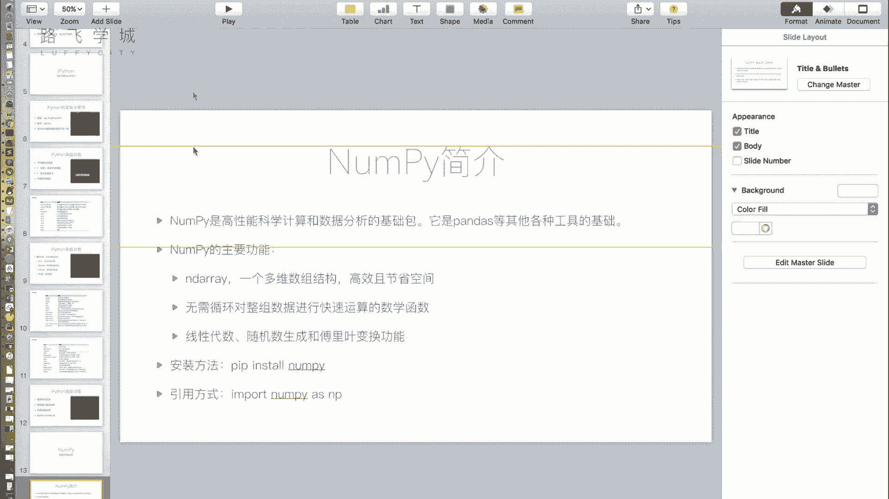


上一节我们提到了NumPy的重要性，本节中我们通过具体例子来看看它为何如此高效。


假设我们已知50家跨国公司的市值（以百万美元为单位），需要将其全部转换为人民币（假设汇率为6.8）。使用传统的Python列表方法，我们需要编写循环或列表推导式。

```python
import random
# 模拟50家公司的市值（百万美元）
a = [random.uniform(100, 200) for _ in range(50)]
# 传统方法：使用列表推导式转换为人民币
b = [value * 6.8 for value in a]
```

然而，使用NumPy可以极大地简化这一过程：

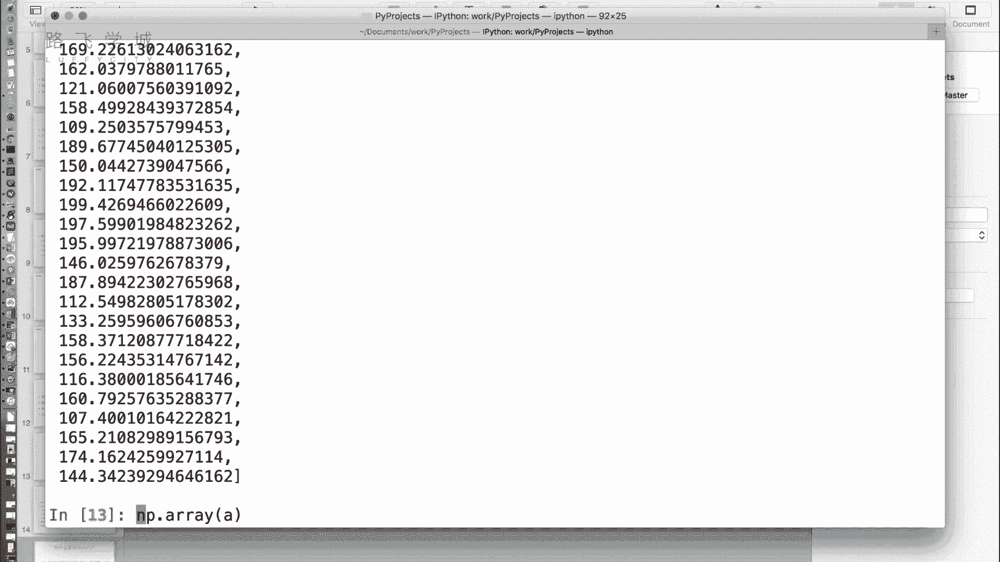

```python
import numpy as np
# 将列表转换为NumPy数组
a_np = np.array(a)
# 直接进行数组与标量的乘法
result = a_np * 6.8
```


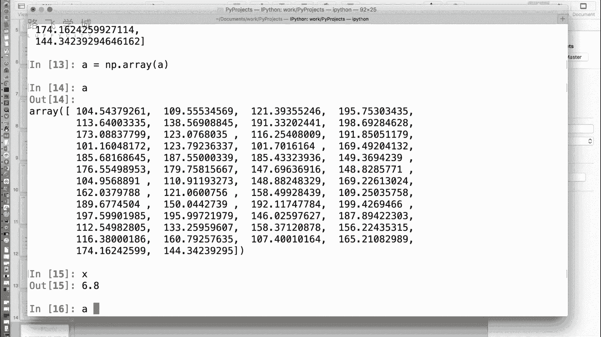

可以看到，NumPy允许我们直接对整个数组进行运算，无需显式循环，代码简洁且执行效率更高。

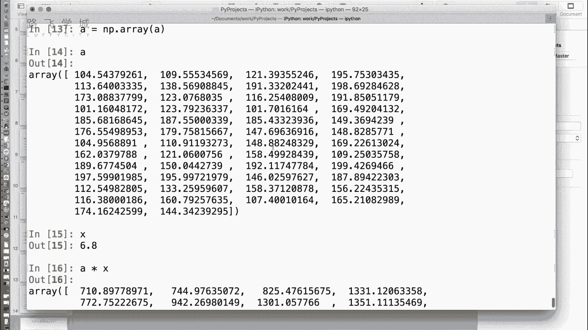

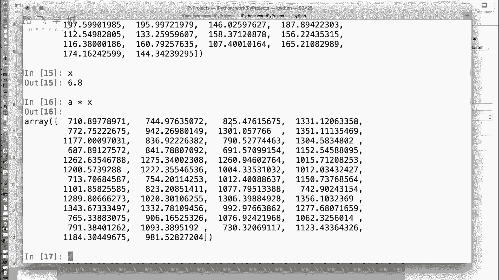

再看另一个例子：已知购物车中每件商品的价格和对应件数，求总金额。


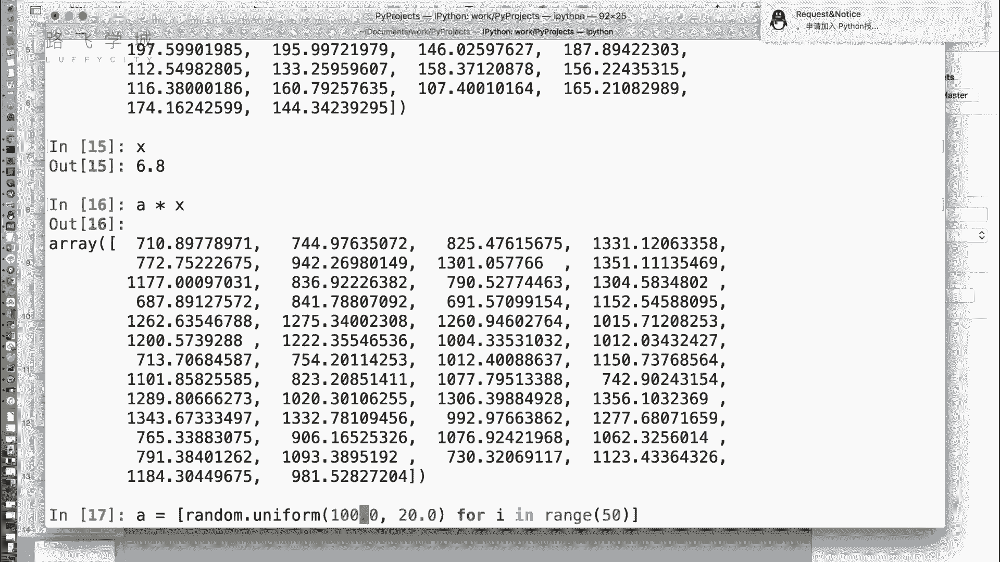

```python
# 商品价格列表（50件商品）
prices = [random.uniform(10, 20) for _ in range(50)]
# 商品件数列表
counts = [random.randint(1, 10) for _ in range(50)]

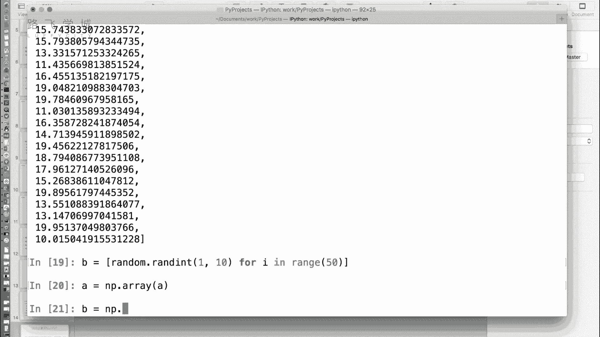

# 转换为NumPy数组
prices_np = np.array(prices)
counts_np = np.array(counts)
# 对应元素相乘得到每件商品的总价，再求和
total = (prices_np * counts_np).sum()
```

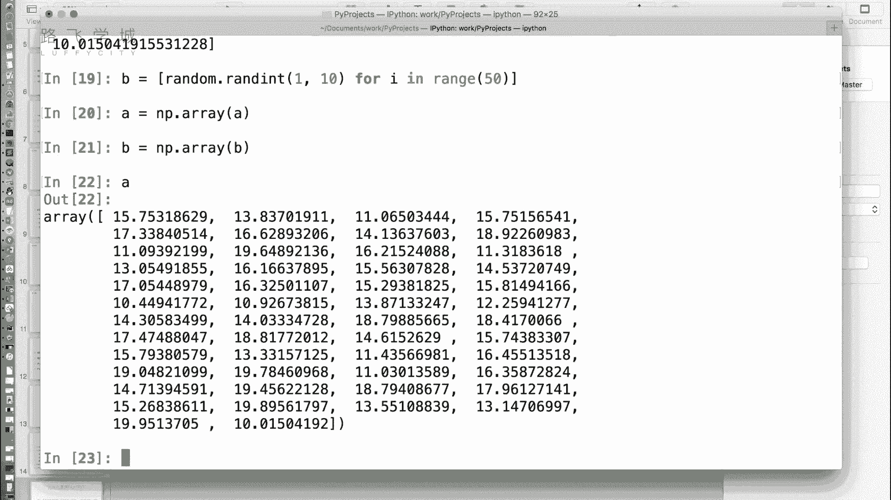


NumPy的数组运算不仅代码简洁，而且底层由C语言实现，计算速度远超纯Python循环。接下来，我们将深入探讨NumPy数组的核心概念。


## NumPy核心：ndarray对象 📦

上一节我们通过例子感受了NumPy的便捷，本节中我们来正式认识其核心——ndarray（N-dimensional array，N维数组）对象。

创建数组非常简单，使用 `np.array()` 函数，并传入一个列表或其他可迭代对象即可。


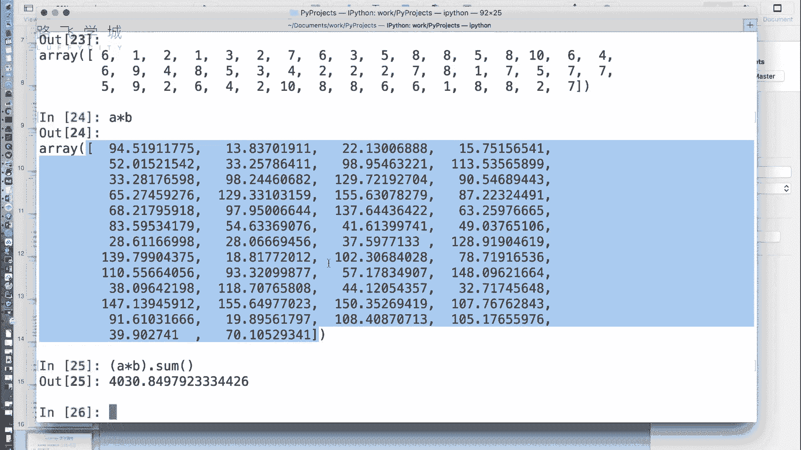


```python
import numpy as np
arr1 = np.array([1, 2, 3, 4, 5])  # 从列表创建
arr2 = np.array(range(10))        # 从range对象创建
```

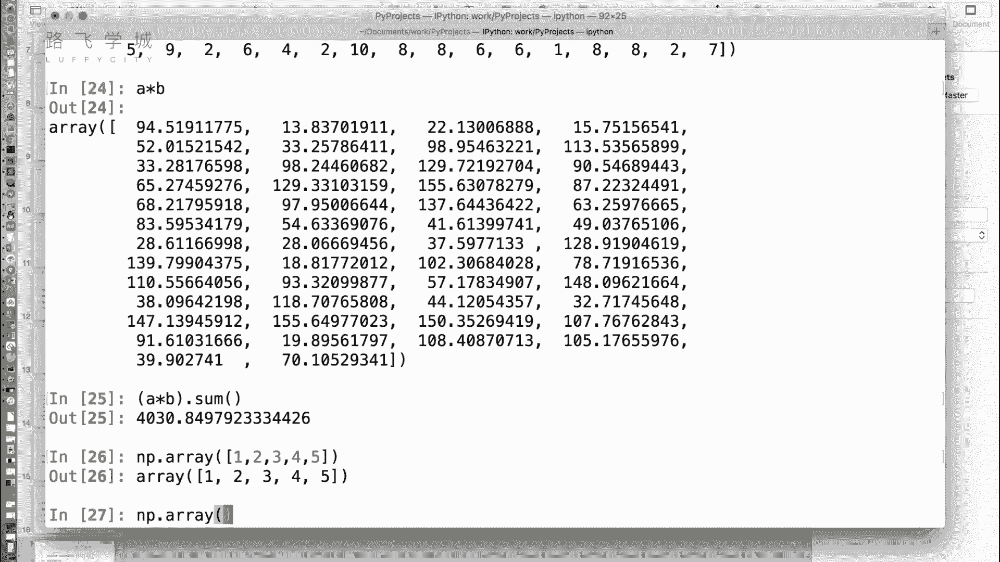

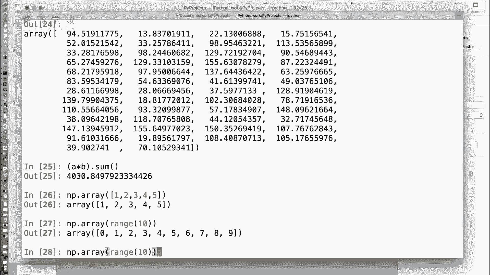

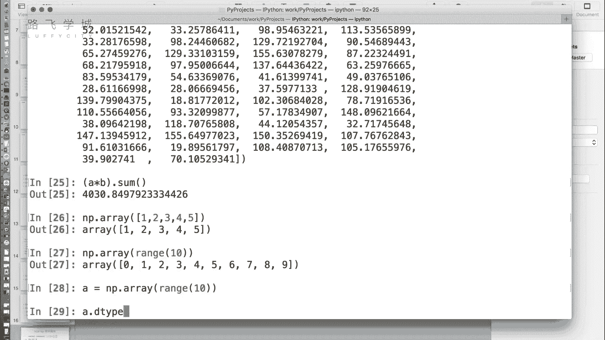

NumPy数组与Python列表有两大关键区别：
1.  **元素类型必须相同**：数组中的所有元素必须是相同的数据类型（如全是整数或全是浮点数）。而Python列表可以混合存放字符串、数字等不同类型。
2.  **大小不可变**：数组一旦创建，其大小（元素个数）就固定了，不能像列表那样随意使用 `append()` 添加元素。这种设计与其高效的内存布局和计算性能密切相关。


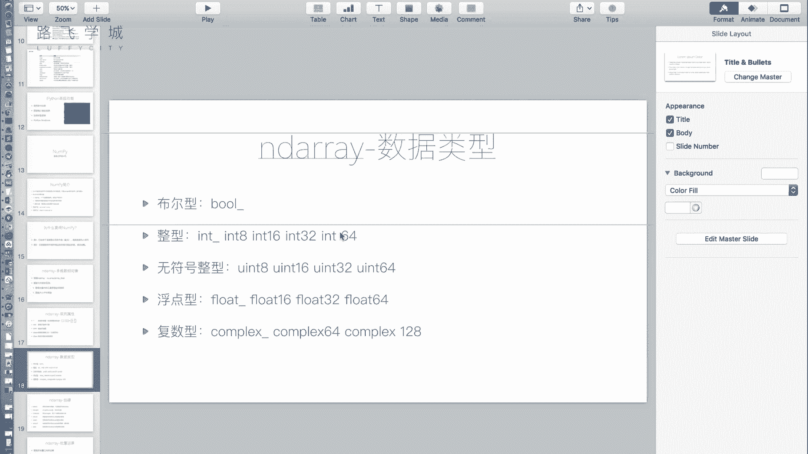

## 数组的常用属性 🔍

了解了数组的基本概念后，我们来看看如何查看和操作数组的各种属性。

以下是查看数组信息的几个关键属性：
*   **`dtype`**: 查看数组中元素的数据类型。
*   **`size`**: 查看数组中元素的总个数。
*   **`shape`**: 查看数组的维度形状，返回一个元组。
*   **`ndim`**: 查看数组的维数。
*   **`T`**: 获取数组的转置（对二维及以上数组有效）。


让我们通过代码来理解：

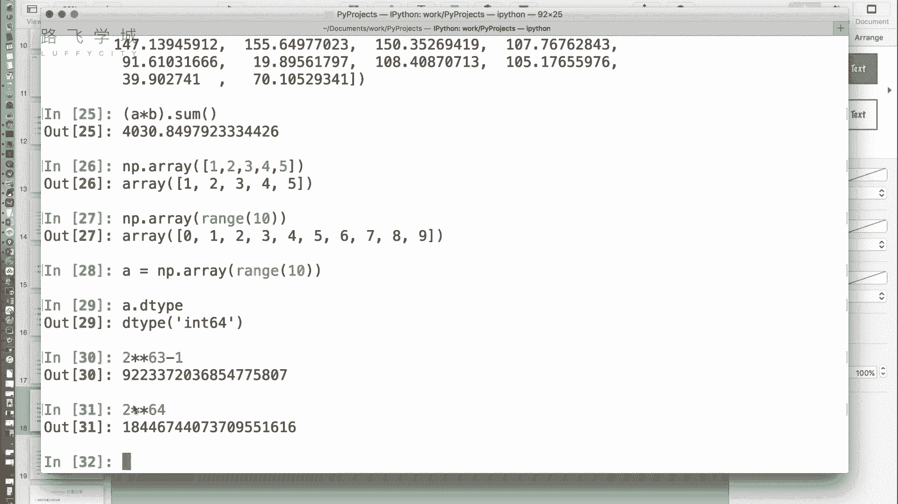

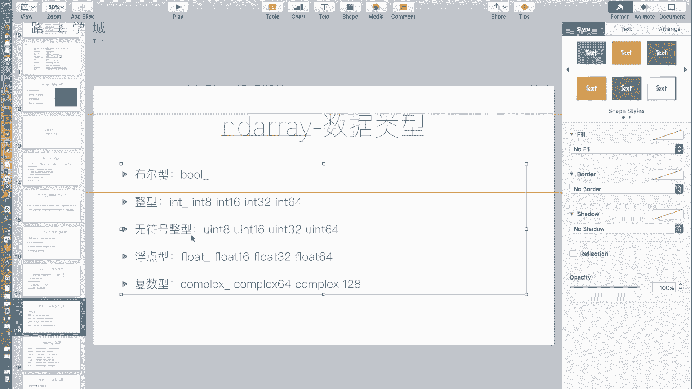

```python
# 创建一个一维数组
arr_1d = np.array([1, 2, 3, 4, 5, 6, 7, 8, 9, 10])
print(“数据类型:”, arr_1d.dtype)  # 输出: int64
print(“元素总数:”, arr_1d.size)   # 输出: 10
print(“数组维数:”, arr_1d.ndim)   # 输出: 1
print(“形状:”, arr_1d.shape)      # 输出: (10,)

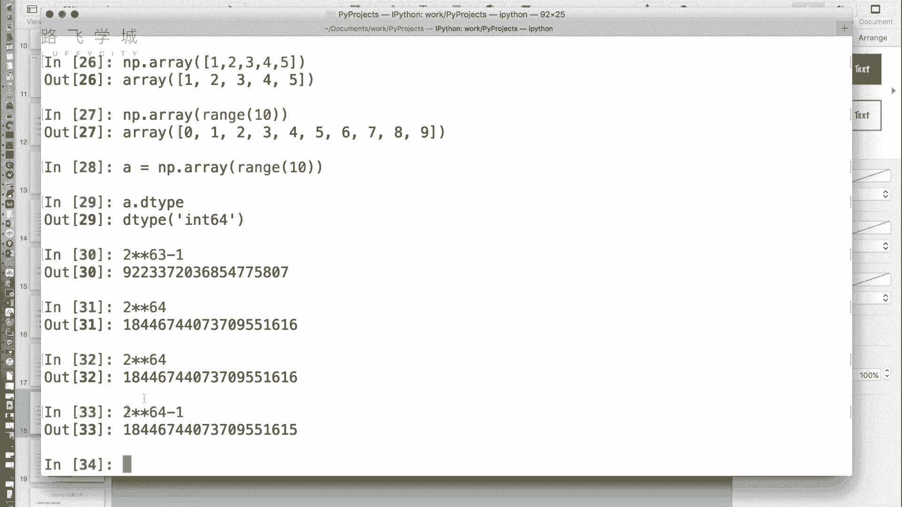

# 创建一个二维数组（可以理解为矩阵或表格）
arr_2d = np.array([[1, 2, 3], [4, 5, 6]])
print(“\n二维数组:\n”, arr_2d)
print(“形状:”, arr_2d.shape)      # 输出: (2, 3) 表示2行3列
print(“转置:\n”, arr_2d.T)        # 输出: 行变列，列变行
# [[1 4]
#  [2 5]
#  [3 6]]
```


对于二维数组，`shape` 属性非常有用，它能清晰地告诉我们数据的结构。`T` 属性则在线性代数或数据处理中常用于调整数据布局。

## NumPy的数据类型 📝

在查看 `dtype` 属性时，我们看到了如 `int64`、`float64` 这样的类型标识。NumPy提供了丰富的数据类型以优化存储和计算。

以下是NumPy中主要的数据类型分类：
*   **布尔型 (bool_)**: 存储 `True` 或 `False`。
*   **整型 (int8, int16, int32, int64)**: 带符号整数，数字表示占用的位数。
*   **无符号整型 (uint8, uint16, uint32, uint64)**: 无符号整数（仅非负）。
*   **浮点型 (float16, float32, float64)**: 浮点数，数字表示精度。
*   **复数型 (complex64, complex128)**: 复数。

类型名后的下划线是为了与Python内置关键字区分。例如，`int64` 表示占用64位（8字节）的整数，其表示范围约为 ±9.22e18。选择合适的数据类型可以在保证精度的同时，有效节省内存空间。

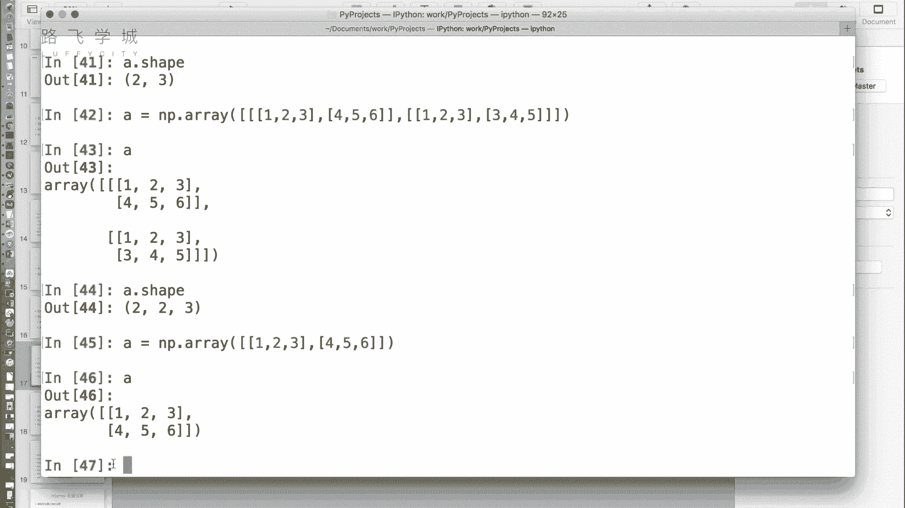


## 课程总结 🎯

本节课中我们一起学习了NumPy库的基础知识。
*   我们首先通过实例对比，理解了NumPy在**批量数据运算**上的高效与便捷。
*   接着，我们深入探讨了NumPy的**核心数据结构ndarray**，并了解了其与Python列表在**元素类型一致性**和**大小不可变性**上的区别。
*   然后，我们学习了如何查看数组的**关键属性**，如形状(`shape`)、大小(`size`)、数据类型(`dtype`)和维数(`ndim`)，并掌握了数组**转置(`T`)** 的操作。
*   最后，我们简要介绍了NumPy中为了优化性能而设计的各种**数据类型**。

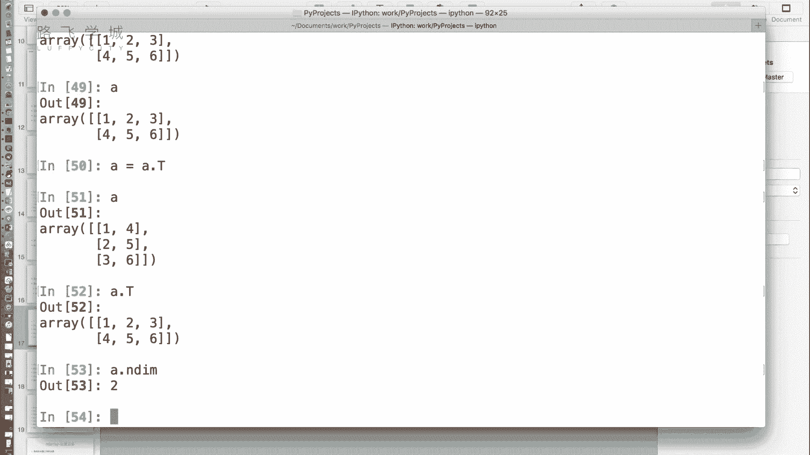

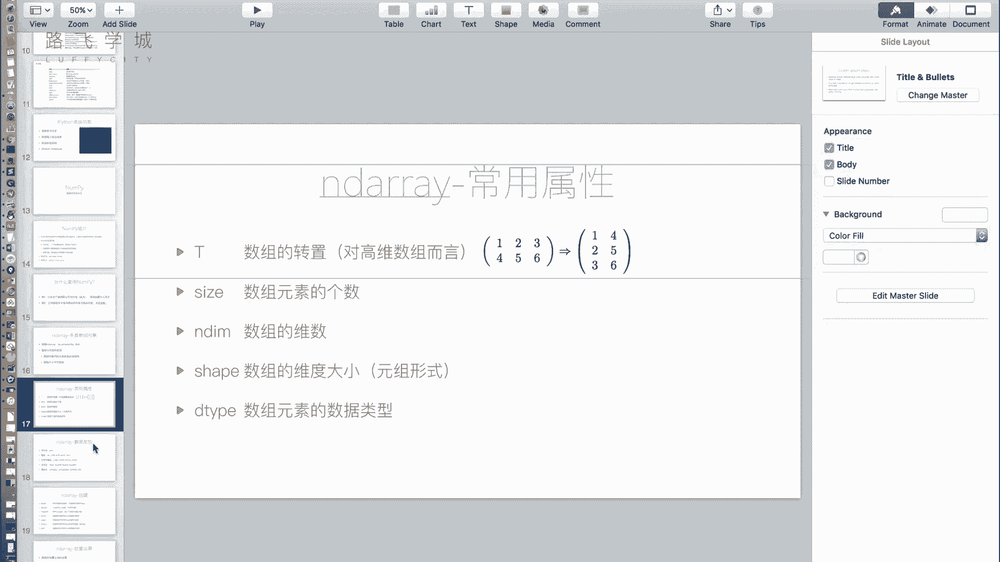

掌握这些基础是后续进行更复杂金融数据分析和计算的前提。在接下来的课程中，我们将学习如何使用NumPy进行更丰富的数组操作和数学运算。