# Python金融量化：P11：NumPy数组创建教程 🚀

在本节课中，我们将学习如何使用NumPy库创建各种类型的数组。这是进行金融量化分析的基础，因为高效的数据结构是处理股票价格、交易量等大量数据的关键。


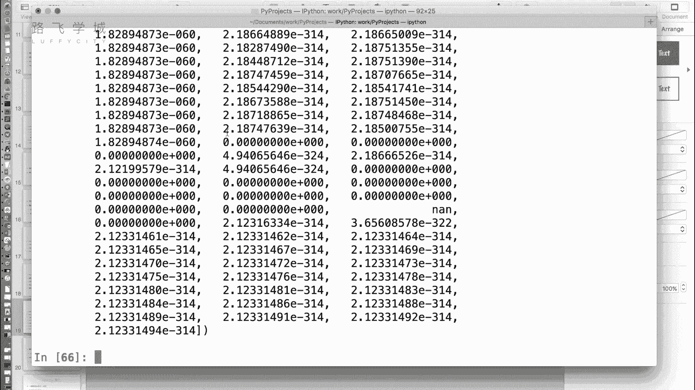

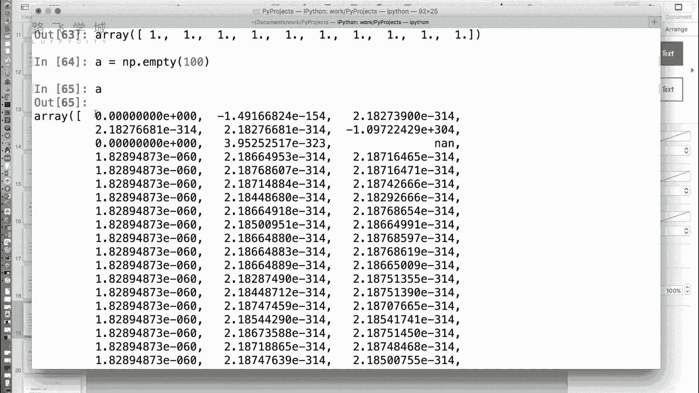

上一节我们介绍了NumPy数组（ndarray）的一些常用属性，本节中我们来看看如何创建它们。

## 使用 `array` 方法创建数组


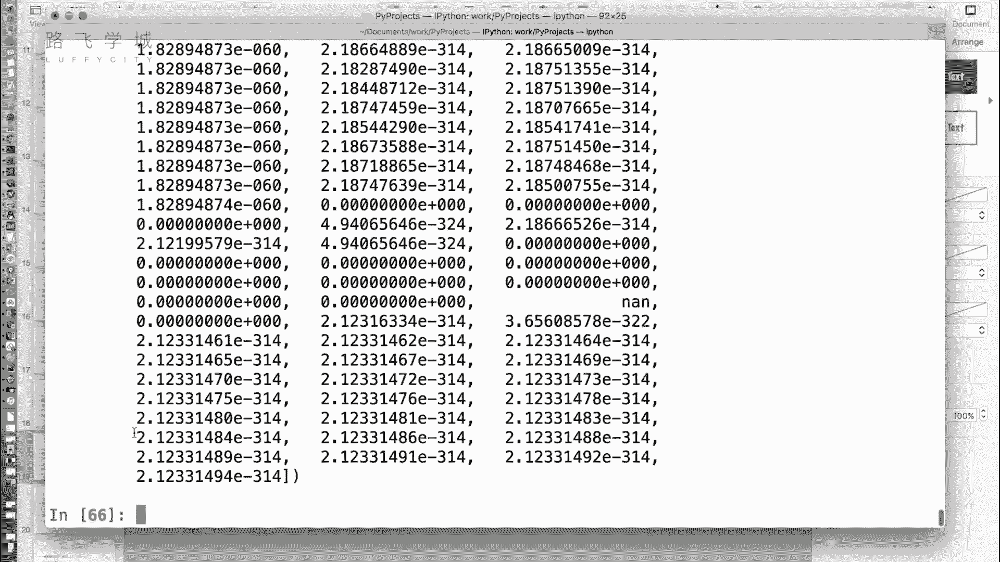

最基本的方法是使用 `np.array()` 函数，它可以将一个列表直接转换成一个NumPy数组。


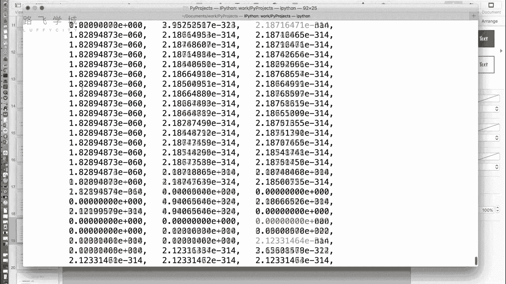

```python
import numpy as np
arr = np.array([1, 2, 3, 4, 5])
```


## 创建特殊数组的函数


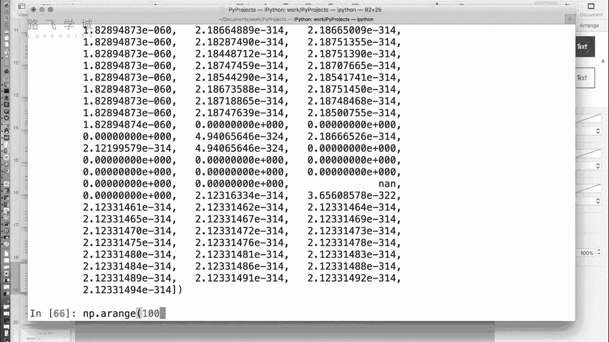

除了 `array` 方法，NumPy还提供了一系列便捷函数来创建具有特定内容的数组。

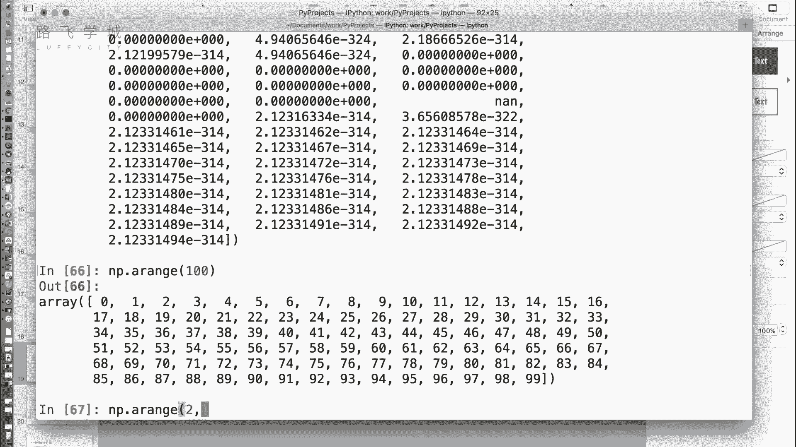


以下是创建全零、全一和“空”数组的方法。

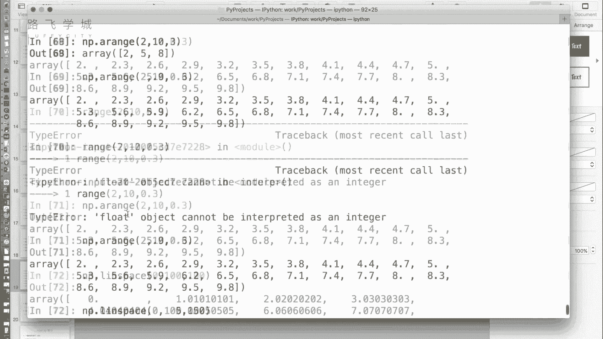

*   **`np.zeros(shape)`**：创建指定形状的全零数组。默认数据类型为 `float64`。
    ```python
    a = np.zeros(10) # 创建长度为10的全零数组，类型为float64
    a_int = np.zeros(10, dtype=int) # 创建长度为10的全零整数数组
    ```
*   **`np.ones(shape)`**：创建指定形状的全一数组。默认数据类型同样为 `float64`。
    ```python
    b = np.ones(5) # 创建长度为5的全一数组
    ```
*   **`np.empty(shape)`**：创建指定形状的“空”数组。它只分配内存空间，但不初始化数组元素，因此数组中的值是内存中的随机残留值。这在性能要求高且后续会覆盖所有值的场景下有用。
    ```python
    c = np.empty(100) # 创建一个长度为100的未初始化数组
    ```

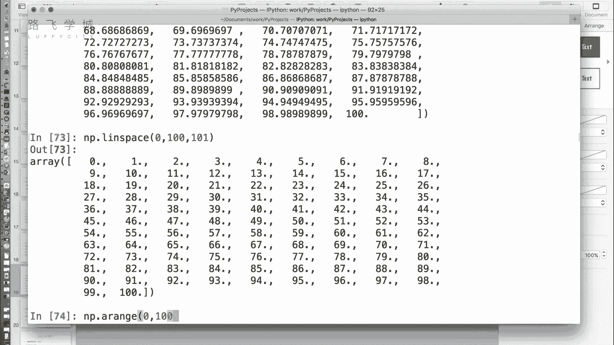

## 创建序列数组


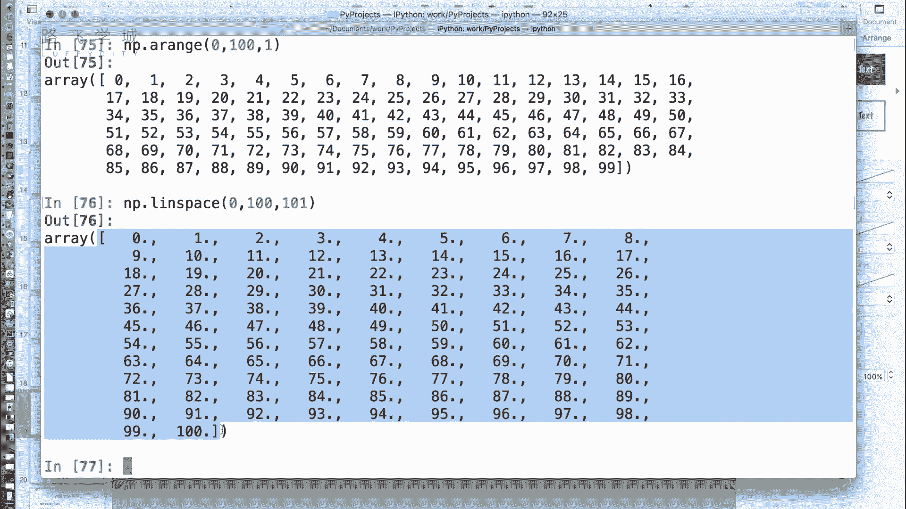

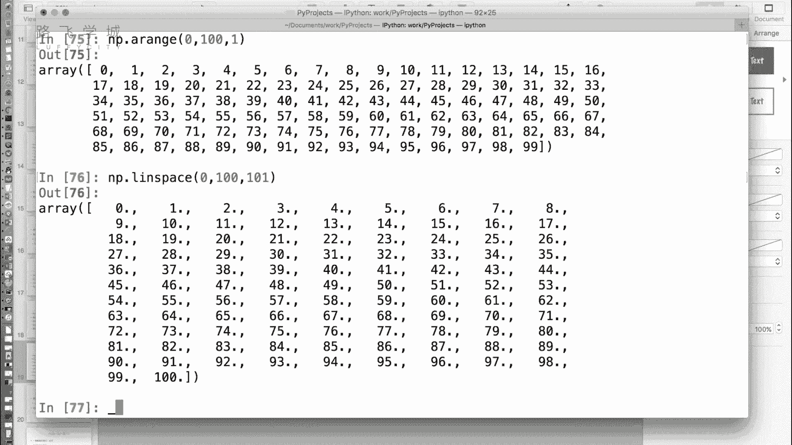

在数据处理中，经常需要生成一个数值序列。NumPy为此提供了两个强大的函数。


以下是创建数值序列的两种主要方式。

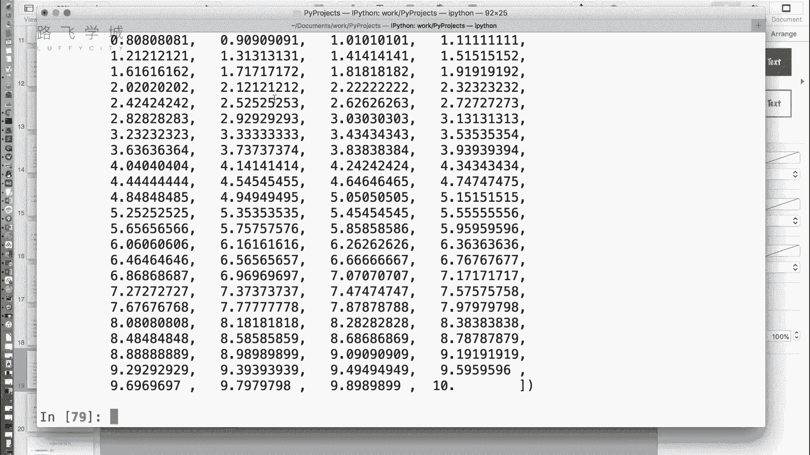


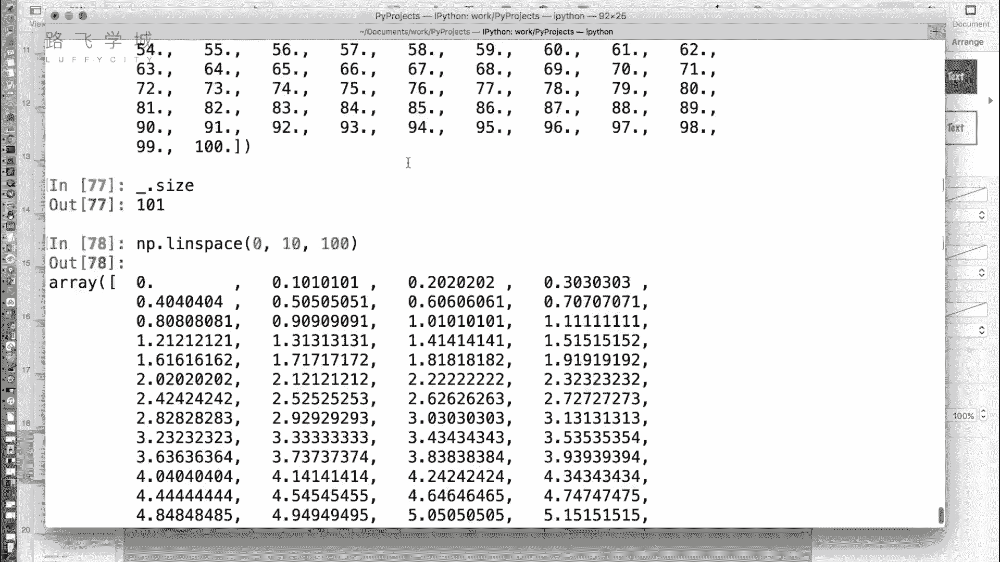

*   **`np.arange(start, stop, step)`**：类似于Python内置的 `range` 函数，但返回的是数组。它可以生成整数或浮点数序列（步长可以是小数）。
    ```python
    seq1 = np.arange(10) # 生成 0, 1, 2, ..., 9
    seq2 = np.arange(0, 10, 0.5) # 生成 0.0, 0.5, 1.0, ..., 9.5
    ```
*   **`np.linspace(start, stop, num)`**：在指定的起始值和结束值之间，生成**等间隔**的 `num` 个点。与 `arange` 不同，它的第三个参数是点的数量，而不是步长。它**包含**结束值。
    ```python
    # 在0到10之间生成5个等间隔的点
    points = np.linspace(0, 10, 5) # 结果为 [ 0. , 2.5, 5. , 7.5, 10. ]
    ```
    `linspace` 在需要均匀采样时非常有用，例如绘制函数图像：
    ```python
    x = np.linspace(-10, 10, 10000) # 在-10到10之间取10000个点
    y = x ** 2 # 计算y = x^2
    # 之后可以用matplotlib等库绘制(x, y)的图像
    ```

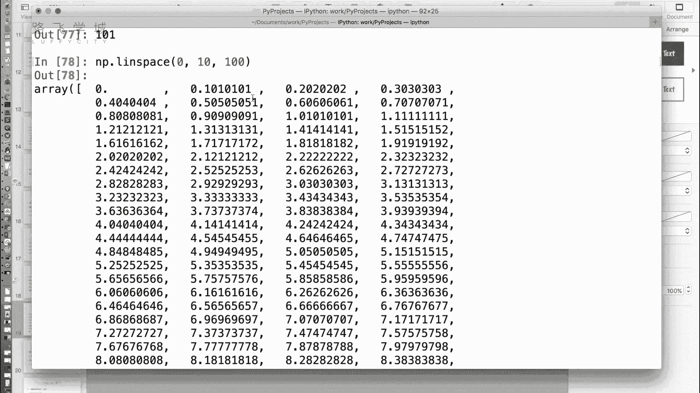

## 创建特殊矩阵（了解）


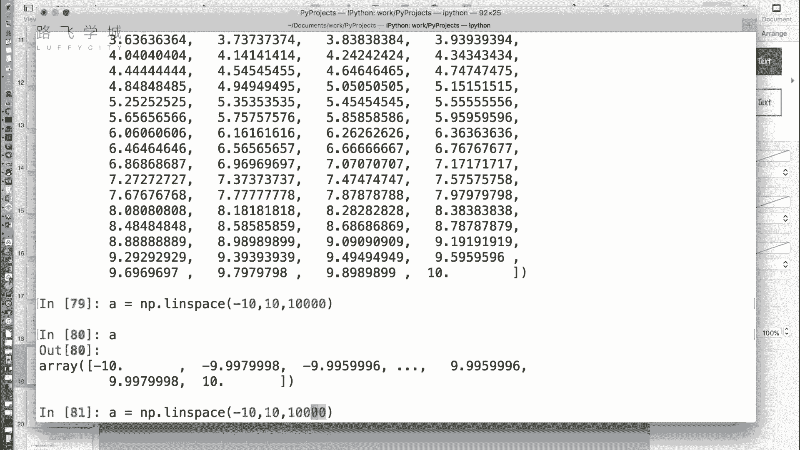

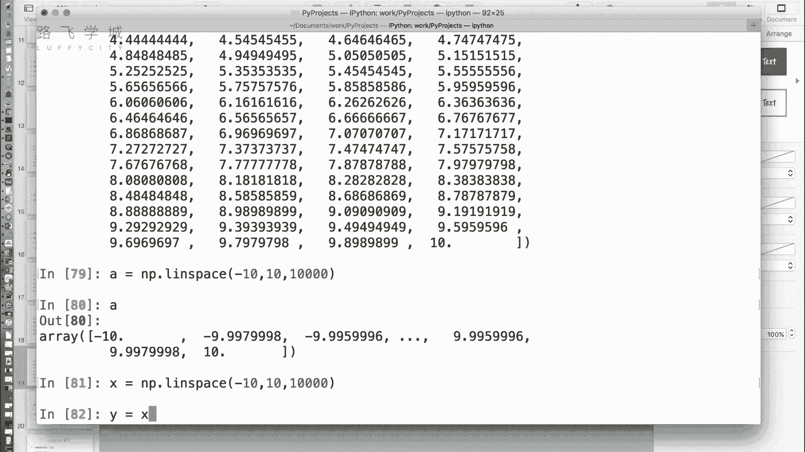

最后，还有一个用于线性代数的函数。


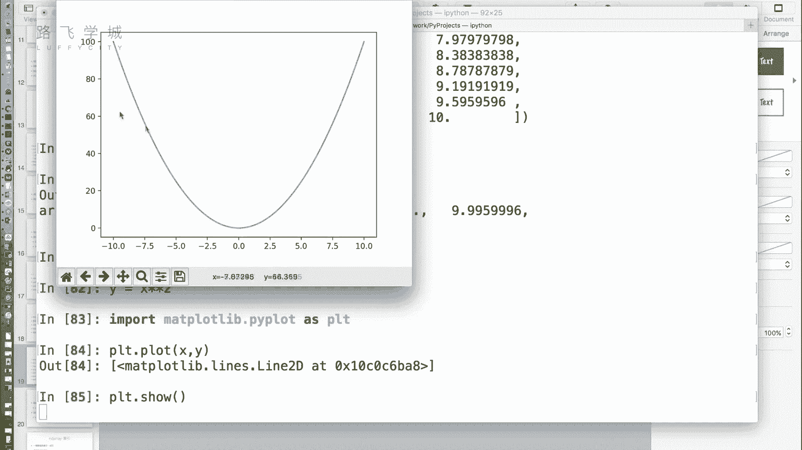

*   **`np.eye(N)`**：创建大小为 N x N 的单位矩阵（对角线为1，其余为0）。在纯粹的金融数据分析中较少使用。
    ```python
    identity_matrix = np.eye(3)
    # 输出：
    # [[1. 0. 0.]
    #  [0. 1. 0.]
    #  [0. 0. 1.]]
    ```

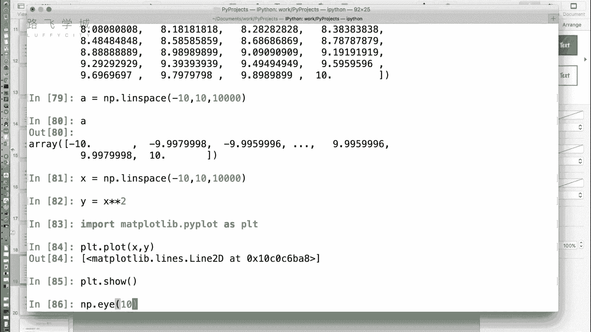

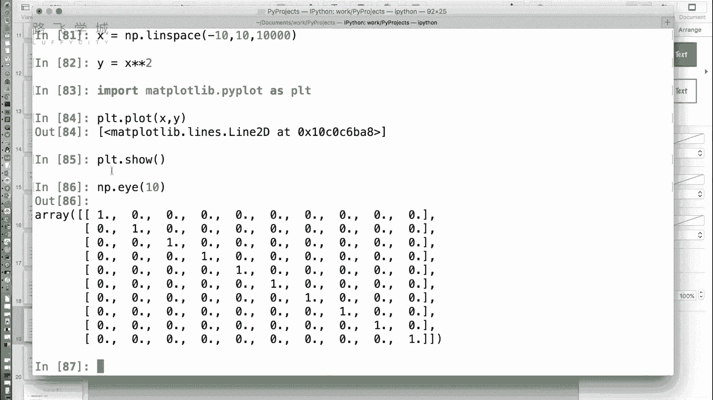


本节课中我们一起学习了多种创建NumPy数组的方法，包括从列表转换、创建特殊值数组、生成数值序列以及创建单位矩阵。掌握这些方法是利用NumPy进行高效金融数据计算和分析的第一步。下一节，我们将学习如何操作和计算这些数组。