# Python金融量化投资分析与股票交易：P11：10 金融量化分析-numpy-array索引和切片 📊

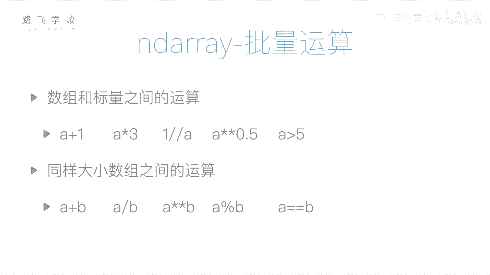

在本节课中，我们将要学习NumPy数组（ndarray）的索引和切片操作。这是数据处理的基础，能帮助我们高效地提取和操作数组中的特定数据。我们将从一维数组开始，逐步深入到二维数组，并理解NumPy切片与Python列表切片的关键区别。

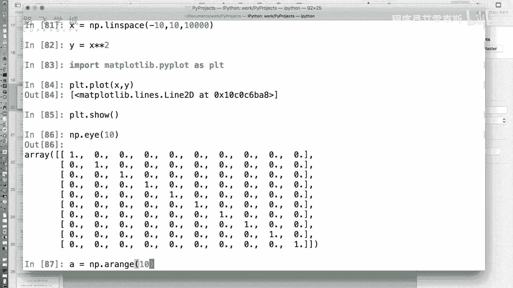

## 数组与标量及数组间的运算

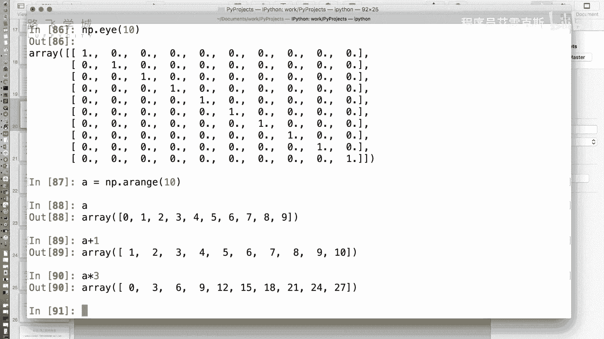

上一节我们介绍了NumPy数组的创建，本节中我们来看看数组如何进行快速运算。NumPy支持数组与单个数值（标量）以及数组与数组之间的逐元素运算。


**核心概念**：逐元素运算。这意味着运算会应用到数组中的每一个元素上。

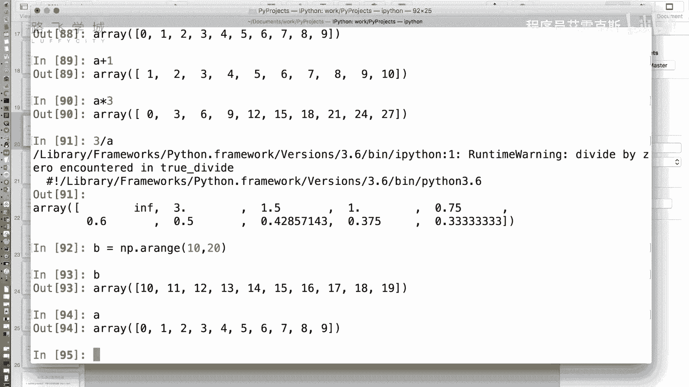

以下是具体的运算示例：


*   **与标量运算**：数组中的每个元素都会与标量进行运算。
    *   公式：`数组 + 标量`， `数组 * 标量`， `标量 / 数组`
    *   代码示例：
        ```python
        import numpy as np
        A = np.arange(10)  # 创建数组 [0, 1, 2, ..., 9]
        print(A + 1)   # 每个元素加1
        print(A * 3)   # 每个元素乘3
        print(3 / A)   # 3除以每个元素（注意：0做除数会产生警告和inf）
        ```

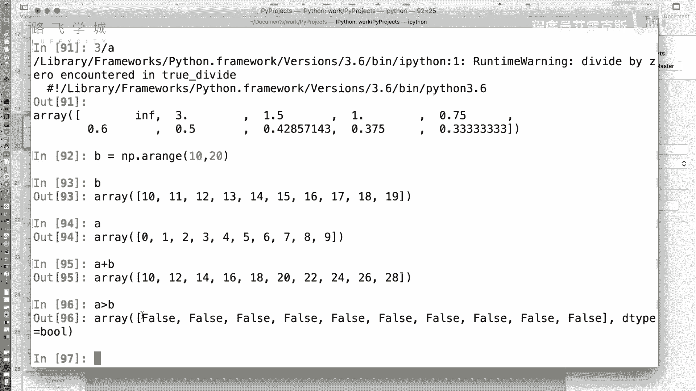

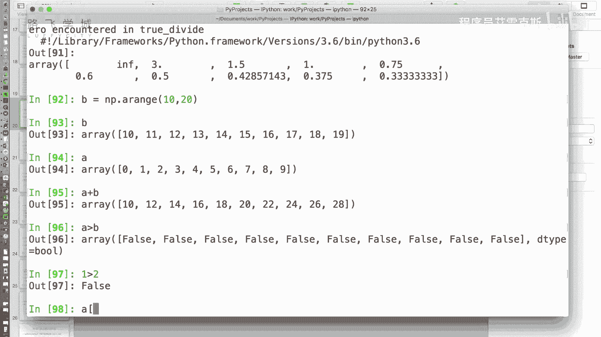

*   **数组间运算**：两个形状相同的数组，对应位置的元素进行运算。
    *   公式：`数组A + 数组B`， `数组A > 数组B`
    *   代码示例：
        ```python
        B = np.arange(10, 20)  # 创建数组 [10, 11, 12, ..., 19]
        print(A + B)  # 对应位置相加
        print(A > B)  # 比较对应位置，返回布尔值数组
        ```
        这种运算方式比手动编写循环更高效、更简洁。

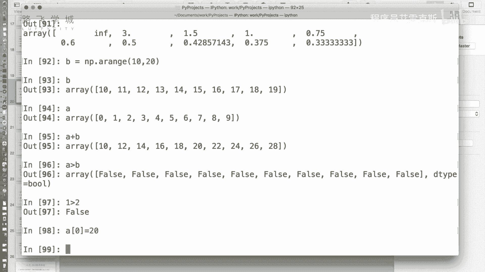

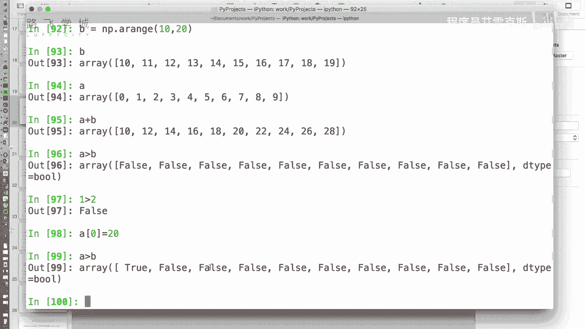

## 一维数组的索引与切片

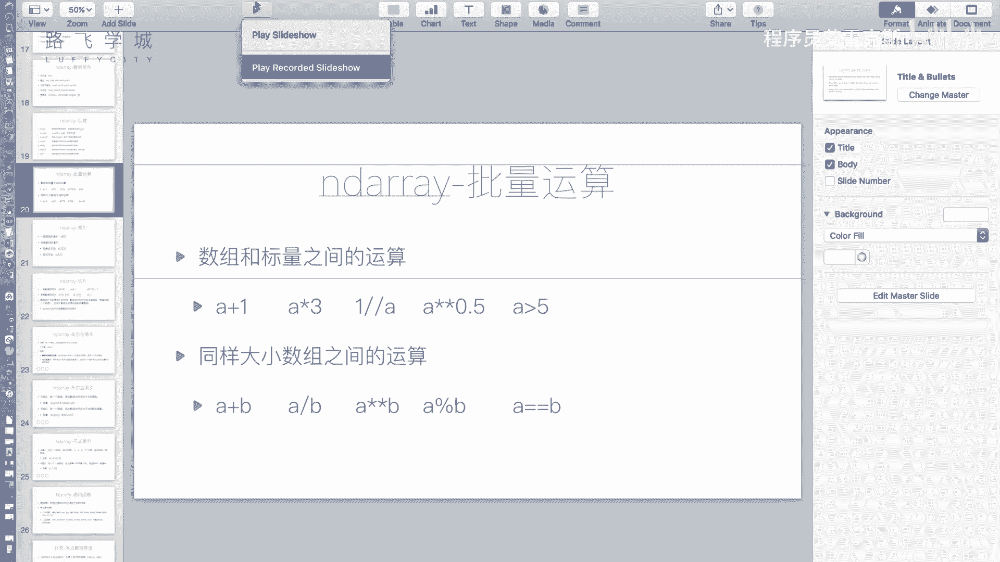

了解了基本运算后，我们来看看如何获取数组中的特定数据。索引和切片是两种主要方法。


**核心概念**：索引用于获取单个元素，切片用于获取一个子序列。

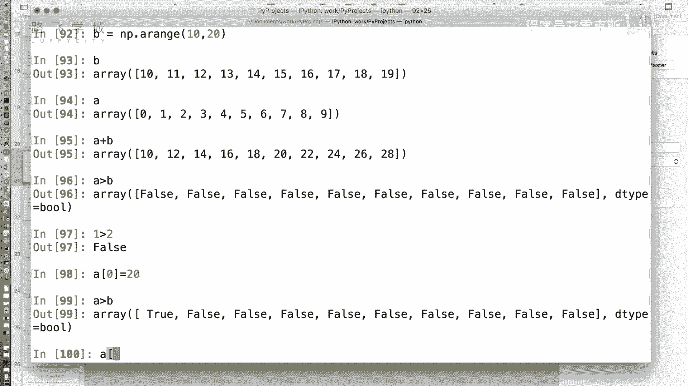

其语法与Python列表非常相似：


*   **索引**：通过位置（从0开始）获取元素。`A[0]` 获取第一个元素。
*   **切片**：通过 `start:stop:step` 语法获取一个片段。遵循“前闭后开”原则。
    *   代码示例：
        ```python
        print(A[0])      # 索引，输出 0
        print(A[0:4])    # 切片，输出 [0, 1, 2, 3]
        print(A[:5])     # 从开始到第5个元素（索引4）
        print(A[::2])    # 步长为2，输出 [0, 2, 4, 6, 8]
        ```

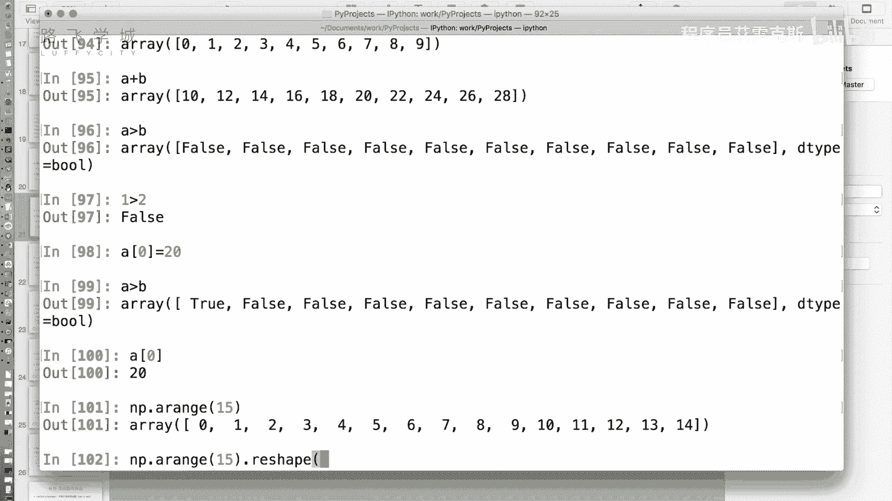

## NumPy切片与列表切片的关键区别


虽然语法相似，但NumPy数组的切片与Python列表的切片有一个**重要区别**：**视图（View）与副本（Copy）**。

*   **NumPy数组切片是原数组的视图**。这意味着切片得到的数组与原数组共享数据内存。修改切片会直接影响原数组。这样做是为了节省内存，在处理大型数据时非常高效。
*   **Python列表切片是原列表的副本**。修改切片得到的列表不会影响原列表。

以下是演示这一区别的代码：

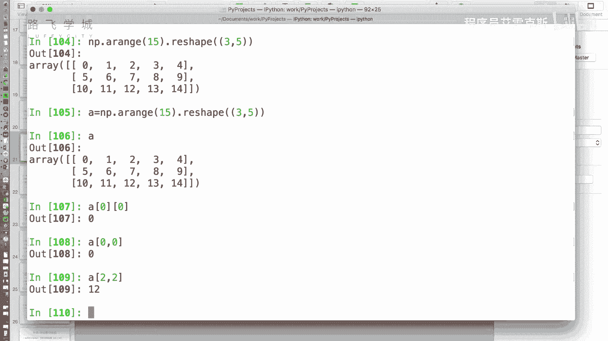

```python
import numpy as np


# NumPy数组
A_np = np.arange(10)
slice_np = A_np[0:4]  # 切片，得到视图
slice_np[0] = 99      # 修改视图
print(A_np)           # 输出：[99  1  2  3  4  5  6  7  8  9]，原数组被修改！

# Python列表
A_list = list(range(10))
slice_list = A_list[0:4] # 切片，得到副本
slice_list[0] = 99       # 修改副本
print(A_list)            # 输出：[0, 1, 2, 3, 4, 5, 6, 7, 8, 9]，原列表不变！
```

**如何创建副本**：如果你需要一份独立的切片数据，可以使用 `copy()` 方法。

```python
A = np.arange(10)
C = A[0:4].copy()  # 创建副本
C[0] = 100
print(A)           # 输出：[0 1 2 3 4 5 6 7 8 9]，原数组不变
print(C)           # 输出：[100   1   2   3]
```

## 二维数组的索引与切片

现在我们将知识扩展到二维数组（矩阵）。二维数组的索引和切片逻辑是“先行后列”。

**核心概念**：使用逗号 `,` 分隔行和列的索引或切片。格式为 `数组[行操作, 列操作]`。

首先，我们创建一个二维数组：

```python
import numpy as np
# 将0-14的一维数组重塑(reshape)为3行5列的二维数组
A_2d = np.arange(15).reshape(3, 5)
print(A_2d)
# 输出：
# [[ 0  1  2  3  4]
#  [ 5  6  7  8  9]
#  [10 11 12 13 14]]
```

以下是操作示例：

*   **索引**：获取单个元素。
    *   代码示例：
        ```python
        print(A_2d[0, 0])  # 获取第0行第0列的元素，输出 0
        print(A_2d[2, 2])  # 获取第2行第2列的元素，输出 12
        ```

*   **切片**：获取子矩阵。
    *   代码示例：
        ```python
        # 获取前两行，所有列
        print(A_2d[0:2, :])
        # 输出：
        # [[0 1 2 3 4]
        #  [5 6 7 8 9]]

        # 获取所有行，第2到第4列（索引2和3）
        print(A_2d[:, 2:4])
        # 输出：
        # [[ 2  3]
        #  [ 7  8]
        #  [12 13]]

        # 获取一个特定区域，例如第1-2行，第3-4列（即元素 8, 9, 13, 14）
        print(A_2d[1:3, 3:5])
        # 输出：
        # [[ 8  9]
        #  [13 14]]
        ```

**重要提示**：二维数组的切片同样返回的是**视图**，而非副本。如果需要独立数据，记得使用 `.copy()` 方法。

## 总结

本节课中我们一起学习了NumPy数组的核心操作——索引和切片。

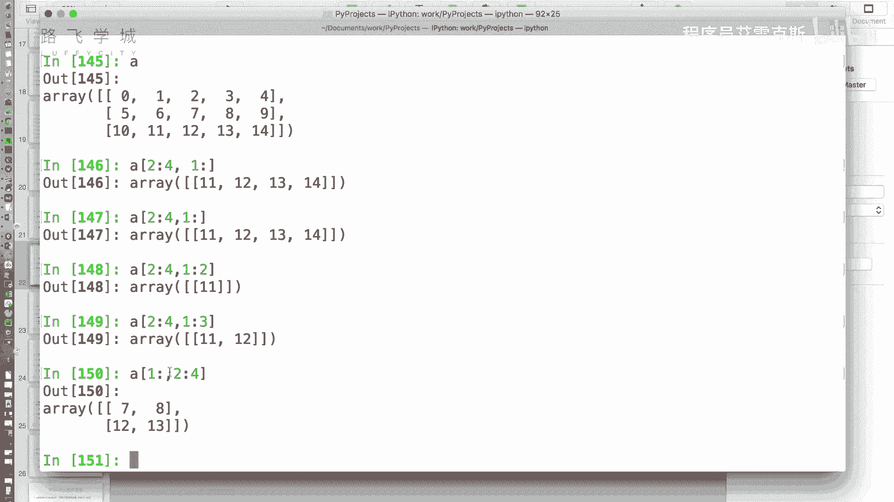

*   我们了解了数组与标量、数组与数组之间高效的逐元素运算。
*   我们掌握了一维和二维数组的索引（获取单个元素）和切片（获取子序列）方法。
*   我们重点理解了**NumPy切片是视图**这一关键特性，它与Python列表的副本行为不同，旨在提升大数据处理的性能。同时，我们也学会了如何使用 `copy()` 方法来创建数据的独立副本。

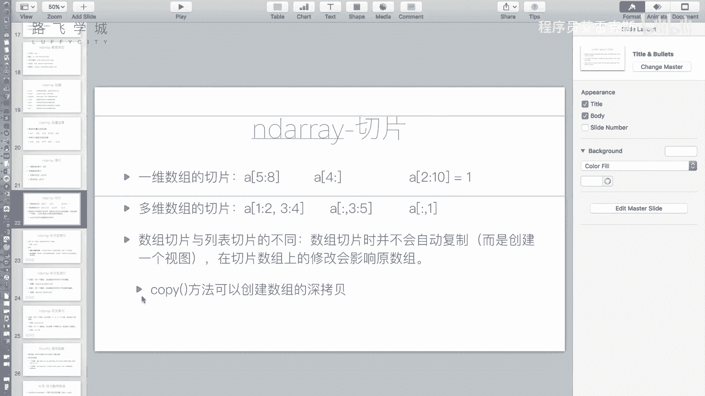


熟练掌握这些操作，是后续进行金融数据清洗、筛选和转换的基础。下一节，我们将学习如何使用这些技巧进行更复杂的数据筛选。