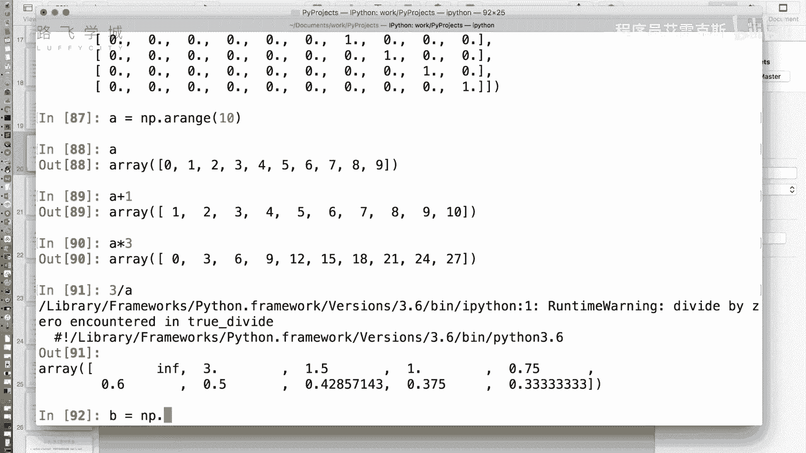
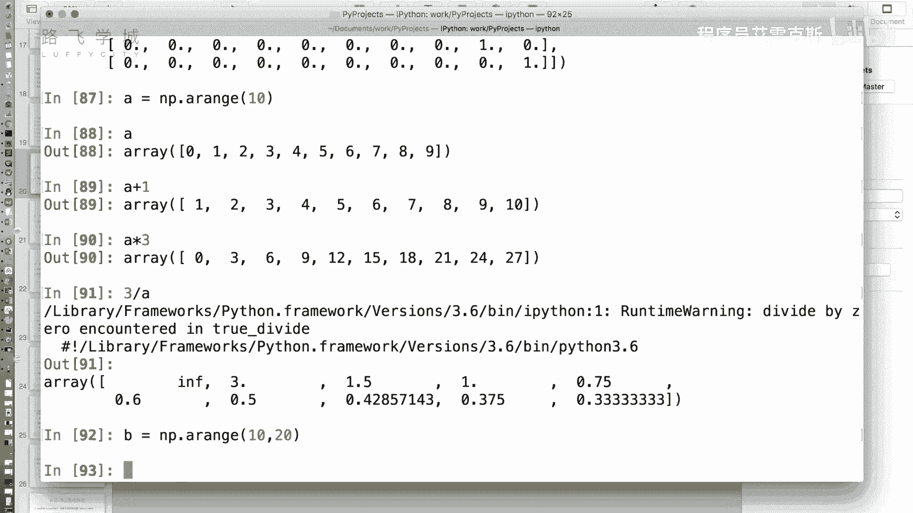
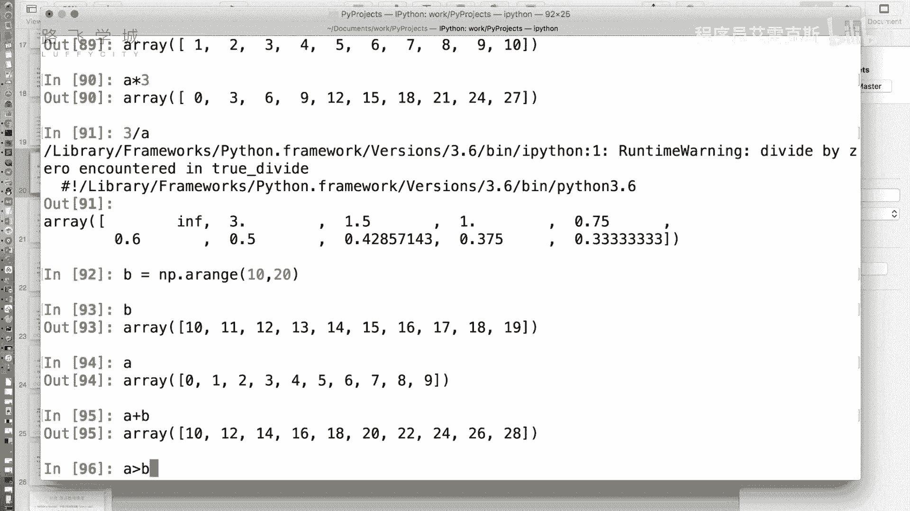
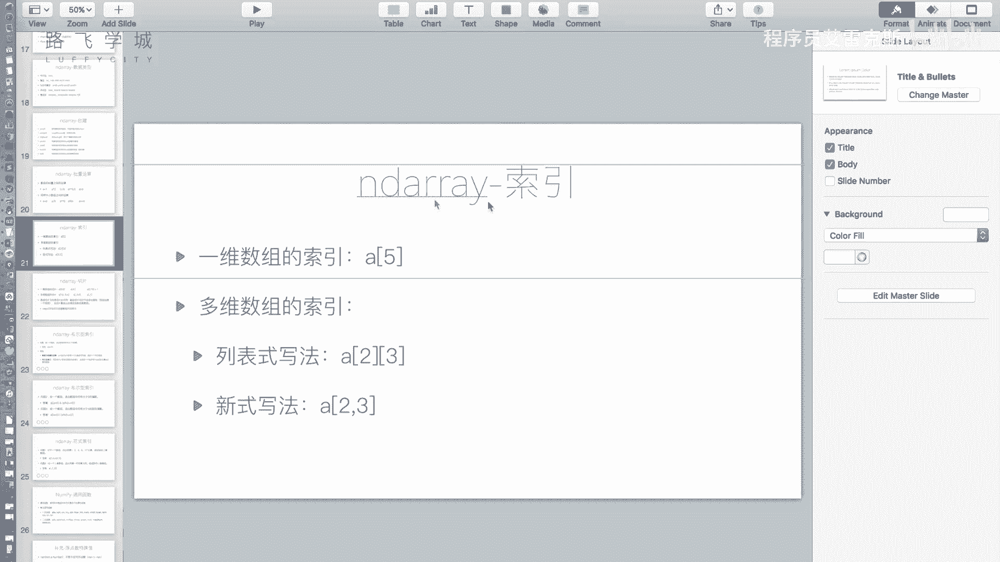
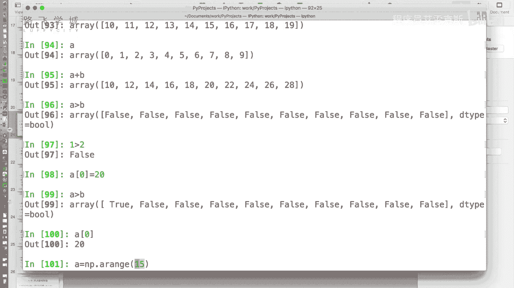
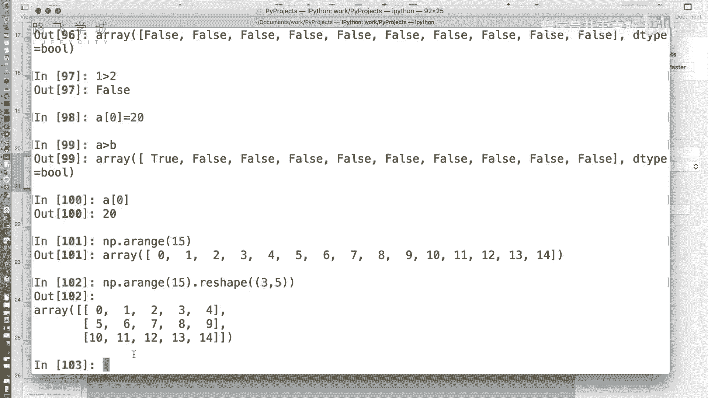
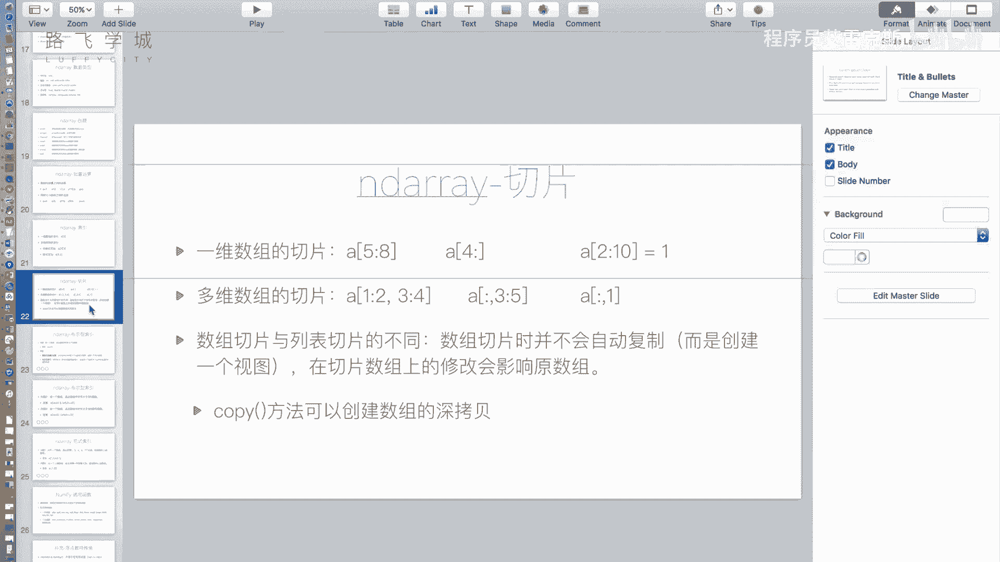

# Python金融量化投资分析：P13：NumPy数组索引与切片


在本节课中，我们将学习NumPy数组的核心操作之一：索引与切片。这是处理金融数据的基础，能够帮助我们高效地提取和操作数据中的特定部分。我们将从一维数组开始，逐步深入到二维数组，并理解NumPy切片与Python列表切片的区别。


## 数组与标量的运算






上一节我们介绍了NumPy数组的创建，本节中我们来看看数组如何进行快捷的数学运算。



NumPy数组支持与标量（单个数值）进行逐元素运算。这意味着运算会应用到数组中的每一个元素上，而无需编写循环。


以下是数组与标量运算的示例：
```python
import numpy as np
A = np.arange(10)  # 创建数组 [0, 1, 2, ..., 9]
print(A + 1)   # 每个元素加1
print(A * 3)   # 每个元素乘以3
print(3 / A)   # 3除以每个元素（注意：除以0会产生警告，结果为inf）
```


## 数组与数组的运算




除了与标量运算，两个形状相同的数组也可以进行逐元素的加减乘除和比较运算。这比使用循环效率高得多。


以下是两个数组进行运算的示例：
```python
A = np.arange(10)
B = np.array([10, 10, 10, 10, 10, 10, 10, 10, 10, 10])
print(A + B)  # 对应位置相加
print(A > B)  # 对应位置比较，返回布尔值数组
```




## 一维数组的索引与切片



索引和切片是获取数组子集的基本方法。一维数组的索引和切片规则与Python列表非常相似。

索引用于获取单个元素，切片用于获取一个连续的子序列。
```python
A = np.arange(10)
# 索引
print(A[0])  # 获取第一个元素
# 切片
print(A[0:4]) # 获取索引0到3的元素（顾头不顾尾）
print(A[:5])  # 获取前5个元素
print(A[5:])  # 获取从索引5开始到末尾的元素
```


## NumPy切片与列表切片的区别



虽然语法相似，但NumPy数组的切片与Python列表的切片有一个关键区别：**NumPy的切片返回的是原数组数据的视图（view），而非副本（copy）**。这意味着修改切片会直接影响原数组。

以下是说明这一区别的示例：
```python
import numpy as np
A = np.arange(10)  # NumPy数组
B = list(range(10)) # Python列表

C = A[0:4]  # A的切片（视图）
D = B[0:4]  # B的切片（副本）

C[0] = 20   # 修改C的第一个元素
D[0] = 20   # 修改D的第一个元素

print(A[0]) # 输出 20，原数组被修改
print(B[0]) # 输出 0，原列表未被修改
```
如果你需要一份独立的副本，可以使用 `copy()` 方法：
```python
C = A[0:4].copy()
C[0] = 0
print(A[0]) # 输出 20，原数组未被修改
```

## 二维数组的索引

对于二维数组（可以想象成一个表格或矩阵），我们需要通过行和列两个维度来定位元素。

索引的基本方法是使用两个中括号 `A[row][col]`。NumPy也支持更简洁的逗号语法 `A[row, col]`，这在后续使用Pandas等库时会更加常见。
```python
# 创建一个3行5列的二维数组
A = np.arange(15).reshape(3, 5)
print(A)
# 索引
print(A[0][0])   # 获取第0行第0列的元素
print(A[0, 0])   # 等效的逗号语法
print(A[2, 2])   # 获取第2行第2列的元素
```

## 二维数组的切片

二维数组的切片功能更加强大，允许我们同时切割行和列。其核心语法是使用逗号分隔行切片和列切片：`A[行切片, 列切片]`。


以下是二维数组切片的示例：
```python
A = np.arange(15).reshape(3, 5)
print(A)
# 切出前两行，前两列（即左上角的2x2子矩阵）
print(A[0:2, 0:2])
# 切出第1行和第2行（索引1和2），以及第2列到最后一列
print(A[1:3, 2:])
```
记住规则：**逗号左边是行切片，右边是列切片**。你可以灵活组合，提取出任意矩形区域的子数组。


本节课中我们一起学习了NumPy数组的索引与切片操作。我们掌握了数组与标量、数组与数组的快捷运算，理解了一维和二维数组的索引方法，并重点区分了NumPy切片（产生视图）与列表切片（产生副本）的关键差异。这些技能是后续进行金融数据选择和预处理的基础。下一节，我们将学习如何使用这些数据子集进行更复杂的计算和分析。