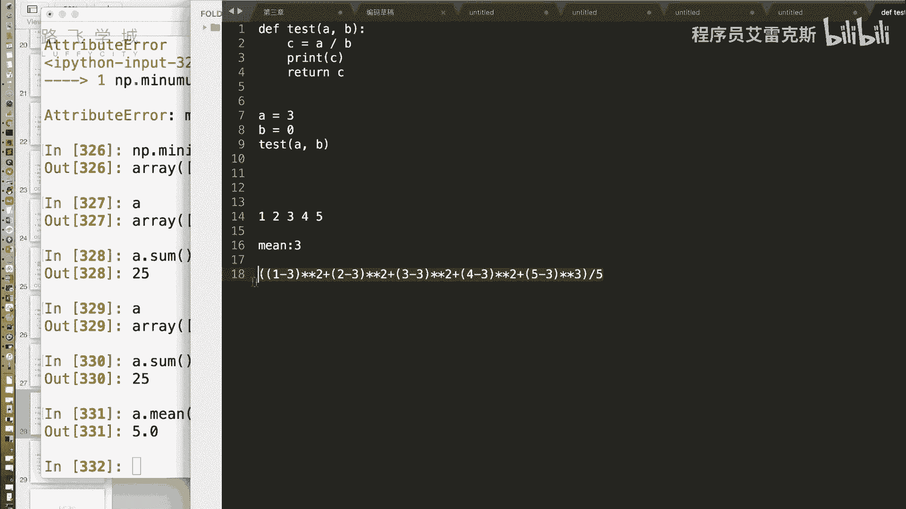
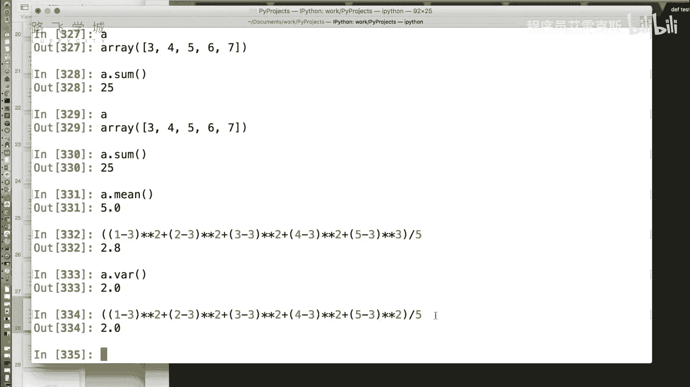
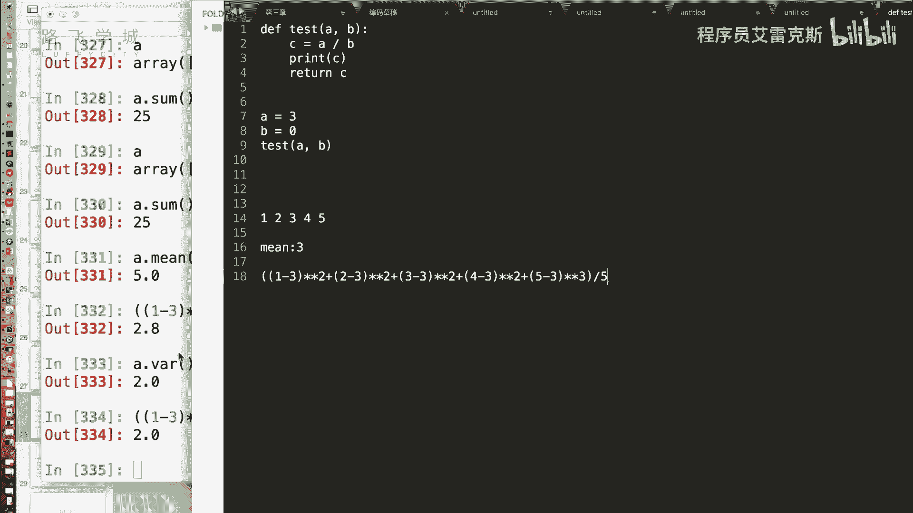
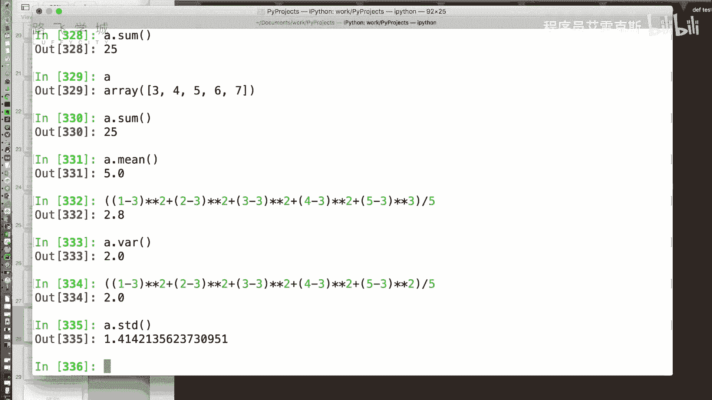
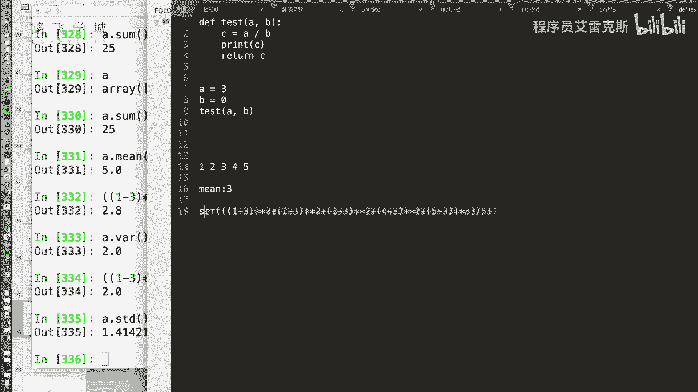
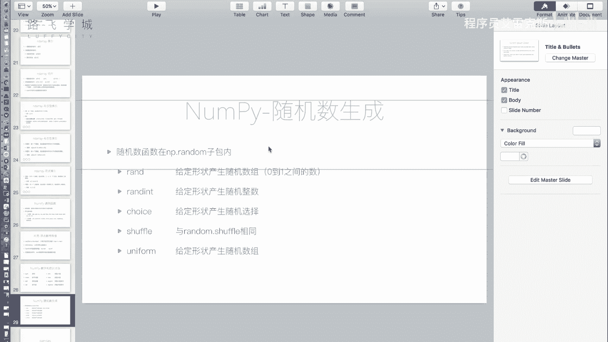

# Python金融量化投资分析：P17：16 金融量化分析-numpy-统计方法和随机数生成 📊


在本节课中，我们将学习NumPy模块提供的数学统计方法以及随机数生成功能。这些功能是进行金融数据分析和量化建模的基础工具。



## 概述



上一节我们介绍了NumPy数组的索引和切片操作。本节中，我们来看看NumPy提供的核心数学统计函数，以及如何生成符合特定分布的随机数数组，这些在模拟金融数据和计算统计指标时至关重要。







## 统计方法

NumPy提供了一系列用于计算数组统计量的方法。

以下是常用的统计方法：

*   **求和**：`A.sum()` 方法对数组 `A` 中的所有值进行求和。其功能与Python内置的 `sum()` 函数类似。
*   **求平均值**：`A.mean()` 方法用于计算数组 `A` 中所有元素的平均值。
*   **求方差**：`A.var()` 方法用于计算数组的方差。方差衡量一组数据的离散程度。其计算公式为：**方差 = Σ(每个元素 - 平均值)² / 元素个数**。方差越大，数据波动越大。
*   **求标准差**：`A.std()` 方法用于计算数组的标准差。标准差是方差的平方根，同样用于衡量数据的离散程度。其计算公式为：**标准差 = sqrt(方差)**。在金融领域，标准差常用来衡量资产价格的风险。
*   **求最大值与最小值**：`A.max()` 和 `A.min()` 分别用于找出数组中的最大值和最小值。
*   **求最大值与最小值的索引**：`A.argmax()` 和 `A.argmin()` 分别返回数组中最大值和最小值所在位置的索引（下标）。

## 随机数生成

NumPy的 `random` 子模块提供了强大的随机数生成功能，与Python内置的 `random` 模块相比，其最大优势是可以直接生成任意形状的随机数数组。

以下是 `numpy.random` 中常用的函数：

*   **生成随机浮点数**：`np.random.rand(d0, d1, ..., dn)` 生成一个给定形状的数组，数组中的元素是 `[0, 1)` 区间内均匀分布的随机浮点数。
    ```python
    # 生成一个包含10个随机数的数组
    arr = np.random.rand(10)
    # 生成一个3行5列的随机数数组
    arr_2d = np.random.rand(3, 5)
    ```
*   **生成随机整数**：`np.random.randint(low, high=None, size=None)` 生成指定范围内的随机整数。`size` 参数可以指定输出数组的形状。
    ```python
    # 生成一个0到10之间的随机整数
    num = np.random.randint(0, 10)
    # 生成一个形状为(3,5)，元素在0到10之间的整数数组
    arr_int = np.random.randint(0, 10, size=(3, 5))
    ```
*   **从给定序列中随机选择**：`np.random.choice(a, size=None)` 从数组 `a` 中随机抽取元素生成新数组。
    ```python
    # 从[1,3,4,5]中随机抽取一个数
    choice_single = np.random.choice([1, 3, 4, 5])
    # 从[1,3,4,5]中随机抽取10个数（可重复）
    choice_multi = np.random.choice([1, 3, 4, 5], size=10)
    ```
*   **打乱数组顺序**：`np.random.shuffle(x)` 将数组 `x` 的元素顺序随机打乱。此操作直接修改原数组。
*   **生成均匀分布随机数**：`np.random.uniform(low=0.0, high=1.0, size=None)` 在指定区间 `[low, high)` 内生成均匀分布的随机浮点数。
    ```python
    # 生成10个在2.0到4.0之间的随机浮点数
    arr_uniform = np.random.uniform(2.0, 4.0, 10)
    ```



## 总结

本节课中我们一起学习了NumPy的统计方法和随机数生成。我们掌握了如何计算数组的求和、均值、方差、标准差等核心统计指标，并学会了使用 `numpy.random` 模块高效地生成各种随机数数组。这些功能是进行数据探索、风险度量和蒙特卡洛模拟等金融量化分析任务的基石。NumPy作为底层计算库，其高效性为后续学习更高级的数据分析工具（如Pandas）打下了坚实基础。