# 蜂鸟量化交易训练营：第二期：Demo Day 策略演示与总结 🚀

在本节课中，我们将回顾蜂鸟量化交易训练营第二期学员的Demo Day成果。我们将学习四种不同类型的量化交易策略，了解其核心逻辑、实现方式以及优缺点。课程内容涵盖做市策略、横截面动量策略、基于情绪的定投策略以及统计套利策略。

## 策略演示概述

本次Demo Day的主要内容是学员策略演示与最佳策略投票。部分学员因故未能及时提交作品，但可在下期训练营前补交。接下来，我们将逐一演示和分析提交的策略。

## AAS 做市策略 🤖

上一节我们介绍了课程概述，本节中我们来看看第一种策略：AAS做市策略。该策略的开发者最初被Hummingbot的做市功能吸引，并深入研究了从纯做市到AAS的演变。

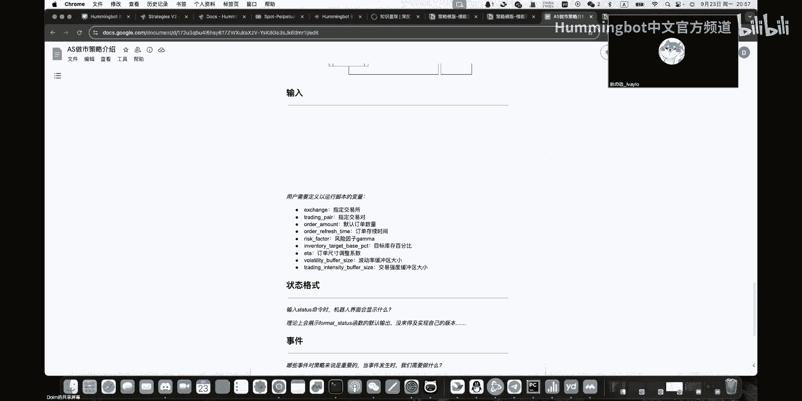

做市策略的核心赚钱逻辑是在市场订单簿上同时挂出买单和卖单，通过捕捉微小的价差获利。其最基础的形式是**纯做市商策略**。

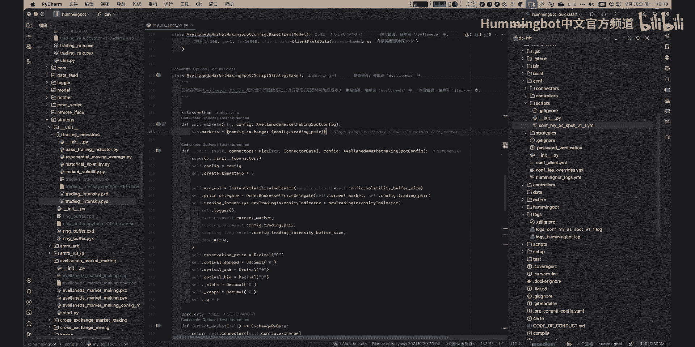

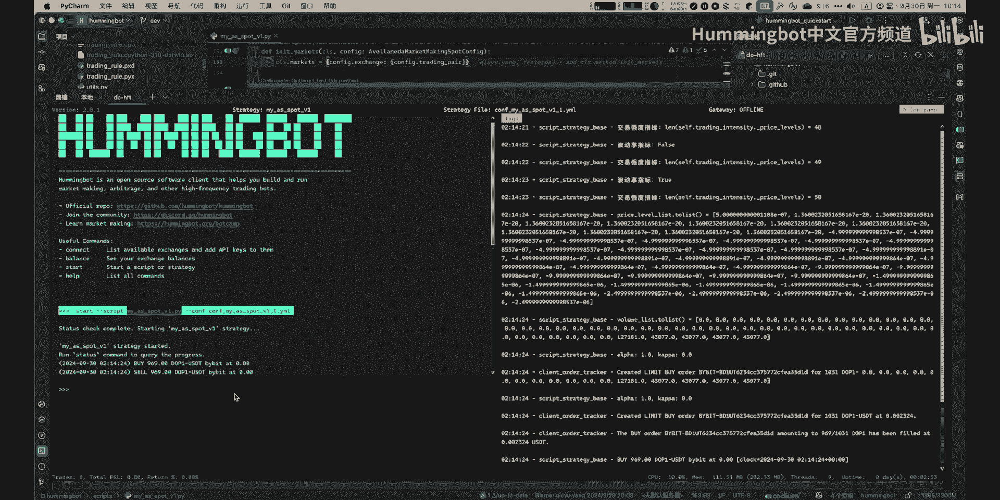

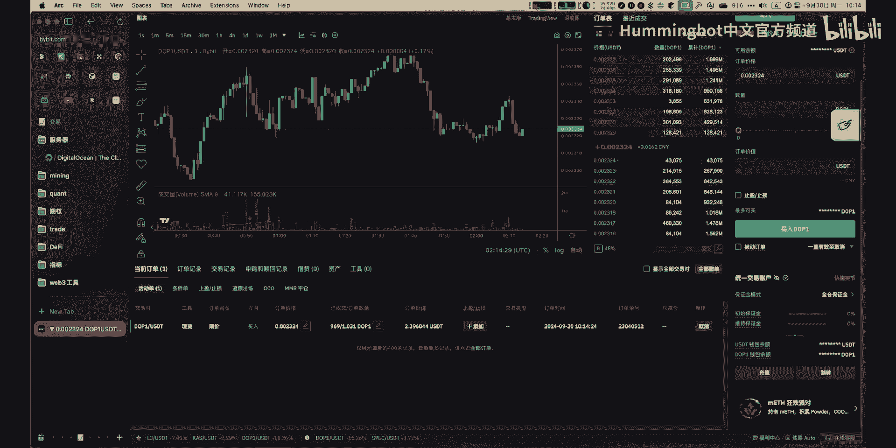

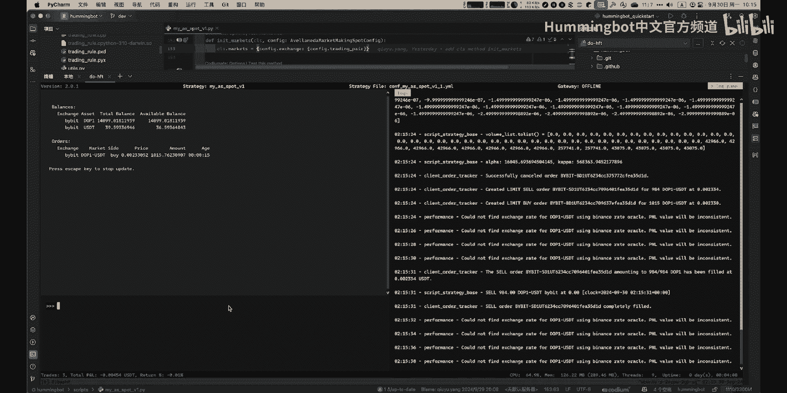

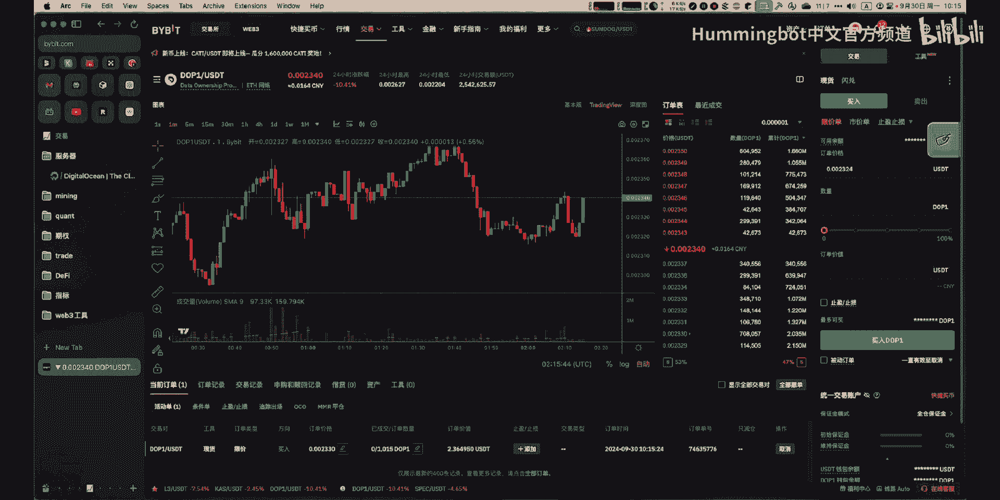

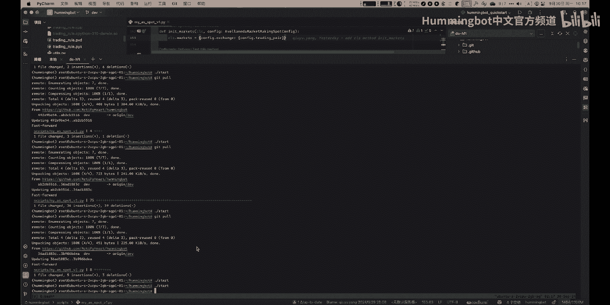

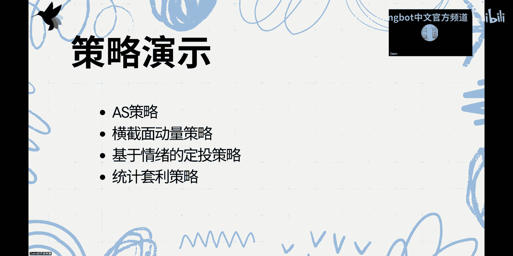

**纯做市商策略**的核心公式是围绕一个中间价进行均衡挂单：
```
卖单价格 = 中间价 * (1 + 价差百分比)
买单价格 = 中间价 * (1 - 价差百分比)
```

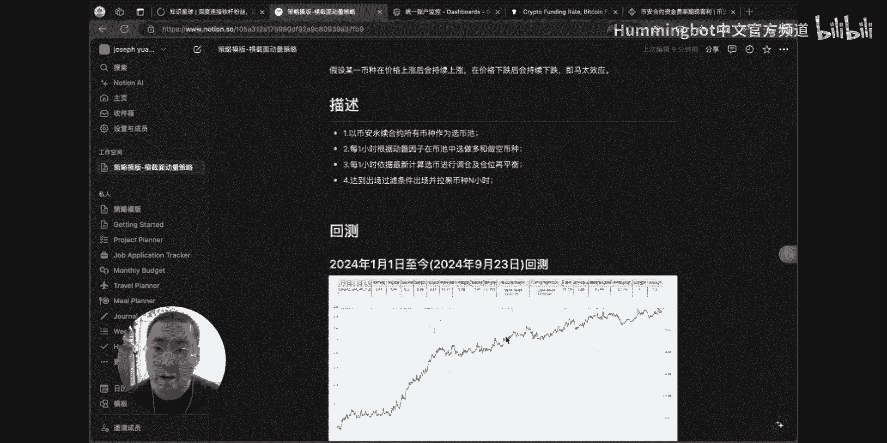

AAS策略旨在优化上述纯做市策略。它基于价格变动服从**泊松分布**的假设，通过动态调整买卖挂单与中间价的间距，来更好地控制库存风险，降低总体风险。

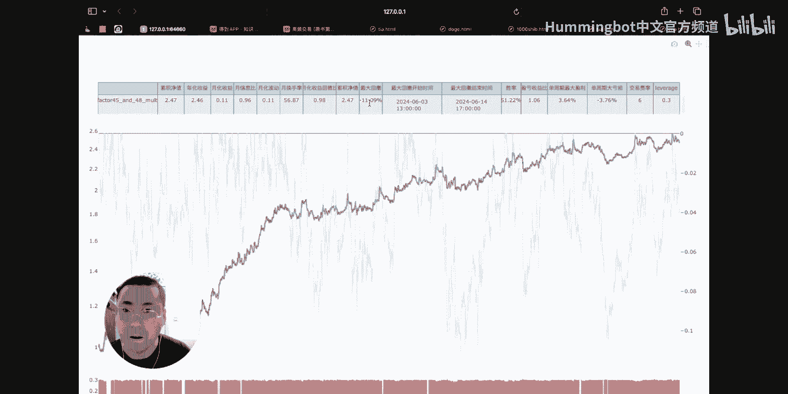

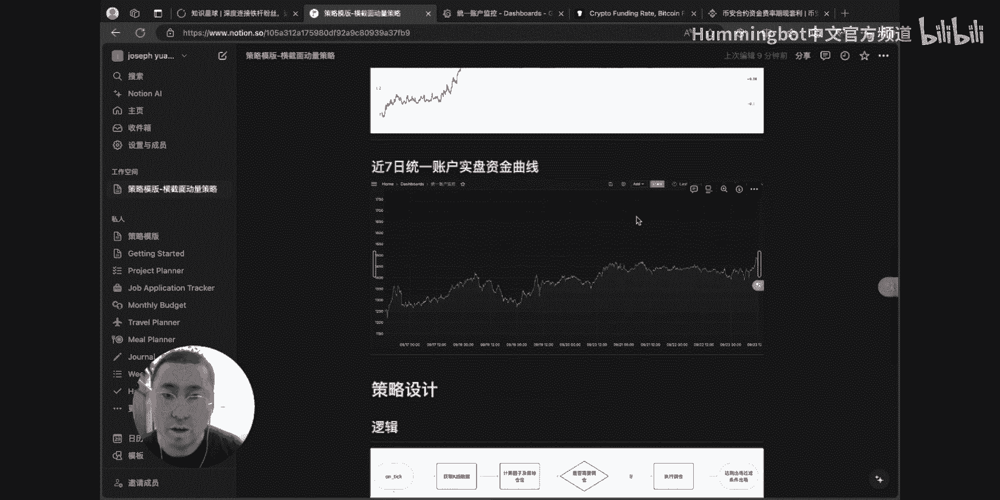

一个形象的比喻是：将资产价格视为一个游走的乒乓球，买卖挂单是两块挡板。策略的目标是让球（价格）持续击打上下挡板（成交）。当球偏向一方时，AAS会调整挡板距离，使其更容易被击中。

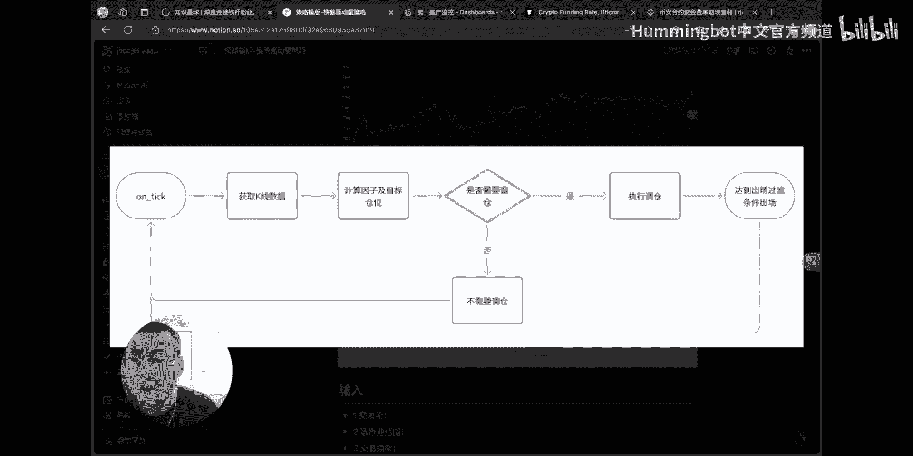

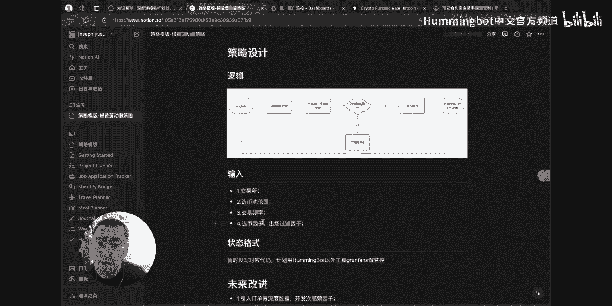

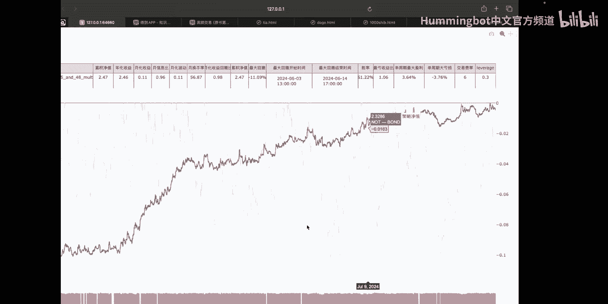

AAS策略并非万能。所有做市策略都偏好小幅震荡行情，以便持续赚取价差。但它们都害怕单边趋势行情，因为在上涨趋势中，策略可能持续成交卖单，从而不断累积相反方向的持仓，造成亏损。

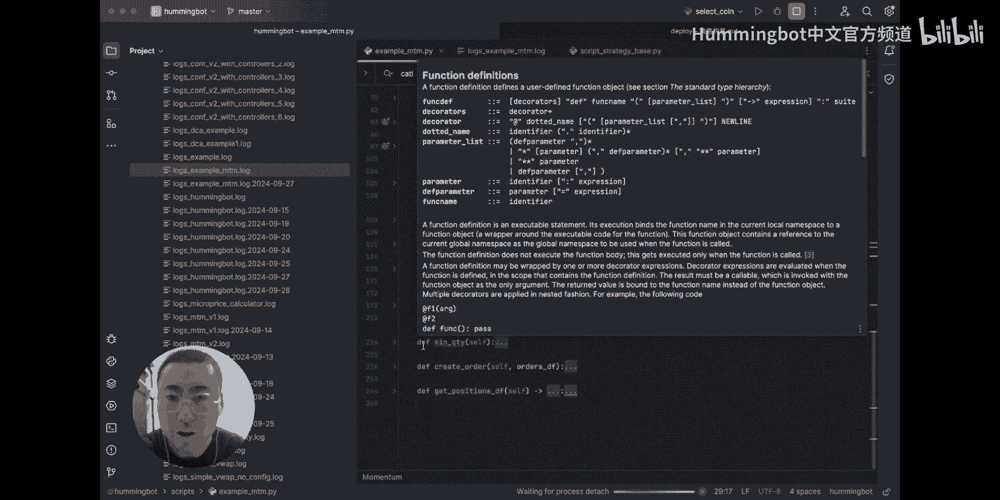

潜在的优化方向包括添加止损条件，或结合订单簿数据挖掘趋势预测因子，使策略在单边行情下也能减少不利持仓。

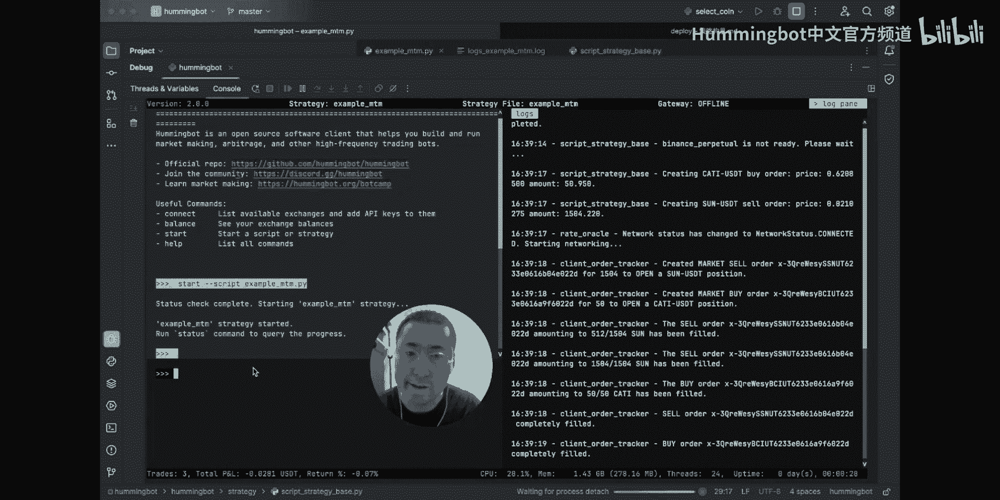

## 横截面动量策略 📈

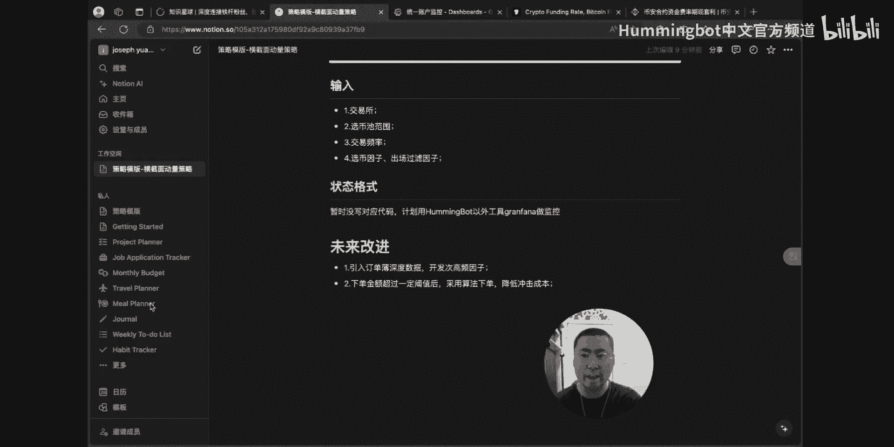

在了解了做市策略后，我们转向趋势追踪策略。本节介绍的是横截面动量策略。

该策略的目标是通过做多未来可能上涨更多的币种，同时做空未来可能下跌更多的币种，来获取**阿尔法收益**。其核心假设是“马太效应”，即上涨的币种会持续上涨，下跌的币种会持续下跌。

策略流程如下：
1.  **选币池**：选择币安永续合约的所有币种作为候选池。
2.  **计算因子**：每小时根据动量因子（如过去一段时间收益率）在选币池中进行排序。
3.  **多空对冲**：做多排名靠前的币种，做空排名靠后的币种。
4.  **调仓再平衡**：每小时根据最新的因子计算结果进行调仓。
5.  **出场过滤**：达到出场条件的币种会被暂时“拉黑”N小时，避免重复交易。

该策略的优点是通过多空头寸对冲市场风险，获取纯选币收益。缺点是在牛市时，绩效可能不如纯做多策略。回测显示，该策略在特定参数下能取得可观收益，但也需注意控制回撤。


开发者使用Hummingbot脚本实现策略自动化，并搭配自制的仪表板监控账户状态、持仓和净值曲线。

未来改进点可能包括：
*   利用订单簿深度数据编写高频因子。
*   优化选币池范围，提升策略性能。
*   实现更智能的拆单功能。

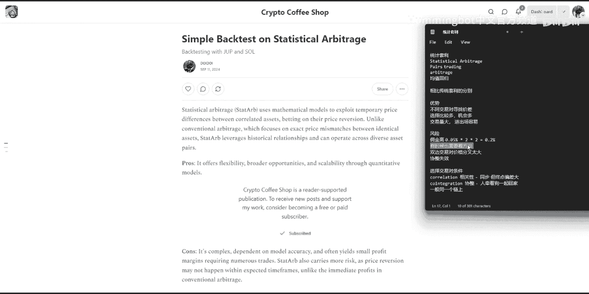

## 基于情绪的定投策略 😨😊

接下来，我们看一种结合市场情绪的择时策略：基于情绪的定投策略。该策略由第一期学员提交，旨在利用市场情绪波动进行“聪明的”定投。

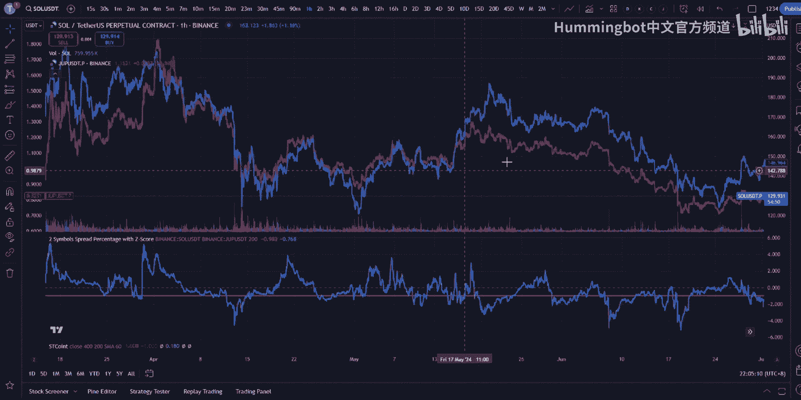

策略逻辑是：定期比较同一资产（如BTC）在**现货市场**和**永续合约市场**的价格。合约价格通常反映市场未来预期。
*   当**合约价格低于现货价格**时，市场情绪倾向于**恐惧**，策略执行**买入**。
*   当**合约价格高于现货价格**时，市场情绪倾向于**贪婪**，策略执行**卖出**。

这改变了传统定期定额定投（DCA）的模式，通过在市场恐惧时多买、贪婪时少买甚至卖出，来降低平均持仓成本。策略回测显示，在震荡上行行情中，其收益表现优于简单定投。

策略实现上，它会监控两个市场价差，计算情绪值，并与预设的恐惧/贪婪阈值比较，从而触发交易。同时，策略设置了最小交易时间间隔，防止过度频繁交易。

## 统计套利策略 🔄

最后，我们探讨一种基于数学统计的套利策略：统计套利策略。它属于**配对交易**的一种。

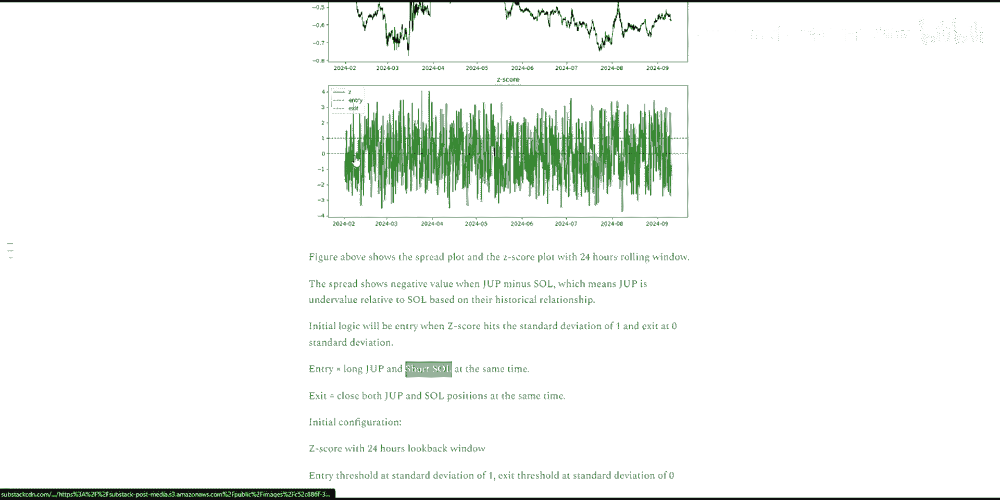

与传统跨交易所套利不同，统计套利可以在**同一交易所内**，选择两个不同的交易对进行多空对冲，寻找价格偏离均衡关系的机会进行套利。其核心思想是**均值回归**。

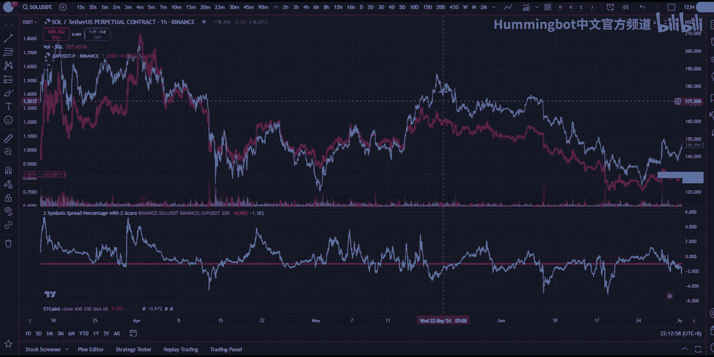

该策略的关键是找到两个价格序列存在**协整关系**的交易对。协整关系好比主人遛狗，价格虽各自波动，但长期看会围绕一个均衡关系运动，存在许多交叉回归的机会。这与简单的**相关性**不同，相关性高的资产可能长期趋势一致但价差不断扩大。

策略构建步骤如下：
1.  **数据准备**：选择两个疑似存在协整关系的交易对（如SOL和JUP）。
2.  **计算价差**：通过**线性回归**等方法计算对冲比率，构建一个价差序列。
    ```
    价差 = 价格_A - 对冲比率 * 价格_B
    ```
3.  **标准化处理**：计算价差序列的**Z-Score**（标准分数），使其围绕0上下波动。
    ```
    Z-Score = (当前价差 - N窗口均价) / N窗口标准差
    ```
4.  **生成信号**：当Z-Score突破正负一个标准差时开仓（做多弱势币，做空强势币），当Z-Score回归到0时平仓。
5.  **参数优化与风控**：通过网格搜索优化回看窗口和开仓阈值等参数，并设置止损（如Z-Score突破三个标准差时止损）。

统计套利的优势是机会多，且可选择高流动性交易对。风险在于价差可能长期不回归（协整关系破裂），以及手续费侵蚀薄利。通过Hummingbot自动化执行，可以快速捕捉短暂的套利机会。

## 课程总结与展望 🎉

本节课中我们一起学习了四种量化交易策略：AAS做市策略、横截面动量策略、基于情绪的定投策略以及统计套利策略。每种策略都有其独特的逻辑、适用场景和风险点。

最终，通过社区投票，横截面动量策略被评为本期最佳策略。量化交易学习是一个从理论到实践的持续过程，希望本次训练营能为大家打开策略研发的新思路。未来，训练营将继续推出更多关于Hummingbot及量化交易的相关内容。


感谢大家的参与。